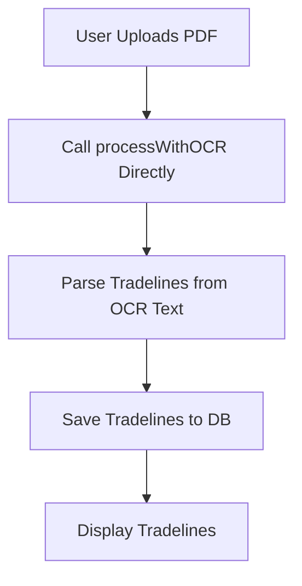

# Plan: Configure 'OCR Fast' as Singular Processing Method

**Goal**: Modify the `CreditReportUploadPage.tsx` to exclusively use the 'OCR (Fast)' processing method, removing the option for 'AI Enhanced' processing.

## Mermaid Diagram: Current Processing Flow

```mermaid
graph TD
    A[User Uploads PDF] --> B{Processing Method Selected?};
    B -- Yes --> C{Method: 'ocr'};
    C -- Yes --> D[Call processWithOCR];
    B -- No --> E{Method: 'ai'};
    E -- Yes --> F[Call processWithAI];
    D --> G[Parse Tradelines from OCR Text];
    F --> H[AI Processing (Document AI + Gemini)];
    H -- Fallback --> D;
    G --> I[Save Tradelines to DB];
    H --> I;
    I --> J[Display Tradelines];
```

## Mermaid Diagram: Proposed Processing Flow (OCR Fast Only)



## Detailed Steps:

1.  **Modify `src/pages/CreditReportUploadPage.tsx`**:
    *   **Remove AI Processing Method Selection UI**:
        *   Remove the "AI Enhanced (Slower, More Accurate)" button and related UI elements that allow the user to select the AI processing method. This will ensure that only "OCR (Fast)" is presented as an option.
    *   **Remove `processingMethod` State and Logic**:
        *   Remove the `processingMethod` state variable and any associated `useState` and `useEffect` hooks that manage its value.
        *   Remove the conditional logic (`if (processingMethod === 'ai')`) that branches to `processWithAI`.
    *   **Directly Call `processWithOCR`**:
        *   In the `handleFileUpload` function, modify the logic to directly call `processWithOCR(file)` without any conditional checks for `processingMethod`.
    *   **Remove `processWithAI` Function**:
        *   Delete the entire `processWithAI` asynchronous function, as it will no longer be used.
    *   **Remove AI-related State and UI**:
        *   Remove `extractedKeywords`, `aiInsights`, and `showAiResults` state variables.
        *   Remove the `showAiResults` conditional rendering block (lines 531-556) and any other UI elements related to displaying AI analysis results.
    *   **Update Imports**:
        *   Remove imports related to AI processing, such as `parseDocumentViaProxy` and `generateContent` from `@/services/llm-parser`.

**Rationale**:

By making these changes, the application will exclusively use the `processWithOCR` function for extracting text from uploaded PDF documents. This aligns with the requirement to configure 'OCR Fast' as the singular processing method. Future optimizations can then focus on enhancing the OCR pipeline itself.


# Process data
context = ProcessingContext(
    job_id="job-123",
    document_type="credit_report",
    confidence_threshold=0.7
)

result = await llm_service.normalize_tradeline_data(
    raw_text=document_text,
    table_data=extracted_tables,
    context=context
)
```

## API Endpoints

### POST /api/llm/normalize
Normalize document data using LLM.

**Request:**
```json
{
    "job_id": "job-123",
    "document_type": "credit_report",
    "confidence_threshold": 0.7
}
```

**Response:**
```json
{
    "job_id": "job-123",
    "consumer_info": {
        "name": "John Doe",
        "ssn": "XXX-XX-1234",
        "date_of_birth": "1980-01-15"
    },
    "tradelines": [
        {
            "creditor_name": "Chase Bank",
            "account_type": "Credit Card",
            "balance": "1234.56",
            "confidence_score": 0.85
        }
    ],
    "confidence_score": 0.82,
    "processing_metadata": {
        "processed_at": "2024-01-15T10:30:00Z",
        "tokens_used": 1500
    }
}
```

### POST /api/llm/validate
Validate normalized data.

**Request:**
```json
{
    "job_id": "job-123",
    "tradelines": [...],
    "consumer_info": {...}
}
```

### GET /api/llm/jobs/{job_id}/results
Get LLM processing results.

## Error Handling

### Common Error Scenarios

1. **LLM API Failures**
   - Automatic retry with exponential backoff
   - Fallback to degraded processing mode
   - Clear error reporting in job status

2. **JSON Parsing Errors**
   - Response cleaning and re-parsing
   - Structured error logging
   - Fallback data extraction

3. **Validation Failures**
   - Issue categorization by severity
   - Actionable improvement suggestions
   - Confidence score adjustments

4. **Timeout Handling**
   - Configurable processing timeouts
   - Graceful degradation
   - Partial result preservation

### Error Response Format

```json
{
    "error": "processing_failed",
    "message": "LLM normalization failed after 3 attempts",
    "details": {
        "job_id": "job-123",
        "last_error": "Rate limit exceeded",
        "retry_count": 3
    }
}
```

## Performance Considerations

### Token Management
- Automatic prompt truncation for large documents
- Token usage tracking and reporting
- Cost optimization through model selection

### Processing Optimization
- Parallel processing of independent tradelines
- Caching of common normalization patterns
- Batch processing for multiple documents

### Scaling
- Rate limiting to respect API limits
- Queue management for high volume
- Horizontal scaling support

## Monitoring and Observability

### Key Metrics
- Processing success rate
- Average processing time
- Token usage and costs
- Validation issue frequency
- Confidence score distributions

### Logging
- Structured logging with correlation IDs
- Performance metrics collection
- Error tracking and alerting
- Audit trail for data transformations

### Health Checks
```python
# Health check endpoint
@router.get("/health")
async def health_check():
    return {
        "status": "healthy",
        "llm_service": "operational",
        "validation_service": "operational",
        "last_successful_processing": "2024-01-15T10:30:00Z"
    }
```

## Testing

### Unit Tests
```bash
# Run Phase 3 unit tests
pytest tests/test_phase3/ -v

# Run specific test modules
pytest tests/test_phase3/test_llm_parser_service.py
pytest tests/test_phase3/test_validation_service.py
pytest tests/test_phase3/test_data_normalizers.py
```

### Integration Tests
```bash
# Run integration tests
pytest tests/integration/test_phase3_workflow.py

# Test with real LLM (requires API key)
OPENAI_API_KEY=your-key pytest tests/integration/test_llm_integration.py
```

### Load Testing
```bash
# Simulate high volume processing
python tests/load_tests/test_phase3_load.py
```

## Troubleshooting

### Common Issues

#### 1. LLM API Rate Limits
**Symptoms:** 429 errors, processing delays
**Solutions:**
- Adjust rate limiting configuration
- Implement request queuing
- Consider upgrading API tier

#### 2. Low Confidence Scores
**Symptoms:** Many validation issues, low confidence scores
**Solutions:**
- Review prompt templates
- Adjust confidence thresholds
- Improve source data quality

#### 3. JSON Parsing Failures
**Symptoms:** Processing failures, malformed responses
**Solutions:**
- Update prompt instructions for JSON format
- Enhance response cleaning logic
- Add fallback parsing methods

#### 4. Memory Issues
**Symptoms:** Out of memory errors with large documents
**Solutions:**
- Implement document chunking
- Optimize prompt sizes
- Use streaming processing

### Debug Mode
```python
# Enable debug logging
import logging
logging.getLogger('backend.services.llm_parser_service').setLevel(logging.DEBUG)

# Test individual components
from backend.services.llm_parser_service import LLMParserService
service = LLMParserService(config)
# ... debug specific methods
```

## Migration Guide

### From Phase 2 to Phase 3
1. Ensure Document AI results are stored correctly
2. Configure LLM service credentials
3. Set up validation rules and thresholds
4. Test with sample documents
5. Monitor processing metrics

### Rollback Procedures
1. Disable Phase 3 processing
2. Revert to Document AI only results
3. Fix configuration issues
4. Re-enable with testing

## Security Considerations

### Data Privacy
- SSN and account number masking
- Secure API key management
- Audit logging for sensitive data
- Compliance with data protection regulations

### API Security
- Rate limiting and authentication
- Input validation and sanitization
- Secure credential storage
- Network security controls

## Future Enhancements

### Planned Features
- Multi-model LLM support (Claude, Gemini)
- Advanced validation rules engine
- Real-time processing monitoring
- Automated model fine-tuning
- Custom normalization rules

### Extension Points
- Custom validation plugins
- Additional data normalizers
- Integration with external data sources
- Machine learning model integration

## Support

### Documentation
- API documentation: `/docs`
- Code documentation: Generated with Sphinx
- Configuration reference: `config/README.md`

### Getting Help
- Internal documentation: Wiki
- Code reviews: Pull request process
- Technical support: Team channels
- Issue tracking: JIRA/GitHub Issues
```

This completes the comprehensive Phase 3 implementation for your LLM normalization system. The implementation includes:

1. **Core Services**: LLM parser, validation, and normalization services
2. **API Endpoints**: RESTful APIs for processing and results retrieval
3. **Data Models**: Comprehensive data structures for requests/responses
4. **Utilities**: Token counting, response validation, data normalization
5. **Workflow Orchestration**: Complete workflow management with error handling
6. **Configuration**: Flexible configuration system
7. **Testing**: Comprehensive test suite with unit and integration tests
8. **Documentation**: Complete integration guide and troubleshooting

The system is designed to be:
- **Scalable**: Handles high-volume processing with rate limiting
- **Reliable**: Comprehensive error handling and retry logic
- **Maintainable**: Clean architecture with separation of concerns
- **Configurable**: Flexible configuration for different use cases
- **Observable**: Extensive logging and monitoring capabilities

You can now integrate this Phase 3 implementation with your existing document processing pipeline to achieve intelligent data normalization and validation using LLM services.# Phase 3 Workflow Configuration
PHASE3_MAX_PROCESSING_TIME=300
PHASE3_RETRY_ATTEMPTS=2
PHASE3_ENABLE_VALIDATION=true
PHASE3_ENABLE_NORMALIZATION=true
```

### Dependencies (add to `requirements.txt`)

```txt
# LLM and AI libraries
openai==1.3.0
tiktoken==0.5.1
python-dateutil==2.8.2

# Text processing
difflib==3.9
```

---

## 10. Testing Framework

### `tests/test_phase3/test_llm_parser_service.py`

```python
"""
Tests for LLM Parser Service
"""
import pytest
import asyncio
from unittest.mock import Mock, AsyncMock, patch
from decimal import Decimal
from datetime import date

from backend.services.llm_parser_service import LLMParserService, ProcessingContext
from backend.models.tradeline_models import Tradeline, ConsumerInfo
from backend.config.llm_config import LLMConfig

class TestLLMParserService:
    
    @pytest.fixture
    def mock_config(self):
        return LLMConfig(
            openai_api_key="test-key",
            model_name="gpt-4",
            max_tokens=4000,
            temperature=0.1
        )
    
    @pytest.fixture
    def llm_service(self, mock_config):
        return LLMParserService(mock_config)
    
    @pytest.fixture
    def processing_context(self):
        return ProcessingContext(
            job_id="test-job-123",
            document_type="credit_report",
            confidence_threshold=0.7
        )
    
    @pytest.fixture
    def sample_raw_text(self):
        return """
        CONSUMER CREDIT REPORT
        
        Name: John Doe
        SSN: XXX-XX-1234
        DOB: 01/15/1980
        Address: 123 Main St, Anytown, CA 12345
        
        TRADELINES:
        Chase Bank - Credit Card
        Account: ****5678
        Balance: $1,234.56
        Credit Limit: $5,000.00
        Status: Current
        Opened: 01/2020
        """
    
    @pytest.fixture
    def sample_table_data(self):
        return [
            {
                "creditor": "Chase Bank",
                "account": "****5678", 
                "type": "Credit Card",
                "balance": "$1,234.56",
                "limit": "$5,000.00",
                "status": "Current"
            }
        ]
    
    @pytest.mark.asyncio
    async def test_normalize_tradeline_data_success(
        self, 
        llm_service, 
        processing_context,
        sample_raw_text,
        sample_table_data
    ):
        """Test successful tradeline data normalization"""
        
        # Mock OpenAI responses
        mock_responses = [
            # Extraction response
            '{"tradelines": [{"creditor_name": "Chase Bank", "account_number": "****5678"}], "consumer_info": {"name": "John Doe"}}',
            # Tradeline normalization response
            '{"creditor_name": "Chase Bank", "account_type": "Credit Card", "confidence_score": 0.9}',
            # Consumer info response
            '{"name": "John Doe", "ssn": "XXX-XX-1234"}',
            # Validation response
            '{"overall_confidence": 0.85, "issues": []}'
        ]
        
        with patch.object(llm_service, '_make_llm_request') as mock_request:
            mock_request.side_effect = mock_responses
            
            result = await llm_service.normalize_tradeline_data(
                raw_text=sample_raw_text,
                table_data=sample_table_data,
                context=processing_context
            )
            
            assert result is not None
            assert result.job_id == "test-job-123"
            assert len(result.tradelines) > 0
            assert result.consumer_info is not None
    
    @pytest.mark.asyncio
    async def test_make_llm_request_with_retry(self, llm_service, processing_context):
        """Test LLM request retry logic"""
        
        # Mock client to fail twice then succeed
        mock_client = AsyncMock()
        mock_response = Mock()
        mock_response.choices = [Mock()]
        mock_response.choices[0].message.content = "test response"
        mock_response.usage.prompt_tokens = 100
        mock_response.usage.completion_tokens = 50
        
        # Fail twice, then succeed
        mock_client.chat.completions.create.side_effect = [
            Exception("API Error"),
            Exception("Rate Limit"),
            mock_response
        ]
        
        llm_service.client = mock_client
        
        result = await llm_service._make_llm_request(
            prompt="test prompt",
            context=processing_context,
            operation="test"
        )
        
        assert result == "test response"
        assert mock_client.chat.completions.create.call_count == 3
    
    def test_create_tradeline_from_normalized_data(self, llm_service):
        """Test tradeline creation from normalized data"""
        
        normalized_data = {
            "creditor_name": "Chase Bank",
            "account_number": "****5678",
            "account_type": "Credit Card",
            "balance": "1234.56",
            "credit_limit": "5000.00",
            "payment_status": "Current",
            "confidence_score": 0.9
        }
        
        raw_data = {"original": "data"}
        
        tradeline = llm_service._create_tradeline_from_normalized_data(
            normalized_data, raw_data
        )
        
        assert isinstance(tradeline, Tradeline)
        assert tradeline.creditor_name == "Chase Bank"
        assert tradeline.balance == Decimal("1234.56")
        assert tradeline.confidence_score == 0.9
    
    def test_safe_decimal_conversion(self, llm_service):
        """Test safe decimal conversion utility"""
        
        # Test valid conversions
        assert llm_service._safe_decimal_conversion("1234.56") == Decimal("1234.56")
        assert llm_service._safe_decimal_conversion("$1,234.56") == Decimal("1234.56")
        assert llm_service._safe_decimal_conversion(1234.56) == Decimal("1234.56")
        
        # Test invalid conversions
        assert llm_service._safe_decimal_conversion("invalid") is None
        assert llm_service._safe_decimal_conversion(None) is None
        assert llm_service._safe_decimal_conversion("") is None
    
    def test_safe_date_conversion(self, llm_service):
        """Test safe date conversion utility"""
        
        # Test valid conversions
        result = llm_service._safe_date_conversion("2023-12-25")
        assert result == date(2023, 12, 25)
        
        result = llm_service._safe_date_conversion("Dec 25, 2023")
        assert result == date(2023, 12, 25)
        
        # Test invalid conversions
        assert llm_service._safe_date_conversion("invalid") is None
        assert llm_service._safe_date_conversion(None) is None
    
    def test_clean_json_response(self, llm_service):
        """Test JSON response cleaning"""
        
        # Test with markdown code blocks
        dirty_response = '```json\n{"key": "value"}\n```'
        clean = llm_service._clean_json_response(dirty_response)
        assert clean == '{"key": "value"}'
        
        # Test with extra text
        dirty_response = 'Here is the JSON: {"key": "value"} and some more text'
        clean = llm_service._clean_json_response(dirty_response)
        assert clean == '{"key": "value"}'
        
        # Test with array
        dirty_response = 'Result: [{"item": 1}, {"item": 2}]'
        clean = llm_service._clean_json_response(dirty_response)
        assert clean == '[{"item": 1}, {"item": 2}]'
```

### `tests/test_phase3/test_validation_service.py`

```python
"""
Tests for Validation Service
"""
import pytest
from datetime import date, datetime
from decimal import Decimal

from backend.services.validation_service import ValidationService, ValidationConfig
from backend.models.tradeline_models import Tradeline, ConsumerInfo
from backend.models.llm_models import ValidationIssue

class TestValidationService:
    
    @pytest.fixture
    def validation_service(self):
        config = ValidationConfig(
            min_confidence_score=0.7,
            max_reasonable_balance=Decimal('100000')
        )
        return ValidationService(config)
    
    @pytest.fixture
    def sample_tradeline(self):
        return Tradeline(
            creditor_name="Chase Bank",
            account_number="****5678",
            account_type="Credit Card",
            balance=Decimal("1234.56"),
            credit_limit=Decimal("5000.00"),
            payment_status="Current",
            date_opened=date(2020, 1, 15),
            date_closed=None,
            payment_history=["Current", "Current", "Current"],
            confidence_score=0.85
        )
    
    @pytest.fixture
    def sample_consumer_info(self):
        return ConsumerInfo(
            name="John Doe",
            ssn="XXX-XX-1234",
            date_of_birth=date(1980, 1, 15),
            addresses=[{
                "street": "123 Main St",
                "city": "Anytown", 
                "state": "CA",
                "zip": "12345"
            }],
            confidence_score=0.9
        )
    
    def test_validate_normalized_data_success(
        self, 
        validation_service, 
        sample_tradeline, 
        sample_consumer_info
    ):
        """Test successful validation of good data"""
        
        result = validation_service.validate_normalized_data(
            tradelines=[sample_tradeline],
            consumer_info=sample_consumer_info,
            job_id="test-job"
        )
        
        assert result.overall_confidence > 0.7
        assert result.validation_summary.total_tradelines == 1
        assert result.validation_summary.valid_tradelines >= 0
        assert len(result.issues_found) >= 0  # May have minor issues
    
    def test_validate_tradeline_with_issues(self, validation_service):
        """Test tradeline validation with various issues"""
        
        # Create problematic tradeline
        problematic_tradeline = Tradeline(
            creditor_name="",  # Missing creditor name
            account_number="****5678",
            account_type="Unknown",  # Unknown account type
            balance=Decimal("150000"),  # Excessive balance
            credit_limit=Decimal("5000"),  # Balance > limit
            payment_status="Current",
            date_opened=date(2025, 1, 1),  # Future date
            date_closed=date(2020, 1, 1),  # Closed before opened
            payment_history=[],
            confidence_score=0.3  # Low confidence
        )
        
        issues, suggestions = validation_service._validate_tradeline(problematic_tradeline, 0)
        
        # Should find multiple issues
        assert len(issues) > 0
        
        # Check for specific issue types
        issue_types = [issue.type for issue in issues]
        assert "missing_data" in issue_types  # Missing creditor name
        assert "data_range" in issue_types  # Excessive balance
        assert "date_error" in issue_types  # Future date
        assert "date_inconsistency" in issue_types  # Date logic error
    
    def test_validate_consumer_info_with_issues(self, validation_service):
        """Test consumer info validation with issues"""
        
        problematic_consumer = ConsumerInfo(
            name="",  # Missing name
            ssn="123-45-6789-INVALID",  # Invalid SSN format
            date_of_birth=date(2030, 1, 1),  # Future birth date
            addresses=[],  # No addresses
            confidence_score=0.5
        )
        
        issues, suggestions = validation_service._validate_consumer_info(problematic_consumer)
        
        assert len(issues) > 0
        
        issue_types = [issue.type for issue in issues]
        assert "missing_data" in issue_types
        assert "format_error" in issue_types
        assert "date_error" in issue_types
    
    def test_cross_validate_duplicates(self, validation_service):
        """Test cross-validation for duplicate detection"""
        
        # Create similar tradelines
        tradeline1 = Tradeline(
            creditor_name="Chase Bank",
            account_number="****5678",
            account_type="Credit Card",
            confidence_score=0.8
        )
        
        tradeline2 = Tradeline(
            creditor_name="Chase Bank", 
            account_number="****5678",
            account_type="Credit Card",
            confidence_score=0.8
        )
        
        issues, suggestions = validation_service._cross_validate_tradelines([tradeline1, tradeline2])
        
        # Should detect potential duplicate
        duplicate_issues = [issue for issue in issues if issue.type == "potential_duplicate"]
        assert len(duplicate_issues) > 0
    
    def test_calculate_quality_metrics(self, validation_service, sample_tradeline, sample_consumer_info):
        """Test quality metrics calculation"""
        
        # Create some validation issues
        issues = [
            ValidationIssue(
                type="data_quality",
                description="Test issue",
                severity="medium",
                tradeline_index=0
            )
        ]
        
        metrics = validation_service._calculate_quality_metrics(
            tradelines=[sample_tradeline],
            consumer_info=sample_consumer_info,
            issues=issues
        )
        
        assert 0.0 <= metrics.completeness <= 1.0
        assert 0.0 <= metrics.accuracy <= 1.0
        assert 0.0 <= metrics.consistency <= 1.0
        assert 0.0 <= metrics.reliability <= 1.0
    
    def test_monetary_value_validation(self, validation_service):
        """Test monetary value range validation"""
        
        # Test valid value
        issues = validation_service._validate_monetary_value(
            Decimal("5000"), "balance", 0, Decimal("0"), Decimal("100000")
        )
        assert len(issues) == 0
        
        # Test value too high
        issues = validation_service._validate_monetary_value(
            Decimal("200000"), "balance", 0, Decimal("0"), Decimal("100000")
        )
        assert len(issues) > 0
        assert any(issue.type == "data_range" for issue in issues)
        
        # Test negative value
        issues = validation_service._validate_monetary_value(
            Decimal("-100"), "balance", 0, Decimal("0"), Decimal("100000")
        )
        assert len(issues) > 0
    
    def test_date_validation(self, validation_service):
        """Test date logic validation"""
        
        from datetime import date, timedelta
        
        # Valid tradeline
        valid_tradeline = Tradeline(
            creditor_name="Test",
            account_type="Credit Card",
            date_opened=date(2020, 1, 1),
            date_closed=date(2023, 1, 1),
            confidence_score=0.8
        )
        
        issues = validation_service._validate_tradeline_dates(valid_tradeline, 0)
        assert len(issues) == 0
        
        # Invalid tradeline (closed before opened)
        invalid_tradeline = Tradeline(
            creditor_name="Test",
            account_type="Credit Card", 
            date_opened=date(2023, 1, 1),
            date_closed=date(2020, 1, 1),  # Before opened
            confidence_score=0.8
        )
        
        issues = validation_service._validate_tradeline_dates(invalid_tradeline, 0)
        assert len(issues) > 0
        assert any(issue.type == "date_inconsistency" for issue in issues)
```

### `tests/test_phase3/test_data_normalizers.py`

```python
"""
Tests for Data Normalizers
"""
import pytest
from decimal import Decimal
from datetime import date

from backend.utils.data_normalizers import (
    CurrencyNormalizer,
    DateNormalizer, 
    TextNormalizer,
    AccountNumberNormalizer,
    SSNNormalizer,
    PhoneNumberNormalizer,
    ComprehensiveNormalizer
)

class TestCurrencyNormalizer:
    
    def test_normalize_valid_currencies(self):
        """Test normalization of valid currency values"""
        
        # Test various formats
        assert CurrencyNormalizer.normalize("$1,234.56") == Decimal("1234.56")
        assert CurrencyNormalizer.normalize("1234.56") == Decimal("1234.56")
        assert CurrencyNormalizer.normalize("USD 1,234.56") == Decimal("1234.56")
        assert CurrencyNormalizer.normalize("1,234") == Decimal("1234")
        
        # Test negative values
        assert CurrencyNormalizer.normalize("($1,234.56)") == Decimal("-1234.56")
        assert CurrencyNormalizer.normalize("-$1,234.56") == Decimal("-1234.56")
        assert CurrencyNormalizer.normalize("1234.56CR") == Decimal("-1234.56")
    
    def test_normalize_invalid_currencies(self):
        """Test handling of invalid currency values"""
        
        assert CurrencyNormalizer.normalize("invalid") is None
        assert CurrencyNormalizer.normalize("") is None
        assert CurrencyNormalizer.normalize(None) is None
        assert CurrencyNormalizer.normalize("N/A") is None
        assert CurrencyNormalizer.normalize("--") is None
    
    def test_normalize_numeric_types(self):
        """Test normalization of numeric types"""
        
        assert CurrencyNormalizer.normalize(1234.56) == Decimal("1234.56")
        assert CurrencyNormalizer.normalize(1234) == Decimal("1234")
        assert CurrencyNormalizer.normalize(Decimal("1234.56")) == Decimal("1234.56")

class TestDateNormalizer:
    
    def test_normalize_valid_dates(self):
        """Test normalization of valid date formats"""
        
        # Test various formats
        assert DateNormalizer.normalize("2023-12-25") == date(2023, 12, 25)
        assert DateNormalizer.normalize("12/25/2023") == date(2023, 12, 25)
        assert DateNormalizer.normalize("25/12/2023") == date(2023, 12, 25)
        assert DateNormalizer.normalize("December 25, 2023") == date(2023, 12, 25)
        assert DateNormalizer.normalize("Dec 25, 2023") == date(2023, 12, 25)
        
        # Test partial dates
        assert DateNormalizer.normalize("12/2023") == date(2023, 12, 1)
        assert DateNormalizer.normalize("2023") == date(2023, 1, 1)
    
    def test_normalize_invalid_dates(self):
        """Test handling of invalid dates"""
        
        assert DateNormalizer.normalize("invalid") is None
        assert DateNormalizer.normalize("") is None
        assert DateNormalizer.normalize(None) is None
        assert DateNormalizer.normalize("N/A") is None
    
    def test_normalize_date_objects(self):
        """Test handling of existing date objects"""
        
        test_date = date(2023, 12, 25)
        assert DateNormalizer.normalize(test_date) == test_date
        
        from datetime import datetime
        test_datetime = datetime(2023, 12, 25, 10, 30)
        assert DateNormalizer.normalize(test_datetime) == date(2023, 12, 25)

class TestTextNormalizer:
    
    def test_normalize_creditor_names(self):
        """Test creditor name normalization"""
        
        assert TextNormalizer.normalize_creditor_name("CHASE") == "Chase Bank"
        assert TextNormalizer.normalize_creditor_name("CITI") == "Citibank"
        assert TextNormalizer.normalize_creditor_name("BOA") == "Bank of America"
        assert TextNormalizer.normalize_creditor_name("AMEX") == "American Express"
        
        # Test title casing for unknown creditors
        assert TextNormalizer.normalize_creditor_name("test bank") == "Test Bank"
    
    def test_normalize_account_types(self):
        """Test account type normalization"""
        
        assert TextNormalizer.normalize_account_type("credit card") == "Credit Card"
        assert TextNormalizer.normalize_account_type("CC") == "Credit Card"
        assert TextNormalizer.normalize_account_type("mortgage") == "Mortgage"
        assert TextNormalizer.normalize_account_type("auto loan") == "Auto Loan"
        assert TextNormalizer.normalize_account_type("student") == "Student Loan"
        
        # Test unknown types
        assert TextNormalizer.normalize_account_type("unknown type") == "Unknown Type"
    
    def test_normalize_payment_status(self):
        """Test payment status normalization"""
        
        assert TextNormalizer.normalize_payment_status("current") == "Current"
        assert TextNormalizer.normalize_payment_status("OK") == "Current"
        assert TextNormalizer.normalize_payment_status("30") == "30 days late"
        assert TextNormalizer.normalize_payment_status("60 days") == "60 days late"
        assert TextNormalizer.normalize_payment_status("charged off") == "Charged off"
        assert TextNormalizer.normalize_payment_status("collection") == "Collection"
    
    def test_normalize_person_names(self):
        """Test person name normalization"""
        
        assert TextNormalizer.normalize_name("john doe") == "John Doe"
        assert TextNormalizer.normalize_name("MARY JANE SMITH") == "Mary Jane Smith"
        assert TextNormalizer.normalize_name("mc donald") == "McDonald"  # Special case
        assert TextNormalizer.normalize_name("o'connor") == "O'Connor"  # Special case

class TestAccountNumberNormalizer:
    
    def test_normalize_account_numbers(self):
        """Test account number normalization"""
        
        # Test masking
        assert AccountNumberNormalizer.normalize("1234567890", mask_digits=True) == "******7890"
        assert AccountNumberNormalizer.normalize("1234", mask_digits=True) == "****"
        
        # Test no masking
        assert AccountNumberNormalizer.normalize("1234567890", mask_digits=False) == "1234567890"
        
        # Test already masked
        assert AccountNumberNormalizer.normalize("****7890", mask_digits=True) == "****7890"
    
    def test_normalize_invalid_account_numbers(self):
        """Test handling of invalid account numbers"""
        
        assert AccountNumberNormalizer.normalize("") is None
        assert AccountNumberNormalizer.normalize(None) is None

class TestSSNNormalizer:
    
    def test_normalize_ssn(self):
        """Test SSN normalization"""
        
        # Test masking
        assert SSNNormalizer.normalize("123456789", mask=True) == "XXX-XX-6789"
        assert SSNNormalizer.normalize("123-45-6789", mask=True) == "XXX-XX-6789"
        
        # Test no masking
        assert SSNNormalizer.normalize("123456789", mask=False) == "123-45-6789"
        
        # Test already masked
        assert SSNNormalizer.normalize("XXX-XX-6789", mask=True) == "XXX-XX-6789"
    
    def test_normalize_invalid_ssn(self):
        """Test handling of invalid SSNs"""
        
        assert SSNNormalizer.normalize("12345") is None  # Too short
        assert SSNNormalizer.normalize("") is None
        assert SSNNormalizer.normalize(None) is None

class TestPhoneNumberNormalizer:
    
    def test_normalize_phone_numbers(self):
        """Test phone number normalization"""
        
        # Test 10-digit US numbers
        assert PhoneNumberNormalizer.normalize("5551234567") == "(555) 123-4567"
        assert PhoneNumberNormalizer.normalize("(555) 123-4567") == "(555) 123-4567"
        assert PhoneNumberNormalizer.normalize("555-123-4567") == "(555) 123-4567"
        
        # Test 11-digit with country code
        assert PhoneNumberNormalizer.normalize("15551234567") == "(555) 123-4567"
        
        # Test 7-digit local
        assert PhoneNumberNormalizer.normalize("1234567") == "(000) 123-4567"
    
    def test_normalize_invalid_phone_numbers(self):
        """Test handling of invalid phone numbers"""
        
        assert PhoneNumberNormalizer.normalize("") is None
        assert PhoneNumberNormalizer.normalize(None) is None
        assert PhoneNumberNormalizer.normalize("abc") is None

class TestComprehensiveNormalizer:
    
    @pytest.fixture
    def normalizer(self):
        return ComprehensiveNormalizer()
    
    def test_normalize_tradeline_data(self, normalizer):
        """Test comprehensive tradeline normalization"""
        
        raw_data = {
            "creditor_name": "CHASE",
            "account_number": "1234567890",
            "account_type": "cc",
            "balance": "$1,234.56",
            "credit_limit": "5000.00",
            "payment_status": "current",
            "date_opened": "01/15/2020",
            "extra_field": "keep this"
        }
        
        normalized = normalizer.normalize_tradeline_data(raw_data)
        
        assert normalized["creditor_name"] == "Chase Bank"
        assert "****7890" in normalized["account_number"]
        assert normalized["account_type"] == "Credit Card"
        assert normalized["balance"] == Decimal("1234.56")
        assert normalized["payment_status"] == "Current"
        assert normalized["date_opened"] == date(2020, 1, 15)
        assert normalized["extra_field"] == "keep this"  # Pass-through
        
        # Check normalization stats
        assert "_normalization_stats" in normalized
        stats = normalized["_normalization_stats"]
        assert stats["fields_processed"] > 0
        assert stats["success_rate"] > 0
    
    def test_normalize_consumer_data(self, normalizer):
        """Test comprehensive consumer normalization"""
        
        raw_data = {
            "name": "john doe",
            "ssn": "123456789",
            "date_of_birth": "01/15/1980",
            "addresses": [{
                "street": "123 main st",
                "city": "anytown",
                "state": "ca",
                "zip": "12345"
            }],
            "phone_numbers": ["5551234567", "(555) 987-6543"]
        }
        
        normalized = normalizer.normalize_consumer_data(raw_data)
        
        assert normalized["name"] == "John Doe"
        assert normalized["ssn"] == "XXX-XX-6789"
        assert normalized["date_of_birth"] == date(1980, 1, 15)
        assert len(normalized["addresses"]) == 1
        assert normalized["addresses"][0]["city"] == "Anytown"
        assert len(normalized["phone_numbers"]) == 2
        assert "(555) 123-4567" in normalized["phone_numbers"]
```

---

## 11. Documentation

### `docs/phase3_integration_guide.md`

```markdown
# Phase 3 Integration Guide

## Overview

Phase 3 of the document processing system handles LLM-based normalization and validation of extracted document data. This phase takes raw text and structured data from Document AI (Phase 2) and transforms it into clean, validated, structured information.

## Architecture

```
Document AI Results → LLM Parser → Data Normalizer → Validator → Structured Output
```

## Key Components

### 1. LLM Parser Service (`llm_parser_service.py`)
- Orchestrates LLM requests for data extraction and normalization
- Handles prompt templates and response parsing
- Implements retry logic and error handling
- Manages token counting and usage tracking

### 2. Validation Service (`validation_service.py`)
- Validates data consistency and accuracy
- Detects potential issues and duplicates
- Calculates quality metrics and confidence scores
- Generates suggestions for data improvement

### 3. Data Normalizers (`data_normalizers.py`)
- Standardizes data formats (currency, dates, text)
- Handles various input formats and edge cases
- Applies business rules for data standardization
- Maintains data integrity during transformation

### 4. Workflow Orchestrator (`phase3_workflow.py`)
- Coordinates the complete Phase 3 process
- Manages timeouts and retry logic
- Handles job status updates and result storage
- Provides configurable processing options

## Configuration

### Environment Variables

```bash
# LLM Configuration
OPENAI_API_KEY=your-api-key
OPENAI_MODEL=gpt-4
LLM_CONFIDENCE_THRESHOLD=0.7
LLM_MAX_RETRIES=3

# Workflow Configuration  
PHASE3_MAX_PROCESSING_TIME=300
PHASE3_ENABLE_VALIDATION=true
PHASE3_ENABLE_NORMALIZATION=true
```

### Model Configuration

```python
from backend.config.llm_config import LLMConfig

config = LLMConfig(
    openai_api_key="your-key",
    model_name="gpt-4",
    temperature=0.1,
    max_tokens=8000
)
```

## Usage Examples

### Basic Integration

```python
from backend.workflows.phase3_workflow import create_phase3_workflow
from backend.services.storage_service import StorageService

# Create workflow
storage_service = StorageService()
workflow = create_phase3_workflow(storage_service)

# Execute Phase 3
result = await workflow.execute_phase3(
    job_id="job-123",
    document_type="credit_report"
)
```

### Custom Configuration

```python
from backend.workflows.phase3_workflow import Phase3Config

config = Phase3Config(
    max_processing_time=600,  # 10 minutes
    retry_attempts=3,
    confidence_threshold=0.8,
    enable_validation=True
)

workflow = create_phase3_workflow(storage_service, config)
```

### Direct Service Usage

```python
from backend.services.llm_parser_service import LLMParserService
from backend.config.llm_config import get_llm_config

# Create service
llm_service = LLMParserService(get_llm_config())

# Process data
context = ProcessingContext(
    job        # Remove extra whitespace
        normalized = re.sub(r'\s+', ' ', normalized)
        
        # Title case for names
        if cls._appears_to_be_person_name(normalized):
            normalized = cls._title_case_name(normalized)
        else:
            # Company name - title case but preserve some all-caps words
            normalized = cls._title_case_company(normalized)
        
        return normalized if normalized else None
    
    @classmethod
    def normalize_creditor_name(cls, name: str) -> Optional[str]:
        """Normalize creditor/company name"""
        
        if not name or not isinstance(name, str):
            return None
        
        # Common creditor name mappings
        CREDITOR_MAPPINGS = {
            "CHASE": "Chase Bank",
            "CITI": "Citibank",
            "BOA": "Bank of America", 
            "BOFA": "Bank of America",
            "AMEX": "American Express",
            "DISCOVER": "Discover",
            "CAP ONE": "Capital One",
            "CAPITAL ONE": "Capital One",
            "WELLS FARGO": "Wells Fargo",
            "US BANK": "U.S. Bank"
        }
        
        normalized = name.strip().upper()
        
        # Check for direct mappings
        for pattern, replacement in CREDITOR_MAPPINGS.items():
            if pattern in normalized:
                return replacement
        
        # Standard title case
        return cls._title_case_company(name.strip())
    
    @classmethod
    def normalize_account_type(cls, account_type: str) -> str:
        """Normalize account type to standard categories"""
        
        if not account_type or not isinstance(account_type, str):
            return "Unknown"
        
        # Account type mappings
        TYPE_MAPPINGS = {
            "credit card": ["credit card", "cc", "visa", "mastercard", "amex", "discover", "card"],
            "mortgage": ["mortgage", "home loan", "real estate", "mtg"],
            "auto loan": ["auto", "car loan", "vehicle", "automobile", "auto loan"],
            "student loan": ["student", "education", "sallie mae", "student loan"],
            "personal loan": ["personal", "signature", "unsecured", "personal loan"],
            "line of credit": ["line of credit", "loc", "credit line", "heloc", "home equity"],
            "installment": ["installment", "term loan", "installment loan"],
            "collection": ["collection", "collections"],
            "charge off": ["charge off", "charged off", "chargeoff"]
        }
        
        normalized_input = account_type.lower().strip()
        
        # Find matching category
        for standard_type, variations in TYPE_MAPPINGS.items():
            if any(variation in normalized_input for variation in variations):
                return standard_type.title()
        
        # Return title case version if no mapping found
        return account_type.strip().title()
    
    @classmethod
    def normalize_payment_status(cls, status: str) -> str:
        """Normalize payment status to standard terms"""
        
        if not status or not isinstance(status, str):
            return "Unknown"
        
        # Payment status mappings
        STATUS_MAPPINGS = {
            "Current": ["current", "ok", "pays as agreed", "on time", "0", "00"],
            "30 days late": ["30", "30 days", "30 day", "1", "01"],
            "60 days late": ["60", "60 days", "60 day", "2", "02"],
            "90 days late": ["90", "90 days", "90 day", "3", "03"],
            "120+ days late": ["120", "120+", "120 days", "120 day", "4", "04", "5", "05"],
            "Charged off": ["charged off", "charge off", "co", "chargeoff"],
            "Collection": ["collection", "collections", "col"],
            "Settled": ["settled", "settlement", "paid settled"],
            "Paid": ["paid", "paid in full", "closed", "paid closed"]
        }
        
        normalized_input = status.lower().strip()
        
        # Find matching status
        for standard_status, variations in STATUS_MAPPINGS.items():
            if any(variation in normalized_input for variation in variations):
                return standard_status
        
        return status.strip().title()
    
    @classmethod
    def _appears_to_be_person_name(cls, name: str) -> bool:
        """Check if name appears to be a person rather than company"""
        
        # Simple heuristics
        words = name.split()
        
        # If 2-3 words, likely a person
        if 2 <= len(words) <= 3:
            return True
        
        # Check for common company indicators
        company_indicators = ["inc", "llc", "corp", "company", "bank", "credit", "union", "services"]
        if any(indicator in name.lower() for indicator in company_indicators):
            return False
        
        return len(words) <= 4  # Assume person if 4 or fewer words
    
    @classmethod
    def _title_case_name(cls, name: str) -> str:
        """Apply title case appropriate for person names"""
        
        # Handle special cases
        special_cases = {
            "mc": "Mc",
            "mac": "Mac",
            "o'": "O'",
            "de": "de",
            "la": "la",
            "le": "le",
            "van": "van",
            "von": "von"
        }
        
        words = []
        for word in name.split():
            # Check for special prefixes
            lower_word = word.lower()
            if lower_word in special_cases:
                words.append(special_cases[lower_word])
            else:
                words.append(word.title())
        
        return " ".join(words)
    
    @classmethod
    def _title_case_company(cls, name: str) -> str:
        """Apply title case appropriate for company names"""
        
        # Words that should stay uppercase
        uppercase_words = {"LLC", "INC", "CORP", "LTD", "LP", "USA", "US", "ATM"}
        
        # Words that should stay lowercase (unless first word)
        lowercase_words = {"and", "of", "the", "for", "in", "on", "at", "by", "with"}
        
        words = []
        for i, word in enumerate(name.split()):
            upper_word = word.upper()
            lower_word = word.lower()
            
            if upper_word in uppercase_words:
                words.append(upper_word)
            elif i > 0 and lower_word in lowercase_words:
                words.append(lower_word)
            else:
                words.append(word.title())
        
        return " ".join(words)

class AccountNumberNormalizer:
    """Normalize account numbers"""
    
    @classmethod
    def normalize(cls, account_number: str, mask_digits: bool = True) -> Optional[str]:
        """
        Normalize account number format
        
        Args:
            account_number: Raw account number
            mask_digits: Whether to mask digits for security
            
        Returns:
            Normalized account number
        """
        if not account_number or not isinstance(account_number, str):
            return None
        
        # Remove non-alphanumeric characters except hyphens and asterisks
        cleaned = re.sub(r'[^\w\-\*]', '', account_number.strip())
        
        if not cleaned:
            return None
        
        # If masking is requested and number isn't already masked
        if mask_digits and not cls._is_already_masked(cleaned):
            return cls._mask_account_number(cleaned)
        
        return cleaned
    
    @classmethod
    def _is_already_masked(cls, account_number: str) -> bool:
        """Check if account number is already masked"""
        return '*' in account_number or 'X' in account_number.upper()
    
    @classmethod
    def _mask_account_number(cls, account_number: str) -> str:
        """Mask account number for security"""
        if len(account_number) <= 4:
            return '*' * len(account_number)
        
        # Show last 4 digits
        last_four = account_number[-4:]
        masked_part = '*' * (len(account_number) - 4)
        
        return masked_part + last_four

class SSNNormalizer:
    """Normalize Social Security Numbers"""
    
    @classmethod
    def normalize(cls, ssn: str, mask: bool = True) -> Optional[str]:
        """
        Normalize SSN format
        
        Args:
            ssn: Raw SSN value
            mask: Whether to mask the SSN for security
            
        Returns:
            Normalized SSN in XXX-XX-XXXX format
        """
        if not ssn or not isinstance(ssn, str):
            return None
        
        # Remove non-digit characters except X (for masking)
        cleaned = re.sub(r'[^\dX]', '', ssn.strip().upper())
        
        if not cleaned:
            return None
        
        # Validate length
        if len(cleaned) != 9:
            return None
        
        # Format as XXX-XX-XXXX
        if mask and not cls._is_already_masked(cleaned):
            return "XXX-XX-" + cleaned[-4:]
        else:
            return f"{cleaned[:3]}-{cleaned[3:5]}-{cleaned[5:]}"
    
    @classmethod
    def _is_already_masked(cls, ssn: str) -> bool:
        """Check if SSN is already masked"""
        return 'X' in ssn

class PhoneNumberNormalizer:
    """Normalize phone numbers"""
    
    @classmethod
    def normalize(cls, phone: str) -> Optional[str]:
        """
        Normalize phone number to (XXX) XXX-XXXX format
        
        Args:
            phone: Raw phone number
            
        Returns:
            Normalized phone number
        """
        if not phone or not isinstance(phone, str):
            return None
        
        # Extract digits only
        digits = re.sub(r'\D', '', phone.strip())
        
        if not digits:
            return None
        
        # Handle different length scenarios
        if len(digits) == 10:
            # US number without country code
            return f"({digits[:3]}) {digits[3:6]}-{digits[6:]}"
        elif len(digits) == 11 and digits[0] == '1':
            # US number with country code
            return f"({digits[1:4]}) {digits[4:7]}-{digits[7:]}"
        elif len(digits) == 7:
            # Local number (assume area code 000)
            return f"(000) {digits[:3]}-{digits[3:]}"
        
        # Return original if can't normalize
        return phone.strip()

class ComprehensiveNormalizer:
    """Main normalizer that orchestrates all normalization operations"""
    
    def __init__(self):
        self.stats = NormalizationStats()
        self.currency_normalizer = CurrencyNormalizer()
        self.date_normalizer = DateNormalizer()
        self.text_normalizer = TextNormalizer()
        self.account_normalizer = AccountNumberNormalizer()
        self.ssn_normalizer = SSNNormalizer()
        self.phone_normalizer = PhoneNumberNormalizer()
    
    def normalize_tradeline_data(self, raw_data: Dict[str, Any]) -> Dict[str, Any]:
        """
        Normalize all fields in tradeline data
        
        Args:
            raw_data: Raw tradeline data dictionary
            
        Returns:
            Normalized tradeline data dictionary
        """
        
        normalized = {}
        self.stats = NormalizationStats()  # Reset stats
        
        # Field-specific normalization
        field_normalizers = {
            "creditor_name": lambda x: self.text_normalizer.normalize_creditor_name(x),
            "account_number": lambda x: self.account_normalizer.normalize(x),
            "account_type": lambda x: self.text_normalizer.normalize_account_type(x),
            "balance": lambda x: self.currency_normalizer.normalize(x),
            "credit_limit": lambda x: self.currency_normalizer.normalize(x),
            "payment_status": lambda x: self.text_normalizer.normalize_payment_status(x),
            "date_opened": lambda x: self.date_normalizer.normalize(x),
            "date_closed": lambda x: self.date_normalizer.normalize(x),
        }
        
        # Process each field
        for field, value in raw_data.items():
            self.stats.fields_processed += 1
            
            try:
                if field in field_normalizers:
                    normalized_value = field_normalizers[field](value)
                    if normalized_value is not None:
                        normalized[field] = normalized_value
                        self.stats.fields_normalized += 1
                    else:
                        # Keep original value if normalization returns None
                        normalized[field] = value
                        if value is not None:
                            self.stats.errors.append(f"Failed to normalize {field}: {value}")
                else:
                    # Pass through fields that don't need normalization
                    normalized[field] = value
                    self.stats.fields_normalized += 1
                    
            except Exception as e:
                logger.error(f"Error normalizing field {field}: {e}")
                normalized[field] = value  # Keep original on error
                self.stats.fields_failed += 1
                self.stats.errors.append(f"Exception normalizing {field}: {str(e)}")
        
        # Add normalization metadata
        normalized["_normalization_stats"] = {
            "fields_processed": self.stats.fields_processed,
            "fields_normalized": self.stats.fields_normalized,
            "fields_failed": self.stats.fields_failed,
            "success_rate": (self.stats.fields_normalized / self.stats.fields_processed) if self.stats.fields_processed > 0 else 0,
            "errors": self.stats.errors
        }
        
        return normalized
    
    def normalize_consumer_data(self, raw_data: Dict[str, Any]) -> Dict[str, Any]:
        """
        Normalize consumer information data
        
        Args:
            raw_data: Raw consumer data dictionary
            
        Returns:
            Normalized consumer data dictionary
        """
        
        normalized = {}
        
        # Field-specific normalization
        field_normalizers = {
            "name": lambda x: self.text_normalizer.normalize_name(x),
            "ssn": lambda x: self.ssn_normalizer.normalize(x),
            "date_of_birth": lambda x: self.date_normalizer.normalize(x),
        }
        
        # Process basic fields
        for field, value in raw_data.items():
            if field in field_normalizers:
                normalized[field] = field_normalizers[field](value)
            elif field == "addresses":
                # Special handling for addresses
                normalized[field] = self._normalize_addresses(value)
            elif field == "phone_numbers":
                # Special handling for phone numbers
                normalized[field] = self._normalize_phone_numbers(value)
            else:
                normalized[field] = value
        
        return normalized
    
    def _normalize_addresses(self, addresses: List[Dict[str, Any]]) -> List[Dict[str, Any]]:
        """Normalize address list"""
        
        if not addresses:
            return []
        
        normalized_addresses = []
        
        for addr in addresses:
            if not isinstance(addr, dict):
                continue
                
            normalized_addr = {}
            
            # Normalize address fields
            for field, value in addr.items():
                if field in ["street", "city"]:
                    normalized_addr[field] = self.text_normalizer.normalize_name(value)
                elif field == "state":
                    # Normalize state (could add state abbreviation logic)
                    normalized_addr[field] = value.upper().strip() if isinstance(value, str) else value
                elif field == "zip":
                    # Normalize ZIP code
                    if isinstance(value, str):
                        zip_clean = re.sub(r'[^\d-]', '', value.strip())
                        normalized_addr[field] = zip_clean if zip_clean else value
                    else:
                        normalized_addr[field] = value
                else:
                    normalized_addr[field] = value
            
            normalized_addresses.append(normalized_addr)
        
        return normalized_addresses
    
    def _normalize_phone_numbers(self, phones: List[str]) -> List[str]:
        """Normalize phone number list"""
        
        if not phones:
            return []
        
        normalized_phones = []
        
        for phone in phones:
            if isinstance(phone, str):
                normalized_phone = self.phone_normalizer.normalize(phone)
                if normalized_phone:
                    normalized_phones.append(normalized_phone)
        
        return normalized_phones
    
    def get_normalization_stats(self) -> NormalizationStats:
        """Get normalization statistics"""
        return self.stats
```

---

## 8. Main Workflow Integration

### `backend/workflows/phase3_workflow.py`

```python
"""
Phase 3 workflow orchestration for LLM normalization
"""
import asyncio
import logging
from typing import Dict, Any, Optional
from datetime import datetime, timedelta
from dataclasses import dataclass

from ..services.llm_parser_service import LLMParserService, ProcessingContext
from ..services.validation_service import ValidationService
from ..services.storage_service import StorageService
from ..utils.data_normalizers import ComprehensiveNormalizer
from ..config.llm_config import get_llm_config
from ..models.llm_models import NormalizationResult

logger = logging.getLogger(__name__)

@dataclass
class Phase3Config:
    """Configuration for Phase 3 processing"""
    max_processing_time: int = 300  # 5 minutes
    retry_attempts: int = 2
    confidence_threshold: float = 0.7
    enable_validation: bool = True
    enable_normalization: bool = True

class Phase3Workflow:
    """Orchestrates the complete Phase 3 LLM normalization workflow"""
    
    def __init__(
        self,
        llm_service: LLMParserService = None,
        validation_service: ValidationService = None,
        storage_service: StorageService = None,
        config: Phase3Config = None
    ):
        self.llm_service = llm_service or LLMParserService(get_llm_config())
        self.validation_service = validation_service or ValidationService()
        self.storage_service = storage_service  # Injected dependency
        self.normalizer = ComprehensiveNormalizer()
        self.config = config or Phase3Config()
    
    async def execute_phase3(
        self, 
        job_id: str, 
        document_type: str = "credit_report",
        force_reprocess: bool = False
    ) -> NormalizationResult:
        """
        Execute complete Phase 3 workflow
        
        Args:
            job_id: Processing job identifier
            document_type: Type of document being processed
            force_reprocess: Force reprocessing even if results exist
            
        Returns:
            Complete normalization result
        """
        
        workflow_start = datetime.utcnow()
        
        try:
            logger.info(f"Starting Phase 3 workflow for job {job_id}")
            
            # Step 1: Check if processing already completed
            if not force_reprocess:
                existing_result = await self._check_existing_results(job_id)
                if existing_result:
                    logger.info(f"Phase 3 already completed for job {job_id}")
                    return existing_result
            
            # Step 2: Update job status
            await self._update_job_status(job_id, "llm_processing_started")
            
            # Step 3: Retrieve Document AI results
            document_data = await self._get_document_ai_results(job_id)
            if not document_data:
                raise ValueError(f"No Document AI results found for job {job_id}")
            
            # Step 4: Create processing context
            context = ProcessingContext(
                job_id=job_id,
                document_type=document_type,
                confidence_threshold=self.config.confidence_threshold
            )
            
            # Step 5: Execute LLM normalization with timeout
            normalization_result = await self._execute_with_timeout(
                self._perform_llm_normalization(document_data, context),
                timeout_seconds=self.config.max_processing_time
            )
            
            # Step 6: Post-process normalization results
            if self.config.enable_normalization:
                normalization_result = await self._post_process_normalization(
                    normalization_result, context
                )
            
            # Step 7: Validate results
            if self.config.enable_validation:
                normalization_result = await self._validate_results(
                    normalization_result, context
                )
            
            # Step 8: Store final results
            await self._store_results(job_id, normalization_result)
            
            # Step 9: Update job status to completed
            processing_duration = (datetime.utcnow() - workflow_start).total_seconds()
            await self._update_job_status(
                job_id, 
                "phase3_completed",
                {"processing_duration": processing_duration}
            )
            
            logger.info(f"Phase 3 workflow completed for job {job_id} in {processing_duration:.2f} seconds")
            
            return normalization_result
            
        except asyncio.TimeoutError:
            logger.error(f"Phase 3 workflow timed out for job {job_id}")
            await self._update_job_status(job_id, "phase3_timeout")
            raise
            
        except Exception as e:
            logger.error(f"Phase 3 workflow failed for job {job_id}: {str(e)}")
            await self._update_job_status(job_id, "phase3_failed", {"error": str(e)})
            raise
    
    async def _check_existing_results(self, job_id: str) -> Optional[NormalizationResult]:
        """Check if Phase 3 results already exist"""
        
        if not self.storage_service:
            return None
        
        try:
            return await self.storage_service.get_llm_results(job_id)
        except Exception as e:
            logger.warning(f"Error checking existing results for job {job_id}: {e}")
            return None
    
    async def _get_document_ai_results(self, job_id: str) -> Dict[str, Any]:
        """Retrieve Document AI results from storage"""
        
        if not self.storage_service:
            raise ValueError("Storage service not available")
        
        document_data = await self.storage_service.get_document_ai_results(job_id)
        
        if not document_data:
            raise ValueError(f"No Document AI results found for job {job_id}")
        
        # Validate required fields
        required_fields = ["text_content"]
        missing_fields = [field for field in required_fields if field not in document_data]
        
        if missing_fields:
            raise ValueError(f"Missing required fields in Document AI results: {missing_fields}")
        
        return document_data
    
    async def _perform_llm_normalization(
        self, 
        document_data: Dict[str, Any], 
        context: ProcessingContext
    ) -> NormalizationResult:
        """Perform LLM normalization with retry logic"""
        
        last_exception = None
        
        for attempt in range(self.config.retry_attempts + 1):
            try:
                logger.info(f"LLM normalization attempt {attempt + 1} for job {context.job_id}")
                
                result = await self.llm_service.normalize_tradeline_data(
                    raw_text=document_data.get("text_content", ""),
                    table_data=document_data.get("tables", []),
                    context=context
                )
                
                logger.info(f"LLM normalization successful for job {context.job_id}")
                return result
                
            except Exception as e:
                last_exception = e
                logger.warning(f"LLM normalization attempt {attempt + 1} failed for job {context.job_id}: {str(e)}")
                
                if attempt < self.config.retry_attempts:
                    # Wait before retry with exponential backoff
                    wait_time = 2 ** attempt
                    logger.info(f"Retrying in {wait_time} seconds...")
                    await asyncio.sleep(wait_time)
        
        # All attempts failed
        raise Exception(f"LLM normalization failed after {self.config.retry_attempts + 1} attempts. Last error: {str(last_exception)}")
    
    async def _post_process_normalization(
        self, 
        result: NormalizationResult, 
        context: ProcessingContext
    ) -> NormalizationResult:
        """Post-process normalization results with additional normalization"""
        
        logger.info(f"Post-processing normalization results for job {context.job_id}")
        
        # Normalize tradeline data
        normalized_tradelines = []
        for tradeline in result.tradelines:
            # Convert tradeline to dict for normalization
            tradeline_dict = tradeline.dict() if hasattr(tradeline, 'dict') else tradeline.__dict__
            
            # Apply comprehensive normalization
            normalized_dict = self.normalizer.normalize_tradeline_data(tradeline_dict)
            
            # Convert back to Tradeline object (implementation depends on your Tradeline model)
            # This would need to be implemented based on your specific Tradeline class
            normalized_tradelines.append(tradeline)  # Placeholder
        
        # Normalize consumer info
        consumer_dict = result.consumer_info.dict() if hasattr(result.consumer_info, 'dict') else result.consumer_info.__dict__
        normalized_consumer_dict = self.normalizer.normalize_consumer_data(consumer_dict)
        
        # Update result with normalized data
        result.tradelines = normalized_tradelines
        # result.consumer_info = ConsumerInfo(**normalized_consumer_dict)  # Update based on your model
        
        # Add normalization metadata
        normalization_stats = self.normalizer.get_normalization_stats()
        result.processing_metadata["normalization_stats"] = {
            "fields_processed": normalization_stats.fields_processed,
            "fields_normalized": normalization_stats.fields_normalized,
            "fields_failed": normalization_stats.fields_failed,
            "errors": normalization_stats.errors
        }
        
        return result
    
    async def _validate_results(
        self, 
        result: NormalizationResult, 
        context: ProcessingContext
    ) -> NormalizationResult:
        """Validate normalization results"""
        
        logger.info(f"Validating normalization results for job {context.job_id}")
        
        validation_result = self.validation_service.validate_normalized_data(
            tradelines=result.tradelines,
            consumer_info=result.consumer_info,
            job_id=context.job_id
        )
        
        # Update result with validation information
        result.validation_results = validation_result
        result.confidence_score = validation_result.overall_confidence
        
        # Add validation metadata
        result.processing_metadata["validation_summary"] = {
            "total_issues": len(validation_result.issues_found),
            "critical_issues": len([i for i in validation_result.issues_found if i.severity == "critical"]),
            "high_issues": len([i for i in validation_result.issues_found if i.severity == "high"]),
            "overall_confidence": validation_result.overall_confidence,
            "data_quality_score": validation_result.validation_summary.data_quality_score
        }
        
        return result
    
    async def _store_results(self, job_id: str, result: NormalizationResult):
        """Store normalization results"""
        
        if not self.storage_service:
            logger.warning(f"No storage service available for job {job_id}")
            return
        
        try:
            await self.storage_service.store_llm_results(job_id, result)
            logger.info(f"Results stored successfully for job {job_id}")
        except Exception as e:
            logger.error(f"Error storing results for job {job_id}: {str(e)}")
            raise
    
    async def _update_job_status(
        self, 
        job_id: str, 
        status: str, 
        metadata: Dict[str, Any] = None
    ):
        """Update job processing status"""
        
        if not self.storage_service:
            logger.warning(f"No storage service available to update status for job {job_id}")
            return
        
        try:
            await self.storage_service.update_job_status(job_id, status, metadata or {})
        except Exception as e:
            logger.warning(f"Error updating job status for {job_id}: {str(e)}")
    
    async def _execute_with_timeout(self, coroutine, timeout_seconds: int):
        """Execute coroutine with timeout"""
        
        try:
            return await asyncio.wait_for(coroutine, timeout=timeout_seconds)
        except asyncio.TimeoutError:
            logger.error(f"Operation timed out after {timeout_seconds} seconds")
            raise

# Factory function for creating workflow instance
def create_phase3_workflow(
    storage_service: StorageService,
    config: Phase3Config = None
) -> Phase3Workflow:
    """
    Create Phase 3 workflow instance with dependencies
    
    Args:
        storage_service: Storage service instance
        config: Workflow configuration
        
    Returns:
        Configured Phase3Workflow instance
    """
    
    llm_config = get_llm_config()
    llm_service = LLMParserService(llm_config)
    validation_service = ValidationService()
    
    return Phase3Workflow(
        llm_service=llm_service,
        validation_service=validation_service,
        storage_service=storage_service,
        config=config or Phase3Config()
    )
```

---

## 9. Integration with Existing System

### Updated `backend/main.py` (additions)

```python
# Add these imports
from .routers import parse_router
from .workflows.phase3_workflow import create_phase3_workflow

# Add to create_app() function
def create_app():
    app = FastAPI(title="Document Processing System")
    
    # ... existing code ...
    
    # Add Phase 3 router
    app.include_router(parse_router.router)
    
    # ... rest of existing code ...
    
    return app
```

### Environment Variables (add to `.env`)

```env
# LLM Configuration
OPENAI_API_KEY=your-openai-api-key
OPENAI_MODEL=gpt-4
LLM_MAX_TOKENS=8000
LLM_TEMPERATURE=0.1
LLM_TOP_P=0.9
LLM_MAX_RETRIES=3
LLM_TIMEOUT=120
LLM_CONFIDENCE_THRESHOLD=0.7
LLM_MAX_TRADELINES=50
LLM_RATE_LIMIT_RPM=10
LLM_RATE_LIMIT_TPM=100000

# Phase 3 Workflow Configuration
PHASE3_MAX_PROCESSING_TIME=300
PHASE3_RETRY_ATTEMPTS=2
PHASE3_ENABLE_---

## 6. Validation Service

### `backend/services/validation_service.py`

```python
"""
Service for validating normalized document data
"""
import logging
from typing import List, Dict, Any, Optional, Tuple
from datetime import datetime, date, timedelta
from decimal import Decimal
from dataclasses import dataclass

from ..models.tradeline_models import Tradeline, ConsumerInfo
from ..models.llm_models import (
    ValidationResult, 
    ValidationIssue, 
    ValidationSuggestion, 
    ValidationSummary,
    QualityMetrics
)

logger = logging.getLogger(__name__)

@dataclass
class ValidationConfig:
    """Configuration for validation rules"""
    min_confidence_score: float = 0.7
    max_date_future: int = 30  # days
    min_reasonable_balance: Decimal = Decimal('0')
    max_reasonable_balance: Decimal = Decimal('1000000')
    min_reasonable_credit_limit: Decimal = Decimal('100')
    max_reasonable_credit_limit: Decimal = Decimal('100000')

class ValidationService:
    """Service for comprehensive data validation"""
    
    def __init__(self, config: ValidationConfig = None):
        self.config = config or ValidationConfig()
        self.validation_rules = self._initialize_validation_rules()
    
    def validate_normalized_data(
        self,
        tradelines: List[Tradeline],
        consumer_info: ConsumerInfo,
        job_id: str
    ) -> ValidationResult:
        """
        Perform comprehensive validation of normalized data
        
        Args:
            tradelines: List of normalized tradelines
            consumer_info: Normalized consumer information
            job_id: Processing job identifier
            
        Returns:
            Complete validation result with issues and suggestions
        """
        
        logger.info(f"Starting validation for job {job_id}")
        
        issues = []
        suggestions = []
        
        # Validate consumer information
        consumer_issues, consumer_suggestions = self._validate_consumer_info(consumer_info)
        issues.extend(consumer_issues)
        suggestions.extend(consumer_suggestions)
        
        # Validate individual tradelines
        for idx, tradeline in enumerate(tradelines):
            tl_issues, tl_suggestions = self._validate_tradeline(tradeline, idx)
            issues.extend(tl_issues)
            suggestions.extend(tl_suggestions)
        
        # Cross-validation between tradelines
        cross_issues, cross_suggestions = self._cross_validate_tradelines(tradelines)
        issues.extend(cross_issues)
        suggestions.extend(cross_suggestions)
        
        # Calculate quality metrics
        quality_metrics = self._calculate_quality_metrics(tradelines, consumer_info, issues)
        
        # Create validation summary
        validation_summary = self._create_validation_summary(tradelines, issues)
        
        # Calculate overall confidence
        overall_confidence = self._calculate_overall_confidence(
            tradelines, consumer_info, issues, quality_metrics
        )
        
        result = ValidationResult(
            overall_confidence=overall_confidence,
            validation_summary=validation_summary,
            issues_found=issues,
            suggestions=suggestions,
            quality_metrics=quality_metrics
        )
        
        logger.info(f"Validation completed for job {job_id}. "
                   f"Issues found: {len(issues)}, Overall confidence: {overall_confidence}")
        
        return result
    
    def _validate_consumer_info(
        self, 
        consumer_info: ConsumerInfo
    ) -> Tuple[List[ValidationIssue], List[ValidationSuggestion]]:
        """Validate consumer information"""
        
        issues = []
        suggestions = []
        
        # Validate name
        if not consumer_info.name or consumer_info.name.strip() == "":
            issues.append(ValidationIssue(
                type="missing_data",
                description="Consumer name is missing or empty",
                severity="high",
                field_name="name",
                suggested_fix="Manual entry required"
            ))
        elif len(consumer_info.name.strip()) < 2:
            issues.append(ValidationIssue(
                type="data_quality",
                description="Consumer name appears too short",
                severity="medium",
                field_name="name",
                suggested_fix="Verify name extraction accuracy"
            ))
        
        # Validate SSN format
        if consumer_info.ssn:
            if not self._is_valid_ssn_format(consumer_info.ssn):
                issues.append(ValidationIssue(
                    type="format_error",
                    description="SSN format is invalid",
                    severity="medium",
                    field_name="ssn",
                    suggested_fix="Verify SSN format (XXX-XX-XXXX)"
                ))
        
        # Validate date of birth
        if consumer_info.date_of_birth:
            age_issues = self._validate_date_of_birth(consumer_info.date_of_birth)
            issues.extend(age_issues)
        
        # Validate addresses
        if not consumer_info.addresses or len(consumer_info.addresses) == 0:
            issues.append(ValidationIssue(
                type="missing_data",
                description="No addresses found for consumer",
                severity="medium",
                field_name="addresses",
                suggested_fix="Review document for address information"
            ))
        else:
            for idx, address in enumerate(consumer_info.addresses):
                addr_issues = self._validate_address(address, idx)
                issues.extend(addr_issues)
        
        # Suggestions for improvement
        if consumer_info.confidence_score < self.config.min_confidence_score:
            suggestions.append(ValidationSuggestion(
                type="confidence_improvement",
                description=f"Consumer info confidence ({consumer_info.confidence_score:.2f}) is below threshold",
                priority="medium",
                affected_items=["consumer_info"]
            ))
        
        return issues, suggestions
    
    def _validate_tradeline(
        self, 
        tradeline: Tradeline, 
        index: int
    ) -> Tuple[List[ValidationIssue], List[ValidationSuggestion]]:
        """Validate individual tradeline"""
        
        issues = []
        suggestions = []
        
        # Validate required fields
        if not tradeline.creditor_name or tradeline.creditor_name.strip() == "":
            issues.append(ValidationIssue(
                type="missing_data",
                description="Creditor name is missing",
                severity="high",
                tradeline_index=index,
                field_name="creditor_name",
                suggested_fix="Manual entry or re-extraction required"
            ))
        
        if not tradeline.account_type or tradeline.account_type == "Unknown":
            issues.append(ValidationIssue(
                type="missing_data",
                description="Account type is missing or unknown",
                severity="medium",
                tradeline_index=index,
                field_name="account_type",
                suggested_fix="Review document for account type information"
            ))
        
        # Validate monetary values
        if tradeline.balance is not None:
            balance_issues = self._validate_monetary_value(
                tradeline.balance, "balance", index, 
                self.config.min_reasonable_balance, 
                self.config.max_reasonable_balance
            )
            issues.extend(balance_issues)
        
        if tradeline.credit_limit is not None:
            limit_issues = self._validate_monetary_value(
                tradeline.credit_limit, "credit_limit", index,
                self.config.min_reasonable_credit_limit,
                self.config.max_reasonable_credit_limit
            )
            issues.extend(limit_issues)
        
        # Validate balance vs credit limit relationship
        if (tradeline.balance is not None and tradeline.credit_limit is not None and 
            tradeline.balance > tradeline.credit_limit * Decimal('1.1')):  # Allow 10% over limit
            issues.append(ValidationIssue(
                type="data_inconsistency",
                description="Balance exceeds credit limit by more than 10%",
                severity="medium",
                tradeline_index=index,
                field_name="balance",
                suggested_fix="Verify balance and credit limit values"
            ))
        
        # Validate dates
        date_issues = self._validate_tradeline_dates(tradeline, index)
        issues.extend(date_issues)
        
        # Validate confidence score
        if tradeline.confidence_score < self.config.min_confidence_score:
            suggestions.append(ValidationSuggestion(
                type="confidence_improvement",
                description=f"Tradeline confidence ({tradeline.confidence_score:.2f}) is below threshold",
                priority="medium",
                affected_items=[f"tradeline_{index}"]
            ))
        
        # Validate payment status consistency
        if tradeline.payment_status and tradeline.payment_history:
            status_issues = self._validate_payment_consistency(tradeline, index)
            issues.extend(status_issues)
        
        return issues, suggestions
    
    def _cross_validate_tradelines(
        self, 
        tradelines: List[Tradeline]
    ) -> Tuple[List[ValidationIssue], List[ValidationSuggestion]]:
        """Cross-validate tradelines for duplicates and inconsistencies"""
        
        issues = []
        suggestions = []
        
        # Check for potential duplicates
        for i, tl1 in enumerate(tradelines):
            for j, tl2 in enumerate(tradelines[i+1:], i+1):
                similarity_score = self._calculate_tradeline_similarity(tl1, tl2)
                
                if similarity_score > 0.8:  # High similarity threshold
                    issues.append(ValidationIssue(
                        type="potential_duplicate",
                        description=f"Tradelines {i} and {j} appear to be duplicates (similarity: {similarity_score:.2f})",
                        severity="medium",
                        tradeline_index=i,
                        suggested_fix="Review and merge duplicate tradelines"
                    ))
        
        # Check for inconsistent creditor names (same company, different spelling)
        creditor_groups = self._group_similar_creditors(tradelines)
        for group in creditor_groups:
            if len(group) > 1:
                indices = [tl['index'] for tl in group]
                suggestions.append(ValidationSuggestion(
                    type="creditor_standardization",
                    description=f"Similar creditor names found: {[tl['name'] for tl in group]}",
                    priority="low",
                    affected_items=[f"tradeline_{i}" for i in indices]
                ))
        
        return issues, suggestions
    
    def _validate_monetary_value(
        self, 
        value: Decimal, 
        field_name: str, 
        tradeline_index: int,
        min_value: Decimal, 
        max_value: Decimal
    ) -> List[ValidationIssue]:
        """Validate monetary values are within reasonable ranges"""
        
        issues = []
        
        if value < min_value:
            issues.append(ValidationIssue(
                type="data_range",
                description=f"{field_name} ({value}) is below reasonable minimum ({min_value})",
                severity="low",
                tradeline_index=tradeline_index,
                field_name=field_name,
                suggested_fix="Verify value accuracy"
            ))
        
        if value > max_value:
            issues.append(ValidationIssue(
                type="data_range",
                description=f"{field_name} ({value}) exceeds reasonable maximum ({max_value})",
                severity="medium",
                tradeline_index=tradeline_index,
                field_name=field_name,
                suggested_fix="Verify value accuracy - possible data extraction error"
            ))
        
        return issues
    
    def _validate_tradeline_dates(
        self, 
        tradeline: Tradeline, 
        index: int
    ) -> List[ValidationIssue]:
        """Validate tradeline date logic"""
        
        issues = []
        today = date.today()
        future_limit = today + timedelta(days=self.config.max_date_future)
        
        # Validate date_opened
        if tradeline.date_opened:
            if tradeline.date_opened > future_limit:
                issues.append(ValidationIssue(
                    type="date_error",
                    description="Date opened is too far in the future",
                    severity="high",
                    tradeline_index=index,
                    field_name="date_opened",
                    suggested_fix="Verify date_opened value"
                ))
            
            # Check if account is very old (more than 50 years)
            if tradeline.date_opened < date(today.year - 50, 1, 1):
                issues.append(ValidationIssue(
                    type="date_warning",
                    description="Date opened is unusually old (>50 years)",
                    severity="low",
                    tradeline_index=index,
                    field_name="date_opened",
                    suggested_fix="Verify date_opened accuracy"
                ))
        
        # Validate date_closed logic
        if tradeline.date_closed:
            if tradeline.date_closed > future_limit:
                issues.append(ValidationIssue(
                    type="date_error",
                    description="Date closed is in the future",
                    severity="high",
                    tradeline_index=index,
                    field_name="date_closed",
                    suggested_fix="Verify date_closed value"
                ))
            
            if tradeline.date_opened and tradeline.date_closed < tradeline.date_opened:
                issues.append(ValidationIssue(
                    type="date_inconsistency",
                    description="Date closed is before date opened",
                    severity="high",
                    tradeline_index=index,
                    field_name="date_closed",
                    suggested_fix="Verify both date_opened and date_closed values"
                ))
        
        return issues
    
    def _validate_payment_consistency(
        self, 
        tradeline: Tradeline, 
        index: int
    ) -> List[ValidationIssue]:
        """Validate payment status consistency with payment history"""
        
        issues = []
        
        if not tradeline.payment_history:
            return issues
        
        # Check if current payment status matches recent payment history
        recent_payments = tradeline.payment_history[:3]  # Last 3 months
        
        if tradeline.payment_status == "Current":
            if any("late" in payment.lower() for payment in recent_payments):
                issues.append(ValidationIssue(
                    type="payment_inconsistency",
                    description="Payment status shows 'Current' but recent payment history shows late payments",
                    severity="medium",
                    tradeline_index=index,
                    field_name="payment_status",
                    suggested_fix="Verify payment status and history consistency"
                ))
        
        return issues
    
    def _calculate_quality_metrics(
        self, 
        tradelines: List[Tradeline], 
        consumer_info: ConsumerInfo, 
        issues: List[ValidationIssue]
    ) -> QualityMetrics:
        """Calculate data quality metrics"""
        
        # Completeness: percentage of fields with data
        total_fields = 0
        filled_fields = 0
        
        # Consumer info fields
        consumer_fields = ["name", "ssn", "date_of_birth", "addresses"]
        for field in consumer_fields:
            total_fields += 1
            if getattr(consumer_info, field, None):
                filled_fields += 1
        
        # Tradeline fields
        tradeline_fields = ["creditor_name", "account_type", "balance", "credit_limit", "payment_status"]
        for tradeline in tradelines:
            for field in tradeline_fields:
                total_fields += 1
                if getattr(tradeline, field, None) is not None:
                    filled_fields += 1
        
        completeness = filled_fields / total_fields if total_fields > 0 else 0.0
        
        # Accuracy: based on confidence scores
        all_confidence_scores = [consumer_info.confidence_score] + [tl.confidence_score for tl in tradelines]
        accuracy = sum(all_confidence_scores) / len(all_confidence_scores) if all_confidence_scores else 0.0
        
        # Consistency: based on validation issues
        critical_issues = len([i for i in issues if i.severity in ["high", "critical"]])
        total_items = len(tradelines) + 1  # +1 for consumer info
        consistency = max(0.0, 1.0 - (critical_issues / total_items)) if total_items > 0 else 0.0
        
        # Reliability: combination of other metrics
        reliability = (completeness * 0.3 + accuracy * 0.4 + consistency * 0.3)
        
        return QualityMetrics(
            completeness=round(completeness, 3),
            accuracy=round(accuracy, 3),
            consistency=round(consistency, 3),
            reliability=round(reliability, 3)
        )
    
    def _create_validation_summary(
        self, 
        tradelines: List[Tradeline], 
        issues: List[ValidationIssue]
    ) -> ValidationSummary:
        """Create validation summary statistics"""
        
        total_tradelines = len(tradelines)
        critical_issues = [i for i in issues if i.severity == "critical"]
        high_issues = [i for i in issues if i.severity == "high"]
        medium_issues = [i for i in issues if i.severity == "medium"]
        
        # Count tradelines with issues
        tradelines_with_critical = len(set(i.tradeline_index for i in critical_issues if i.tradeline_index is not None))
        tradelines_with_high = len(set(i.tradeline_index for i in high_issues if i.tradeline_index is not None))
        tradelines_with_medium = len(set(i.tradeline_index for i in medium_issues if i.tradeline_index is not None))
        
        invalid_tradelines = tradelines_with_critical + tradelines_with_high
        warning_tradelines = tradelines_with_medium
        valid_tradelines = total_tradelines - invalid_tradelines - warning_tradelines
        
        # Calculate overall data quality score
        severity_weights = {"critical": 1.0, "high": 0.8, "medium": 0.4, "low": 0.2}
        total_severity = sum(severity_weights.get(i.severity, 0.1) for i in issues)
        max_possible_severity = total_tradelines * 2.0  # Assume max 2 critical issues per tradeline
        
        data_quality_score = max(0.0, 1.0 - (total_severity / max_possible_severity)) if max_possible_severity > 0 else 1.0
        
        return ValidationSummary(
            total_tradelines=total_tradelines,
            valid_tradelines=max(0, valid_tradelines),
            invalid_tradelines=invalid_tradelines,
            warning_tradelines=warning_tradelines,
            data_quality_score=round(data_quality_score, 3)
        )
    
    def _calculate_overall_confidence(
        self,
        tradelines: List[Tradeline],
        consumer_info: ConsumerInfo,
        issues: List[ValidationIssue],
        quality_metrics: QualityMetrics
    ) -> float:
        """Calculate overall confidence score"""
        
        # Base confidence from individual confidence scores
        confidence_scores = [consumer_info.confidence_score] + [tl.confidence_score for tl in tradelines]
        base_confidence = sum(confidence_scores) / len(confidence_scores) if confidence_scores else 0.0
        
        # Penalty for critical and high severity issues
        critical_penalty = len([i for i in issues if i.severity == "critical"]) * 0.2
        high_penalty = len([i for i in issues if i.severity == "high"]) * 0.1
        medium_penalty = len([i for i in issues if i.severity == "medium"]) * 0.05
        
        total_penalty = critical_penalty + high_penalty + medium_penalty
        
        # Combine with quality metrics
        overall_confidence = (
            base_confidence * 0.4 +
            quality_metrics.reliability * 0.3 +
            quality_metrics.consistency * 0.2 +
            quality_metrics.completeness * 0.1
        ) - total_penalty
        
        return round(max(0.0, min(1.0, overall_confidence)), 3)
    
    def _calculate_tradeline_similarity(self, tl1: Tradeline, tl2: Tradeline) -> float:
        """Calculate similarity between two tradelines"""
        
        similarity_factors = []
        
        # Creditor name similarity
        if tl1.creditor_name and tl2.creditor_name:
            name_similarity = self._string_similarity(tl1.creditor_name, tl2.creditor_name)
            similarity_factors.append(name_similarity * 0.4)
        
        # Account number similarity (last 4 digits)
        if tl1.account_number and tl2.account_number:
            acc_similarity = self._account_similarity(tl1.account_number, tl2.account_number)
            similarity_factors.append(acc_similarity * 0.3)
        
        # Account type similarity
        if tl1.account_type and tl2.account_type:
            type_similarity = 1.0 if tl1.account_type == tl2.account_type else 0.0
            similarity_factors.append(type_similarity * 0.2)
        
        # Date opened similarity
        if tl1.date_opened and tl2.date_opened:
            date_diff = abs((tl1.date_opened - tl2.date_opened).days)
            date_similarity = max(0.0, 1.0 - (date_diff / 365))  # Similarity decreases over a year
            similarity_factors.append(date_similarity * 0.1)
        
        return sum(similarity_factors) if similarity_factors else 0.0
    
    def _string_similarity(self, str1: str, str2: str) -> float:
        """Calculate string similarity using simple ratio"""
        from difflib import SequenceMatcher
        return SequenceMatcher(None, str1.lower(), str2.lower()).ratio()
    
    def _account_similarity(self, acc1: str, acc2: str) -> float:
        """Calculate account number similarity (focus on last digits)"""
        # Extract last 4 digits
        digits1 = ''.join(filter(str.isdigit, acc1))[-4:]
        digits2 = ''.join(filter(str.isdigit, acc2))[-4:]
        
        if digits1 and digits2:
            return 1.0 if digits1 == digits2 else 0.0
        return 0.0
    
    def _group_similar_creditors(self, tradelines: List[Tradeline]) -> List[List[Dict]]:
        """Group tradelines with similar creditor names"""
        
        creditor_groups = []
        processed_indices = set()
        
        for i, tl1 in enumerate(tradelines):
            if i in processed_indices or not tl1.creditor_name:
                continue
            
            group = [{"index": i, "name": tl1.creditor_name}]
            processed_indices.add(i)
            
            for j, tl2 in enumerate(tradelines[i+1:], i+1):
                if j in processed_indices or not tl2.creditor_name:
                    continue
                
                similarity = self._string_similarity(tl1.creditor_name, tl2.creditor_name)
                if similarity > 0.7:  # Similar creditor names
                    group.append({"index": j, "name": tl2.creditor_name})
                    processed_indices.add(j)
            
            if len(group) > 1:
                creditor_groups.append(group)
        
        return creditor_groups
    
    def _is_valid_ssn_format(self, ssn: str) -> bool:
        """Validate SSN format"""
        import re
        # Accept XXX-XX-XXXX format (masked) or ###-##-#### format
        pattern = r'^(\d{3}|XXX)-(\d{2}|XX)-(\d{4}|XXXX)# Phase 3: LLM Normalization Implementation

## Overview
This phase takes the raw text and structured data from Document AI and uses LLM services to normalize, extract, and validate tradeline data into structured formats.

## File Structure for Phase 3

```
backend/
├── services/
│   ├── llm_parser_service.py          # Main LLM parsing service
│   ├── prompt_templates.py            # LLM prompt templates
│   └── validation_service.py          # Data validation logic
├── routers/
│   └── parse_router.py                # LLM parsing endpoints
├── models/
│   ├── llm_models.py                  # LLM request/response models
│   └── validation_models.py           # Validation result models
├── utils/
│   ├── llm_helpers.py                 # LLM utility functions
│   └── data_normalizers.py            # Data normalization utilities
└── config/
    └── llm_config.py                  # LLM configuration settings
```

---

## 1. Core LLM Service Implementation

### `backend/services/llm_parser_service.py`

```python
"""
LLM-based data normalization and extraction service
"""
import json
import asyncio
from typing import Dict, List, Optional, Any, Tuple
from datetime import datetime, date
from decimal import Decimal
import openai
from openai import AsyncOpenAI
import logging
from dataclasses import dataclass

from ..models.tradeline_models import Tradeline, CreditReport, ConsumerInfo
from ..models.llm_models import LLMRequest, LLMResponse, NormalizationResult
from ..config.llm_config import LLMConfig
from ..utils.llm_helpers import TokenCounter, ResponseValidator
from .prompt_templates import PromptTemplates

logger = logging.getLogger(__name__)

@dataclass
class ProcessingContext:
    """Context for LLM processing operations"""
    job_id: str
    document_type: str
    confidence_threshold: float = 0.7
    max_retries: int = 3

class LLMParserService:
    """Service for parsing and normalizing document data using LLM"""
    
    def __init__(self, config: LLMConfig):
        self.config = config
        self.client = AsyncOpenAI(api_key=config.openai_api_key)
        self.token_counter = TokenCounter()
        self.response_validator = ResponseValidator()
        self.prompt_templates = PromptTemplates()
        
    async def normalize_tradeline_data(
        self, 
        raw_text: str, 
        table_data: List[Dict], 
        context: ProcessingContext
    ) -> NormalizationResult:
        """
        Main method to normalize tradeline data using LLM
        
        Args:
            raw_text: Raw text from Document AI
            table_data: Structured table data from Document AI
            context: Processing context with job details
            
        Returns:
            NormalizationResult with normalized data and metadata
        """
        try:
            logger.info(f"Starting LLM normalization for job {context.job_id}")
            
            # Step 1: Extract structured data from raw text
            structured_data = await self._extract_structured_data(
                raw_text, table_data, context
            )
            
            # Step 2: Normalize tradeline information
            normalized_tradelines = await self._normalize_tradelines(
                structured_data, context
            )
            
            # Step 3: Extract consumer information
            consumer_info = await self._extract_consumer_info(
                raw_text, context
            )
            
            # Step 4: Validate and generate confidence scores
            validation_results = await self._validate_and_score(
                normalized_tradelines, consumer_info, context
            )
            
            # Step 5: Create final normalized result
            result = NormalizationResult(
                job_id=context.job_id,
                consumer_info=consumer_info,
                tradelines=normalized_tradelines,
                validation_results=validation_results,
                confidence_score=validation_results.overall_confidence,
                processing_metadata={
                    "processed_at": datetime.utcnow().isoformat(),
                    "model_used": self.config.model_name,
                    "tokens_used": self.token_counter.get_total_tokens(),
                    "processing_duration": None  # Will be set by caller
                }
            )
            
            logger.info(f"LLM normalization completed for job {context.job_id}")
            return result
            
        except Exception as e:
            logger.error(f"Error in LLM normalization for job {context.job_id}: {str(e)}")
            raise
    
    async def _extract_structured_data(
        self, 
        raw_text: str, 
        table_data: List[Dict], 
        context: ProcessingContext
    ) -> Dict[str, Any]:
        """Extract structured data from raw text and tables"""
        
        prompt = self.prompt_templates.get_extraction_prompt(
            raw_text=raw_text,
            table_data=table_data,
            document_type=context.document_type
        )
        
        response = await self._make_llm_request(
            prompt=prompt,
            context=context,
            operation="data_extraction"
        )
        
        try:
            structured_data = json.loads(response)
            return structured_data
        except json.JSONDecodeError as e:
            logger.error(f"Failed to parse LLM response as JSON: {str(e)}")
            # Attempt to clean and re-parse
            cleaned_response = self._clean_json_response(response)
            return json.loads(cleaned_response)
    
    async def _normalize_tradelines(
        self, 
        structured_data: Dict[str, Any], 
        context: ProcessingContext
    ) -> List[Tradeline]:
        """Normalize tradeline data into standard format"""
        
        tradelines = []
        raw_tradelines = structured_data.get("tradelines", [])
        
        for idx, raw_tradeline in enumerate(raw_tradelines):
            try:
                # Create normalization prompt for individual tradeline
                prompt = self.prompt_templates.get_tradeline_normalization_prompt(
                    raw_tradeline=raw_tradeline,
                    context=context
                )
                
                response = await self._make_llm_request(
                    prompt=prompt,
                    context=context,
                    operation=f"tradeline_normalization_{idx}"
                )
                
                # Parse and validate tradeline
                normalized_data = json.loads(response)
                tradeline = self._create_tradeline_from_normalized_data(
                    normalized_data, raw_tradeline
                )
                
                tradelines.append(tradeline)
                
            except Exception as e:
                logger.error(f"Error normalizing tradeline {idx}: {str(e)}")
                # Create a basic tradeline with available data
                fallback_tradeline = self._create_fallback_tradeline(raw_tradeline)
                tradelines.append(fallback_tradeline)
        
        return tradelines
    
    async def _extract_consumer_info(
        self, 
        raw_text: str, 
        context: ProcessingContext
    ) -> ConsumerInfo:
        """Extract consumer information from document"""
        
        prompt = self.prompt_templates.get_consumer_info_prompt(
            raw_text=raw_text,
            context=context
        )
        
        response = await self._make_llm_request(
            prompt=prompt,
            context=context,
            operation="consumer_info_extraction"
        )
        
        try:
            consumer_data = json.loads(response)
            return ConsumerInfo(**consumer_data)
        except Exception as e:
            logger.error(f"Error extracting consumer info: {str(e)}")
            return ConsumerInfo(
                name="Unknown",
                ssn=None,
                date_of_birth=None,
                addresses=[],
                confidence_score=0.0
            )
    
    async def _validate_and_score(
        self, 
        tradelines: List[Tradeline], 
        consumer_info: ConsumerInfo, 
        context: ProcessingContext
    ) -> Any:  # ValidationResult type
        """Validate normalized data and generate confidence scores"""
        
        # Create validation prompt
        prompt = self.prompt_templates.get_validation_prompt(
            tradelines=tradelines,
            consumer_info=consumer_info,
            context=context
        )
        
        response = await self._make_llm_request(
            prompt=prompt,
            context=context,
            operation="validation"
        )
        
        try:
            validation_data = json.loads(response)
            return self._create_validation_result(validation_data)
        except Exception as e:
            logger.error(f"Error in validation: {str(e)}")
            return self._create_default_validation_result()
    
    async def _make_llm_request(
        self, 
        prompt: str, 
        context: ProcessingContext, 
        operation: str,
        max_tokens: int = 4000
    ) -> str:
        """Make request to LLM with retry logic"""
        
        for attempt in range(context.max_retries):
            try:
                # Count tokens before making request
                token_count = self.token_counter.count_tokens(prompt)
                
                if token_count > self.config.max_tokens - max_tokens:
                    # Truncate prompt if too long
                    prompt = self.token_counter.truncate_prompt(
                        prompt, 
                        self.config.max_tokens - max_tokens
                    )
                
                response = await self.client.chat.completions.create(
                    model=self.config.model_name,
                    messages=[
                        {
                            "role": "system",
                            "content": self.config.system_prompt
                        },
                        {
                            "role": "user",
                            "content": prompt
                        }
                    ],
                    max_tokens=max_tokens,
                    temperature=self.config.temperature,
                    top_p=self.config.top_p
                )
                
                content = response.choices[0].message.content
                
                # Track token usage
                self.token_counter.add_tokens(
                    prompt_tokens=response.usage.prompt_tokens,
                    completion_tokens=response.usage.completion_tokens
                )
                
                logger.info(f"LLM request successful for operation: {operation}")
                return content
                
            except Exception as e:
                logger.error(f"LLM request failed (attempt {attempt + 1}): {str(e)}")
                if attempt == context.max_retries - 1:
                    raise
                await asyncio.sleep(2 ** attempt)  # Exponential backoff
    
    def _create_tradeline_from_normalized_data(
        self, 
        normalized_data: Dict[str, Any], 
        raw_data: Dict[str, Any]
    ) -> Tradeline:
        """Create Tradeline object from normalized data"""
        
        return Tradeline(
            creditor_name=normalized_data.get("creditor_name", "Unknown"),
            account_number=normalized_data.get("account_number", ""),
            account_type=normalized_data.get("account_type", "Unknown"),
            balance=self._safe_decimal_conversion(normalized_data.get("balance")),
            credit_limit=self._safe_decimal_conversion(normalized_data.get("credit_limit")),
            payment_status=normalized_data.get("payment_status", "Unknown"),
            date_opened=self._safe_date_conversion(normalized_data.get("date_opened")),
            date_closed=self._safe_date_conversion(normalized_data.get("date_closed")),
            payment_history=normalized_data.get("payment_history", []),
            confidence_score=normalized_data.get("confidence_score", 0.5),
            original_data=raw_data  # Keep original for reference
        )
    
    def _create_fallback_tradeline(self, raw_data: Dict[str, Any]) -> Tradeline:
        """Create basic tradeline when normalization fails"""
        return Tradeline(
            creditor_name=raw_data.get("creditor", "Unknown"),
            account_number=raw_data.get("account", ""),
            account_type="Unknown",
            balance=None,
            credit_limit=None,
            payment_status="Unknown",
            date_opened=None,
            date_closed=None,
            payment_history=[],
            confidence_score=0.1,
            original_data=raw_data
        )
    
    def _safe_decimal_conversion(self, value: Any) -> Optional[Decimal]:
        """Safely convert value to Decimal"""
        if value is None:
            return None
        try:
            # Remove common currency symbols and commas
            if isinstance(value, str):
                cleaned = value.replace("$", "").replace(",", "").strip()
                return Decimal(cleaned)
            return Decimal(str(value))
        except:
            return None
    
    def _safe_date_conversion(self, value: Any) -> Optional[date]:
        """Safely convert value to date"""
        if value is None:
            return None
        try:
            if isinstance(value, str):
                # Handle common date formats
                from dateutil.parser import parse
                return parse(value).date()
            return value
        except:
            return None
    
    def _clean_json_response(self, response: str) -> str:
        """Clean LLM response to extract valid JSON"""
        # Remove code blocks
        response = response.replace("```json", "").replace("```", "")
        
        # Find JSON object boundaries
        start_idx = response.find("{")
        end_idx = response.rfind("}") + 1
        
        if start_idx >= 0 and end_idx > start_idx:
            return response[start_idx:end_idx]
        
        return response
    
    def _create_validation_result(self, validation_data: Dict[str, Any]) -> Any:
        """Create validation result from LLM response"""
        # This would create a proper ValidationResult object
        # Implementation depends on your validation model structure
        pass
    
    def _create_default_validation_result(self) -> Any:
        """Create default validation result when validation fails"""
        # This would create a default ValidationResult object
        # Implementation depends on your validation model structure
        pass
```

---

## 2. Prompt Templates

### `backend/services/prompt_templates.py`

```python
"""
LLM prompt templates for document processing
"""
from typing import Dict, List, Any
from dataclasses import dataclass
import json

@dataclass
class ProcessingContext:
    job_id: str
    document_type: str
    confidence_threshold: float = 0.7

class PromptTemplates:
    """Collection of prompt templates for different LLM operations"""
    
    def get_extraction_prompt(
        self, 
        raw_text: str, 
        table_data: List[Dict], 
        document_type: str
    ) -> str:
        """Generate prompt for extracting structured data from raw document"""
        
        return f"""
You are an expert document parser specializing in credit reports and financial documents.

DOCUMENT TYPE: {document_type}

RAW TEXT FROM DOCUMENT:
{raw_text[:5000]}  # Truncate for token limits

TABLE DATA:
{json.dumps(table_data, indent=2)[:3000]}  # Truncate for token limits

TASK: Extract and structure the following information from the document:

1. CONSUMER INFORMATION:
   - Full name
   - Social Security Number (if present)
   - Date of birth
   - Current and previous addresses
   - Phone numbers

2. TRADELINE INFORMATION:
   - Creditor/Company name
   - Account number (masked if necessary)
   - Account type (Credit Card, Mortgage, Auto Loan, etc.)
   - Current balance
   - Credit limit or high credit
   - Payment status (Current, 30 days late, etc.)
   - Date account opened
   - Date account closed (if applicable)
   - Payment history (last 24 months if available)
   - Account status (Open, Closed, etc.)

3. INQUIRIES:
   - Date of inquiry
   - Company that made inquiry
   - Type of inquiry (Hard/Soft)

4. PUBLIC RECORDS:
   - Type of record (Bankruptcy, Lien, etc.)
   - Date filed
   - Amount (if applicable)
   - Status

RESPONSE FORMAT:
Provide your response as a valid JSON object with the following structure:

{{
  "consumer_info": {{
    "name": "Full Name",
    "ssn": "XXX-XX-XXXX or null",
    "date_of_birth": "YYYY-MM-DD or null",
    "addresses": [
      {{
        "street": "123 Main St",
        "city": "City",
        "state": "ST",
        "zip": "12345",
        "type": "current/previous"
      }}
    ],
    "phones": ["(555) 123-4567"]
  }},
  "tradelines": [
    {{
      "creditor_name": "Creditor Name",
      "account_number": "****1234",
      "account_type": "Credit Card",
      "balance": "1000.00",
      "credit_limit": "5000.00",
      "payment_status": "Current",
      "date_opened": "YYYY-MM-DD",
      "date_closed": "YYYY-MM-DD or null",
      "payment_history": ["Current", "Current", "30 days"],
      "account_status": "Open"
    }}
  ],
  "inquiries": [
    {{
      "date": "YYYY-MM-DD",
      "company": "Company Name",
      "type": "Hard"
    }}
  ],
  "public_records": [
    {{
      "type": "Bankruptcy",
      "date_filed": "YYYY-MM-DD",
      "amount": "0.00",
      "status": "Discharged"
    }}
  ]
}}

IMPORTANT GUIDELINES:
- Extract only information that is clearly present in the document
- Use "null" for missing information
- Standardize date formats to YYYY-MM-DD
- Normalize payment statuses to standard terms (Current, 30 days late, 60 days late, etc.)
- Mask sensitive information like full account numbers
- If information is ambiguous, indicate uncertainty in a confidence field
"""

    def get_tradeline_normalization_prompt(
        self, 
        raw_tradeline: Dict[str, Any], 
        context: ProcessingContext
    ) -> str:
        """Generate prompt for normalizing individual tradeline data"""
        
        return f"""
You are an expert at normalizing credit report tradeline data.

RAW TRADELINE DATA:
{json.dumps(raw_tradeline, indent=2)}

TASK: Normalize this tradeline data into a standard format with the following requirements:

1. CREDITOR NAME: Standardize creditor names (e.g., "CHASE BANK" → "Chase Bank")
2. ACCOUNT TYPE: Normalize to standard categories:
   - Credit Card
   - Mortgage
   - Auto Loan
   - Student Loan
   - Personal Loan
   - Line of Credit
   - Installment Loan
   - Other

3. PAYMENT STATUS: Normalize to standard terms:
   - Current
   - 30 days late
   - 60 days late
   - 90 days late
   - 120+ days late
   - Charged off
   - Collection
   - Settled

4. MONETARY VALUES: Convert to decimal format (e.g., "$1,234.56" → "1234.56")

5. DATES: Convert to YYYY-MM-DD format

6. CONFIDENCE SCORING: Assign a confidence score (0.0-1.0) based on:
   - Clarity of source data
   - Completeness of information
   - Consistency of formatting

RESPONSE FORMAT:
Provide a JSON object with the normalized tradeline:

{{
  "creditor_name": "Normalized Creditor Name",
  "account_number": "****1234",
  "account_type": "Credit Card",
  "balance": "1234.56",
  "credit_limit": "5000.00",
  "payment_status": "Current",
  "date_opened": "2020-01-15",
  "date_closed": null,
  "payment_history": ["Current", "Current", "30 days late"],
  "account_status": "Open",
  "confidence_score": 0.85,
  "normalization_notes": "Any issues or assumptions made during normalization"
}}

GUIDELINES:
- Maintain accuracy while standardizing format
- If unsure about a value, use your best judgment and lower the confidence score
- Include normalization notes for any assumptions or issues
- Preserve original account number masking for security
"""

    def get_consumer_info_prompt(
        self, 
        raw_text: str, 
        context: ProcessingContext
    ) -> str:
        """Generate prompt for extracting consumer information"""
        
        return f"""
You are an expert at extracting consumer information from credit reports.

DOCUMENT TEXT:
{raw_text[:4000]}  # Truncate for token limits

TASK: Extract consumer personal information from this credit report text.

INFORMATION TO EXTRACT:
1. Full name (as it appears on the report)
2. Social Security Number (if present, keep masked)
3. Date of birth
4. Current address
5. Previous addresses (if any)
6. Phone numbers
7. Employment information (if present)

RESPONSE FORMAT:
Provide a JSON object with the consumer information:

{{
  "name": "John Doe",
  "ssn": "XXX-XX-1234",
  "date_of_birth": "1980-01-15",
  "current_address": {{
    "street": "123 Main St",
    "city": "Anytown",
    "state": "CA",
    "zip": "12345"
  }},
  "previous_addresses": [
    {{
      "street": "456 Oak Ave",
      "city": "Oldtown",
      "state": "CA",
      "zip": "54321"
    }}
  ],
  "phone_numbers": ["(555) 123-4567"],
  "employment": {{
    "current_employer": "ABC Company",
    "position": "Manager",
    "income": "50000"
  }},
  "confidence_score": 0.9
}}

GUIDELINES:
- Extract only information that is clearly present
- Maintain privacy by keeping SSN masked
- Standardize address formats
- Use null for missing information
- Assign confidence score based on clarity and completeness
"""

    def get_validation_prompt(
        self, 
        tradelines: List[Any], 
        consumer_info: Any, 
        context: ProcessingContext
    ) -> str:
        """Generate prompt for validating normalized data"""
        
        return f"""
You are an expert at validating credit report data for accuracy and consistency.

NORMALIZED DATA TO VALIDATE:

CONSUMER INFO:
{json.dumps(consumer_info.dict() if hasattr(consumer_info, 'dict') else consumer_info, indent=2)}

TRADELINES:
{json.dumps([t.dict() if hasattr(t, 'dict') else t for t in tradelines[:10]], indent=2)}  # Limit for tokens

VALIDATION TASKS:
1. Check for data consistency across all tradelines
2. Validate date formats and logical date sequences
3. Verify monetary values are reasonable
4. Check for duplicate tradelines
5. Validate account types and payment statuses
6. Assess overall data quality

RESPONSE FORMAT:
Provide a JSON object with validation results:

{{
  "overall_confidence": 0.85,
  "validation_summary": {{
    "total_tradelines": 15,
    "valid_tradelines": 14,
    "invalid_tradelines": 1,
    "data_quality_score": 0.85
  }},
  "issues_found": [
    {{
      "type": "date_inconsistency",
      "description": "Date closed before date opened for account ****1234",
      "severity": "high",
      "tradeline_index": 3
    }}
  ],
  "suggestions": [
    {{
      "type": "data_correction",
      "description": "Consider manual review of account ****1234 dates",
      "priority": "high"
    }}
  ],
  "quality_metrics": {{
    "completeness": 0.90,
    "accuracy": 0.85,
    "consistency": 0.80
  }}
}}

VALIDATION CRITERIA:
- Dates: opened_date < closed_date, reasonable date ranges
- Balances: Non-negative, reasonable amounts
- Payment Status: Consistent with payment history
- Account Types: Valid categories
- Duplicates: Check for similar account numbers/creditors
"""
```

---

## 3. API Router for LLM Operations

### `backend/routers/parse_router.py`

```python
"""
API router for LLM parsing and normalization operations
"""
from fastapi import APIRouter, HTTPException, Depends, BackgroundTasks
from fastapi.responses import JSONResponse
from typing import List, Optional
import logging
from datetime import datetime

from ..services.llm_parser_service import LLMParserService, ProcessingContext
from ..services.storage_service import StorageService
from ..models.llm_models import (
    LLMRequest, 
    LLMResponse, 
    NormalizationResult,
    ValidationRequest,
    ValidationResponse
)
from ..config.llm_config import get_llm_config
from ..utils.auth import get_current_user
from ..utils.rate_limiter import RateLimiter

logger = logging.getLogger(__name__)

router = APIRouter(prefix="/api/llm", tags=["llm-parsing"])

# Rate limiter for LLM operations
rate_limiter = RateLimiter(max_requests=10, window_minutes=1)

@router.post("/normalize", response_model=NormalizationResult)
async def normalize_document_data(
    request: LLMRequest,
    background_tasks: BackgroundTasks,
    current_user: dict = Depends(get_current_user),
    llm_service: LLMParserService = Depends(get_llm_service),
    storage_service: StorageService = Depends(get_storage_service)
):
    """
    Normalize document data using LLM
    
    This endpoint takes raw document data and normalizes it into
    structured tradeline and consumer information.
    """
    
    # Check rate limit
    if not rate_limiter.allow_request(current_user.get("user_id")):
        raise HTTPException(
            status_code=429,
            detail="Rate limit exceeded. Please try again later."
        )
    
    try:
        # Get processing context
        context = ProcessingContext(
            job_id=request.job_id,
            document_type=request.document_type,
            confidence_threshold=request.confidence_threshold or 0.7
        )
        
        # Get document data from storage
        document_data = await storage_service.get_document_ai_results(request.job_id)
        
        if not document_data:
            raise HTTPException(
                status_code=404,
                detail=f"Document AI results not found for job {request.job_id}"
            )
        
        # Start normalization process
        start_time = datetime.utcnow()
        
        logger.info(f"Starting LLM normalization for job {request.job_id}")
        
        # Perform normalization
        result = await llm_service.normalize_tradeline_data(
            raw_text=document_data.get("text_content", ""),
            table_data=document_data.get("tables", []),
            context=context
        )
        
        # Calculate processing duration
        processing_duration = (datetime.utcnow() - start_time).total_seconds()
        result.processing_metadata["processing_duration"] = processing_duration
        
        # Store results
        background_tasks.add_task(
            storage_service.store_llm_results,
            request.job_id,
            result
        )
        
        # Update job status
        background_tasks.add_task(
            storage_service.update_job_status,
            request.job_id,
            "llm_completed",
            {"llm_processing_duration": processing_duration}
        )
        
        logger.info(f"LLM normalization completed for job {request.job_id}")
        
        return result
        
    except Exception as e:
        logger.error(f"Error in LLM normalization: {str(e)}")
        
        # Update job status with error
        background_tasks.add_task(
            storage_service.update_job_status,
            request.job_id,
            "llm_failed",
            {"error": str(e)}
        )
        
        raise HTTPException(
            status_code=500,
            detail=f"LLM normalization failed: {str(e)}"
        )

@router.post("/validate", response_model=ValidationResponse)
async def validate_normalized_data(
    request: ValidationRequest,
    current_user: dict = Depends(get_current_user),
    llm_service: LLMParserService = Depends(get_llm_service)
):
    """
    Validate normalized data using LLM
    
    This endpoint validates the consistency and accuracy of
    normalized tradeline data.
    """
    
    try:
        context = ProcessingContext(
            job_id=request.job_id,
            document_type=request.document_type,
            confidence_threshold=request.confidence_threshold or 0.7
        )
        
        # Perform validation
        validation_result = await llm_service._validate_and_score(
            tradelines=request.tradelines,
            consumer_info=request.consumer_info,
            context=context
        )
        
        return ValidationResponse(
            job_id=request.job_id,
            validation_result=validation_result,
            validated_at=datetime.utcnow()
        )
        
    except Exception as e:
        logger.error(f"Error in data validation: {str(e)}")
        raise HTTPException(
            status_code=500,
            detail=f"Data validation failed: {str(e)}"
        )

@router.get("/jobs/{job_id}/results")
async def get_llm_results(
    job_id: str,
    current_user: dict = Depends(get_current_user),
    storage_service: StorageService = Depends(get_storage_service)
):
    """
    Get LLM processing results for a specific job
    """
    
    try:
        results = await storage_service.get_llm_results(job_id)
        
        if not results:
            raise HTTPException(
                status_code=404,
                detail=f"LLM results not found for job {job_id}"
            )
        
        return results
        
    except Exception as e:
        logger.error(f"Error retrieving LLM results: {str(e)}")
        raise HTTPException(
            status_code=500,
            detail=f"Failed to retrieve LLM results: {str(e)}"
        )

@router.post("/jobs/{job_id}/reprocess")
async def reprocess_with_llm(
    job_id: str,
    background_tasks: BackgroundTasks,
    confidence_threshold: Optional[float] = 0.7,
    current_user: dict = Depends(get_current_user),
    llm_service: LLMParserService = Depends(get_llm_service),
    storage_service: StorageService = Depends(get_storage_service)
):
    """
    Reprocess document data with LLM using different parameters
    """
    
    try:
        # Get original document data
        document_data = await storage_service.get_document_ai_results(job_id)
        
        if not document_data:
            raise HTTPException(
                status_code=404,
                detail=f"Document AI results not found for job {job_id}"
            )
        
        # Create new processing context
        context = ProcessingContext(
            job_id=job_id,
            document_type=document_data.get("document_type", "credit_report"),
            confidence_threshold=confidence_threshold
        )
        
        # Start reprocessing in background
        background_tasks.add_task(
            _reprocess_job_background,
            job_id,
            document_data,
            context,
            llm_service,
            storage_service
        )
        
        return JSONResponse(
            content={
                "message": f"Reprocessing started for job {job_id}",
                "job_id": job_id,
                "status": "reprocessing"
            }
        )
        
    except Exception as e:
        logger.error(f"Error starting reprocessing: {str(e)}")
        raise HTTPException(
            status_code=500,
            detail=f"Failed to start reprocessing: {str(e)}"
        )

async def _reprocess_job_background(
    job_id: str,
    document_data: dict,
    context: ProcessingContext,
    llm_service: LLMParserService,
    storage_service: StorageService
):
    """Background task for reprocessing job with LLM"""
    
    try:
        # Update status to reprocessing
        await storage_service.update_job_status(
            job_id, 
            "reprocessing", 
            {"reprocess_started_at": datetime.utcnow().isoformat()}
        )
        
        # Perform normalization
        result = await llm_service.normalize_tradeline_data(
            raw_text=document_data.get("text_content", ""),
            table_data=document_data.get("tables", []),
            context=context
        )
        
        # Store new results
        await storage_service.store_llm_results(job_id, result)
        
        # Update job status
        await storage_service.update_job_status(
            job_id,
            "reprocess_completed",
            {"reprocess_completed_at": datetime.utcnow().isoformat()}
        )
        
    except Exception as e:
        logger.error(f"Error in background reprocessing: {str(e)}")
        await storage_service.update_job_status(
            job_id,
            "reprocess_failed",
            {"error": str(e)}
        )

# Dependency functions
async def get_llm_service() -> LLMParserService:
    """Get LLM parser service instance"""
    config = get_llm_config()
    return LLMParserService(config)

---

## 4. Data Models for LLM Operations

### `backend/models/llm_models.py`

```python
"""
Data models for LLM request/response operations
"""
from pydantic import BaseModel, Field, validator
from typing import List, Dict, Optional, Any
from datetime import datetime, date
from decimal import Decimal

from .tradeline_models import Tradeline, ConsumerInfo

class LLMRequest(BaseModel):
    """Request model for LLM processing"""
    job_id: str = Field(..., description="Unique job identifier")
    document_type: str = Field(default="credit_report", description="Type of document being processed")
    confidence_threshold: Optional[float] = Field(default=0.7, ge=0.0, le=1.0)
    processing_options: Optional[Dict[str, Any]] = Field(default_factory=dict)
    
    @validator('confidence_threshold')
    def validate_confidence_threshold(cls, v):
        if v is not None and (v < 0.0 or v > 1.0):
            raise ValueError('Confidence threshold must be between 0.0 and 1.0')
        return v

class NormalizationResult(BaseModel):
    """Result of LLM normalization process"""
    job_id: str
    consumer_info: ConsumerInfo
    tradelines: List[Tradeline]
    validation_results: Optional[Any] = None  # ValidationResult type
    confidence_score: float = Field(..., ge=0.0, le=1.0)
    processing_metadata: Dict[str, Any] = Field(default_factory=dict)
    normalized_at: datetime = Field(default_factory=datetime.utcnow)
    
    class Config:
        json_encoders = {
            datetime: lambda v: v.isoformat(),
            date: lambda v: v.isoformat(),
            Decimal: lambda v: str(v)
        }

class ValidationRequest(BaseModel):
    """Request model for data validation"""
    job_id: str
    document_type: str = "credit_report"
    tradelines: List[Tradeline]
    consumer_info: ConsumerInfo
    confidence_threshold: Optional[float] = 0.7
    validation_rules: Optional[Dict[str, Any]] = Field(default_factory=dict)

class ValidationIssue(BaseModel):
    """Individual validation issue"""
    type: str = Field(..., description="Type of validation issue")
    description: str = Field(..., description="Detailed description of the issue")
    severity: str = Field(..., description="Severity level: low, medium, high, critical")
    tradeline_index: Optional[int] = Field(None, description="Index of affected tradeline")
    field_name: Optional[str] = Field(None, description="Name of affected field")
    suggested_fix: Optional[str] = Field(None, description="Suggested fix for the issue")

class ValidationSuggestion(BaseModel):
    """Validation improvement suggestion"""
    type: str = Field(..., description="Type of suggestion")
    description: str = Field(..., description="Detailed description")
    priority: str = Field(..., description="Priority level: low, medium, high")
    affected_items: Optional[List[str]] = Field(default_factory=list)

class QualityMetrics(BaseModel):
    """Data quality metrics"""
    completeness: float = Field(..., ge=0.0, le=1.0, description="Completeness score")
    accuracy: float = Field(..., ge=0.0, le=1.0, description="Accuracy score")
    consistency: float = Field(..., ge=0.0, le=1.0, description="Consistency score")
    reliability: float = Field(..., ge=0.0, le=1.0, description="Reliability score")

class ValidationSummary(BaseModel):
    """Summary of validation results"""
    total_tradelines: int = Field(..., ge=0)
    valid_tradelines: int = Field(..., ge=0)
    invalid_tradelines: int = Field(..., ge=0)
    warning_tradelines: int = Field(..., ge=0)
    data_quality_score: float = Field(..., ge=0.0, le=1.0)
    
    @validator('invalid_tradelines', 'valid_tradelines', 'warning_tradelines')
    def validate_tradeline_counts(cls, v, values):
        if 'total_tradelines' in values:
            total = values['total_tradelines']
            # These validations would run after all fields are processed
        return v

class ValidationResult(BaseModel):
    """Complete validation result"""
    overall_confidence: float = Field(..., ge=0.0, le=1.0)
    validation_summary: ValidationSummary
    issues_found: List[ValidationIssue] = Field(default_factory=list)
    suggestions: List[ValidationSuggestion] = Field(default_factory=list)
    quality_metrics: QualityMetrics
    validation_timestamp: datetime = Field(default_factory=datetime.utcnow)
    
    class Config:
        json_encoders = {
            datetime: lambda v: v.isoformat()
        }

class ValidationResponse(BaseModel):
    """Response model for validation operations"""
    job_id: str
    validation_result: ValidationResult
    validated_at: datetime = Field(default_factory=datetime.utcnow)
    
    class Config:
        json_encoders = {
            datetime: lambda v: v.isoformat()
        }

class LLMResponse(BaseModel):
    """Generic LLM response model"""
    job_id: str
    operation: str = Field(..., description="Type of LLM operation performed")
    result: Dict[str, Any] = Field(..., description="Operation result data")
    metadata: Dict[str, Any] = Field(default_factory=dict)
    success: bool = True
    error_message: Optional[str] = None
    processing_time: Optional[float] = None
    tokens_used: Optional[int] = None
    
    class Config:
        json_encoders = {
            datetime: lambda v: v.isoformat()
        }

class ReprocessingRequest(BaseModel):
    """Request model for reprocessing with different parameters"""
    job_id: str
    confidence_threshold: Optional[float] = Field(default=0.7, ge=0.0, le=1.0)
    processing_options: Optional[Dict[str, Any]] = Field(default_factory=dict)
    force_reprocess: bool = Field(default=False, description="Force reprocessing even if recent results exist")
```

---

## 5. Configuration and Utilities

### `backend/config/llm_config.py`

```python
"""
Configuration settings for LLM services
"""
import os
from dataclasses import dataclass
from typing import Optional

@dataclass
class LLMConfig:
    """Configuration for LLM services"""
    
    # OpenAI Configuration
    openai_api_key: str
    model_name: str = "gpt-4"
    max_tokens: int = 8000
    temperature: float = 0.1
    top_p: float = 0.9
    
    # Request Configuration
    max_retries: int = 3
    timeout_seconds: int = 120
    
    # Processing Configuration
    default_confidence_threshold: float = 0.7
    max_tradelines_per_request: int = 50
    
    # System Prompt
    system_prompt: str = """You are an expert financial document processor specializing in credit reports and tradeline data. 
    Your role is to accurately extract, normalize, and validate financial information while maintaining the highest standards of data quality and consistency.
    
    Key principles:
    - Accuracy over speed
    - Preserve original meaning while standardizing format
    - Flag uncertainties rather than guessing
    - Maintain data privacy and security standards
    - Provide confidence scores for all extractions"""
    
    # Rate Limiting
    requests_per_minute: int = 10
    tokens_per_minute: int = 100000
    
    @classmethod
    def from_env(cls) -> 'LLMConfig':
        """Create configuration from environment variables"""
        return cls(
            openai_api_key=os.getenv("OPENAI_API_KEY", ""),
            model_name=os.getenv("OPENAI_MODEL", "gpt-4"),
            max_tokens=int(os.getenv("LLM_MAX_TOKENS", "8000")),
            temperature=float(os.getenv("LLM_TEMPERATURE", "0.1")),
            top_p=float(os.getenv("LLM_TOP_P", "0.9")),
            max_retries=int(os.getenv("LLM_MAX_RETRIES", "3")),
            timeout_seconds=int(os.getenv("LLM_TIMEOUT", "120")),
            default_confidence_threshold=float(os.getenv("LLM_CONFIDENCE_THRESHOLD", "0.7")),
            max_tradelines_per_request=int(os.getenv("LLM_MAX_TRADELINES", "50")),
            requests_per_minute=int(os.getenv("LLM_RATE_LIMIT_RPM", "10")),
            tokens_per_minute=int(os.getenv("LLM_RATE_LIMIT_TPM", "100000"))
        )

def get_llm_config() -> LLMConfig:
    """Get LLM configuration instance"""
    return LLMConfig.from_env()

# Alternative models configuration
SUPPORTED_MODELS = {
    "gpt-4": {
        "max_tokens": 8192,
        "context_window": 8192,
        "cost_per_1k_tokens": {"input": 0.03, "output": 0.06}
    },
    "gpt-4-32k": {
        "max_tokens": 32768,
        "context_window": 32768,
        "cost_per_1k_tokens": {"input": 0.06, "output": 0.12}
    },
    "gpt-3.5-turbo": {
        "max_tokens": 4096,
        "context_window": 4096,
        "cost_per_1k_tokens": {"input": 0.001, "output": 0.002}
    },
    "claude-3-sonnet": {
        "max_tokens": 4096,
        "context_window": 200000,
        "cost_per_1k_tokens": {"input": 0.003, "output": 0.015}
    }
}

def get_model_config(model_name: str) -> dict:
    """Get configuration for specific model"""
    return SUPPORTED_MODELS.get(model_name, SUPPORTED_MODELS["gpt-4"])
```

### `backend/utils/llm_helpers.py`

```python
"""
Utility functions for LLM operations
"""
import re
import json
import tiktoken
from typing import Dict, List, Any, Optional
from datetime import datetime, date
from decimal import Decimal
import logging

logger = logging.getLogger(__name__)

class TokenCounter:
    """Token counting and management for LLM requests"""
    
    def __init__(self, model_name: str = "gpt-4"):
        self.model_name = model_name
        self.encoding = tiktoken.encoding_for_model(model_name)
        self.total_tokens = 0
        self.session_tokens = {
            "prompt_tokens": 0,
            "completion_tokens": 0
        }
    
    def count_tokens(self, text: str) -> int:
        """Count tokens in text"""
        try:
            return len(self.encoding.encode(text))
        except Exception as e:
            logger.warning(f"Error counting tokens: {e}")
            # Fallback estimation: ~4 characters per token
            return len(text) // 4
    
    def add_tokens(self, prompt_tokens: int, completion_tokens: int):
        """Add token usage to session tracking"""
        self.session_tokens["prompt_tokens"] += prompt_tokens
        self.session_tokens["completion_tokens"] += completion_tokens
        self.total_tokens += prompt_tokens + completion_tokens
    
    def get_total_tokens(self) -> int:
        """Get total tokens used in session"""
        return self.total_tokens
    
    def get_session_stats(self) -> Dict[str, int]:
        """Get session token statistics"""
        return {
            **self.session_tokens,
            "total_tokens": self.total_tokens
        }
    
    def truncate_prompt(self, prompt: str, max_tokens: int) -> str:
        """Truncate prompt to fit within token limit"""
        tokens = self.encoding.encode(prompt)
        if len(tokens) <= max_tokens:
            return prompt
        
        # Truncate from the middle to preserve structure
        start_tokens = tokens[:max_tokens//3]
        end_tokens = tokens[-(max_tokens//3):]
        
        truncated_tokens = start_tokens + end_tokens
        truncated_text = self.encoding.decode(truncated_tokens)
        
        # Add truncation indicator
        truncated_text += "\n\n[... CONTENT TRUNCATED FOR LENGTH ...]\n\n"
        
        return truncated_text

class ResponseValidator:
    """Validate and clean LLM responses"""
    
    @staticmethod
    def validate_json_response(response: str) -> tuple[bool, Optional[dict], Optional[str]]:
        """
        Validate JSON response from LLM
        
        Returns:
            (is_valid, parsed_data, error_message)
        """
        try:
            # Clean the response
            cleaned = ResponseValidator.clean_json_response(response)
            parsed = json.loads(cleaned)
            return True, parsed, None
        except json.JSONDecodeError as e:
            return False, None, f"JSON decode error: {str(e)}"
        except Exception as e:
            return False, None, f"Validation error: {str(e)}"
    
    @staticmethod
    def clean_json_response(response: str) -> str:
        """Clean LLM response to extract valid JSON"""
        # Remove markdown code blocks
        response = re.sub(r'```json\s*', '', response)
        response = re.sub(r'```\s*', '', response)
        
        # Remove leading/trailing whitespace and explanatory text
        response = response.strip()
        
        # Find JSON object boundaries
        start_idx = response.find('{')
        if start_idx == -1:
            # Try finding array start
            start_idx = response.find('[')
        
        if start_idx >= 0:
            # Find matching closing bracket
            bracket_count = 0
            end_idx = start_idx
            start_char = response[start_idx]
            end_char = '}' if start_char == '{' else ']'
            
            for i in range(start_idx, len(response)):
                if response[i] == start_char:
                    bracket_count += 1
                elif response[i] == end_char:
                    bracket_count -= 1
                    if bracket_count == 0:
                        end_idx = i + 1
                        break
            
            response = response[start_idx:end_idx]
        
        return response
    
    @staticmethod
    def validate_tradeline_data(tradeline_data: dict) -> tuple[bool, List[str]]:
        """
        Validate tradeline data structure
        
        Returns:
            (is_valid, list_of_errors)
        """
        errors = []
        required_fields = ["creditor_name", "account_type"]
        
        # Check required fields
        for field in required_fields:
            if field not in tradeline_data or not tradeline_data[field]:
                errors.append(f"Missing required field: {field}")
        
        # Validate data types and formats
        if "balance" in tradeline_data and tradeline_data["balance"] is not None:
            try:
                Decimal(str(tradeline_data["balance"]))
            except:
                errors.append("Invalid balance format")
        
        if "date_opened" in tradeline_data and tradeline_data["date_opened"]:
            if not ResponseValidator._is_valid_date_string(tradeline_data["date_opened"]):
                errors.append("Invalid date_opened format")
        
        # Validate confidence score
        if "confidence_score" in tradeline_data:
            score = tradeline_data["confidence_score"]
            if not isinstance(score, (int, float)) or score < 0 or score > 1:
                errors.append("Invalid confidence_score (must be 0-1)")
        
        return len(errors) == 0, errors
    
    @staticmethod
    def _is_valid_date_string(date_string: str) -> bool:
        """Check if string is a valid date format"""
        date_patterns = [
            r'^\d{4}-\d{2}-\d{2},  # YYYY-MM-DD
            r'^\d{2}/\d{2}/\d{4},  # MM/DD/YYYY
            r'^\d{2}-\d{2}-\d{4},  # MM-DD-YYYY
        ]
        
        return any(re.match(pattern, date_string) for pattern in date_patterns)

class DataNormalizer:
    """Utilities for normalizing extracted data"""
    
    @staticmethod
    def normalize_currency(value: Any) -> Optional[Decimal]:
        """Normalize currency values to Decimal"""
        if value is None:
            return None
        
        if isinstance(value, (int, float, Decimal)):
            return Decimal(str(value))
        
        if isinstance(value, str):
            # Remove currency symbols and formatting
            cleaned = re.sub(r'[$,\s]', '', value.strip())
            
            # Handle parentheses as negative
            if cleaned.startswith('(') and cleaned.endswith(')'):
                cleaned = '-' + cleaned[1:-1]
            
            try:
                return Decimal(cleaned)
            except:
                return None
        
        return None
    
    @staticmethod
    def normalize_date(value: Any) -> Optional[date]:
        """Normalize date values"""
        if value is None:
            return None
        
        if isinstance(value, date):
            return value
        
        if isinstance(value, datetime):
            return value.date()
        
        if isinstance(value, str):
            # Try common date formats
            date_formats = [
                "%Y-%m-%d",
                "%m/%d/%Y",
                "%m-%d-%Y",
                "%Y/%m/%d",
                "%d/%m/%Y",
                "%B %d, %Y",
                "%b %d, %Y"
            ]
            
            for fmt in date_formats:
                try:
                    return datetime.strptime(value.strip(), fmt).date()
                except:
                    continue
        
        return None
    
    @staticmethod
    def normalize_account_type(value: str) -> str:
        """Normalize account type to standard categories"""
        if not value:
            return "Unknown"
        
        value_lower = value.lower().strip()
        
        # Account type mappings
        type_mappings = {
            "credit card": ["credit card", "cc", "visa", "mastercard", "amex", "discover"],
            "mortgage": ["mortgage", "home loan", "real estate"],
            "auto loan": ["auto", "car loan", "vehicle", "automobile"],
            "student loan": ["student", "education", "sallie mae"],
            "personal loan": ["personal", "signature", "unsecured"],
            "line of credit": ["line of credit", "loc", "credit line", "heloc"],
            "installment": ["installment", "term loan"],
            "collection": ["collection", "charged off", "charge off"]
        }
        
        for standard_type, variations in type_mappings.items():
            if any(variation in value_lower for variation in variations):
                return standard_type.title()
        
        return value.title()
    
    @staticmethod
    def normalize_payment_status(value: str) -> str:
        """Normalize payment status to standard terms"""
        if not value:
            return "Unknown"
        
        value_lower = value.lower().strip()
        
        # Status mappings
        status_mappings = {
            "current": ["current", "ok", "pays as agreed", "on time"],
            "30 days late": ["30", "30 days", "30 day"],
            "60 days late": ["60", "60 days", "60 day"],
            "90 days late": ["90", "90 days", "90 day"],
            "120+ days late": ["120", "120+", "120 days", "120 day"],
            "charged off": ["charged off", "charge off", "co"],
            "collection": ["collection", "collections"],
            "settled": ["settled", "settlement"],
            "paid": ["paid", "paid in full", "closed"]
        }
        
        for standard_status, variations in status_mappings.items():
            if any(variation in value_lower for variation in variations):
                return standard_status
        
        return value.title()

class ConfidenceCalculator:
    """Calculate confidence scores for extracted data"""
    
    @staticmethod
    def calculate_tradeline_confidence(
        tradeline_data: dict,
        source_quality: float = 1.0
    ) -> float:
        """Calculate confidence score for a tradeline"""
        
        # Base confidence factors
        factors = {
            "completeness": 0.0,
            "data_quality": 0.0,
            "consistency": 0.0,
            "format_validity": 0.0
        }
        
        # Completeness factor (40% weight)
        required_fields = ["creditor_name", "account_type"]
        optional_fields = ["balance", "credit_limit", "payment_status", "date_opened"]
        
        completeness = len([f for f in required_fields if f in tradeline_data and tradeline_data[f]]) / len(required_fields)
        completeness += 0.5 * len([f for f in optional_fields if f in tradeline_data and tradeline_data[f]]) / len(optional_fields)
        factors["completeness"] = min(completeness, 1.0) * 0.4
        
        # Data quality factor (30% weight)
        quality_score = 1.0
        if "balance" in tradeline_data:
            try:
                Decimal(str(tradeline_data["balance"]))
            except:
                quality_score -= 0.2
        
        if "date_opened" in tradeline_data and tradeline_data["date_opened"]:
            if not ResponseValidator._is_valid_date_string(str(tradeline_data["date_opened"])):
                quality_score -= 0.2
        
        factors["data_quality"] = max(quality_score, 0.0) * 0.3
        
        # Consistency factor (20% weight)
        # Check for logical consistency
        consistency_score = 1.0
        # Add consistency checks here
        factors["consistency"] = consistency_score * 0.2
        
        # Format validity factor (10% weight)
        # Check if data follows expected formats
        format_score = 1.0
        # Add format validation here
        factors["format_validity"] = format_score * 0.1
        
        # Combine factors with source quality
        total_confidence = sum(factors.values()) * source_quality
        
        return round(min(max(total_confidence, 0.0), 1.0), 3)
```
        return bool(re.match(pattern, ssn))
    
    def _validate_date_of_birth(self, dob: date) -> List[ValidationIssue]:
        """Validate date of birth reasonableness"""
        
        issues = []
        today = date.today()
        age = today.year - dob.year - ((today.month, today.day) < (dob.month, dob.day))
        
        if dob > today:
            issues.append(ValidationIssue(
                type="date_error",
                description="Date of birth is in the future",
                severity="critical",
                field_name="date_of_birth",
                suggested_fix="Verify date of birth value"
            ))
        elif age > 120:
            issues.append(ValidationIssue(
                type="date_warning",
                description=f"Age ({age}) is unusually high",
                severity="medium",
                field_name="date_of_birth",
                suggested_fix="Verify date of birth accuracy"
            ))
        elif age < 18:
            issues.append(ValidationIssue(
                type="age_warning",
                description=f"Consumer appears to be a minor (age {age})",
                severity="low",
                field_name="date_of_birth",
                suggested_fix="Verify age for credit report validity"
            ))
        
        return issues
    
    def _validate_address(self, address: dict, index: int) -> List[ValidationIssue]:
        """Validate address completeness and format"""
        
        issues = []
        required_fields = ["street", "city", "state"]
        
        for field in required_fields:
            if not address.get(field):
                issues.append(ValidationIssue(
                    type="missing_data",
                    description=f"Address {index} missing {field}",
                    severity="medium",
                    field_name=f"addresses[{index}].{field}",
                    suggested_fix=f"Complete {field} information"
                ))
        
        # Validate ZIP code format
        zip_code = address.get("zip")
        if zip_code:
            import re
            if not re.match(r'^\d{5}(-\d{4})?# Phase 3: LLM Normalization Implementation

## Overview
This phase takes the raw text and structured data from Document AI and uses LLM services to normalize, extract, and validate tradeline data into structured formats.

## File Structure for Phase 3

```
backend/
├── services/
│   ├── llm_parser_service.py          # Main LLM parsing service
│   ├── prompt_templates.py            # LLM prompt templates
│   └── validation_service.py          # Data validation logic
├── routers/
│   └── parse_router.py                # LLM parsing endpoints
├── models/
│   ├── llm_models.py                  # LLM request/response models
│   └── validation_models.py           # Validation result models
├── utils/
│   ├── llm_helpers.py                 # LLM utility functions
│   └── data_normalizers.py            # Data normalization utilities
└── config/
    └── llm_config.py                  # LLM configuration settings
```

---

## 1. Core LLM Service Implementation

### `backend/services/llm_parser_service.py`

```python
"""
LLM-based data normalization and extraction service
"""
import json
import asyncio
from typing import Dict, List, Optional, Any, Tuple
from datetime import datetime, date
from decimal import Decimal
import openai
from openai import AsyncOpenAI
import logging
from dataclasses import dataclass

from ..models.tradeline_models import Tradeline, CreditReport, ConsumerInfo
from ..models.llm_models import LLMRequest, LLMResponse, NormalizationResult
from ..config.llm_config import LLMConfig
from ..utils.llm_helpers import TokenCounter, ResponseValidator
from .prompt_templates import PromptTemplates

logger = logging.getLogger(__name__)

@dataclass
class ProcessingContext:
    """Context for LLM processing operations"""
    job_id: str
    document_type: str
    confidence_threshold: float = 0.7
    max_retries: int = 3

class LLMParserService:
    """Service for parsing and normalizing document data using LLM"""
    
    def __init__(self, config: LLMConfig):
        self.config = config
        self.client = AsyncOpenAI(api_key=config.openai_api_key)
        self.token_counter = TokenCounter()
        self.response_validator = ResponseValidator()
        self.prompt_templates = PromptTemplates()
        
    async def normalize_tradeline_data(
        self, 
        raw_text: str, 
        table_data: List[Dict], 
        context: ProcessingContext
    ) -> NormalizationResult:
        """
        Main method to normalize tradeline data using LLM
        
        Args:
            raw_text: Raw text from Document AI
            table_data: Structured table data from Document AI
            context: Processing context with job details
            
        Returns:
            NormalizationResult with normalized data and metadata
        """
        try:
            logger.info(f"Starting LLM normalization for job {context.job_id}")
            
            # Step 1: Extract structured data from raw text
            structured_data = await self._extract_structured_data(
                raw_text, table_data, context
            )
            
            # Step 2: Normalize tradeline information
            normalized_tradelines = await self._normalize_tradelines(
                structured_data, context
            )
            
            # Step 3: Extract consumer information
            consumer_info = await self._extract_consumer_info(
                raw_text, context
            )
            
            # Step 4: Validate and generate confidence scores
            validation_results = await self._validate_and_score(
                normalized_tradelines, consumer_info, context
            )
            
            # Step 5: Create final normalized result
            result = NormalizationResult(
                job_id=context.job_id,
                consumer_info=consumer_info,
                tradelines=normalized_tradelines,
                validation_results=validation_results,
                confidence_score=validation_results.overall_confidence,
                processing_metadata={
                    "processed_at": datetime.utcnow().isoformat(),
                    "model_used": self.config.model_name,
                    "tokens_used": self.token_counter.get_total_tokens(),
                    "processing_duration": None  # Will be set by caller
                }
            )
            
            logger.info(f"LLM normalization completed for job {context.job_id}")
            return result
            
        except Exception as e:
            logger.error(f"Error in LLM normalization for job {context.job_id}: {str(e)}")
            raise
    
    async def _extract_structured_data(
        self, 
        raw_text: str, 
        table_data: List[Dict], 
        context: ProcessingContext
    ) -> Dict[str, Any]:
        """Extract structured data from raw text and tables"""
        
        prompt = self.prompt_templates.get_extraction_prompt(
            raw_text=raw_text,
            table_data=table_data,
            document_type=context.document_type
        )
        
        response = await self._make_llm_request(
            prompt=prompt,
            context=context,
            operation="data_extraction"
        )
        
        try:
            structured_data = json.loads(response)
            return structured_data
        except json.JSONDecodeError as e:
            logger.error(f"Failed to parse LLM response as JSON: {str(e)}")
            # Attempt to clean and re-parse
            cleaned_response = self._clean_json_response(response)
            return json.loads(cleaned_response)
    
    async def _normalize_tradelines(
        self, 
        structured_data: Dict[str, Any], 
        context: ProcessingContext
    ) -> List[Tradeline]:
        """Normalize tradeline data into standard format"""
        
        tradelines = []
        raw_tradelines = structured_data.get("tradelines", [])
        
        for idx, raw_tradeline in enumerate(raw_tradelines):
            try:
                # Create normalization prompt for individual tradeline
                prompt = self.prompt_templates.get_tradeline_normalization_prompt(
                    raw_tradeline=raw_tradeline,
                    context=context
                )
                
                response = await self._make_llm_request(
                    prompt=prompt,
                    context=context,
                    operation=f"tradeline_normalization_{idx}"
                )
                
                # Parse and validate tradeline
                normalized_data = json.loads(response)
                tradeline = self._create_tradeline_from_normalized_data(
                    normalized_data, raw_tradeline
                )
                
                tradelines.append(tradeline)
                
            except Exception as e:
                logger.error(f"Error normalizing tradeline {idx}: {str(e)}")
                # Create a basic tradeline with available data
                fallback_tradeline = self._create_fallback_tradeline(raw_tradeline)
                tradelines.append(fallback_tradeline)
        
        return tradelines
    
    async def _extract_consumer_info(
        self, 
        raw_text: str, 
        context: ProcessingContext
    ) -> ConsumerInfo:
        """Extract consumer information from document"""
        
        prompt = self.prompt_templates.get_consumer_info_prompt(
            raw_text=raw_text,
            context=context
        )
        
        response = await self._make_llm_request(
            prompt=prompt,
            context=context,
            operation="consumer_info_extraction"
        )
        
        try:
            consumer_data = json.loads(response)
            return ConsumerInfo(**consumer_data)
        except Exception as e:
            logger.error(f"Error extracting consumer info: {str(e)}")
            return ConsumerInfo(
                name="Unknown",
                ssn=None,
                date_of_birth=None,
                addresses=[],
                confidence_score=0.0
            )
    
    async def _validate_and_score(
        self, 
        tradelines: List[Tradeline], 
        consumer_info: ConsumerInfo, 
        context: ProcessingContext
    ) -> Any:  # ValidationResult type
        """Validate normalized data and generate confidence scores"""
        
        # Create validation prompt
        prompt = self.prompt_templates.get_validation_prompt(
            tradelines=tradelines,
            consumer_info=consumer_info,
            context=context
        )
        
        response = await self._make_llm_request(
            prompt=prompt,
            context=context,
            operation="validation"
        )
        
        try:
            validation_data = json.loads(response)
            return self._create_validation_result(validation_data)
        except Exception as e:
            logger.error(f"Error in validation: {str(e)}")
            return self._create_default_validation_result()
    
    async def _make_llm_request(
        self, 
        prompt: str, 
        context: ProcessingContext, 
        operation: str,
        max_tokens: int = 4000
    ) -> str:
        """Make request to LLM with retry logic"""
        
        for attempt in range(context.max_retries):
            try:
                # Count tokens before making request
                token_count = self.token_counter.count_tokens(prompt)
                
                if token_count > self.config.max_tokens - max_tokens:
                    # Truncate prompt if too long
                    prompt = self.token_counter.truncate_prompt(
                        prompt, 
                        self.config.max_tokens - max_tokens
                    )
                
                response = await self.client.chat.completions.create(
                    model=self.config.model_name,
                    messages=[
                        {
                            "role": "system",
                            "content": self.config.system_prompt
                        },
                        {
                            "role": "user",
                            "content": prompt
                        }
                    ],
                    max_tokens=max_tokens,
                    temperature=self.config.temperature,
                    top_p=self.config.top_p
                )
                
                content = response.choices[0].message.content
                
                # Track token usage
                self.token_counter.add_tokens(
                    prompt_tokens=response.usage.prompt_tokens,
                    completion_tokens=response.usage.completion_tokens
                )
                
                logger.info(f"LLM request successful for operation: {operation}")
                return content
                
            except Exception as e:
                logger.error(f"LLM request failed (attempt {attempt + 1}): {str(e)}")
                if attempt == context.max_retries - 1:
                    raise
                await asyncio.sleep(2 ** attempt)  # Exponential backoff
    
    def _create_tradeline_from_normalized_data(
        self, 
        normalized_data: Dict[str, Any], 
        raw_data: Dict[str, Any]
    ) -> Tradeline:
        """Create Tradeline object from normalized data"""
        
        return Tradeline(
            creditor_name=normalized_data.get("creditor_name", "Unknown"),
            account_number=normalized_data.get("account_number", ""),
            account_type=normalized_data.get("account_type", "Unknown"),
            balance=self._safe_decimal_conversion(normalized_data.get("balance")),
            credit_limit=self._safe_decimal_conversion(normalized_data.get("credit_limit")),
            payment_status=normalized_data.get("payment_status", "Unknown"),
            date_opened=self._safe_date_conversion(normalized_data.get("date_opened")),
            date_closed=self._safe_date_conversion(normalized_data.get("date_closed")),
            payment_history=normalized_data.get("payment_history", []),
            confidence_score=normalized_data.get("confidence_score", 0.5),
            original_data=raw_data  # Keep original for reference
        )
    
    def _create_fallback_tradeline(self, raw_data: Dict[str, Any]) -> Tradeline:
        """Create basic tradeline when normalization fails"""
        return Tradeline(
            creditor_name=raw_data.get("creditor", "Unknown"),
            account_number=raw_data.get("account", ""),
            account_type="Unknown",
            balance=None,
            credit_limit=None,
            payment_status="Unknown",
            date_opened=None,
            date_closed=None,
            payment_history=[],
            confidence_score=0.1,
            original_data=raw_data
        )
    
    def _safe_decimal_conversion(self, value: Any) -> Optional[Decimal]:
        """Safely convert value to Decimal"""
        if value is None:
            return None
        try:
            # Remove common currency symbols and commas
            if isinstance(value, str):
                cleaned = value.replace("$", "").replace(",", "").strip()
                return Decimal(cleaned)
            return Decimal(str(value))
        except:
            return None
    
    def _safe_date_conversion(self, value: Any) -> Optional[date]:
        """Safely convert value to date"""
        if value is None:
            return None
        try:
            if isinstance(value, str):
                # Handle common date formats
                from dateutil.parser import parse
                return parse(value).date()
            return value
        except:
            return None
    
    def _clean_json_response(self, response: str) -> str:
        """Clean LLM response to extract valid JSON"""
        # Remove code blocks
        response = response.replace("```json", "").replace("```", "")
        
        # Find JSON object boundaries
        start_idx = response.find("{")
        end_idx = response.rfind("}") + 1
        
        if start_idx >= 0 and end_idx > start_idx:
            return response[start_idx:end_idx]
        
        return response
    
    def _create_validation_result(self, validation_data: Dict[str, Any]) -> Any:
        """Create validation result from LLM response"""
        # This would create a proper ValidationResult object
        # Implementation depends on your validation model structure
        pass
    
    def _create_default_validation_result(self) -> Any:
        """Create default validation result when validation fails"""
        # This would create a default ValidationResult object
        # Implementation depends on your validation model structure
        pass
```

---

## 2. Prompt Templates

### `backend/services/prompt_templates.py`

```python
"""
LLM prompt templates for document processing
"""
from typing import Dict, List, Any
from dataclasses import dataclass
import json

@dataclass
class ProcessingContext:
    job_id: str
    document_type: str
    confidence_threshold: float = 0.7

class PromptTemplates:
    """Collection of prompt templates for different LLM operations"""
    
    def get_extraction_prompt(
        self, 
        raw_text: str, 
        table_data: List[Dict], 
        document_type: str
    ) -> str:
        """Generate prompt for extracting structured data from raw document"""
        
        return f"""
You are an expert document parser specializing in credit reports and financial documents.

DOCUMENT TYPE: {document_type}

RAW TEXT FROM DOCUMENT:
{raw_text[:5000]}  # Truncate for token limits

TABLE DATA:
{json.dumps(table_data, indent=2)[:3000]}  # Truncate for token limits

TASK: Extract and structure the following information from the document:

1. CONSUMER INFORMATION:
   - Full name
   - Social Security Number (if present)
   - Date of birth
   - Current and previous addresses
   - Phone numbers

2. TRADELINE INFORMATION:
   - Creditor/Company name
   - Account number (masked if necessary)
   - Account type (Credit Card, Mortgage, Auto Loan, etc.)
   - Current balance
   - Credit limit or high credit
   - Payment status (Current, 30 days late, etc.)
   - Date account opened
   - Date account closed (if applicable)
   - Payment history (last 24 months if available)
   - Account status (Open, Closed, etc.)

3. INQUIRIES:
   - Date of inquiry
   - Company that made inquiry
   - Type of inquiry (Hard/Soft)

4. PUBLIC RECORDS:
   - Type of record (Bankruptcy, Lien, etc.)
   - Date filed
   - Amount (if applicable)
   - Status

RESPONSE FORMAT:
Provide your response as a valid JSON object with the following structure:

{{
  "consumer_info": {{
    "name": "Full Name",
    "ssn": "XXX-XX-XXXX or null",
    "date_of_birth": "YYYY-MM-DD or null",
    "addresses": [
      {{
        "street": "123 Main St",
        "city": "City",
        "state": "ST",
        "zip": "12345",
        "type": "current/previous"
      }}
    ],
    "phones": ["(555) 123-4567"]
  }},
  "tradelines": [
    {{
      "creditor_name": "Creditor Name",
      "account_number": "****1234",
      "account_type": "Credit Card",
      "balance": "1000.00",
      "credit_limit": "5000.00",
      "payment_status": "Current",
      "date_opened": "YYYY-MM-DD",
      "date_closed": "YYYY-MM-DD or null",
      "payment_history": ["Current", "Current", "30 days"],
      "account_status": "Open"
    }}
  ],
  "inquiries": [
    {{
      "date": "YYYY-MM-DD",
      "company": "Company Name",
      "type": "Hard"
    }}
  ],
  "public_records": [
    {{
      "type": "Bankruptcy",
      "date_filed": "YYYY-MM-DD",
      "amount": "0.00",
      "status": "Discharged"
    }}
  ]
}}

IMPORTANT GUIDELINES:
- Extract only information that is clearly present in the document
- Use "null" for missing information
- Standardize date formats to YYYY-MM-DD
- Normalize payment statuses to standard terms (Current, 30 days late, 60 days late, etc.)
- Mask sensitive information like full account numbers
- If information is ambiguous, indicate uncertainty in a confidence field
"""

    def get_tradeline_normalization_prompt(
        self, 
        raw_tradeline: Dict[str, Any], 
        context: ProcessingContext
    ) -> str:
        """Generate prompt for normalizing individual tradeline data"""
        
        return f"""
You are an expert at normalizing credit report tradeline data.

RAW TRADELINE DATA:
{json.dumps(raw_tradeline, indent=2)}

TASK: Normalize this tradeline data into a standard format with the following requirements:

1. CREDITOR NAME: Standardize creditor names (e.g., "CHASE BANK" → "Chase Bank")
2. ACCOUNT TYPE: Normalize to standard categories:
   - Credit Card
   - Mortgage
   - Auto Loan
   - Student Loan
   - Personal Loan
   - Line of Credit
   - Installment Loan
   - Other

3. PAYMENT STATUS: Normalize to standard terms:
   - Current
   - 30 days late
   - 60 days late
   - 90 days late
   - 120+ days late
   - Charged off
   - Collection
   - Settled

4. MONETARY VALUES: Convert to decimal format (e.g., "$1,234.56" → "1234.56")

5. DATES: Convert to YYYY-MM-DD format

6. CONFIDENCE SCORING: Assign a confidence score (0.0-1.0) based on:
   - Clarity of source data
   - Completeness of information
   - Consistency of formatting

RESPONSE FORMAT:
Provide a JSON object with the normalized tradeline:

{{
  "creditor_name": "Normalized Creditor Name",
  "account_number": "****1234",
  "account_type": "Credit Card",
  "balance": "1234.56",
  "credit_limit": "5000.00",
  "payment_status": "Current",
  "date_opened": "2020-01-15",
  "date_closed": null,
  "payment_history": ["Current", "Current", "30 days late"],
  "account_status": "Open",
  "confidence_score": 0.85,
  "normalization_notes": "Any issues or assumptions made during normalization"
}}

GUIDELINES:
- Maintain accuracy while standardizing format
- If unsure about a value, use your best judgment and lower the confidence score
- Include normalization notes for any assumptions or issues
- Preserve original account number masking for security
"""

    def get_consumer_info_prompt(
        self, 
        raw_text: str, 
        context: ProcessingContext
    ) -> str:
        """Generate prompt for extracting consumer information"""
        
        return f"""
You are an expert at extracting consumer information from credit reports.

DOCUMENT TEXT:
{raw_text[:4000]}  # Truncate for token limits

TASK: Extract consumer personal information from this credit report text.

INFORMATION TO EXTRACT:
1. Full name (as it appears on the report)
2. Social Security Number (if present, keep masked)
3. Date of birth
4. Current address
5. Previous addresses (if any)
6. Phone numbers
7. Employment information (if present)

RESPONSE FORMAT:
Provide a JSON object with the consumer information:

{{
  "name": "John Doe",
  "ssn": "XXX-XX-1234",
  "date_of_birth": "1980-01-15",
  "current_address": {{
    "street": "123 Main St",
    "city": "Anytown",
    "state": "CA",
    "zip": "12345"
  }},
  "previous_addresses": [
    {{
      "street": "456 Oak Ave",
      "city": "Oldtown",
      "state": "CA",
      "zip": "54321"
    }}
  ],
  "phone_numbers": ["(555) 123-4567"],
  "employment": {{
    "current_employer": "ABC Company",
    "position": "Manager",
    "income": "50000"
  }},
  "confidence_score": 0.9
}}

GUIDELINES:
- Extract only information that is clearly present
- Maintain privacy by keeping SSN masked
- Standardize address formats
- Use null for missing information
- Assign confidence score based on clarity and completeness
"""

    def get_validation_prompt(
        self, 
        tradelines: List[Any], 
        consumer_info: Any, 
        context: ProcessingContext
    ) -> str:
        """Generate prompt for validating normalized data"""
        
        return f"""
You are an expert at validating credit report data for accuracy and consistency.

NORMALIZED DATA TO VALIDATE:

CONSUMER INFO:
{json.dumps(consumer_info.dict() if hasattr(consumer_info, 'dict') else consumer_info, indent=2)}

TRADELINES:
{json.dumps([t.dict() if hasattr(t, 'dict') else t for t in tradelines[:10]], indent=2)}  # Limit for tokens

VALIDATION TASKS:
1. Check for data consistency across all tradelines
2. Validate date formats and logical date sequences
3. Verify monetary values are reasonable
4. Check for duplicate tradelines
5. Validate account types and payment statuses
6. Assess overall data quality

RESPONSE FORMAT:
Provide a JSON object with validation results:

{{
  "overall_confidence": 0.85,
  "validation_summary": {{
    "total_tradelines": 15,
    "valid_tradelines": 14,
    "invalid_tradelines": 1,
    "data_quality_score": 0.85
  }},
  "issues_found": [
    {{
      "type": "date_inconsistency",
      "description": "Date closed before date opened for account ****1234",
      "severity": "high",
      "tradeline_index": 3
    }}
  ],
  "suggestions": [
    {{
      "type": "data_correction",
      "description": "Consider manual review of account ****1234 dates",
      "priority": "high"
    }}
  ],
  "quality_metrics": {{
    "completeness": 0.90,
    "accuracy": 0.85,
    "consistency": 0.80
  }}
}}

VALIDATION CRITERIA:
- Dates: opened_date < closed_date, reasonable date ranges
- Balances: Non-negative, reasonable amounts
- Payment Status: Consistent with payment history
- Account Types: Valid categories
- Duplicates: Check for similar account numbers/creditors
"""
```

---

## 3. API Router for LLM Operations

### `backend/routers/parse_router.py`

```python
"""
API router for LLM parsing and normalization operations
"""
from fastapi import APIRouter, HTTPException, Depends, BackgroundTasks
from fastapi.responses import JSONResponse
from typing import List, Optional
import logging
from datetime import datetime

from ..services.llm_parser_service import LLMParserService, ProcessingContext
from ..services.storage_service import StorageService
from ..models.llm_models import (
    LLMRequest, 
    LLMResponse, 
    NormalizationResult,
    ValidationRequest,
    ValidationResponse
)
from ..config.llm_config import get_llm_config
from ..utils.auth import get_current_user
from ..utils.rate_limiter import RateLimiter

logger = logging.getLogger(__name__)

router = APIRouter(prefix="/api/llm", tags=["llm-parsing"])

# Rate limiter for LLM operations
rate_limiter = RateLimiter(max_requests=10, window_minutes=1)

@router.post("/normalize", response_model=NormalizationResult)
async def normalize_document_data(
    request: LLMRequest,
    background_tasks: BackgroundTasks,
    current_user: dict = Depends(get_current_user),
    llm_service: LLMParserService = Depends(get_llm_service),
    storage_service: StorageService = Depends(get_storage_service)
):
    """
    Normalize document data using LLM
    
    This endpoint takes raw document data and normalizes it into
    structured tradeline and consumer information.
    """
    
    # Check rate limit
    if not rate_limiter.allow_request(current_user.get("user_id")):
        raise HTTPException(
            status_code=429,
            detail="Rate limit exceeded. Please try again later."
        )
    
    try:
        # Get processing context
        context = ProcessingContext(
            job_id=request.job_id,
            document_type=request.document_type,
            confidence_threshold=request.confidence_threshold or 0.7
        )
        
        # Get document data from storage
        document_data = await storage_service.get_document_ai_results(request.job_id)
        
        if not document_data:
            raise HTTPException(
                status_code=404,
                detail=f"Document AI results not found for job {request.job_id}"
            )
        
        # Start normalization process
        start_time = datetime.utcnow()
        
        logger.info(f"Starting LLM normalization for job {request.job_id}")
        
        # Perform normalization
        result = await llm_service.normalize_tradeline_data(
            raw_text=document_data.get("text_content", ""),
            table_data=document_data.get("tables", []),
            context=context
        )
        
        # Calculate processing duration
        processing_duration = (datetime.utcnow() - start_time).total_seconds()
        result.processing_metadata["processing_duration"] = processing_duration
        
        # Store results
        background_tasks.add_task(
            storage_service.store_llm_results,
            request.job_id,
            result
        )
        
        # Update job status
        background_tasks.add_task(
            storage_service.update_job_status,
            request.job_id,
            "llm_completed",
            {"llm_processing_duration": processing_duration}
        )
        
        logger.info(f"LLM normalization completed for job {request.job_id}")
        
        return result
        
    except Exception as e:
        logger.error(f"Error in LLM normalization: {str(e)}")
        
        # Update job status with error
        background_tasks.add_task(
            storage_service.update_job_status,
            request.job_id,
            "llm_failed",
            {"error": str(e)}
        )
        
        raise HTTPException(
            status_code=500,
            detail=f"LLM normalization failed: {str(e)}"
        )

@router.post("/validate", response_model=ValidationResponse)
async def validate_normalized_data(
    request: ValidationRequest,
    current_user: dict = Depends(get_current_user),
    llm_service: LLMParserService = Depends(get_llm_service)
):
    """
    Validate normalized data using LLM
    
    This endpoint validates the consistency and accuracy of
    normalized tradeline data.
    """
    
    try:
        context = ProcessingContext(
            job_id=request.job_id,
            document_type=request.document_type,
            confidence_threshold=request.confidence_threshold or 0.7
        )
        
        # Perform validation
        validation_result = await llm_service._validate_and_score(
            tradelines=request.tradelines,
            consumer_info=request.consumer_info,
            context=context
        )
        
        return ValidationResponse(
            job_id=request.job_id,
            validation_result=validation_result,
            validated_at=datetime.utcnow()
        )
        
    except Exception as e:
        logger.error(f"Error in data validation: {str(e)}")
        raise HTTPException(
            status_code=500,
            detail=f"Data validation failed: {str(e)}"
        )

@router.get("/jobs/{job_id}/results")
async def get_llm_results(
    job_id: str,
    current_user: dict = Depends(get_current_user),
    storage_service: StorageService = Depends(get_storage_service)
):
    """
    Get LLM processing results for a specific job
    """
    
    try:
        results = await storage_service.get_llm_results(job_id)
        
        if not results:
            raise HTTPException(
                status_code=404,
                detail=f"LLM results not found for job {job_id}"
            )
        
        return results
        
    except Exception as e:
        logger.error(f"Error retrieving LLM results: {str(e)}")
        raise HTTPException(
            status_code=500,
            detail=f"Failed to retrieve LLM results: {str(e)}"
        )

@router.post("/jobs/{job_id}/reprocess")
async def reprocess_with_llm(
    job_id: str,
    background_tasks: BackgroundTasks,
    confidence_threshold: Optional[float] = 0.7,
    current_user: dict = Depends(get_current_user),
    llm_service: LLMParserService = Depends(get_llm_service),
    storage_service: StorageService = Depends(get_storage_service)
):
    """
    Reprocess document data with LLM using different parameters
    """
    
    try:
        # Get original document data
        document_data = await storage_service.get_document_ai_results(job_id)
        
        if not document_data:
            raise HTTPException(
                status_code=404,
                detail=f"Document AI results not found for job {job_id}"
            )
        
        # Create new processing context
        context = ProcessingContext(
            job_id=job_id,
            document_type=document_data.get("document_type", "credit_report"),
            confidence_threshold=confidence_threshold
        )
        
        # Start reprocessing in background
        background_tasks.add_task(
            _reprocess_job_background,
            job_id,
            document_data,
            context,
            llm_service,
            storage_service
        )
        
        return JSONResponse(
            content={
                "message": f"Reprocessing started for job {job_id}",
                "job_id": job_id,
                "status": "reprocessing"
            }
        )
        
    except Exception as e:
        logger.error(f"Error starting reprocessing: {str(e)}")
        raise HTTPException(
            status_code=500,
            detail=f"Failed to start reprocessing: {str(e)}"
        )

async def _reprocess_job_background(
    job_id: str,
    document_data: dict,
    context: ProcessingContext,
    llm_service: LLMParserService,
    storage_service: StorageService
):
    """Background task for reprocessing job with LLM"""
    
    try:
        # Update status to reprocessing
        await storage_service.update_job_status(
            job_id, 
            "reprocessing", 
            {"reprocess_started_at": datetime.utcnow().isoformat()}
        )
        
        # Perform normalization
        result = await llm_service.normalize_tradeline_data(
            raw_text=document_data.get("text_content", ""),
            table_data=document_data.get("tables", []),
            context=context
        )
        
        # Store new results
        await storage_service.store_llm_results(job_id, result)
        
        # Update job status
        await storage_service.update_job_status(
            job_id,
            "reprocess_completed",
            {"reprocess_completed_at": datetime.utcnow().isoformat()}
        )
        
    except Exception as e:
        logger.error(f"Error in background reprocessing: {str(e)}")
        await storage_service.update_job_status(
            job_id,
            "reprocess_failed",
            {"error": str(e)}
        )

# Dependency functions
async def get_llm_service() -> LLMParserService:
    """Get LLM parser service instance"""
    config = get_llm_config()
    return LLMParserService(config)

---

## 4. Data Models for LLM Operations

### `backend/models/llm_models.py`

```python
"""
Data models for LLM request/response operations
"""
from pydantic import BaseModel, Field, validator
from typing import List, Dict, Optional, Any
from datetime import datetime, date
from decimal import Decimal

from .tradeline_models import Tradeline, ConsumerInfo

class LLMRequest(BaseModel):
    """Request model for LLM processing"""
    job_id: str = Field(..., description="Unique job identifier")
    document_type: str = Field(default="credit_report", description="Type of document being processed")
    confidence_threshold: Optional[float] = Field(default=0.7, ge=0.0, le=1.0)
    processing_options: Optional[Dict[str, Any]] = Field(default_factory=dict)
    
    @validator('confidence_threshold')
    def validate_confidence_threshold(cls, v):
        if v is not None and (v < 0.0 or v > 1.0):
            raise ValueError('Confidence threshold must be between 0.0 and 1.0')
        return v

class NormalizationResult(BaseModel):
    """Result of LLM normalization process"""
    job_id: str
    consumer_info: ConsumerInfo
    tradelines: List[Tradeline]
    validation_results: Optional[Any] = None  # ValidationResult type
    confidence_score: float = Field(..., ge=0.0, le=1.0)
    processing_metadata: Dict[str, Any] = Field(default_factory=dict)
    normalized_at: datetime = Field(default_factory=datetime.utcnow)
    
    class Config:
        json_encoders = {
            datetime: lambda v: v.isoformat(),
            date: lambda v: v.isoformat(),
            Decimal: lambda v: str(v)
        }

class ValidationRequest(BaseModel):
    """Request model for data validation"""
    job_id: str
    document_type: str = "credit_report"
    tradelines: List[Tradeline]
    consumer_info: ConsumerInfo
    confidence_threshold: Optional[float] = 0.7
    validation_rules: Optional[Dict[str, Any]] = Field(default_factory=dict)

class ValidationIssue(BaseModel):
    """Individual validation issue"""
    type: str = Field(..., description="Type of validation issue")
    description: str = Field(..., description="Detailed description of the issue")
    severity: str = Field(..., description="Severity level: low, medium, high, critical")
    tradeline_index: Optional[int] = Field(None, description="Index of affected tradeline")
    field_name: Optional[str] = Field(None, description="Name of affected field")
    suggested_fix: Optional[str] = Field(None, description="Suggested fix for the issue")

class ValidationSuggestion(BaseModel):
    """Validation improvement suggestion"""
    type: str = Field(..., description="Type of suggestion")
    description: str = Field(..., description="Detailed description")
    priority: str = Field(..., description="Priority level: low, medium, high")
    affected_items: Optional[List[str]] = Field(default_factory=list)

class QualityMetrics(BaseModel):
    """Data quality metrics"""
    completeness: float = Field(..., ge=0.0, le=1.0, description="Completeness score")
    accuracy: float = Field(..., ge=0.0, le=1.0, description="Accuracy score")
    consistency: float = Field(..., ge=0.0, le=1.0, description="Consistency score")
    reliability: float = Field(..., ge=0.0, le=1.0, description="Reliability score")

class ValidationSummary(BaseModel):
    """Summary of validation results"""
    total_tradelines: int = Field(..., ge=0)
    valid_tradelines: int = Field(..., ge=0)
    invalid_tradelines: int = Field(..., ge=0)
    warning_tradelines: int = Field(..., ge=0)
    data_quality_score: float = Field(..., ge=0.0, le=1.0)
    
    @validator('invalid_tradelines', 'valid_tradelines', 'warning_tradelines')
    def validate_tradeline_counts(cls, v, values):
        if 'total_tradelines' in values:
            total = values['total_tradelines']
            # These validations would run after all fields are processed
        return v

class ValidationResult(BaseModel):
    """Complete validation result"""
    overall_confidence: float = Field(..., ge=0.0, le=1.0)
    validation_summary: ValidationSummary
    issues_found: List[ValidationIssue] = Field(default_factory=list)
    suggestions: List[ValidationSuggestion] = Field(default_factory=list)
    quality_metrics: QualityMetrics
    validation_timestamp: datetime = Field(default_factory=datetime.utcnow)
    
    class Config:
        json_encoders = {
            datetime: lambda v: v.isoformat()
        }

class ValidationResponse(BaseModel):
    """Response model for validation operations"""
    job_id: str
    validation_result: ValidationResult
    validated_at: datetime = Field(default_factory=datetime.utcnow)
    
    class Config:
        json_encoders = {
            datetime: lambda v: v.isoformat()
        }

class LLMResponse(BaseModel):
    """Generic LLM response model"""
    job_id: str
    operation: str = Field(..., description="Type of LLM operation performed")
    result: Dict[str, Any] = Field(..., description="Operation result data")
    metadata: Dict[str, Any] = Field(default_factory=dict)
    success: bool = True
    error_message: Optional[str] = None
    processing_time: Optional[float] = None
    tokens_used: Optional[int] = None
    
    class Config:
        json_encoders = {
            datetime: lambda v: v.isoformat()
        }

class ReprocessingRequest(BaseModel):
    """Request model for reprocessing with different parameters"""
    job_id: str
    confidence_threshold: Optional[float] = Field(default=0.7, ge=0.0, le=1.0)
    processing_options: Optional[Dict[str, Any]] = Field(default_factory=dict)
    force_reprocess: bool = Field(default=False, description="Force reprocessing even if recent results exist")
```

---

## 5. Configuration and Utilities

### `backend/config/llm_config.py`

```python
"""
Configuration settings for LLM services
"""
import os
from dataclasses import dataclass
from typing import Optional

@dataclass
class LLMConfig:
    """Configuration for LLM services"""
    
    # OpenAI Configuration
    openai_api_key: str
    model_name: str = "gpt-4"
    max_tokens: int = 8000
    temperature: float = 0.1
    top_p: float = 0.9
    
    # Request Configuration
    max_retries: int = 3
    timeout_seconds: int = 120
    
    # Processing Configuration
    default_confidence_threshold: float = 0.7
    max_tradelines_per_request: int = 50
    
    # System Prompt
    system_prompt: str = """You are an expert financial document processor specializing in credit reports and tradeline data. 
    Your role is to accurately extract, normalize, and validate financial information while maintaining the highest standards of data quality and consistency.
    
    Key principles:
    - Accuracy over speed
    - Preserve original meaning while standardizing format
    - Flag uncertainties rather than guessing
    - Maintain data privacy and security standards
    - Provide confidence scores for all extractions"""
    
    # Rate Limiting
    requests_per_minute: int = 10
    tokens_per_minute: int = 100000
    
    @classmethod
    def from_env(cls) -> 'LLMConfig':
        """Create configuration from environment variables"""
        return cls(
            openai_api_key=os.getenv("OPENAI_API_KEY", ""),
            model_name=os.getenv("OPENAI_MODEL", "gpt-4"),
            max_tokens=int(os.getenv("LLM_MAX_TOKENS", "8000")),
            temperature=float(os.getenv("LLM_TEMPERATURE", "0.1")),
            top_p=float(os.getenv("LLM_TOP_P", "0.9")),
            max_retries=int(os.getenv("LLM_MAX_RETRIES", "3")),
            timeout_seconds=int(os.getenv("LLM_TIMEOUT", "120")),
            default_confidence_threshold=float(os.getenv("LLM_CONFIDENCE_THRESHOLD", "0.7")),
            max_tradelines_per_request=int(os.getenv("LLM_MAX_TRADELINES", "50")),
            requests_per_minute=int(os.getenv("LLM_RATE_LIMIT_RPM", "10")),
            tokens_per_minute=int(os.getenv("LLM_RATE_LIMIT_TPM", "100000"))
        )

def get_llm_config() -> LLMConfig:
    """Get LLM configuration instance"""
    return LLMConfig.from_env()

# Alternative models configuration
SUPPORTED_MODELS = {
    "gpt-4": {
        "max_tokens": 8192,
        "context_window": 8192,
        "cost_per_1k_tokens": {"input": 0.03, "output": 0.06}
    },
    "gpt-4-32k": {
        "max_tokens": 32768,
        "context_window": 32768,
        "cost_per_1k_tokens": {"input": 0.06, "output": 0.12}
    },
    "gpt-3.5-turbo": {
        "max_tokens": 4096,
        "context_window": 4096,
        "cost_per_1k_tokens": {"input": 0.001, "output": 0.002}
    },
    "claude-3-sonnet": {
        "max_tokens": 4096,
        "context_window": 200000,
        "cost_per_1k_tokens": {"input": 0.003, "output": 0.015}
    }
}

def get_model_config(model_name: str) -> dict:
    """Get configuration for specific model"""
    return SUPPORTED_MODELS.get(model_name, SUPPORTED_MODELS["gpt-4"])
```

### `backend/utils/llm_helpers.py`

```python
"""
Utility functions for LLM operations
"""
import re
import json
import tiktoken
from typing import Dict, List, Any, Optional
from datetime import datetime, date
from decimal import Decimal
import logging

logger = logging.getLogger(__name__)

class TokenCounter:
    """Token counting and management for LLM requests"""
    
    def __init__(self, model_name: str = "gpt-4"):
        self.model_name = model_name
        self.encoding = tiktoken.encoding_for_model(model_name)
        self.total_tokens = 0
        self.session_tokens = {
            "prompt_tokens": 0,
            "completion_tokens": 0
        }
    
    def count_tokens(self, text: str) -> int:
        """Count tokens in text"""
        try:
            return len(self.encoding.encode(text))
        except Exception as e:
            logger.warning(f"Error counting tokens: {e}")
            # Fallback estimation: ~4 characters per token
            return len(text) // 4
    
    def add_tokens(self, prompt_tokens: int, completion_tokens: int):
        """Add token usage to session tracking"""
        self.session_tokens["prompt_tokens"] += prompt_tokens
        self.session_tokens["completion_tokens"] += completion_tokens
        self.total_tokens += prompt_tokens + completion_tokens
    
    def get_total_tokens(self) -> int:
        """Get total tokens used in session"""
        return self.total_tokens
    
    def get_session_stats(self) -> Dict[str, int]:
        """Get session token statistics"""
        return {
            **self.session_tokens,
            "total_tokens": self.total_tokens
        }
    
    def truncate_prompt(self, prompt: str, max_tokens: int) -> str:
        """Truncate prompt to fit within token limit"""
        tokens = self.encoding.encode(prompt)
        if len(tokens) <= max_tokens:
            return prompt
        
        # Truncate from the middle to preserve structure
        start_tokens = tokens[:max_tokens//3]
        end_tokens = tokens[-(max_tokens//3):]
        
        truncated_tokens = start_tokens + end_tokens
        truncated_text = self.encoding.decode(truncated_tokens)
        
        # Add truncation indicator
        truncated_text += "\n\n[... CONTENT TRUNCATED FOR LENGTH ...]\n\n"
        
        return truncated_text

class ResponseValidator:
    """Validate and clean LLM responses"""
    
    @staticmethod
    def validate_json_response(response: str) -> tuple[bool, Optional[dict], Optional[str]]:
        """
        Validate JSON response from LLM
        
        Returns:
            (is_valid, parsed_data, error_message)
        """
        try:
            # Clean the response
            cleaned = ResponseValidator.clean_json_response(response)
            parsed = json.loads(cleaned)
            return True, parsed, None
        except json.JSONDecodeError as e:
            return False, None, f"JSON decode error: {str(e)}"
        except Exception as e:
            return False, None, f"Validation error: {str(e)}"
    
    @staticmethod
    def clean_json_response(response: str) -> str:
        """Clean LLM response to extract valid JSON"""
        # Remove markdown code blocks
        response = re.sub(r'```json\s*', '', response)
        response = re.sub(r'```\s*', '', response)
        
        # Remove leading/trailing whitespace and explanatory text
        response = response.strip()
        
        # Find JSON object boundaries
        start_idx = response.find('{')
        if start_idx == -1:
            # Try finding array start
            start_idx = response.find('[')
        
        if start_idx >= 0:
            # Find matching closing bracket
            bracket_count = 0
            end_idx = start_idx
            start_char = response[start_idx]
            end_char = '}' if start_char == '{' else ']'
            
            for i in range(start_idx, len(response)):
                if response[i] == start_char:
                    bracket_count += 1
                elif response[i] == end_char:
                    bracket_count -= 1
                    if bracket_count == 0:
                        end_idx = i + 1
                        break
            
            response = response[start_idx:end_idx]
        
        return response
    
    @staticmethod
    def validate_tradeline_data(tradeline_data: dict) -> tuple[bool, List[str]]:
        """
        Validate tradeline data structure
        
        Returns:
            (is_valid, list_of_errors)
        """
        errors = []
        required_fields = ["creditor_name", "account_type"]
        
        # Check required fields
        for field in required_fields:
            if field not in tradeline_data or not tradeline_data[field]:
                errors.append(f"Missing required field: {field}")
        
        # Validate data types and formats
        if "balance" in tradeline_data and tradeline_data["balance"] is not None:
            try:
                Decimal(str(tradeline_data["balance"]))
            except:
                errors.append("Invalid balance format")
        
        if "date_opened" in tradeline_data and tradeline_data["date_opened"]:
            if not ResponseValidator._is_valid_date_string(tradeline_data["date_opened"]):
                errors.append("Invalid date_opened format")
        
        # Validate confidence score
        if "confidence_score" in tradeline_data:
            score = tradeline_data["confidence_score"]
            if not isinstance(score, (int, float)) or score < 0 or score > 1:
                errors.append("Invalid confidence_score (must be 0-1)")
        
        return len(errors) == 0, errors
    
    @staticmethod
    def _is_valid_date_string(date_string: str) -> bool:
        """Check if string is a valid date format"""
        date_patterns = [
            r'^\d{4}-\d{2}-\d{2},  # YYYY-MM-DD
            r'^\d{2}/\d{2}/\d{4},  # MM/DD/YYYY
            r'^\d{2}-\d{2}-\d{4},  # MM-DD-YYYY
        ]
        
        return any(re.match(pattern, date_string) for pattern in date_patterns)

class DataNormalizer:
    """Utilities for normalizing extracted data"""
    
    @staticmethod
    def normalize_currency(value: Any) -> Optional[Decimal]:
        """Normalize currency values to Decimal"""
        if value is None:
            return None
        
        if isinstance(value, (int, float, Decimal)):
            return Decimal(str(value))
        
        if isinstance(value, str):
            # Remove currency symbols and formatting
            cleaned = re.sub(r'[$,\s]', '', value.strip())
            
            # Handle parentheses as negative
            if cleaned.startswith('(') and cleaned.endswith(')'):
                cleaned = '-' + cleaned[1:-1]
            
            try:
                return Decimal(cleaned)
            except:
                return None
        
        return None
    
    @staticmethod
    def normalize_date(value: Any) -> Optional[date]:
        """Normalize date values"""
        if value is None:
            return None
        
        if isinstance(value, date):
            return value
        
        if isinstance(value, datetime):
            return value.date()
        
        if isinstance(value, str):
            # Try common date formats
            date_formats = [
                "%Y-%m-%d",
                "%m/%d/%Y",
                "%m-%d-%Y",
                "%Y/%m/%d",
                "%d/%m/%Y",
                "%B %d, %Y",
                "%b %d, %Y"
            ]
            
            for fmt in date_formats:
                try:
                    return datetime.strptime(value.strip(), fmt).date()
                except:
                    continue
        
        return None
    
    @staticmethod
    def normalize_account_type(value: str) -> str:
        """Normalize account type to standard categories"""
        if not value:
            return "Unknown"
        
        value_lower = value.lower().strip()
        
        # Account type mappings
        type_mappings = {
            "credit card": ["credit card", "cc", "visa", "mastercard", "amex", "discover"],
            "mortgage": ["mortgage", "home loan", "real estate"],
            "auto loan": ["auto", "car loan", "vehicle", "automobile"],
            "student loan": ["student", "education", "sallie mae"],
            "personal loan": ["personal", "signature", "unsecured"],
            "line of credit": ["line of credit", "loc", "credit line", "heloc"],
            "installment": ["installment", "term loan"],
            "collection": ["collection", "charged off", "charge off"]
        }
        
        for standard_type, variations in type_mappings.items():
            if any(variation in value_lower for variation in variations):
                return standard_type.title()
        
        return value.title()
    
    @staticmethod
    def normalize_payment_status(value: str) -> str:
        """Normalize payment status to standard terms"""
        if not value:
            return "Unknown"
        
        value_lower = value.lower().strip()
        
        # Status mappings
        status_mappings = {
            "current": ["current", "ok", "pays as agreed", "on time"],
            "30 days late": ["30", "30 days", "30 day"],
            "60 days late": ["60", "60 days", "60 day"],
            "90 days late": ["90", "90 days", "90 day"],
            "120+ days late": ["120", "120+", "120 days", "120 day"],
            "charged off": ["charged off", "charge off", "co"],
            "collection": ["collection", "collections"],
            "settled": ["settled", "settlement"],
            "paid": ["paid", "paid in full", "closed"]
        }
        
        for standard_status, variations in status_mappings.items():
            if any(variation in value_lower for variation in variations):
                return standard_status
        
        return value.title()

class ConfidenceCalculator:
    """Calculate confidence scores for extracted data"""
    
    @staticmethod
    def calculate_tradeline_confidence(
        tradeline_data: dict,
        source_quality: float = 1.0
    ) -> float:
        """Calculate confidence score for a tradeline"""
        
        # Base confidence factors
        factors = {
            "completeness": 0.0,
            "data_quality": 0.0,
            "consistency": 0.0,
            "format_validity": 0.0
        }
        
        # Completeness factor (40% weight)
        required_fields = ["creditor_name", "account_type"]
        optional_fields = ["balance", "credit_limit", "payment_status", "date_opened"]
        
        completeness = len([f for f in required_fields if f in tradeline_data and tradeline_data[f]]) / len(required_fields)
        completeness += 0.5 * len([f for f in optional_fields if f in tradeline_data and tradeline_data[f]]) / len(optional_fields)
        factors["completeness"] = min(completeness, 1.0) * 0.4
        
        # Data quality factor (30% weight)
        quality_score = 1.0
        if "balance" in tradeline_data:
            try:
                Decimal(str(tradeline_data["balance"]))
            except:
                quality_score -= 0.2
        
        if "date_opened" in tradeline_data and tradeline_data["date_opened"]:
            if not ResponseValidator._is_valid_date_string(str(tradeline_data["date_opened"])):
                quality_score -= 0.2
        
        factors["data_quality"] = max(quality_score, 0.0) * 0.3
        
        # Consistency factor (20% weight)
        # Check for logical consistency
        consistency_score = 1.0
        # Add consistency checks here
        factors["consistency"] = consistency_score * 0.2
        
        # Format validity factor (10% weight)
        # Check if data follows expected formats
        format_score = 1.0
        # Add format validation here
        factors["format_validity"] = format_score * 0.1
        
        # Combine factors with source quality
        total_confidence = sum(factors.values()) * source_quality
        
        return round(min(max(total_confidence, 0.0), 1.0), 3)
```, zip_code):
                issues.append(ValidationIssue(
                    type="format_error",
                    description=f"Address {index} has invalid ZIP code format",
                    severity="low",
                    field_name=f"addresses[{index}].zip",
                    suggested_fix="Verify ZIP code format (12345 or 12345-6789)"
                ))
        
        return issues
    
    def _initialize_validation_rules(self) -> Dict[str, Any]:
        """Initialize validation rules configuration"""
        
        return {
            "required_consumer_fields": ["name"],
            "required_tradeline_fields": ["creditor_name", "account_type"],
            "date_validation": {
                "max_future_days": self.config.max_date_future,
                "max_age_years": 120,
                "min_age_years": 18
            },
            "monetary_validation": {
                "min_balance": self.config.min_reasonable_balance,
                "max_balance": self.config.max_reasonable_balance,
                "min_credit_limit": self.config.min_reasonable_credit_limit,
                "max_credit_limit": self.config.max_reasonable_credit_limit
            },
            "similarity_thresholds": {
                "duplicate_detection": 0.8,
                "creditor_grouping": 0.7
            }
        }
```

---

## 7. Data Normalization Utilities

### `backend/utils/data_normalizers.py`

```python
"""
Utility functions for data normalization
"""
import re
import logging
from typing import Optional, List, Dict, Any
from datetime import datetime, date
from decimal import Decimal, InvalidOperation
from dataclasses import dataclass

logger = logging.getLogger(__name__)

@dataclass
class NormalizationStats:
    """Statistics for normalization operations"""
    fields_processed: int = 0
    fields_normalized: int = 0
    fields_failed: int = 0
    errors: List[str] = None
    
    def __post_init__(self):
        if self.errors is None:
            self.errors = []

class CurrencyNormalizer:
    """Normalize currency and monetary values"""
    
    # Common currency symbols and patterns
    CURRENCY_PATTERNS = [
        r'^\# Phase 3: LLM Normalization Implementation

## Overview
This phase takes the raw text and structured data from Document AI and uses LLM services to normalize, extract, and validate tradeline data into structured formats.

## File Structure for Phase 3

```
backend/
├── services/
│   ├── llm_parser_service.py          # Main LLM parsing service
│   ├── prompt_templates.py            # LLM prompt templates
│   └── validation_service.py          # Data validation logic
├── routers/
│   └── parse_router.py                # LLM parsing endpoints
├── models/
│   ├── llm_models.py                  # LLM request/response models
│   └── validation_models.py           # Validation result models
├── utils/
│   ├── llm_helpers.py                 # LLM utility functions
│   └── data_normalizers.py            # Data normalization utilities
└── config/
    └── llm_config.py                  # LLM configuration settings
```

---

## 1. Core LLM Service Implementation

### `backend/services/llm_parser_service.py`

```python
"""
LLM-based data normalization and extraction service
"""
import json
import asyncio
from typing import Dict, List, Optional, Any, Tuple
from datetime import datetime, date
from decimal import Decimal
import openai
from openai import AsyncOpenAI
import logging
from dataclasses import dataclass

from ..models.tradeline_models import Tradeline, CreditReport, ConsumerInfo
from ..models.llm_models import LLMRequest, LLMResponse, NormalizationResult
from ..config.llm_config import LLMConfig
from ..utils.llm_helpers import TokenCounter, ResponseValidator
from .prompt_templates import PromptTemplates

logger = logging.getLogger(__name__)

@dataclass
class ProcessingContext:
    """Context for LLM processing operations"""
    job_id: str
    document_type: str
    confidence_threshold: float = 0.7
    max_retries: int = 3

class LLMParserService:
    """Service for parsing and normalizing document data using LLM"""
    
    def __init__(self, config: LLMConfig):
        self.config = config
        self.client = AsyncOpenAI(api_key=config.openai_api_key)
        self.token_counter = TokenCounter()
        self.response_validator = ResponseValidator()
        self.prompt_templates = PromptTemplates()
        
    async def normalize_tradeline_data(
        self, 
        raw_text: str, 
        table_data: List[Dict], 
        context: ProcessingContext
    ) -> NormalizationResult:
        """
        Main method to normalize tradeline data using LLM
        
        Args:
            raw_text: Raw text from Document AI
            table_data: Structured table data from Document AI
            context: Processing context with job details
            
        Returns:
            NormalizationResult with normalized data and metadata
        """
        try:
            logger.info(f"Starting LLM normalization for job {context.job_id}")
            
            # Step 1: Extract structured data from raw text
            structured_data = await self._extract_structured_data(
                raw_text, table_data, context
            )
            
            # Step 2: Normalize tradeline information
            normalized_tradelines = await self._normalize_tradelines(
                structured_data, context
            )
            
            # Step 3: Extract consumer information
            consumer_info = await self._extract_consumer_info(
                raw_text, context
            )
            
            # Step 4: Validate and generate confidence scores
            validation_results = await self._validate_and_score(
                normalized_tradelines, consumer_info, context
            )
            
            # Step 5: Create final normalized result
            result = NormalizationResult(
                job_id=context.job_id,
                consumer_info=consumer_info,
                tradelines=normalized_tradelines,
                validation_results=validation_results,
                confidence_score=validation_results.overall_confidence,
                processing_metadata={
                    "processed_at": datetime.utcnow().isoformat(),
                    "model_used": self.config.model_name,
                    "tokens_used": self.token_counter.get_total_tokens(),
                    "processing_duration": None  # Will be set by caller
                }
            )
            
            logger.info(f"LLM normalization completed for job {context.job_id}")
            return result
            
        except Exception as e:
            logger.error(f"Error in LLM normalization for job {context.job_id}: {str(e)}")
            raise
    
    async def _extract_structured_data(
        self, 
        raw_text: str, 
        table_data: List[Dict], 
        context: ProcessingContext
    ) -> Dict[str, Any]:
        """Extract structured data from raw text and tables"""
        
        prompt = self.prompt_templates.get_extraction_prompt(
            raw_text=raw_text,
            table_data=table_data,
            document_type=context.document_type
        )
        
        response = await self._make_llm_request(
            prompt=prompt,
            context=context,
            operation="data_extraction"
        )
        
        try:
            structured_data = json.loads(response)
            return structured_data
        except json.JSONDecodeError as e:
            logger.error(f"Failed to parse LLM response as JSON: {str(e)}")
            # Attempt to clean and re-parse
            cleaned_response = self._clean_json_response(response)
            return json.loads(cleaned_response)
    
    async def _normalize_tradelines(
        self, 
        structured_data: Dict[str, Any], 
        context: ProcessingContext
    ) -> List[Tradeline]:
        """Normalize tradeline data into standard format"""
        
        tradelines = []
        raw_tradelines = structured_data.get("tradelines", [])
        
        for idx, raw_tradeline in enumerate(raw_tradelines):
            try:
                # Create normalization prompt for individual tradeline
                prompt = self.prompt_templates.get_tradeline_normalization_prompt(
                    raw_tradeline=raw_tradeline,
                    context=context
                )
                
                response = await self._make_llm_request(
                    prompt=prompt,
                    context=context,
                    operation=f"tradeline_normalization_{idx}"
                )
                
                # Parse and validate tradeline
                normalized_data = json.loads(response)
                tradeline = self._create_tradeline_from_normalized_data(
                    normalized_data, raw_tradeline
                )
                
                tradelines.append(tradeline)
                
            except Exception as e:
                logger.error(f"Error normalizing tradeline {idx}: {str(e)}")
                # Create a basic tradeline with available data
                fallback_tradeline = self._create_fallback_tradeline(raw_tradeline)
                tradelines.append(fallback_tradeline)
        
        return tradelines
    
    async def _extract_consumer_info(
        self, 
        raw_text: str, 
        context: ProcessingContext
    ) -> ConsumerInfo:
        """Extract consumer information from document"""
        
        prompt = self.prompt_templates.get_consumer_info_prompt(
            raw_text=raw_text,
            context=context
        )
        
        response = await self._make_llm_request(
            prompt=prompt,
            context=context,
            operation="consumer_info_extraction"
        )
        
        try:
            consumer_data = json.loads(response)
            return ConsumerInfo(**consumer_data)
        except Exception as e:
            logger.error(f"Error extracting consumer info: {str(e)}")
            return ConsumerInfo(
                name="Unknown",
                ssn=None,
                date_of_birth=None,
                addresses=[],
                confidence_score=0.0
            )
    
    async def _validate_and_score(
        self, 
        tradelines: List[Tradeline], 
        consumer_info: ConsumerInfo, 
        context: ProcessingContext
    ) -> Any:  # ValidationResult type
        """Validate normalized data and generate confidence scores"""
        
        # Create validation prompt
        prompt = self.prompt_templates.get_validation_prompt(
            tradelines=tradelines,
            consumer_info=consumer_info,
            context=context
        )
        
        response = await self._make_llm_request(
            prompt=prompt,
            context=context,
            operation="validation"
        )
        
        try:
            validation_data = json.loads(response)
            return self._create_validation_result(validation_data)
        except Exception as e:
            logger.error(f"Error in validation: {str(e)}")
            return self._create_default_validation_result()
    
    async def _make_llm_request(
        self, 
        prompt: str, 
        context: ProcessingContext, 
        operation: str,
        max_tokens: int = 4000
    ) -> str:
        """Make request to LLM with retry logic"""
        
        for attempt in range(context.max_retries):
            try:
                # Count tokens before making request
                token_count = self.token_counter.count_tokens(prompt)
                
                if token_count > self.config.max_tokens - max_tokens:
                    # Truncate prompt if too long
                    prompt = self.token_counter.truncate_prompt(
                        prompt, 
                        self.config.max_tokens - max_tokens
                    )
                
                response = await self.client.chat.completions.create(
                    model=self.config.model_name,
                    messages=[
                        {
                            "role": "system",
                            "content": self.config.system_prompt
                        },
                        {
                            "role": "user",
                            "content": prompt
                        }
                    ],
                    max_tokens=max_tokens,
                    temperature=self.config.temperature,
                    top_p=self.config.top_p
                )
                
                content = response.choices[0].message.content
                
                # Track token usage
                self.token_counter.add_tokens(
                    prompt_tokens=response.usage.prompt_tokens,
                    completion_tokens=response.usage.completion_tokens
                )
                
                logger.info(f"LLM request successful for operation: {operation}")
                return content
                
            except Exception as e:
                logger.error(f"LLM request failed (attempt {attempt + 1}): {str(e)}")
                if attempt == context.max_retries - 1:
                    raise
                await asyncio.sleep(2 ** attempt)  # Exponential backoff
    
    def _create_tradeline_from_normalized_data(
        self, 
        normalized_data: Dict[str, Any], 
        raw_data: Dict[str, Any]
    ) -> Tradeline:
        """Create Tradeline object from normalized data"""
        
        return Tradeline(
            creditor_name=normalized_data.get("creditor_name", "Unknown"),
            account_number=normalized_data.get("account_number", ""),
            account_type=normalized_data.get("account_type", "Unknown"),
            balance=self._safe_decimal_conversion(normalized_data.get("balance")),
            credit_limit=self._safe_decimal_conversion(normalized_data.get("credit_limit")),
            payment_status=normalized_data.get("payment_status", "Unknown"),
            date_opened=self._safe_date_conversion(normalized_data.get("date_opened")),
            date_closed=self._safe_date_conversion(normalized_data.get("date_closed")),
            payment_history=normalized_data.get("payment_history", []),
            confidence_score=normalized_data.get("confidence_score", 0.5),
            original_data=raw_data  # Keep original for reference
        )
    
    def _create_fallback_tradeline(self, raw_data: Dict[str, Any]) -> Tradeline:
        """Create basic tradeline when normalization fails"""
        return Tradeline(
            creditor_name=raw_data.get("creditor", "Unknown"),
            account_number=raw_data.get("account", ""),
            account_type="Unknown",
            balance=None,
            credit_limit=None,
            payment_status="Unknown",
            date_opened=None,
            date_closed=None,
            payment_history=[],
            confidence_score=0.1,
            original_data=raw_data
        )
    
    def _safe_decimal_conversion(self, value: Any) -> Optional[Decimal]:
        """Safely convert value to Decimal"""
        if value is None:
            return None
        try:
            # Remove common currency symbols and commas
            if isinstance(value, str):
                cleaned = value.replace("$", "").replace(",", "").strip()
                return Decimal(cleaned)
            return Decimal(str(value))
        except:
            return None
    
    def _safe_date_conversion(self, value: Any) -> Optional[date]:
        """Safely convert value to date"""
        if value is None:
            return None
        try:
            if isinstance(value, str):
                # Handle common date formats
                from dateutil.parser import parse
                return parse(value).date()
            return value
        except:
            return None
    
    def _clean_json_response(self, response: str) -> str:
        """Clean LLM response to extract valid JSON"""
        # Remove code blocks
        response = response.replace("```json", "").replace("```", "")
        
        # Find JSON object boundaries
        start_idx = response.find("{")
        end_idx = response.rfind("}") + 1
        
        if start_idx >= 0 and end_idx > start_idx:
            return response[start_idx:end_idx]
        
        return response
    
    def _create_validation_result(self, validation_data: Dict[str, Any]) -> Any:
        """Create validation result from LLM response"""
        # This would create a proper ValidationResult object
        # Implementation depends on your validation model structure
        pass
    
    def _create_default_validation_result(self) -> Any:
        """Create default validation result when validation fails"""
        # This would create a default ValidationResult object
        # Implementation depends on your validation model structure
        pass
```

---

## 2. Prompt Templates

### `backend/services/prompt_templates.py`

```python
"""
LLM prompt templates for document processing
"""
from typing import Dict, List, Any
from dataclasses import dataclass
import json

@dataclass
class ProcessingContext:
    job_id: str
    document_type: str
    confidence_threshold: float = 0.7

class PromptTemplates:
    """Collection of prompt templates for different LLM operations"""
    
    def get_extraction_prompt(
        self, 
        raw_text: str, 
        table_data: List[Dict], 
        document_type: str
    ) -> str:
        """Generate prompt for extracting structured data from raw document"""
        
        return f"""
You are an expert document parser specializing in credit reports and financial documents.

DOCUMENT TYPE: {document_type}

RAW TEXT FROM DOCUMENT:
{raw_text[:5000]}  # Truncate for token limits

TABLE DATA:
{json.dumps(table_data, indent=2)[:3000]}  # Truncate for token limits

TASK: Extract and structure the following information from the document:

1. CONSUMER INFORMATION:
   - Full name
   - Social Security Number (if present)
   - Date of birth
   - Current and previous addresses
   - Phone numbers

2. TRADELINE INFORMATION:
   - Creditor/Company name
   - Account number (masked if necessary)
   - Account type (Credit Card, Mortgage, Auto Loan, etc.)
   - Current balance
   - Credit limit or high credit
   - Payment status (Current, 30 days late, etc.)
   - Date account opened
   - Date account closed (if applicable)
   - Payment history (last 24 months if available)
   - Account status (Open, Closed, etc.)

3. INQUIRIES:
   - Date of inquiry
   - Company that made inquiry
   - Type of inquiry (Hard/Soft)

4. PUBLIC RECORDS:
   - Type of record (Bankruptcy, Lien, etc.)
   - Date filed
   - Amount (if applicable)
   - Status

RESPONSE FORMAT:
Provide your response as a valid JSON object with the following structure:

{{
  "consumer_info": {{
    "name": "Full Name",
    "ssn": "XXX-XX-XXXX or null",
    "date_of_birth": "YYYY-MM-DD or null",
    "addresses": [
      {{
        "street": "123 Main St",
        "city": "City",
        "state": "ST",
        "zip": "12345",
        "type": "current/previous"
      }}
    ],
    "phones": ["(555) 123-4567"]
  }},
  "tradelines": [
    {{
      "creditor_name": "Creditor Name",
      "account_number": "****1234",
      "account_type": "Credit Card",
      "balance": "1000.00",
      "credit_limit": "5000.00",
      "payment_status": "Current",
      "date_opened": "YYYY-MM-DD",
      "date_closed": "YYYY-MM-DD or null",
      "payment_history": ["Current", "Current", "30 days"],
      "account_status": "Open"
    }}
  ],
  "inquiries": [
    {{
      "date": "YYYY-MM-DD",
      "company": "Company Name",
      "type": "Hard"
    }}
  ],
  "public_records": [
    {{
      "type": "Bankruptcy",
      "date_filed": "YYYY-MM-DD",
      "amount": "0.00",
      "status": "Discharged"
    }}
  ]
}}

IMPORTANT GUIDELINES:
- Extract only information that is clearly present in the document
- Use "null" for missing information
- Standardize date formats to YYYY-MM-DD
- Normalize payment statuses to standard terms (Current, 30 days late, 60 days late, etc.)
- Mask sensitive information like full account numbers
- If information is ambiguous, indicate uncertainty in a confidence field
"""

    def get_tradeline_normalization_prompt(
        self, 
        raw_tradeline: Dict[str, Any], 
        context: ProcessingContext
    ) -> str:
        """Generate prompt for normalizing individual tradeline data"""
        
        return f"""
You are an expert at normalizing credit report tradeline data.

RAW TRADELINE DATA:
{json.dumps(raw_tradeline, indent=2)}

TASK: Normalize this tradeline data into a standard format with the following requirements:

1. CREDITOR NAME: Standardize creditor names (e.g., "CHASE BANK" → "Chase Bank")
2. ACCOUNT TYPE: Normalize to standard categories:
   - Credit Card
   - Mortgage
   - Auto Loan
   - Student Loan
   - Personal Loan
   - Line of Credit
   - Installment Loan
   - Other

3. PAYMENT STATUS: Normalize to standard terms:
   - Current
   - 30 days late
   - 60 days late
   - 90 days late
   - 120+ days late
   - Charged off
   - Collection
   - Settled

4. MONETARY VALUES: Convert to decimal format (e.g., "$1,234.56" → "1234.56")

5. DATES: Convert to YYYY-MM-DD format

6. CONFIDENCE SCORING: Assign a confidence score (0.0-1.0) based on:
   - Clarity of source data
   - Completeness of information
   - Consistency of formatting

RESPONSE FORMAT:
Provide a JSON object with the normalized tradeline:

{{
  "creditor_name": "Normalized Creditor Name",
  "account_number": "****1234",
  "account_type": "Credit Card",
  "balance": "1234.56",
  "credit_limit": "5000.00",
  "payment_status": "Current",
  "date_opened": "2020-01-15",
  "date_closed": null,
  "payment_history": ["Current", "Current", "30 days late"],
  "account_status": "Open",
  "confidence_score": 0.85,
  "normalization_notes": "Any issues or assumptions made during normalization"
}}

GUIDELINES:
- Maintain accuracy while standardizing format
- If unsure about a value, use your best judgment and lower the confidence score
- Include normalization notes for any assumptions or issues
- Preserve original account number masking for security
"""

    def get_consumer_info_prompt(
        self, 
        raw_text: str, 
        context: ProcessingContext
    ) -> str:
        """Generate prompt for extracting consumer information"""
        
        return f"""
You are an expert at extracting consumer information from credit reports.

DOCUMENT TEXT:
{raw_text[:4000]}  # Truncate for token limits

TASK: Extract consumer personal information from this credit report text.

INFORMATION TO EXTRACT:
1. Full name (as it appears on the report)
2. Social Security Number (if present, keep masked)
3. Date of birth
4. Current address
5. Previous addresses (if any)
6. Phone numbers
7. Employment information (if present)

RESPONSE FORMAT:
Provide a JSON object with the consumer information:

{{
  "name": "John Doe",
  "ssn": "XXX-XX-1234",
  "date_of_birth": "1980-01-15",
  "current_address": {{
    "street": "123 Main St",
    "city": "Anytown",
    "state": "CA",
    "zip": "12345"
  }},
  "previous_addresses": [
    {{
      "street": "456 Oak Ave",
      "city": "Oldtown",
      "state": "CA",
      "zip": "54321"
    }}
  ],
  "phone_numbers": ["(555) 123-4567"],
  "employment": {{
    "current_employer": "ABC Company",
    "position": "Manager",
    "income": "50000"
  }},
  "confidence_score": 0.9
}}

GUIDELINES:
- Extract only information that is clearly present
- Maintain privacy by keeping SSN masked
- Standardize address formats
- Use null for missing information
- Assign confidence score based on clarity and completeness
"""

    def get_validation_prompt(
        self, 
        tradelines: List[Any], 
        consumer_info: Any, 
        context: ProcessingContext
    ) -> str:
        """Generate prompt for validating normalized data"""
        
        return f"""
You are an expert at validating credit report data for accuracy and consistency.

NORMALIZED DATA TO VALIDATE:

CONSUMER INFO:
{json.dumps(consumer_info.dict() if hasattr(consumer_info, 'dict') else consumer_info, indent=2)}

TRADELINES:
{json.dumps([t.dict() if hasattr(t, 'dict') else t for t in tradelines[:10]], indent=2)}  # Limit for tokens

VALIDATION TASKS:
1. Check for data consistency across all tradelines
2. Validate date formats and logical date sequences
3. Verify monetary values are reasonable
4. Check for duplicate tradelines
5. Validate account types and payment statuses
6. Assess overall data quality

RESPONSE FORMAT:
Provide a JSON object with validation results:

{{
  "overall_confidence": 0.85,
  "validation_summary": {{
    "total_tradelines": 15,
    "valid_tradelines": 14,
    "invalid_tradelines": 1,
    "data_quality_score": 0.85
  }},
  "issues_found": [
    {{
      "type": "date_inconsistency",
      "description": "Date closed before date opened for account ****1234",
      "severity": "high",
      "tradeline_index": 3
    }}
  ],
  "suggestions": [
    {{
      "type": "data_correction",
      "description": "Consider manual review of account ****1234 dates",
      "priority": "high"
    }}
  ],
  "quality_metrics": {{
    "completeness": 0.90,
    "accuracy": 0.85,
    "consistency": 0.80
  }}
}}

VALIDATION CRITERIA:
- Dates: opened_date < closed_date, reasonable date ranges
- Balances: Non-negative, reasonable amounts
- Payment Status: Consistent with payment history
- Account Types: Valid categories
- Duplicates: Check for similar account numbers/creditors
"""
```

---

## 3. API Router for LLM Operations

### `backend/routers/parse_router.py`

```python
"""
API router for LLM parsing and normalization operations
"""
from fastapi import APIRouter, HTTPException, Depends, BackgroundTasks
from fastapi.responses import JSONResponse
from typing import List, Optional
import logging
from datetime import datetime

from ..services.llm_parser_service import LLMParserService, ProcessingContext
from ..services.storage_service import StorageService
from ..models.llm_models import (
    LLMRequest, 
    LLMResponse, 
    NormalizationResult,
    ValidationRequest,
    ValidationResponse
)
from ..config.llm_config import get_llm_config
from ..utils.auth import get_current_user
from ..utils.rate_limiter import RateLimiter

logger = logging.getLogger(__name__)

router = APIRouter(prefix="/api/llm", tags=["llm-parsing"])

# Rate limiter for LLM operations
rate_limiter = RateLimiter(max_requests=10, window_minutes=1)

@router.post("/normalize", response_model=NormalizationResult)
async def normalize_document_data(
    request: LLMRequest,
    background_tasks: BackgroundTasks,
    current_user: dict = Depends(get_current_user),
    llm_service: LLMParserService = Depends(get_llm_service),
    storage_service: StorageService = Depends(get_storage_service)
):
    """
    Normalize document data using LLM
    
    This endpoint takes raw document data and normalizes it into
    structured tradeline and consumer information.
    """
    
    # Check rate limit
    if not rate_limiter.allow_request(current_user.get("user_id")):
        raise HTTPException(
            status_code=429,
            detail="Rate limit exceeded. Please try again later."
        )
    
    try:
        # Get processing context
        context = ProcessingContext(
            job_id=request.job_id,
            document_type=request.document_type,
            confidence_threshold=request.confidence_threshold or 0.7
        )
        
        # Get document data from storage
        document_data = await storage_service.get_document_ai_results(request.job_id)
        
        if not document_data:
            raise HTTPException(
                status_code=404,
                detail=f"Document AI results not found for job {request.job_id}"
            )
        
        # Start normalization process
        start_time = datetime.utcnow()
        
        logger.info(f"Starting LLM normalization for job {request.job_id}")
        
        # Perform normalization
        result = await llm_service.normalize_tradeline_data(
            raw_text=document_data.get("text_content", ""),
            table_data=document_data.get("tables", []),
            context=context
        )
        
        # Calculate processing duration
        processing_duration = (datetime.utcnow() - start_time).total_seconds()
        result.processing_metadata["processing_duration"] = processing_duration
        
        # Store results
        background_tasks.add_task(
            storage_service.store_llm_results,
            request.job_id,
            result
        )
        
        # Update job status
        background_tasks.add_task(
            storage_service.update_job_status,
            request.job_id,
            "llm_completed",
            {"llm_processing_duration": processing_duration}
        )
        
        logger.info(f"LLM normalization completed for job {request.job_id}")
        
        return result
        
    except Exception as e:
        logger.error(f"Error in LLM normalization: {str(e)}")
        
        # Update job status with error
        background_tasks.add_task(
            storage_service.update_job_status,
            request.job_id,
            "llm_failed",
            {"error": str(e)}
        )
        
        raise HTTPException(
            status_code=500,
            detail=f"LLM normalization failed: {str(e)}"
        )

@router.post("/validate", response_model=ValidationResponse)
async def validate_normalized_data(
    request: ValidationRequest,
    current_user: dict = Depends(get_current_user),
    llm_service: LLMParserService = Depends(get_llm_service)
):
    """
    Validate normalized data using LLM
    
    This endpoint validates the consistency and accuracy of
    normalized tradeline data.
    """
    
    try:
        context = ProcessingContext(
            job_id=request.job_id,
            document_type=request.document_type,
            confidence_threshold=request.confidence_threshold or 0.7
        )
        
        # Perform validation
        validation_result = await llm_service._validate_and_score(
            tradelines=request.tradelines,
            consumer_info=request.consumer_info,
            context=context
        )
        
        return ValidationResponse(
            job_id=request.job_id,
            validation_result=validation_result,
            validated_at=datetime.utcnow()
        )
        
    except Exception as e:
        logger.error(f"Error in data validation: {str(e)}")
        raise HTTPException(
            status_code=500,
            detail=f"Data validation failed: {str(e)}"
        )

@router.get("/jobs/{job_id}/results")
async def get_llm_results(
    job_id: str,
    current_user: dict = Depends(get_current_user),
    storage_service: StorageService = Depends(get_storage_service)
):
    """
    Get LLM processing results for a specific job
    """
    
    try:
        results = await storage_service.get_llm_results(job_id)
        
        if not results:
            raise HTTPException(
                status_code=404,
                detail=f"LLM results not found for job {job_id}"
            )
        
        return results
        
    except Exception as e:
        logger.error(f"Error retrieving LLM results: {str(e)}")
        raise HTTPException(
            status_code=500,
            detail=f"Failed to retrieve LLM results: {str(e)}"
        )

@router.post("/jobs/{job_id}/reprocess")
async def reprocess_with_llm(
    job_id: str,
    background_tasks: BackgroundTasks,
    confidence_threshold: Optional[float] = 0.7,
    current_user: dict = Depends(get_current_user),
    llm_service: LLMParserService = Depends(get_llm_service),
    storage_service: StorageService = Depends(get_storage_service)
):
    """
    Reprocess document data with LLM using different parameters
    """
    
    try:
        # Get original document data
        document_data = await storage_service.get_document_ai_results(job_id)
        
        if not document_data:
            raise HTTPException(
                status_code=404,
                detail=f"Document AI results not found for job {job_id}"
            )
        
        # Create new processing context
        context = ProcessingContext(
            job_id=job_id,
            document_type=document_data.get("document_type", "credit_report"),
            confidence_threshold=confidence_threshold
        )
        
        # Start reprocessing in background
        background_tasks.add_task(
            _reprocess_job_background,
            job_id,
            document_data,
            context,
            llm_service,
            storage_service
        )
        
        return JSONResponse(
            content={
                "message": f"Reprocessing started for job {job_id}",
                "job_id": job_id,
                "status": "reprocessing"
            }
        )
        
    except Exception as e:
        logger.error(f"Error starting reprocessing: {str(e)}")
        raise HTTPException(
            status_code=500,
            detail=f"Failed to start reprocessing: {str(e)}"
        )

async def _reprocess_job_background(
    job_id: str,
    document_data: dict,
    context: ProcessingContext,
    llm_service: LLMParserService,
    storage_service: StorageService
):
    """Background task for reprocessing job with LLM"""
    
    try:
        # Update status to reprocessing
        await storage_service.update_job_status(
            job_id, 
            "reprocessing", 
            {"reprocess_started_at": datetime.utcnow().isoformat()}
        )
        
        # Perform normalization
        result = await llm_service.normalize_tradeline_data(
            raw_text=document_data.get("text_content", ""),
            table_data=document_data.get("tables", []),
            context=context
        )
        
        # Store new results
        await storage_service.store_llm_results(job_id, result)
        
        # Update job status
        await storage_service.update_job_status(
            job_id,
            "reprocess_completed",
            {"reprocess_completed_at": datetime.utcnow().isoformat()}
        )
        
    except Exception as e:
        logger.error(f"Error in background reprocessing: {str(e)}")
        await storage_service.update_job_status(
            job_id,
            "reprocess_failed",
            {"error": str(e)}
        )

# Dependency functions
async def get_llm_service() -> LLMParserService:
    """Get LLM parser service instance"""
    config = get_llm_config()
    return LLMParserService(config)

---

## 4. Data Models for LLM Operations

### `backend/models/llm_models.py`

```python
"""
Data models for LLM request/response operations
"""
from pydantic import BaseModel, Field, validator
from typing import List, Dict, Optional, Any
from datetime import datetime, date
from decimal import Decimal

from .tradeline_models import Tradeline, ConsumerInfo

class LLMRequest(BaseModel):
    """Request model for LLM processing"""
    job_id: str = Field(..., description="Unique job identifier")
    document_type: str = Field(default="credit_report", description="Type of document being processed")
    confidence_threshold: Optional[float] = Field(default=0.7, ge=0.0, le=1.0)
    processing_options: Optional[Dict[str, Any]] = Field(default_factory=dict)
    
    @validator('confidence_threshold')
    def validate_confidence_threshold(cls, v):
        if v is not None and (v < 0.0 or v > 1.0):
            raise ValueError('Confidence threshold must be between 0.0 and 1.0')
        return v

class NormalizationResult(BaseModel):
    """Result of LLM normalization process"""
    job_id: str
    consumer_info: ConsumerInfo
    tradelines: List[Tradeline]
    validation_results: Optional[Any] = None  # ValidationResult type
    confidence_score: float = Field(..., ge=0.0, le=1.0)
    processing_metadata: Dict[str, Any] = Field(default_factory=dict)
    normalized_at: datetime = Field(default_factory=datetime.utcnow)
    
    class Config:
        json_encoders = {
            datetime: lambda v: v.isoformat(),
            date: lambda v: v.isoformat(),
            Decimal: lambda v: str(v)
        }

class ValidationRequest(BaseModel):
    """Request model for data validation"""
    job_id: str
    document_type: str = "credit_report"
    tradelines: List[Tradeline]
    consumer_info: ConsumerInfo
    confidence_threshold: Optional[float] = 0.7
    validation_rules: Optional[Dict[str, Any]] = Field(default_factory=dict)

class ValidationIssue(BaseModel):
    """Individual validation issue"""
    type: str = Field(..., description="Type of validation issue")
    description: str = Field(..., description="Detailed description of the issue")
    severity: str = Field(..., description="Severity level: low, medium, high, critical")
    tradeline_index: Optional[int] = Field(None, description="Index of affected tradeline")
    field_name: Optional[str] = Field(None, description="Name of affected field")
    suggested_fix: Optional[str] = Field(None, description="Suggested fix for the issue")

class ValidationSuggestion(BaseModel):
    """Validation improvement suggestion"""
    type: str = Field(..., description="Type of suggestion")
    description: str = Field(..., description="Detailed description")
    priority: str = Field(..., description="Priority level: low, medium, high")
    affected_items: Optional[List[str]] = Field(default_factory=list)

class QualityMetrics(BaseModel):
    """Data quality metrics"""
    completeness: float = Field(..., ge=0.0, le=1.0, description="Completeness score")
    accuracy: float = Field(..., ge=0.0, le=1.0, description="Accuracy score")
    consistency: float = Field(..., ge=0.0, le=1.0, description="Consistency score")
    reliability: float = Field(..., ge=0.0, le=1.0, description="Reliability score")

class ValidationSummary(BaseModel):
    """Summary of validation results"""
    total_tradelines: int = Field(..., ge=0)
    valid_tradelines: int = Field(..., ge=0)
    invalid_tradelines: int = Field(..., ge=0)
    warning_tradelines: int = Field(..., ge=0)
    data_quality_score: float = Field(..., ge=0.0, le=1.0)
    
    @validator('invalid_tradelines', 'valid_tradelines', 'warning_tradelines')
    def validate_tradeline_counts(cls, v, values):
        if 'total_tradelines' in values:
            total = values['total_tradelines']
            # These validations would run after all fields are processed
        return v

class ValidationResult(BaseModel):
    """Complete validation result"""
    overall_confidence: float = Field(..., ge=0.0, le=1.0)
    validation_summary: ValidationSummary
    issues_found: List[ValidationIssue] = Field(default_factory=list)
    suggestions: List[ValidationSuggestion] = Field(default_factory=list)
    quality_metrics: QualityMetrics
    validation_timestamp: datetime = Field(default_factory=datetime.utcnow)
    
    class Config:
        json_encoders = {
            datetime: lambda v: v.isoformat()
        }

class ValidationResponse(BaseModel):
    """Response model for validation operations"""
    job_id: str
    validation_result: ValidationResult
    validated_at: datetime = Field(default_factory=datetime.utcnow)
    
    class Config:
        json_encoders = {
            datetime: lambda v: v.isoformat()
        }

class LLMResponse(BaseModel):
    """Generic LLM response model"""
    job_id: str
    operation: str = Field(..., description="Type of LLM operation performed")
    result: Dict[str, Any] = Field(..., description="Operation result data")
    metadata: Dict[str, Any] = Field(default_factory=dict)
    success: bool = True
    error_message: Optional[str] = None
    processing_time: Optional[float] = None
    tokens_used: Optional[int] = None
    
    class Config:
        json_encoders = {
            datetime: lambda v: v.isoformat()
        }

class ReprocessingRequest(BaseModel):
    """Request model for reprocessing with different parameters"""
    job_id: str
    confidence_threshold: Optional[float] = Field(default=0.7, ge=0.0, le=1.0)
    processing_options: Optional[Dict[str, Any]] = Field(default_factory=dict)
    force_reprocess: bool = Field(default=False, description="Force reprocessing even if recent results exist")
```

---

## 5. Configuration and Utilities

### `backend/config/llm_config.py`

```python
"""
Configuration settings for LLM services
"""
import os
from dataclasses import dataclass
from typing import Optional

@dataclass
class LLMConfig:
    """Configuration for LLM services"""
    
    # OpenAI Configuration
    openai_api_key: str
    model_name: str = "gpt-4"
    max_tokens: int = 8000
    temperature: float = 0.1
    top_p: float = 0.9
    
    # Request Configuration
    max_retries: int = 3
    timeout_seconds: int = 120
    
    # Processing Configuration
    default_confidence_threshold: float = 0.7
    max_tradelines_per_request: int = 50
    
    # System Prompt
    system_prompt: str = """You are an expert financial document processor specializing in credit reports and tradeline data. 
    Your role is to accurately extract, normalize, and validate financial information while maintaining the highest standards of data quality and consistency.
    
    Key principles:
    - Accuracy over speed
    - Preserve original meaning while standardizing format
    - Flag uncertainties rather than guessing
    - Maintain data privacy and security standards
    - Provide confidence scores for all extractions"""
    
    # Rate Limiting
    requests_per_minute: int = 10
    tokens_per_minute: int = 100000
    
    @classmethod
    def from_env(cls) -> 'LLMConfig':
        """Create configuration from environment variables"""
        return cls(
            openai_api_key=os.getenv("OPENAI_API_KEY", ""),
            model_name=os.getenv("OPENAI_MODEL", "gpt-4"),
            max_tokens=int(os.getenv("LLM_MAX_TOKENS", "8000")),
            temperature=float(os.getenv("LLM_TEMPERATURE", "0.1")),
            top_p=float(os.getenv("LLM_TOP_P", "0.9")),
            max_retries=int(os.getenv("LLM_MAX_RETRIES", "3")),
            timeout_seconds=int(os.getenv("LLM_TIMEOUT", "120")),
            default_confidence_threshold=float(os.getenv("LLM_CONFIDENCE_THRESHOLD", "0.7")),
            max_tradelines_per_request=int(os.getenv("LLM_MAX_TRADELINES", "50")),
            requests_per_minute=int(os.getenv("LLM_RATE_LIMIT_RPM", "10")),
            tokens_per_minute=int(os.getenv("LLM_RATE_LIMIT_TPM", "100000"))
        )

def get_llm_config() -> LLMConfig:
    """Get LLM configuration instance"""
    return LLMConfig.from_env()

# Alternative models configuration
SUPPORTED_MODELS = {
    "gpt-4": {
        "max_tokens": 8192,
        "context_window": 8192,
        "cost_per_1k_tokens": {"input": 0.03, "output": 0.06}
    },
    "gpt-4-32k": {
        "max_tokens": 32768,
        "context_window": 32768,
        "cost_per_1k_tokens": {"input": 0.06, "output": 0.12}
    },
    "gpt-3.5-turbo": {
        "max_tokens": 4096,
        "context_window": 4096,
        "cost_per_1k_tokens": {"input": 0.001, "output": 0.002}
    },
    "claude-3-sonnet": {
        "max_tokens": 4096,
        "context_window": 200000,
        "cost_per_1k_tokens": {"input": 0.003, "output": 0.015}
    }
}

def get_model_config(model_name: str) -> dict:
    """Get configuration for specific model"""
    return SUPPORTED_MODELS.get(model_name, SUPPORTED_MODELS["gpt-4"])
```

### `backend/utils/llm_helpers.py`

```python
"""
Utility functions for LLM operations
"""
import re
import json
import tiktoken
from typing import Dict, List, Any, Optional
from datetime import datetime, date
from decimal import Decimal
import logging

logger = logging.getLogger(__name__)

class TokenCounter:
    """Token counting and management for LLM requests"""
    
    def __init__(self, model_name: str = "gpt-4"):
        self.model_name = model_name
        self.encoding = tiktoken.encoding_for_model(model_name)
        self.total_tokens = 0
        self.session_tokens = {
            "prompt_tokens": 0,
            "completion_tokens": 0
        }
    
    def count_tokens(self, text: str) -> int:
        """Count tokens in text"""
        try:
            return len(self.encoding.encode(text))
        except Exception as e:
            logger.warning(f"Error counting tokens: {e}")
            # Fallback estimation: ~4 characters per token
            return len(text) // 4
    
    def add_tokens(self, prompt_tokens: int, completion_tokens: int):
        """Add token usage to session tracking"""
        self.session_tokens["prompt_tokens"] += prompt_tokens
        self.session_tokens["completion_tokens"] += completion_tokens
        self.total_tokens += prompt_tokens + completion_tokens
    
    def get_total_tokens(self) -> int:
        """Get total tokens used in session"""
        return self.total_tokens
    
    def get_session_stats(self) -> Dict[str, int]:
        """Get session token statistics"""
        return {
            **self.session_tokens,
            "total_tokens": self.total_tokens
        }
    
    def truncate_prompt(self, prompt: str, max_tokens: int) -> str:
        """Truncate prompt to fit within token limit"""
        tokens = self.encoding.encode(prompt)
        if len(tokens) <= max_tokens:
            return prompt
        
        # Truncate from the middle to preserve structure
        start_tokens = tokens[:max_tokens//3]
        end_tokens = tokens[-(max_tokens//3):]
        
        truncated_tokens = start_tokens + end_tokens
        truncated_text = self.encoding.decode(truncated_tokens)
        
        # Add truncation indicator
        truncated_text += "\n\n[... CONTENT TRUNCATED FOR LENGTH ...]\n\n"
        
        return truncated_text

class ResponseValidator:
    """Validate and clean LLM responses"""
    
    @staticmethod
    def validate_json_response(response: str) -> tuple[bool, Optional[dict], Optional[str]]:
        """
        Validate JSON response from LLM
        
        Returns:
            (is_valid, parsed_data, error_message)
        """
        try:
            # Clean the response
            cleaned = ResponseValidator.clean_json_response(response)
            parsed = json.loads(cleaned)
            return True, parsed, None
        except json.JSONDecodeError as e:
            return False, None, f"JSON decode error: {str(e)}"
        except Exception as e:
            return False, None, f"Validation error: {str(e)}"
    
    @staticmethod
    def clean_json_response(response: str) -> str:
        """Clean LLM response to extract valid JSON"""
        # Remove markdown code blocks
        response = re.sub(r'```json\s*', '', response)
        response = re.sub(r'```\s*', '', response)
        
        # Remove leading/trailing whitespace and explanatory text
        response = response.strip()
        
        # Find JSON object boundaries
        start_idx = response.find('{')
        if start_idx == -1:
            # Try finding array start
            start_idx = response.find('[')
        
        if start_idx >= 0:
            # Find matching closing bracket
            bracket_count = 0
            end_idx = start_idx
            start_char = response[start_idx]
            end_char = '}' if start_char == '{' else ']'
            
            for i in range(start_idx, len(response)):
                if response[i] == start_char:
                    bracket_count += 1
                elif response[i] == end_char:
                    bracket_count -= 1
                    if bracket_count == 0:
                        end_idx = i + 1
                        break
            
            response = response[start_idx:end_idx]
        
        return response
    
    @staticmethod
    def validate_tradeline_data(tradeline_data: dict) -> tuple[bool, List[str]]:
        """
        Validate tradeline data structure
        
        Returns:
            (is_valid, list_of_errors)
        """
        errors = []
        required_fields = ["creditor_name", "account_type"]
        
        # Check required fields
        for field in required_fields:
            if field not in tradeline_data or not tradeline_data[field]:
                errors.append(f"Missing required field: {field}")
        
        # Validate data types and formats
        if "balance" in tradeline_data and tradeline_data["balance"] is not None:
            try:
                Decimal(str(tradeline_data["balance"]))
            except:
                errors.append("Invalid balance format")
        
        if "date_opened" in tradeline_data and tradeline_data["date_opened"]:
            if not ResponseValidator._is_valid_date_string(tradeline_data["date_opened"]):
                errors.append("Invalid date_opened format")
        
        # Validate confidence score
        if "confidence_score" in tradeline_data:
            score = tradeline_data["confidence_score"]
            if not isinstance(score, (int, float)) or score < 0 or score > 1:
                errors.append("Invalid confidence_score (must be 0-1)")
        
        return len(errors) == 0, errors
    
    @staticmethod
    def _is_valid_date_string(date_string: str) -> bool:
        """Check if string is a valid date format"""
        date_patterns = [
            r'^\d{4}-\d{2}-\d{2},  # YYYY-MM-DD
            r'^\d{2}/\d{2}/\d{4},  # MM/DD/YYYY
            r'^\d{2}-\d{2}-\d{4},  # MM-DD-YYYY
        ]
        
        return any(re.match(pattern, date_string) for pattern in date_patterns)

class DataNormalizer:
    """Utilities for normalizing extracted data"""
    
    @staticmethod
    def normalize_currency(value: Any) -> Optional[Decimal]:
        """Normalize currency values to Decimal"""
        if value is None:
            return None
        
        if isinstance(value, (int, float, Decimal)):
            return Decimal(str(value))
        
        if isinstance(value, str):
            # Remove currency symbols and formatting
            cleaned = re.sub(r'[$,\s]', '', value.strip())
            
            # Handle parentheses as negative
            if cleaned.startswith('(') and cleaned.endswith(')'):
                cleaned = '-' + cleaned[1:-1]
            
            try:
                return Decimal(cleaned)
            except:
                return None
        
        return None
    
    @staticmethod
    def normalize_date(value: Any) -> Optional[date]:
        """Normalize date values"""
        if value is None:
            return None
        
        if isinstance(value, date):
            return value
        
        if isinstance(value, datetime):
            return value.date()
        
        if isinstance(value, str):
            # Try common date formats
            date_formats = [
                "%Y-%m-%d",
                "%m/%d/%Y",
                "%m-%d-%Y",
                "%Y/%m/%d",
                "%d/%m/%Y",
                "%B %d, %Y",
                "%b %d, %Y"
            ]
            
            for fmt in date_formats:
                try:
                    return datetime.strptime(value.strip(), fmt).date()
                except:
                    continue
        
        return None
    
    @staticmethod
    def normalize_account_type(value: str) -> str:
        """Normalize account type to standard categories"""
        if not value:
            return "Unknown"
        
        value_lower = value.lower().strip()
        
        # Account type mappings
        type_mappings = {
            "credit card": ["credit card", "cc", "visa", "mastercard", "amex", "discover"],
            "mortgage": ["mortgage", "home loan", "real estate"],
            "auto loan": ["auto", "car loan", "vehicle", "automobile"],
            "student loan": ["student", "education", "sallie mae"],
            "personal loan": ["personal", "signature", "unsecured"],
            "line of credit": ["line of credit", "loc", "credit line", "heloc"],
            "installment": ["installment", "term loan"],
            "collection": ["collection", "charged off", "charge off"]
        }
        
        for standard_type, variations in type_mappings.items():
            if any(variation in value_lower for variation in variations):
                return standard_type.title()
        
        return value.title()
    
    @staticmethod
    def normalize_payment_status(value: str) -> str:
        """Normalize payment status to standard terms"""
        if not value:
            return "Unknown"
        
        value_lower = value.lower().strip()
        
        # Status mappings
        status_mappings = {
            "current": ["current", "ok", "pays as agreed", "on time"],
            "30 days late": ["30", "30 days", "30 day"],
            "60 days late": ["60", "60 days", "60 day"],
            "90 days late": ["90", "90 days", "90 day"],
            "120+ days late": ["120", "120+", "120 days", "120 day"],
            "charged off": ["charged off", "charge off", "co"],
            "collection": ["collection", "collections"],
            "settled": ["settled", "settlement"],
            "paid": ["paid", "paid in full", "closed"]
        }
        
        for standard_status, variations in status_mappings.items():
            if any(variation in value_lower for variation in variations):
                return standard_status
        
        return value.title()

class ConfidenceCalculator:
    """Calculate confidence scores for extracted data"""
    
    @staticmethod
    def calculate_tradeline_confidence(
        tradeline_data: dict,
        source_quality: float = 1.0
    ) -> float:
        """Calculate confidence score for a tradeline"""
        
        # Base confidence factors
        factors = {
            "completeness": 0.0,
            "data_quality": 0.0,
            "consistency": 0.0,
            "format_validity": 0.0
        }
        
        # Completeness factor (40% weight)
        required_fields = ["creditor_name", "account_type"]
        optional_fields = ["balance", "credit_limit", "payment_status", "date_opened"]
        
        completeness = len([f for f in required_fields if f in tradeline_data and tradeline_data[f]]) / len(required_fields)
        completeness += 0.5 * len([f for f in optional_fields if f in tradeline_data and tradeline_data[f]]) / len(optional_fields)
        factors["completeness"] = min(completeness, 1.0) * 0.4
        
        # Data quality factor (30% weight)
        quality_score = 1.0
        if "balance" in tradeline_data:
            try:
                Decimal(str(tradeline_data["balance"]))
            except:
                quality_score -= 0.2
        
        if "date_opened" in tradeline_data and tradeline_data["date_opened"]:
            if not ResponseValidator._is_valid_date_string(str(tradeline_data["date_opened"])):
                quality_score -= 0.2
        
        factors["data_quality"] = max(quality_score, 0.0) * 0.3
        
        # Consistency factor (20% weight)
        # Check for logical consistency
        consistency_score = 1.0
        # Add consistency checks here
        factors["consistency"] = consistency_score * 0.2
        
        # Format validity factor (10% weight)
        # Check if data follows expected formats
        format_score = 1.0
        # Add format validation here
        factors["format_validity"] = format_score * 0.1
        
        # Combine factors with source quality
        total_confidence = sum(factors.values()) * source_quality
        
        return round(min(max(total_confidence, 0.0), 1.0), 3)
```,  # Dollar sign
        r'USD',  # USD indicator
        r'[,\s]',  # Commas and spaces
    ]
    
    # Negative value patterns
    NEGATIVE_PATTERNS = [
        r'^\((.*)\)# Phase 3: LLM Normalization Implementation

## Overview
This phase takes the raw text and structured data from Document AI and uses LLM services to normalize, extract, and validate tradeline data into structured formats.

## File Structure for Phase 3

```
backend/
├── services/
│   ├── llm_parser_service.py          # Main LLM parsing service
│   ├── prompt_templates.py            # LLM prompt templates
│   └── validation_service.py          # Data validation logic
├── routers/
│   └── parse_router.py                # LLM parsing endpoints
├── models/
│   ├── llm_models.py                  # LLM request/response models
│   └── validation_models.py           # Validation result models
├── utils/
│   ├── llm_helpers.py                 # LLM utility functions
│   └── data_normalizers.py            # Data normalization utilities
└── config/
    └── llm_config.py                  # LLM configuration settings
```

---

## 1. Core LLM Service Implementation

### `backend/services/llm_parser_service.py`

```python
"""
LLM-based data normalization and extraction service
"""
import json
import asyncio
from typing import Dict, List, Optional, Any, Tuple
from datetime import datetime, date
from decimal import Decimal
import openai
from openai import AsyncOpenAI
import logging
from dataclasses import dataclass

from ..models.tradeline_models import Tradeline, CreditReport, ConsumerInfo
from ..models.llm_models import LLMRequest, LLMResponse, NormalizationResult
from ..config.llm_config import LLMConfig
from ..utils.llm_helpers import TokenCounter, ResponseValidator
from .prompt_templates import PromptTemplates

logger = logging.getLogger(__name__)

@dataclass
class ProcessingContext:
    """Context for LLM processing operations"""
    job_id: str
    document_type: str
    confidence_threshold: float = 0.7
    max_retries: int = 3

class LLMParserService:
    """Service for parsing and normalizing document data using LLM"""
    
    def __init__(self, config: LLMConfig):
        self.config = config
        self.client = AsyncOpenAI(api_key=config.openai_api_key)
        self.token_counter = TokenCounter()
        self.response_validator = ResponseValidator()
        self.prompt_templates = PromptTemplates()
        
    async def normalize_tradeline_data(
        self, 
        raw_text: str, 
        table_data: List[Dict], 
        context: ProcessingContext
    ) -> NormalizationResult:
        """
        Main method to normalize tradeline data using LLM
        
        Args:
            raw_text: Raw text from Document AI
            table_data: Structured table data from Document AI
            context: Processing context with job details
            
        Returns:
            NormalizationResult with normalized data and metadata
        """
        try:
            logger.info(f"Starting LLM normalization for job {context.job_id}")
            
            # Step 1: Extract structured data from raw text
            structured_data = await self._extract_structured_data(
                raw_text, table_data, context
            )
            
            # Step 2: Normalize tradeline information
            normalized_tradelines = await self._normalize_tradelines(
                structured_data, context
            )
            
            # Step 3: Extract consumer information
            consumer_info = await self._extract_consumer_info(
                raw_text, context
            )
            
            # Step 4: Validate and generate confidence scores
            validation_results = await self._validate_and_score(
                normalized_tradelines, consumer_info, context
            )
            
            # Step 5: Create final normalized result
            result = NormalizationResult(
                job_id=context.job_id,
                consumer_info=consumer_info,
                tradelines=normalized_tradelines,
                validation_results=validation_results,
                confidence_score=validation_results.overall_confidence,
                processing_metadata={
                    "processed_at": datetime.utcnow().isoformat(),
                    "model_used": self.config.model_name,
                    "tokens_used": self.token_counter.get_total_tokens(),
                    "processing_duration": None  # Will be set by caller
                }
            )
            
            logger.info(f"LLM normalization completed for job {context.job_id}")
            return result
            
        except Exception as e:
            logger.error(f"Error in LLM normalization for job {context.job_id}: {str(e)}")
            raise
    
    async def _extract_structured_data(
        self, 
        raw_text: str, 
        table_data: List[Dict], 
        context: ProcessingContext
    ) -> Dict[str, Any]:
        """Extract structured data from raw text and tables"""
        
        prompt = self.prompt_templates.get_extraction_prompt(
            raw_text=raw_text,
            table_data=table_data,
            document_type=context.document_type
        )
        
        response = await self._make_llm_request(
            prompt=prompt,
            context=context,
            operation="data_extraction"
        )
        
        try:
            structured_data = json.loads(response)
            return structured_data
        except json.JSONDecodeError as e:
            logger.error(f"Failed to parse LLM response as JSON: {str(e)}")
            # Attempt to clean and re-parse
            cleaned_response = self._clean_json_response(response)
            return json.loads(cleaned_response)
    
    async def _normalize_tradelines(
        self, 
        structured_data: Dict[str, Any], 
        context: ProcessingContext
    ) -> List[Tradeline]:
        """Normalize tradeline data into standard format"""
        
        tradelines = []
        raw_tradelines = structured_data.get("tradelines", [])
        
        for idx, raw_tradeline in enumerate(raw_tradelines):
            try:
                # Create normalization prompt for individual tradeline
                prompt = self.prompt_templates.get_tradeline_normalization_prompt(
                    raw_tradeline=raw_tradeline,
                    context=context
                )
                
                response = await self._make_llm_request(
                    prompt=prompt,
                    context=context,
                    operation=f"tradeline_normalization_{idx}"
                )
                
                # Parse and validate tradeline
                normalized_data = json.loads(response)
                tradeline = self._create_tradeline_from_normalized_data(
                    normalized_data, raw_tradeline
                )
                
                tradelines.append(tradeline)
                
            except Exception as e:
                logger.error(f"Error normalizing tradeline {idx}: {str(e)}")
                # Create a basic tradeline with available data
                fallback_tradeline = self._create_fallback_tradeline(raw_tradeline)
                tradelines.append(fallback_tradeline)
        
        return tradelines
    
    async def _extract_consumer_info(
        self, 
        raw_text: str, 
        context: ProcessingContext
    ) -> ConsumerInfo:
        """Extract consumer information from document"""
        
        prompt = self.prompt_templates.get_consumer_info_prompt(
            raw_text=raw_text,
            context=context
        )
        
        response = await self._make_llm_request(
            prompt=prompt,
            context=context,
            operation="consumer_info_extraction"
        )
        
        try:
            consumer_data = json.loads(response)
            return ConsumerInfo(**consumer_data)
        except Exception as e:
            logger.error(f"Error extracting consumer info: {str(e)}")
            return ConsumerInfo(
                name="Unknown",
                ssn=None,
                date_of_birth=None,
                addresses=[],
                confidence_score=0.0
            )
    
    async def _validate_and_score(
        self, 
        tradelines: List[Tradeline], 
        consumer_info: ConsumerInfo, 
        context: ProcessingContext
    ) -> Any:  # ValidationResult type
        """Validate normalized data and generate confidence scores"""
        
        # Create validation prompt
        prompt = self.prompt_templates.get_validation_prompt(
            tradelines=tradelines,
            consumer_info=consumer_info,
            context=context
        )
        
        response = await self._make_llm_request(
            prompt=prompt,
            context=context,
            operation="validation"
        )
        
        try:
            validation_data = json.loads(response)
            return self._create_validation_result(validation_data)
        except Exception as e:
            logger.error(f"Error in validation: {str(e)}")
            return self._create_default_validation_result()
    
    async def _make_llm_request(
        self, 
        prompt: str, 
        context: ProcessingContext, 
        operation: str,
        max_tokens: int = 4000
    ) -> str:
        """Make request to LLM with retry logic"""
        
        for attempt in range(context.max_retries):
            try:
                # Count tokens before making request
                token_count = self.token_counter.count_tokens(prompt)
                
                if token_count > self.config.max_tokens - max_tokens:
                    # Truncate prompt if too long
                    prompt = self.token_counter.truncate_prompt(
                        prompt, 
                        self.config.max_tokens - max_tokens
                    )
                
                response = await self.client.chat.completions.create(
                    model=self.config.model_name,
                    messages=[
                        {
                            "role": "system",
                            "content": self.config.system_prompt
                        },
                        {
                            "role": "user",
                            "content": prompt
                        }
                    ],
                    max_tokens=max_tokens,
                    temperature=self.config.temperature,
                    top_p=self.config.top_p
                )
                
                content = response.choices[0].message.content
                
                # Track token usage
                self.token_counter.add_tokens(
                    prompt_tokens=response.usage.prompt_tokens,
                    completion_tokens=response.usage.completion_tokens
                )
                
                logger.info(f"LLM request successful for operation: {operation}")
                return content
                
            except Exception as e:
                logger.error(f"LLM request failed (attempt {attempt + 1}): {str(e)}")
                if attempt == context.max_retries - 1:
                    raise
                await asyncio.sleep(2 ** attempt)  # Exponential backoff
    
    def _create_tradeline_from_normalized_data(
        self, 
        normalized_data: Dict[str, Any], 
        raw_data: Dict[str, Any]
    ) -> Tradeline:
        """Create Tradeline object from normalized data"""
        
        return Tradeline(
            creditor_name=normalized_data.get("creditor_name", "Unknown"),
            account_number=normalized_data.get("account_number", ""),
            account_type=normalized_data.get("account_type", "Unknown"),
            balance=self._safe_decimal_conversion(normalized_data.get("balance")),
            credit_limit=self._safe_decimal_conversion(normalized_data.get("credit_limit")),
            payment_status=normalized_data.get("payment_status", "Unknown"),
            date_opened=self._safe_date_conversion(normalized_data.get("date_opened")),
            date_closed=self._safe_date_conversion(normalized_data.get("date_closed")),
            payment_history=normalized_data.get("payment_history", []),
            confidence_score=normalized_data.get("confidence_score", 0.5),
            original_data=raw_data  # Keep original for reference
        )
    
    def _create_fallback_tradeline(self, raw_data: Dict[str, Any]) -> Tradeline:
        """Create basic tradeline when normalization fails"""
        return Tradeline(
            creditor_name=raw_data.get("creditor", "Unknown"),
            account_number=raw_data.get("account", ""),
            account_type="Unknown",
            balance=None,
            credit_limit=None,
            payment_status="Unknown",
            date_opened=None,
            date_closed=None,
            payment_history=[],
            confidence_score=0.1,
            original_data=raw_data
        )
    
    def _safe_decimal_conversion(self, value: Any) -> Optional[Decimal]:
        """Safely convert value to Decimal"""
        if value is None:
            return None
        try:
            # Remove common currency symbols and commas
            if isinstance(value, str):
                cleaned = value.replace("$", "").replace(",", "").strip()
                return Decimal(cleaned)
            return Decimal(str(value))
        except:
            return None
    
    def _safe_date_conversion(self, value: Any) -> Optional[date]:
        """Safely convert value to date"""
        if value is None:
            return None
        try:
            if isinstance(value, str):
                # Handle common date formats
                from dateutil.parser import parse
                return parse(value).date()
            return value
        except:
            return None
    
    def _clean_json_response(self, response: str) -> str:
        """Clean LLM response to extract valid JSON"""
        # Remove code blocks
        response = response.replace("```json", "").replace("```", "")
        
        # Find JSON object boundaries
        start_idx = response.find("{")
        end_idx = response.rfind("}") + 1
        
        if start_idx >= 0 and end_idx > start_idx:
            return response[start_idx:end_idx]
        
        return response
    
    def _create_validation_result(self, validation_data: Dict[str, Any]) -> Any:
        """Create validation result from LLM response"""
        # This would create a proper ValidationResult object
        # Implementation depends on your validation model structure
        pass
    
    def _create_default_validation_result(self) -> Any:
        """Create default validation result when validation fails"""
        # This would create a default ValidationResult object
        # Implementation depends on your validation model structure
        pass
```

---

## 2. Prompt Templates

### `backend/services/prompt_templates.py`

```python
"""
LLM prompt templates for document processing
"""
from typing import Dict, List, Any
from dataclasses import dataclass
import json

@dataclass
class ProcessingContext:
    job_id: str
    document_type: str
    confidence_threshold: float = 0.7

class PromptTemplates:
    """Collection of prompt templates for different LLM operations"""
    
    def get_extraction_prompt(
        self, 
        raw_text: str, 
        table_data: List[Dict], 
        document_type: str
    ) -> str:
        """Generate prompt for extracting structured data from raw document"""
        
        return f"""
You are an expert document parser specializing in credit reports and financial documents.

DOCUMENT TYPE: {document_type}

RAW TEXT FROM DOCUMENT:
{raw_text[:5000]}  # Truncate for token limits

TABLE DATA:
{json.dumps(table_data, indent=2)[:3000]}  # Truncate for token limits

TASK: Extract and structure the following information from the document:

1. CONSUMER INFORMATION:
   - Full name
   - Social Security Number (if present)
   - Date of birth
   - Current and previous addresses
   - Phone numbers

2. TRADELINE INFORMATION:
   - Creditor/Company name
   - Account number (masked if necessary)
   - Account type (Credit Card, Mortgage, Auto Loan, etc.)
   - Current balance
   - Credit limit or high credit
   - Payment status (Current, 30 days late, etc.)
   - Date account opened
   - Date account closed (if applicable)
   - Payment history (last 24 months if available)
   - Account status (Open, Closed, etc.)

3. INQUIRIES:
   - Date of inquiry
   - Company that made inquiry
   - Type of inquiry (Hard/Soft)

4. PUBLIC RECORDS:
   - Type of record (Bankruptcy, Lien, etc.)
   - Date filed
   - Amount (if applicable)
   - Status

RESPONSE FORMAT:
Provide your response as a valid JSON object with the following structure:

{{
  "consumer_info": {{
    "name": "Full Name",
    "ssn": "XXX-XX-XXXX or null",
    "date_of_birth": "YYYY-MM-DD or null",
    "addresses": [
      {{
        "street": "123 Main St",
        "city": "City",
        "state": "ST",
        "zip": "12345",
        "type": "current/previous"
      }}
    ],
    "phones": ["(555) 123-4567"]
  }},
  "tradelines": [
    {{
      "creditor_name": "Creditor Name",
      "account_number": "****1234",
      "account_type": "Credit Card",
      "balance": "1000.00",
      "credit_limit": "5000.00",
      "payment_status": "Current",
      "date_opened": "YYYY-MM-DD",
      "date_closed": "YYYY-MM-DD or null",
      "payment_history": ["Current", "Current", "30 days"],
      "account_status": "Open"
    }}
  ],
  "inquiries": [
    {{
      "date": "YYYY-MM-DD",
      "company": "Company Name",
      "type": "Hard"
    }}
  ],
  "public_records": [
    {{
      "type": "Bankruptcy",
      "date_filed": "YYYY-MM-DD",
      "amount": "0.00",
      "status": "Discharged"
    }}
  ]
}}

IMPORTANT GUIDELINES:
- Extract only information that is clearly present in the document
- Use "null" for missing information
- Standardize date formats to YYYY-MM-DD
- Normalize payment statuses to standard terms (Current, 30 days late, 60 days late, etc.)
- Mask sensitive information like full account numbers
- If information is ambiguous, indicate uncertainty in a confidence field
"""

    def get_tradeline_normalization_prompt(
        self, 
        raw_tradeline: Dict[str, Any], 
        context: ProcessingContext
    ) -> str:
        """Generate prompt for normalizing individual tradeline data"""
        
        return f"""
You are an expert at normalizing credit report tradeline data.

RAW TRADELINE DATA:
{json.dumps(raw_tradeline, indent=2)}

TASK: Normalize this tradeline data into a standard format with the following requirements:

1. CREDITOR NAME: Standardize creditor names (e.g., "CHASE BANK" → "Chase Bank")
2. ACCOUNT TYPE: Normalize to standard categories:
   - Credit Card
   - Mortgage
   - Auto Loan
   - Student Loan
   - Personal Loan
   - Line of Credit
   - Installment Loan
   - Other

3. PAYMENT STATUS: Normalize to standard terms:
   - Current
   - 30 days late
   - 60 days late
   - 90 days late
   - 120+ days late
   - Charged off
   - Collection
   - Settled

4. MONETARY VALUES: Convert to decimal format (e.g., "$1,234.56" → "1234.56")

5. DATES: Convert to YYYY-MM-DD format

6. CONFIDENCE SCORING: Assign a confidence score (0.0-1.0) based on:
   - Clarity of source data
   - Completeness of information
   - Consistency of formatting

RESPONSE FORMAT:
Provide a JSON object with the normalized tradeline:

{{
  "creditor_name": "Normalized Creditor Name",
  "account_number": "****1234",
  "account_type": "Credit Card",
  "balance": "1234.56",
  "credit_limit": "5000.00",
  "payment_status": "Current",
  "date_opened": "2020-01-15",
  "date_closed": null,
  "payment_history": ["Current", "Current", "30 days late"],
  "account_status": "Open",
  "confidence_score": 0.85,
  "normalization_notes": "Any issues or assumptions made during normalization"
}}

GUIDELINES:
- Maintain accuracy while standardizing format
- If unsure about a value, use your best judgment and lower the confidence score
- Include normalization notes for any assumptions or issues
- Preserve original account number masking for security
"""

    def get_consumer_info_prompt(
        self, 
        raw_text: str, 
        context: ProcessingContext
    ) -> str:
        """Generate prompt for extracting consumer information"""
        
        return f"""
You are an expert at extracting consumer information from credit reports.

DOCUMENT TEXT:
{raw_text[:4000]}  # Truncate for token limits

TASK: Extract consumer personal information from this credit report text.

INFORMATION TO EXTRACT:
1. Full name (as it appears on the report)
2. Social Security Number (if present, keep masked)
3. Date of birth
4. Current address
5. Previous addresses (if any)
6. Phone numbers
7. Employment information (if present)

RESPONSE FORMAT:
Provide a JSON object with the consumer information:

{{
  "name": "John Doe",
  "ssn": "XXX-XX-1234",
  "date_of_birth": "1980-01-15",
  "current_address": {{
    "street": "123 Main St",
    "city": "Anytown",
    "state": "CA",
    "zip": "12345"
  }},
  "previous_addresses": [
    {{
      "street": "456 Oak Ave",
      "city": "Oldtown",
      "state": "CA",
      "zip": "54321"
    }}
  ],
  "phone_numbers": ["(555) 123-4567"],
  "employment": {{
    "current_employer": "ABC Company",
    "position": "Manager",
    "income": "50000"
  }},
  "confidence_score": 0.9
}}

GUIDELINES:
- Extract only information that is clearly present
- Maintain privacy by keeping SSN masked
- Standardize address formats
- Use null for missing information
- Assign confidence score based on clarity and completeness
"""

    def get_validation_prompt(
        self, 
        tradelines: List[Any], 
        consumer_info: Any, 
        context: ProcessingContext
    ) -> str:
        """Generate prompt for validating normalized data"""
        
        return f"""
You are an expert at validating credit report data for accuracy and consistency.

NORMALIZED DATA TO VALIDATE:

CONSUMER INFO:
{json.dumps(consumer_info.dict() if hasattr(consumer_info, 'dict') else consumer_info, indent=2)}

TRADELINES:
{json.dumps([t.dict() if hasattr(t, 'dict') else t for t in tradelines[:10]], indent=2)}  # Limit for tokens

VALIDATION TASKS:
1. Check for data consistency across all tradelines
2. Validate date formats and logical date sequences
3. Verify monetary values are reasonable
4. Check for duplicate tradelines
5. Validate account types and payment statuses
6. Assess overall data quality

RESPONSE FORMAT:
Provide a JSON object with validation results:

{{
  "overall_confidence": 0.85,
  "validation_summary": {{
    "total_tradelines": 15,
    "valid_tradelines": 14,
    "invalid_tradelines": 1,
    "data_quality_score": 0.85
  }},
  "issues_found": [
    {{
      "type": "date_inconsistency",
      "description": "Date closed before date opened for account ****1234",
      "severity": "high",
      "tradeline_index": 3
    }}
  ],
  "suggestions": [
    {{
      "type": "data_correction",
      "description": "Consider manual review of account ****1234 dates",
      "priority": "high"
    }}
  ],
  "quality_metrics": {{
    "completeness": 0.90,
    "accuracy": 0.85,
    "consistency": 0.80
  }}
}}

VALIDATION CRITERIA:
- Dates: opened_date < closed_date, reasonable date ranges
- Balances: Non-negative, reasonable amounts
- Payment Status: Consistent with payment history
- Account Types: Valid categories
- Duplicates: Check for similar account numbers/creditors
"""
```

---

## 3. API Router for LLM Operations

### `backend/routers/parse_router.py`

```python
"""
API router for LLM parsing and normalization operations
"""
from fastapi import APIRouter, HTTPException, Depends, BackgroundTasks
from fastapi.responses import JSONResponse
from typing import List, Optional
import logging
from datetime import datetime

from ..services.llm_parser_service import LLMParserService, ProcessingContext
from ..services.storage_service import StorageService
from ..models.llm_models import (
    LLMRequest, 
    LLMResponse, 
    NormalizationResult,
    ValidationRequest,
    ValidationResponse
)
from ..config.llm_config import get_llm_config
from ..utils.auth import get_current_user
from ..utils.rate_limiter import RateLimiter

logger = logging.getLogger(__name__)

router = APIRouter(prefix="/api/llm", tags=["llm-parsing"])

# Rate limiter for LLM operations
rate_limiter = RateLimiter(max_requests=10, window_minutes=1)

@router.post("/normalize", response_model=NormalizationResult)
async def normalize_document_data(
    request: LLMRequest,
    background_tasks: BackgroundTasks,
    current_user: dict = Depends(get_current_user),
    llm_service: LLMParserService = Depends(get_llm_service),
    storage_service: StorageService = Depends(get_storage_service)
):
    """
    Normalize document data using LLM
    
    This endpoint takes raw document data and normalizes it into
    structured tradeline and consumer information.
    """
    
    # Check rate limit
    if not rate_limiter.allow_request(current_user.get("user_id")):
        raise HTTPException(
            status_code=429,
            detail="Rate limit exceeded. Please try again later."
        )
    
    try:
        # Get processing context
        context = ProcessingContext(
            job_id=request.job_id,
            document_type=request.document_type,
            confidence_threshold=request.confidence_threshold or 0.7
        )
        
        # Get document data from storage
        document_data = await storage_service.get_document_ai_results(request.job_id)
        
        if not document_data:
            raise HTTPException(
                status_code=404,
                detail=f"Document AI results not found for job {request.job_id}"
            )
        
        # Start normalization process
        start_time = datetime.utcnow()
        
        logger.info(f"Starting LLM normalization for job {request.job_id}")
        
        # Perform normalization
        result = await llm_service.normalize_tradeline_data(
            raw_text=document_data.get("text_content", ""),
            table_data=document_data.get("tables", []),
            context=context
        )
        
        # Calculate processing duration
        processing_duration = (datetime.utcnow() - start_time).total_seconds()
        result.processing_metadata["processing_duration"] = processing_duration
        
        # Store results
        background_tasks.add_task(
            storage_service.store_llm_results,
            request.job_id,
            result
        )
        
        # Update job status
        background_tasks.add_task(
            storage_service.update_job_status,
            request.job_id,
            "llm_completed",
            {"llm_processing_duration": processing_duration}
        )
        
        logger.info(f"LLM normalization completed for job {request.job_id}")
        
        return result
        
    except Exception as e:
        logger.error(f"Error in LLM normalization: {str(e)}")
        
        # Update job status with error
        background_tasks.add_task(
            storage_service.update_job_status,
            request.job_id,
            "llm_failed",
            {"error": str(e)}
        )
        
        raise HTTPException(
            status_code=500,
            detail=f"LLM normalization failed: {str(e)}"
        )

@router.post("/validate", response_model=ValidationResponse)
async def validate_normalized_data(
    request: ValidationRequest,
    current_user: dict = Depends(get_current_user),
    llm_service: LLMParserService = Depends(get_llm_service)
):
    """
    Validate normalized data using LLM
    
    This endpoint validates the consistency and accuracy of
    normalized tradeline data.
    """
    
    try:
        context = ProcessingContext(
            job_id=request.job_id,
            document_type=request.document_type,
            confidence_threshold=request.confidence_threshold or 0.7
        )
        
        # Perform validation
        validation_result = await llm_service._validate_and_score(
            tradelines=request.tradelines,
            consumer_info=request.consumer_info,
            context=context
        )
        
        return ValidationResponse(
            job_id=request.job_id,
            validation_result=validation_result,
            validated_at=datetime.utcnow()
        )
        
    except Exception as e:
        logger.error(f"Error in data validation: {str(e)}")
        raise HTTPException(
            status_code=500,
            detail=f"Data validation failed: {str(e)}"
        )

@router.get("/jobs/{job_id}/results")
async def get_llm_results(
    job_id: str,
    current_user: dict = Depends(get_current_user),
    storage_service: StorageService = Depends(get_storage_service)
):
    """
    Get LLM processing results for a specific job
    """
    
    try:
        results = await storage_service.get_llm_results(job_id)
        
        if not results:
            raise HTTPException(
                status_code=404,
                detail=f"LLM results not found for job {job_id}"
            )
        
        return results
        
    except Exception as e:
        logger.error(f"Error retrieving LLM results: {str(e)}")
        raise HTTPException(
            status_code=500,
            detail=f"Failed to retrieve LLM results: {str(e)}"
        )

@router.post("/jobs/{job_id}/reprocess")
async def reprocess_with_llm(
    job_id: str,
    background_tasks: BackgroundTasks,
    confidence_threshold: Optional[float] = 0.7,
    current_user: dict = Depends(get_current_user),
    llm_service: LLMParserService = Depends(get_llm_service),
    storage_service: StorageService = Depends(get_storage_service)
):
    """
    Reprocess document data with LLM using different parameters
    """
    
    try:
        # Get original document data
        document_data = await storage_service.get_document_ai_results(job_id)
        
        if not document_data:
            raise HTTPException(
                status_code=404,
                detail=f"Document AI results not found for job {job_id}"
            )
        
        # Create new processing context
        context = ProcessingContext(
            job_id=job_id,
            document_type=document_data.get("document_type", "credit_report"),
            confidence_threshold=confidence_threshold
        )
        
        # Start reprocessing in background
        background_tasks.add_task(
            _reprocess_job_background,
            job_id,
            document_data,
            context,
            llm_service,
            storage_service
        )
        
        return JSONResponse(
            content={
                "message": f"Reprocessing started for job {job_id}",
                "job_id": job_id,
                "status": "reprocessing"
            }
        )
        
    except Exception as e:
        logger.error(f"Error starting reprocessing: {str(e)}")
        raise HTTPException(
            status_code=500,
            detail=f"Failed to start reprocessing: {str(e)}"
        )

async def _reprocess_job_background(
    job_id: str,
    document_data: dict,
    context: ProcessingContext,
    llm_service: LLMParserService,
    storage_service: StorageService
):
    """Background task for reprocessing job with LLM"""
    
    try:
        # Update status to reprocessing
        await storage_service.update_job_status(
            job_id, 
            "reprocessing", 
            {"reprocess_started_at": datetime.utcnow().isoformat()}
        )
        
        # Perform normalization
        result = await llm_service.normalize_tradeline_data(
            raw_text=document_data.get("text_content", ""),
            table_data=document_data.get("tables", []),
            context=context
        )
        
        # Store new results
        await storage_service.store_llm_results(job_id, result)
        
        # Update job status
        await storage_service.update_job_status(
            job_id,
            "reprocess_completed",
            {"reprocess_completed_at": datetime.utcnow().isoformat()}
        )
        
    except Exception as e:
        logger.error(f"Error in background reprocessing: {str(e)}")
        await storage_service.update_job_status(
            job_id,
            "reprocess_failed",
            {"error": str(e)}
        )

# Dependency functions
async def get_llm_service() -> LLMParserService:
    """Get LLM parser service instance"""
    config = get_llm_config()
    return LLMParserService(config)

---

## 4. Data Models for LLM Operations

### `backend/models/llm_models.py`

```python
"""
Data models for LLM request/response operations
"""
from pydantic import BaseModel, Field, validator
from typing import List, Dict, Optional, Any
from datetime import datetime, date
from decimal import Decimal

from .tradeline_models import Tradeline, ConsumerInfo

class LLMRequest(BaseModel):
    """Request model for LLM processing"""
    job_id: str = Field(..., description="Unique job identifier")
    document_type: str = Field(default="credit_report", description="Type of document being processed")
    confidence_threshold: Optional[float] = Field(default=0.7, ge=0.0, le=1.0)
    processing_options: Optional[Dict[str, Any]] = Field(default_factory=dict)
    
    @validator('confidence_threshold')
    def validate_confidence_threshold(cls, v):
        if v is not None and (v < 0.0 or v > 1.0):
            raise ValueError('Confidence threshold must be between 0.0 and 1.0')
        return v

class NormalizationResult(BaseModel):
    """Result of LLM normalization process"""
    job_id: str
    consumer_info: ConsumerInfo
    tradelines: List[Tradeline]
    validation_results: Optional[Any] = None  # ValidationResult type
    confidence_score: float = Field(..., ge=0.0, le=1.0)
    processing_metadata: Dict[str, Any] = Field(default_factory=dict)
    normalized_at: datetime = Field(default_factory=datetime.utcnow)
    
    class Config:
        json_encoders = {
            datetime: lambda v: v.isoformat(),
            date: lambda v: v.isoformat(),
            Decimal: lambda v: str(v)
        }

class ValidationRequest(BaseModel):
    """Request model for data validation"""
    job_id: str
    document_type: str = "credit_report"
    tradelines: List[Tradeline]
    consumer_info: ConsumerInfo
    confidence_threshold: Optional[float] = 0.7
    validation_rules: Optional[Dict[str, Any]] = Field(default_factory=dict)

class ValidationIssue(BaseModel):
    """Individual validation issue"""
    type: str = Field(..., description="Type of validation issue")
    description: str = Field(..., description="Detailed description of the issue")
    severity: str = Field(..., description="Severity level: low, medium, high, critical")
    tradeline_index: Optional[int] = Field(None, description="Index of affected tradeline")
    field_name: Optional[str] = Field(None, description="Name of affected field")
    suggested_fix: Optional[str] = Field(None, description="Suggested fix for the issue")

class ValidationSuggestion(BaseModel):
    """Validation improvement suggestion"""
    type: str = Field(..., description="Type of suggestion")
    description: str = Field(..., description="Detailed description")
    priority: str = Field(..., description="Priority level: low, medium, high")
    affected_items: Optional[List[str]] = Field(default_factory=list)

class QualityMetrics(BaseModel):
    """Data quality metrics"""
    completeness: float = Field(..., ge=0.0, le=1.0, description="Completeness score")
    accuracy: float = Field(..., ge=0.0, le=1.0, description="Accuracy score")
    consistency: float = Field(..., ge=0.0, le=1.0, description="Consistency score")
    reliability: float = Field(..., ge=0.0, le=1.0, description="Reliability score")

class ValidationSummary(BaseModel):
    """Summary of validation results"""
    total_tradelines: int = Field(..., ge=0)
    valid_tradelines: int = Field(..., ge=0)
    invalid_tradelines: int = Field(..., ge=0)
    warning_tradelines: int = Field(..., ge=0)
    data_quality_score: float = Field(..., ge=0.0, le=1.0)
    
    @validator('invalid_tradelines', 'valid_tradelines', 'warning_tradelines')
    def validate_tradeline_counts(cls, v, values):
        if 'total_tradelines' in values:
            total = values['total_tradelines']
            # These validations would run after all fields are processed
        return v

class ValidationResult(BaseModel):
    """Complete validation result"""
    overall_confidence: float = Field(..., ge=0.0, le=1.0)
    validation_summary: ValidationSummary
    issues_found: List[ValidationIssue] = Field(default_factory=list)
    suggestions: List[ValidationSuggestion] = Field(default_factory=list)
    quality_metrics: QualityMetrics
    validation_timestamp: datetime = Field(default_factory=datetime.utcnow)
    
    class Config:
        json_encoders = {
            datetime: lambda v: v.isoformat()
        }

class ValidationResponse(BaseModel):
    """Response model for validation operations"""
    job_id: str
    validation_result: ValidationResult
    validated_at: datetime = Field(default_factory=datetime.utcnow)
    
    class Config:
        json_encoders = {
            datetime: lambda v: v.isoformat()
        }

class LLMResponse(BaseModel):
    """Generic LLM response model"""
    job_id: str
    operation: str = Field(..., description="Type of LLM operation performed")
    result: Dict[str, Any] = Field(..., description="Operation result data")
    metadata: Dict[str, Any] = Field(default_factory=dict)
    success: bool = True
    error_message: Optional[str] = None
    processing_time: Optional[float] = None
    tokens_used: Optional[int] = None
    
    class Config:
        json_encoders = {
            datetime: lambda v: v.isoformat()
        }

class ReprocessingRequest(BaseModel):
    """Request model for reprocessing with different parameters"""
    job_id: str
    confidence_threshold: Optional[float] = Field(default=0.7, ge=0.0, le=1.0)
    processing_options: Optional[Dict[str, Any]] = Field(default_factory=dict)
    force_reprocess: bool = Field(default=False, description="Force reprocessing even if recent results exist")
```

---

## 5. Configuration and Utilities

### `backend/config/llm_config.py`

```python
"""
Configuration settings for LLM services
"""
import os
from dataclasses import dataclass
from typing import Optional

@dataclass
class LLMConfig:
    """Configuration for LLM services"""
    
    # OpenAI Configuration
    openai_api_key: str
    model_name: str = "gpt-4"
    max_tokens: int = 8000
    temperature: float = 0.1
    top_p: float = 0.9
    
    # Request Configuration
    max_retries: int = 3
    timeout_seconds: int = 120
    
    # Processing Configuration
    default_confidence_threshold: float = 0.7
    max_tradelines_per_request: int = 50
    
    # System Prompt
    system_prompt: str = """You are an expert financial document processor specializing in credit reports and tradeline data. 
    Your role is to accurately extract, normalize, and validate financial information while maintaining the highest standards of data quality and consistency.
    
    Key principles:
    - Accuracy over speed
    - Preserve original meaning while standardizing format
    - Flag uncertainties rather than guessing
    - Maintain data privacy and security standards
    - Provide confidence scores for all extractions"""
    
    # Rate Limiting
    requests_per_minute: int = 10
    tokens_per_minute: int = 100000
    
    @classmethod
    def from_env(cls) -> 'LLMConfig':
        """Create configuration from environment variables"""
        return cls(
            openai_api_key=os.getenv("OPENAI_API_KEY", ""),
            model_name=os.getenv("OPENAI_MODEL", "gpt-4"),
            max_tokens=int(os.getenv("LLM_MAX_TOKENS", "8000")),
            temperature=float(os.getenv("LLM_TEMPERATURE", "0.1")),
            top_p=float(os.getenv("LLM_TOP_P", "0.9")),
            max_retries=int(os.getenv("LLM_MAX_RETRIES", "3")),
            timeout_seconds=int(os.getenv("LLM_TIMEOUT", "120")),
            default_confidence_threshold=float(os.getenv("LLM_CONFIDENCE_THRESHOLD", "0.7")),
            max_tradelines_per_request=int(os.getenv("LLM_MAX_TRADELINES", "50")),
            requests_per_minute=int(os.getenv("LLM_RATE_LIMIT_RPM", "10")),
            tokens_per_minute=int(os.getenv("LLM_RATE_LIMIT_TPM", "100000"))
        )

def get_llm_config() -> LLMConfig:
    """Get LLM configuration instance"""
    return LLMConfig.from_env()

# Alternative models configuration
SUPPORTED_MODELS = {
    "gpt-4": {
        "max_tokens": 8192,
        "context_window": 8192,
        "cost_per_1k_tokens": {"input": 0.03, "output": 0.06}
    },
    "gpt-4-32k": {
        "max_tokens": 32768,
        "context_window": 32768,
        "cost_per_1k_tokens": {"input": 0.06, "output": 0.12}
    },
    "gpt-3.5-turbo": {
        "max_tokens": 4096,
        "context_window": 4096,
        "cost_per_1k_tokens": {"input": 0.001, "output": 0.002}
    },
    "claude-3-sonnet": {
        "max_tokens": 4096,
        "context_window": 200000,
        "cost_per_1k_tokens": {"input": 0.003, "output": 0.015}
    }
}

def get_model_config(model_name: str) -> dict:
    """Get configuration for specific model"""
    return SUPPORTED_MODELS.get(model_name, SUPPORTED_MODELS["gpt-4"])
```

### `backend/utils/llm_helpers.py`

```python
"""
Utility functions for LLM operations
"""
import re
import json
import tiktoken
from typing import Dict, List, Any, Optional
from datetime import datetime, date
from decimal import Decimal
import logging

logger = logging.getLogger(__name__)

class TokenCounter:
    """Token counting and management for LLM requests"""
    
    def __init__(self, model_name: str = "gpt-4"):
        self.model_name = model_name
        self.encoding = tiktoken.encoding_for_model(model_name)
        self.total_tokens = 0
        self.session_tokens = {
            "prompt_tokens": 0,
            "completion_tokens": 0
        }
    
    def count_tokens(self, text: str) -> int:
        """Count tokens in text"""
        try:
            return len(self.encoding.encode(text))
        except Exception as e:
            logger.warning(f"Error counting tokens: {e}")
            # Fallback estimation: ~4 characters per token
            return len(text) // 4
    
    def add_tokens(self, prompt_tokens: int, completion_tokens: int):
        """Add token usage to session tracking"""
        self.session_tokens["prompt_tokens"] += prompt_tokens
        self.session_tokens["completion_tokens"] += completion_tokens
        self.total_tokens += prompt_tokens + completion_tokens
    
    def get_total_tokens(self) -> int:
        """Get total tokens used in session"""
        return self.total_tokens
    
    def get_session_stats(self) -> Dict[str, int]:
        """Get session token statistics"""
        return {
            **self.session_tokens,
            "total_tokens": self.total_tokens
        }
    
    def truncate_prompt(self, prompt: str, max_tokens: int) -> str:
        """Truncate prompt to fit within token limit"""
        tokens = self.encoding.encode(prompt)
        if len(tokens) <= max_tokens:
            return prompt
        
        # Truncate from the middle to preserve structure
        start_tokens = tokens[:max_tokens//3]
        end_tokens = tokens[-(max_tokens//3):]
        
        truncated_tokens = start_tokens + end_tokens
        truncated_text = self.encoding.decode(truncated_tokens)
        
        # Add truncation indicator
        truncated_text += "\n\n[... CONTENT TRUNCATED FOR LENGTH ...]\n\n"
        
        return truncated_text

class ResponseValidator:
    """Validate and clean LLM responses"""
    
    @staticmethod
    def validate_json_response(response: str) -> tuple[bool, Optional[dict], Optional[str]]:
        """
        Validate JSON response from LLM
        
        Returns:
            (is_valid, parsed_data, error_message)
        """
        try:
            # Clean the response
            cleaned = ResponseValidator.clean_json_response(response)
            parsed = json.loads(cleaned)
            return True, parsed, None
        except json.JSONDecodeError as e:
            return False, None, f"JSON decode error: {str(e)}"
        except Exception as e:
            return False, None, f"Validation error: {str(e)}"
    
    @staticmethod
    def clean_json_response(response: str) -> str:
        """Clean LLM response to extract valid JSON"""
        # Remove markdown code blocks
        response = re.sub(r'```json\s*', '', response)
        response = re.sub(r'```\s*', '', response)
        
        # Remove leading/trailing whitespace and explanatory text
        response = response.strip()
        
        # Find JSON object boundaries
        start_idx = response.find('{')
        if start_idx == -1:
            # Try finding array start
            start_idx = response.find('[')
        
        if start_idx >= 0:
            # Find matching closing bracket
            bracket_count = 0
            end_idx = start_idx
            start_char = response[start_idx]
            end_char = '}' if start_char == '{' else ']'
            
            for i in range(start_idx, len(response)):
                if response[i] == start_char:
                    bracket_count += 1
                elif response[i] == end_char:
                    bracket_count -= 1
                    if bracket_count == 0:
                        end_idx = i + 1
                        break
            
            response = response[start_idx:end_idx]
        
        return response
    
    @staticmethod
    def validate_tradeline_data(tradeline_data: dict) -> tuple[bool, List[str]]:
        """
        Validate tradeline data structure
        
        Returns:
            (is_valid, list_of_errors)
        """
        errors = []
        required_fields = ["creditor_name", "account_type"]
        
        # Check required fields
        for field in required_fields:
            if field not in tradeline_data or not tradeline_data[field]:
                errors.append(f"Missing required field: {field}")
        
        # Validate data types and formats
        if "balance" in tradeline_data and tradeline_data["balance"] is not None:
            try:
                Decimal(str(tradeline_data["balance"]))
            except:
                errors.append("Invalid balance format")
        
        if "date_opened" in tradeline_data and tradeline_data["date_opened"]:
            if not ResponseValidator._is_valid_date_string(tradeline_data["date_opened"]):
                errors.append("Invalid date_opened format")
        
        # Validate confidence score
        if "confidence_score" in tradeline_data:
            score = tradeline_data["confidence_score"]
            if not isinstance(score, (int, float)) or score < 0 or score > 1:
                errors.append("Invalid confidence_score (must be 0-1)")
        
        return len(errors) == 0, errors
    
    @staticmethod
    def _is_valid_date_string(date_string: str) -> bool:
        """Check if string is a valid date format"""
        date_patterns = [
            r'^\d{4}-\d{2}-\d{2},  # YYYY-MM-DD
            r'^\d{2}/\d{2}/\d{4},  # MM/DD/YYYY
            r'^\d{2}-\d{2}-\d{4},  # MM-DD-YYYY
        ]
        
        return any(re.match(pattern, date_string) for pattern in date_patterns)

class DataNormalizer:
    """Utilities for normalizing extracted data"""
    
    @staticmethod
    def normalize_currency(value: Any) -> Optional[Decimal]:
        """Normalize currency values to Decimal"""
        if value is None:
            return None
        
        if isinstance(value, (int, float, Decimal)):
            return Decimal(str(value))
        
        if isinstance(value, str):
            # Remove currency symbols and formatting
            cleaned = re.sub(r'[$,\s]', '', value.strip())
            
            # Handle parentheses as negative
            if cleaned.startswith('(') and cleaned.endswith(')'):
                cleaned = '-' + cleaned[1:-1]
            
            try:
                return Decimal(cleaned)
            except:
                return None
        
        return None
    
    @staticmethod
    def normalize_date(value: Any) -> Optional[date]:
        """Normalize date values"""
        if value is None:
            return None
        
        if isinstance(value, date):
            return value
        
        if isinstance(value, datetime):
            return value.date()
        
        if isinstance(value, str):
            # Try common date formats
            date_formats = [
                "%Y-%m-%d",
                "%m/%d/%Y",
                "%m-%d-%Y",
                "%Y/%m/%d",
                "%d/%m/%Y",
                "%B %d, %Y",
                "%b %d, %Y"
            ]
            
            for fmt in date_formats:
                try:
                    return datetime.strptime(value.strip(), fmt).date()
                except:
                    continue
        
        return None
    
    @staticmethod
    def normalize_account_type(value: str) -> str:
        """Normalize account type to standard categories"""
        if not value:
            return "Unknown"
        
        value_lower = value.lower().strip()
        
        # Account type mappings
        type_mappings = {
            "credit card": ["credit card", "cc", "visa", "mastercard", "amex", "discover"],
            "mortgage": ["mortgage", "home loan", "real estate"],
            "auto loan": ["auto", "car loan", "vehicle", "automobile"],
            "student loan": ["student", "education", "sallie mae"],
            "personal loan": ["personal", "signature", "unsecured"],
            "line of credit": ["line of credit", "loc", "credit line", "heloc"],
            "installment": ["installment", "term loan"],
            "collection": ["collection", "charged off", "charge off"]
        }
        
        for standard_type, variations in type_mappings.items():
            if any(variation in value_lower for variation in variations):
                return standard_type.title()
        
        return value.title()
    
    @staticmethod
    def normalize_payment_status(value: str) -> str:
        """Normalize payment status to standard terms"""
        if not value:
            return "Unknown"
        
        value_lower = value.lower().strip()
        
        # Status mappings
        status_mappings = {
            "current": ["current", "ok", "pays as agreed", "on time"],
            "30 days late": ["30", "30 days", "30 day"],
            "60 days late": ["60", "60 days", "60 day"],
            "90 days late": ["90", "90 days", "90 day"],
            "120+ days late": ["120", "120+", "120 days", "120 day"],
            "charged off": ["charged off", "charge off", "co"],
            "collection": ["collection", "collections"],
            "settled": ["settled", "settlement"],
            "paid": ["paid", "paid in full", "closed"]
        }
        
        for standard_status, variations in status_mappings.items():
            if any(variation in value_lower for variation in variations):
                return standard_status
        
        return value.title()

class ConfidenceCalculator:
    """Calculate confidence scores for extracted data"""
    
    @staticmethod
    def calculate_tradeline_confidence(
        tradeline_data: dict,
        source_quality: float = 1.0
    ) -> float:
        """Calculate confidence score for a tradeline"""
        
        # Base confidence factors
        factors = {
            "completeness": 0.0,
            "data_quality": 0.0,
            "consistency": 0.0,
            "format_validity": 0.0
        }
        
        # Completeness factor (40% weight)
        required_fields = ["creditor_name", "account_type"]
        optional_fields = ["balance", "credit_limit", "payment_status", "date_opened"]
        
        completeness = len([f for f in required_fields if f in tradeline_data and tradeline_data[f]]) / len(required_fields)
        completeness += 0.5 * len([f for f in optional_fields if f in tradeline_data and tradeline_data[f]]) / len(optional_fields)
        factors["completeness"] = min(completeness, 1.0) * 0.4
        
        # Data quality factor (30% weight)
        quality_score = 1.0
        if "balance" in tradeline_data:
            try:
                Decimal(str(tradeline_data["balance"]))
            except:
                quality_score -= 0.2
        
        if "date_opened" in tradeline_data and tradeline_data["date_opened"]:
            if not ResponseValidator._is_valid_date_string(str(tradeline_data["date_opened"])):
                quality_score -= 0.2
        
        factors["data_quality"] = max(quality_score, 0.0) * 0.3
        
        # Consistency factor (20% weight)
        # Check for logical consistency
        consistency_score = 1.0
        # Add consistency checks here
        factors["consistency"] = consistency_score * 0.2
        
        # Format validity factor (10% weight)
        # Check if data follows expected formats
        format_score = 1.0
        # Add format validation here
        factors["format_validity"] = format_score * 0.1
        
        # Combine factors with source quality
        total_confidence = sum(factors.values()) * source_quality
        
        return round(min(max(total_confidence, 0.0), 1.0), 3)
```,  # Parentheses: (1234.56)
        r'^-(.*)# Phase 3: LLM Normalization Implementation

## Overview
This phase takes the raw text and structured data from Document AI and uses LLM services to normalize, extract, and validate tradeline data into structured formats.

## File Structure for Phase 3

```
backend/
├── services/
│   ├── llm_parser_service.py          # Main LLM parsing service
│   ├── prompt_templates.py            # LLM prompt templates
│   └── validation_service.py          # Data validation logic
├── routers/
│   └── parse_router.py                # LLM parsing endpoints
├── models/
│   ├── llm_models.py                  # LLM request/response models
│   └── validation_models.py           # Validation result models
├── utils/
│   ├── llm_helpers.py                 # LLM utility functions
│   └── data_normalizers.py            # Data normalization utilities
└── config/
    └── llm_config.py                  # LLM configuration settings
```

---

## 1. Core LLM Service Implementation

### `backend/services/llm_parser_service.py`

```python
"""
LLM-based data normalization and extraction service
"""
import json
import asyncio
from typing import Dict, List, Optional, Any, Tuple
from datetime import datetime, date
from decimal import Decimal
import openai
from openai import AsyncOpenAI
import logging
from dataclasses import dataclass

from ..models.tradeline_models import Tradeline, CreditReport, ConsumerInfo
from ..models.llm_models import LLMRequest, LLMResponse, NormalizationResult
from ..config.llm_config import LLMConfig
from ..utils.llm_helpers import TokenCounter, ResponseValidator
from .prompt_templates import PromptTemplates

logger = logging.getLogger(__name__)

@dataclass
class ProcessingContext:
    """Context for LLM processing operations"""
    job_id: str
    document_type: str
    confidence_threshold: float = 0.7
    max_retries: int = 3

class LLMParserService:
    """Service for parsing and normalizing document data using LLM"""
    
    def __init__(self, config: LLMConfig):
        self.config = config
        self.client = AsyncOpenAI(api_key=config.openai_api_key)
        self.token_counter = TokenCounter()
        self.response_validator = ResponseValidator()
        self.prompt_templates = PromptTemplates()
        
    async def normalize_tradeline_data(
        self, 
        raw_text: str, 
        table_data: List[Dict], 
        context: ProcessingContext
    ) -> NormalizationResult:
        """
        Main method to normalize tradeline data using LLM
        
        Args:
            raw_text: Raw text from Document AI
            table_data: Structured table data from Document AI
            context: Processing context with job details
            
        Returns:
            NormalizationResult with normalized data and metadata
        """
        try:
            logger.info(f"Starting LLM normalization for job {context.job_id}")
            
            # Step 1: Extract structured data from raw text
            structured_data = await self._extract_structured_data(
                raw_text, table_data, context
            )
            
            # Step 2: Normalize tradeline information
            normalized_tradelines = await self._normalize_tradelines(
                structured_data, context
            )
            
            # Step 3: Extract consumer information
            consumer_info = await self._extract_consumer_info(
                raw_text, context
            )
            
            # Step 4: Validate and generate confidence scores
            validation_results = await self._validate_and_score(
                normalized_tradelines, consumer_info, context
            )
            
            # Step 5: Create final normalized result
            result = NormalizationResult(
                job_id=context.job_id,
                consumer_info=consumer_info,
                tradelines=normalized_tradelines,
                validation_results=validation_results,
                confidence_score=validation_results.overall_confidence,
                processing_metadata={
                    "processed_at": datetime.utcnow().isoformat(),
                    "model_used": self.config.model_name,
                    "tokens_used": self.token_counter.get_total_tokens(),
                    "processing_duration": None  # Will be set by caller
                }
            )
            
            logger.info(f"LLM normalization completed for job {context.job_id}")
            return result
            
        except Exception as e:
            logger.error(f"Error in LLM normalization for job {context.job_id}: {str(e)}")
            raise
    
    async def _extract_structured_data(
        self, 
        raw_text: str, 
        table_data: List[Dict], 
        context: ProcessingContext
    ) -> Dict[str, Any]:
        """Extract structured data from raw text and tables"""
        
        prompt = self.prompt_templates.get_extraction_prompt(
            raw_text=raw_text,
            table_data=table_data,
            document_type=context.document_type
        )
        
        response = await self._make_llm_request(
            prompt=prompt,
            context=context,
            operation="data_extraction"
        )
        
        try:
            structured_data = json.loads(response)
            return structured_data
        except json.JSONDecodeError as e:
            logger.error(f"Failed to parse LLM response as JSON: {str(e)}")
            # Attempt to clean and re-parse
            cleaned_response = self._clean_json_response(response)
            return json.loads(cleaned_response)
    
    async def _normalize_tradelines(
        self, 
        structured_data: Dict[str, Any], 
        context: ProcessingContext
    ) -> List[Tradeline]:
        """Normalize tradeline data into standard format"""
        
        tradelines = []
        raw_tradelines = structured_data.get("tradelines", [])
        
        for idx, raw_tradeline in enumerate(raw_tradelines):
            try:
                # Create normalization prompt for individual tradeline
                prompt = self.prompt_templates.get_tradeline_normalization_prompt(
                    raw_tradeline=raw_tradeline,
                    context=context
                )
                
                response = await self._make_llm_request(
                    prompt=prompt,
                    context=context,
                    operation=f"tradeline_normalization_{idx}"
                )
                
                # Parse and validate tradeline
                normalized_data = json.loads(response)
                tradeline = self._create_tradeline_from_normalized_data(
                    normalized_data, raw_tradeline
                )
                
                tradelines.append(tradeline)
                
            except Exception as e:
                logger.error(f"Error normalizing tradeline {idx}: {str(e)}")
                # Create a basic tradeline with available data
                fallback_tradeline = self._create_fallback_tradeline(raw_tradeline)
                tradelines.append(fallback_tradeline)
        
        return tradelines
    
    async def _extract_consumer_info(
        self, 
        raw_text: str, 
        context: ProcessingContext
    ) -> ConsumerInfo:
        """Extract consumer information from document"""
        
        prompt = self.prompt_templates.get_consumer_info_prompt(
            raw_text=raw_text,
            context=context
        )
        
        response = await self._make_llm_request(
            prompt=prompt,
            context=context,
            operation="consumer_info_extraction"
        )
        
        try:
            consumer_data = json.loads(response)
            return ConsumerInfo(**consumer_data)
        except Exception as e:
            logger.error(f"Error extracting consumer info: {str(e)}")
            return ConsumerInfo(
                name="Unknown",
                ssn=None,
                date_of_birth=None,
                addresses=[],
                confidence_score=0.0
            )
    
    async def _validate_and_score(
        self, 
        tradelines: List[Tradeline], 
        consumer_info: ConsumerInfo, 
        context: ProcessingContext
    ) -> Any:  # ValidationResult type
        """Validate normalized data and generate confidence scores"""
        
        # Create validation prompt
        prompt = self.prompt_templates.get_validation_prompt(
            tradelines=tradelines,
            consumer_info=consumer_info,
            context=context
        )
        
        response = await self._make_llm_request(
            prompt=prompt,
            context=context,
            operation="validation"
        )
        
        try:
            validation_data = json.loads(response)
            return self._create_validation_result(validation_data)
        except Exception as e:
            logger.error(f"Error in validation: {str(e)}")
            return self._create_default_validation_result()
    
    async def _make_llm_request(
        self, 
        prompt: str, 
        context: ProcessingContext, 
        operation: str,
        max_tokens: int = 4000
    ) -> str:
        """Make request to LLM with retry logic"""
        
        for attempt in range(context.max_retries):
            try:
                # Count tokens before making request
                token_count = self.token_counter.count_tokens(prompt)
                
                if token_count > self.config.max_tokens - max_tokens:
                    # Truncate prompt if too long
                    prompt = self.token_counter.truncate_prompt(
                        prompt, 
                        self.config.max_tokens - max_tokens
                    )
                
                response = await self.client.chat.completions.create(
                    model=self.config.model_name,
                    messages=[
                        {
                            "role": "system",
                            "content": self.config.system_prompt
                        },
                        {
                            "role": "user",
                            "content": prompt
                        }
                    ],
                    max_tokens=max_tokens,
                    temperature=self.config.temperature,
                    top_p=self.config.top_p
                )
                
                content = response.choices[0].message.content
                
                # Track token usage
                self.token_counter.add_tokens(
                    prompt_tokens=response.usage.prompt_tokens,
                    completion_tokens=response.usage.completion_tokens
                )
                
                logger.info(f"LLM request successful for operation: {operation}")
                return content
                
            except Exception as e:
                logger.error(f"LLM request failed (attempt {attempt + 1}): {str(e)}")
                if attempt == context.max_retries - 1:
                    raise
                await asyncio.sleep(2 ** attempt)  # Exponential backoff
    
    def _create_tradeline_from_normalized_data(
        self, 
        normalized_data: Dict[str, Any], 
        raw_data: Dict[str, Any]
    ) -> Tradeline:
        """Create Tradeline object from normalized data"""
        
        return Tradeline(
            creditor_name=normalized_data.get("creditor_name", "Unknown"),
            account_number=normalized_data.get("account_number", ""),
            account_type=normalized_data.get("account_type", "Unknown"),
            balance=self._safe_decimal_conversion(normalized_data.get("balance")),
            credit_limit=self._safe_decimal_conversion(normalized_data.get("credit_limit")),
            payment_status=normalized_data.get("payment_status", "Unknown"),
            date_opened=self._safe_date_conversion(normalized_data.get("date_opened")),
            date_closed=self._safe_date_conversion(normalized_data.get("date_closed")),
            payment_history=normalized_data.get("payment_history", []),
            confidence_score=normalized_data.get("confidence_score", 0.5),
            original_data=raw_data  # Keep original for reference
        )
    
    def _create_fallback_tradeline(self, raw_data: Dict[str, Any]) -> Tradeline:
        """Create basic tradeline when normalization fails"""
        return Tradeline(
            creditor_name=raw_data.get("creditor", "Unknown"),
            account_number=raw_data.get("account", ""),
            account_type="Unknown",
            balance=None,
            credit_limit=None,
            payment_status="Unknown",
            date_opened=None,
            date_closed=None,
            payment_history=[],
            confidence_score=0.1,
            original_data=raw_data
        )
    
    def _safe_decimal_conversion(self, value: Any) -> Optional[Decimal]:
        """Safely convert value to Decimal"""
        if value is None:
            return None
        try:
            # Remove common currency symbols and commas
            if isinstance(value, str):
                cleaned = value.replace("$", "").replace(",", "").strip()
                return Decimal(cleaned)
            return Decimal(str(value))
        except:
            return None
    
    def _safe_date_conversion(self, value: Any) -> Optional[date]:
        """Safely convert value to date"""
        if value is None:
            return None
        try:
            if isinstance(value, str):
                # Handle common date formats
                from dateutil.parser import parse
                return parse(value).date()
            return value
        except:
            return None
    
    def _clean_json_response(self, response: str) -> str:
        """Clean LLM response to extract valid JSON"""
        # Remove code blocks
        response = response.replace("```json", "").replace("```", "")
        
        # Find JSON object boundaries
        start_idx = response.find("{")
        end_idx = response.rfind("}") + 1
        
        if start_idx >= 0 and end_idx > start_idx:
            return response[start_idx:end_idx]
        
        return response
    
    def _create_validation_result(self, validation_data: Dict[str, Any]) -> Any:
        """Create validation result from LLM response"""
        # This would create a proper ValidationResult object
        # Implementation depends on your validation model structure
        pass
    
    def _create_default_validation_result(self) -> Any:
        """Create default validation result when validation fails"""
        # This would create a default ValidationResult object
        # Implementation depends on your validation model structure
        pass
```

---

## 2. Prompt Templates

### `backend/services/prompt_templates.py`

```python
"""
LLM prompt templates for document processing
"""
from typing import Dict, List, Any
from dataclasses import dataclass
import json

@dataclass
class ProcessingContext:
    job_id: str
    document_type: str
    confidence_threshold: float = 0.7

class PromptTemplates:
    """Collection of prompt templates for different LLM operations"""
    
    def get_extraction_prompt(
        self, 
        raw_text: str, 
        table_data: List[Dict], 
        document_type: str
    ) -> str:
        """Generate prompt for extracting structured data from raw document"""
        
        return f"""
You are an expert document parser specializing in credit reports and financial documents.

DOCUMENT TYPE: {document_type}

RAW TEXT FROM DOCUMENT:
{raw_text[:5000]}  # Truncate for token limits

TABLE DATA:
{json.dumps(table_data, indent=2)[:3000]}  # Truncate for token limits

TASK: Extract and structure the following information from the document:

1. CONSUMER INFORMATION:
   - Full name
   - Social Security Number (if present)
   - Date of birth
   - Current and previous addresses
   - Phone numbers

2. TRADELINE INFORMATION:
   - Creditor/Company name
   - Account number (masked if necessary)
   - Account type (Credit Card, Mortgage, Auto Loan, etc.)
   - Current balance
   - Credit limit or high credit
   - Payment status (Current, 30 days late, etc.)
   - Date account opened
   - Date account closed (if applicable)
   - Payment history (last 24 months if available)
   - Account status (Open, Closed, etc.)

3. INQUIRIES:
   - Date of inquiry
   - Company that made inquiry
   - Type of inquiry (Hard/Soft)

4. PUBLIC RECORDS:
   - Type of record (Bankruptcy, Lien, etc.)
   - Date filed
   - Amount (if applicable)
   - Status

RESPONSE FORMAT:
Provide your response as a valid JSON object with the following structure:

{{
  "consumer_info": {{
    "name": "Full Name",
    "ssn": "XXX-XX-XXXX or null",
    "date_of_birth": "YYYY-MM-DD or null",
    "addresses": [
      {{
        "street": "123 Main St",
        "city": "City",
        "state": "ST",
        "zip": "12345",
        "type": "current/previous"
      }}
    ],
    "phones": ["(555) 123-4567"]
  }},
  "tradelines": [
    {{
      "creditor_name": "Creditor Name",
      "account_number": "****1234",
      "account_type": "Credit Card",
      "balance": "1000.00",
      "credit_limit": "5000.00",
      "payment_status": "Current",
      "date_opened": "YYYY-MM-DD",
      "date_closed": "YYYY-MM-DD or null",
      "payment_history": ["Current", "Current", "30 days"],
      "account_status": "Open"
    }}
  ],
  "inquiries": [
    {{
      "date": "YYYY-MM-DD",
      "company": "Company Name",
      "type": "Hard"
    }}
  ],
  "public_records": [
    {{
      "type": "Bankruptcy",
      "date_filed": "YYYY-MM-DD",
      "amount": "0.00",
      "status": "Discharged"
    }}
  ]
}}

IMPORTANT GUIDELINES:
- Extract only information that is clearly present in the document
- Use "null" for missing information
- Standardize date formats to YYYY-MM-DD
- Normalize payment statuses to standard terms (Current, 30 days late, 60 days late, etc.)
- Mask sensitive information like full account numbers
- If information is ambiguous, indicate uncertainty in a confidence field
"""

    def get_tradeline_normalization_prompt(
        self, 
        raw_tradeline: Dict[str, Any], 
        context: ProcessingContext
    ) -> str:
        """Generate prompt for normalizing individual tradeline data"""
        
        return f"""
You are an expert at normalizing credit report tradeline data.

RAW TRADELINE DATA:
{json.dumps(raw_tradeline, indent=2)}

TASK: Normalize this tradeline data into a standard format with the following requirements:

1. CREDITOR NAME: Standardize creditor names (e.g., "CHASE BANK" → "Chase Bank")
2. ACCOUNT TYPE: Normalize to standard categories:
   - Credit Card
   - Mortgage
   - Auto Loan
   - Student Loan
   - Personal Loan
   - Line of Credit
   - Installment Loan
   - Other

3. PAYMENT STATUS: Normalize to standard terms:
   - Current
   - 30 days late
   - 60 days late
   - 90 days late
   - 120+ days late
   - Charged off
   - Collection
   - Settled

4. MONETARY VALUES: Convert to decimal format (e.g., "$1,234.56" → "1234.56")

5. DATES: Convert to YYYY-MM-DD format

6. CONFIDENCE SCORING: Assign a confidence score (0.0-1.0) based on:
   - Clarity of source data
   - Completeness of information
   - Consistency of formatting

RESPONSE FORMAT:
Provide a JSON object with the normalized tradeline:

{{
  "creditor_name": "Normalized Creditor Name",
  "account_number": "****1234",
  "account_type": "Credit Card",
  "balance": "1234.56",
  "credit_limit": "5000.00",
  "payment_status": "Current",
  "date_opened": "2020-01-15",
  "date_closed": null,
  "payment_history": ["Current", "Current", "30 days late"],
  "account_status": "Open",
  "confidence_score": 0.85,
  "normalization_notes": "Any issues or assumptions made during normalization"
}}

GUIDELINES:
- Maintain accuracy while standardizing format
- If unsure about a value, use your best judgment and lower the confidence score
- Include normalization notes for any assumptions or issues
- Preserve original account number masking for security
"""

    def get_consumer_info_prompt(
        self, 
        raw_text: str, 
        context: ProcessingContext
    ) -> str:
        """Generate prompt for extracting consumer information"""
        
        return f"""
You are an expert at extracting consumer information from credit reports.

DOCUMENT TEXT:
{raw_text[:4000]}  # Truncate for token limits

TASK: Extract consumer personal information from this credit report text.

INFORMATION TO EXTRACT:
1. Full name (as it appears on the report)
2. Social Security Number (if present, keep masked)
3. Date of birth
4. Current address
5. Previous addresses (if any)
6. Phone numbers
7. Employment information (if present)

RESPONSE FORMAT:
Provide a JSON object with the consumer information:

{{
  "name": "John Doe",
  "ssn": "XXX-XX-1234",
  "date_of_birth": "1980-01-15",
  "current_address": {{
    "street": "123 Main St",
    "city": "Anytown",
    "state": "CA",
    "zip": "12345"
  }},
  "previous_addresses": [
    {{
      "street": "456 Oak Ave",
      "city": "Oldtown",
      "state": "CA",
      "zip": "54321"
    }}
  ],
  "phone_numbers": ["(555) 123-4567"],
  "employment": {{
    "current_employer": "ABC Company",
    "position": "Manager",
    "income": "50000"
  }},
  "confidence_score": 0.9
}}

GUIDELINES:
- Extract only information that is clearly present
- Maintain privacy by keeping SSN masked
- Standardize address formats
- Use null for missing information
- Assign confidence score based on clarity and completeness
"""

    def get_validation_prompt(
        self, 
        tradelines: List[Any], 
        consumer_info: Any, 
        context: ProcessingContext
    ) -> str:
        """Generate prompt for validating normalized data"""
        
        return f"""
You are an expert at validating credit report data for accuracy and consistency.

NORMALIZED DATA TO VALIDATE:

CONSUMER INFO:
{json.dumps(consumer_info.dict() if hasattr(consumer_info, 'dict') else consumer_info, indent=2)}

TRADELINES:
{json.dumps([t.dict() if hasattr(t, 'dict') else t for t in tradelines[:10]], indent=2)}  # Limit for tokens

VALIDATION TASKS:
1. Check for data consistency across all tradelines
2. Validate date formats and logical date sequences
3. Verify monetary values are reasonable
4. Check for duplicate tradelines
5. Validate account types and payment statuses
6. Assess overall data quality

RESPONSE FORMAT:
Provide a JSON object with validation results:

{{
  "overall_confidence": 0.85,
  "validation_summary": {{
    "total_tradelines": 15,
    "valid_tradelines": 14,
    "invalid_tradelines": 1,
    "data_quality_score": 0.85
  }},
  "issues_found": [
    {{
      "type": "date_inconsistency",
      "description": "Date closed before date opened for account ****1234",
      "severity": "high",
      "tradeline_index": 3
    }}
  ],
  "suggestions": [
    {{
      "type": "data_correction",
      "description": "Consider manual review of account ****1234 dates",
      "priority": "high"
    }}
  ],
  "quality_metrics": {{
    "completeness": 0.90,
    "accuracy": 0.85,
    "consistency": 0.80
  }}
}}

VALIDATION CRITERIA:
- Dates: opened_date < closed_date, reasonable date ranges
- Balances: Non-negative, reasonable amounts
- Payment Status: Consistent with payment history
- Account Types: Valid categories
- Duplicates: Check for similar account numbers/creditors
"""
```

---

## 3. API Router for LLM Operations

### `backend/routers/parse_router.py`

```python
"""
API router for LLM parsing and normalization operations
"""
from fastapi import APIRouter, HTTPException, Depends, BackgroundTasks
from fastapi.responses import JSONResponse
from typing import List, Optional
import logging
from datetime import datetime

from ..services.llm_parser_service import LLMParserService, ProcessingContext
from ..services.storage_service import StorageService
from ..models.llm_models import (
    LLMRequest, 
    LLMResponse, 
    NormalizationResult,
    ValidationRequest,
    ValidationResponse
)
from ..config.llm_config import get_llm_config
from ..utils.auth import get_current_user
from ..utils.rate_limiter import RateLimiter

logger = logging.getLogger(__name__)

router = APIRouter(prefix="/api/llm", tags=["llm-parsing"])

# Rate limiter for LLM operations
rate_limiter = RateLimiter(max_requests=10, window_minutes=1)

@router.post("/normalize", response_model=NormalizationResult)
async def normalize_document_data(
    request: LLMRequest,
    background_tasks: BackgroundTasks,
    current_user: dict = Depends(get_current_user),
    llm_service: LLMParserService = Depends(get_llm_service),
    storage_service: StorageService = Depends(get_storage_service)
):
    """
    Normalize document data using LLM
    
    This endpoint takes raw document data and normalizes it into
    structured tradeline and consumer information.
    """
    
    # Check rate limit
    if not rate_limiter.allow_request(current_user.get("user_id")):
        raise HTTPException(
            status_code=429,
            detail="Rate limit exceeded. Please try again later."
        )
    
    try:
        # Get processing context
        context = ProcessingContext(
            job_id=request.job_id,
            document_type=request.document_type,
            confidence_threshold=request.confidence_threshold or 0.7
        )
        
        # Get document data from storage
        document_data = await storage_service.get_document_ai_results(request.job_id)
        
        if not document_data:
            raise HTTPException(
                status_code=404,
                detail=f"Document AI results not found for job {request.job_id}"
            )
        
        # Start normalization process
        start_time = datetime.utcnow()
        
        logger.info(f"Starting LLM normalization for job {request.job_id}")
        
        # Perform normalization
        result = await llm_service.normalize_tradeline_data(
            raw_text=document_data.get("text_content", ""),
            table_data=document_data.get("tables", []),
            context=context
        )
        
        # Calculate processing duration
        processing_duration = (datetime.utcnow() - start_time).total_seconds()
        result.processing_metadata["processing_duration"] = processing_duration
        
        # Store results
        background_tasks.add_task(
            storage_service.store_llm_results,
            request.job_id,
            result
        )
        
        # Update job status
        background_tasks.add_task(
            storage_service.update_job_status,
            request.job_id,
            "llm_completed",
            {"llm_processing_duration": processing_duration}
        )
        
        logger.info(f"LLM normalization completed for job {request.job_id}")
        
        return result
        
    except Exception as e:
        logger.error(f"Error in LLM normalization: {str(e)}")
        
        # Update job status with error
        background_tasks.add_task(
            storage_service.update_job_status,
            request.job_id,
            "llm_failed",
            {"error": str(e)}
        )
        
        raise HTTPException(
            status_code=500,
            detail=f"LLM normalization failed: {str(e)}"
        )

@router.post("/validate", response_model=ValidationResponse)
async def validate_normalized_data(
    request: ValidationRequest,
    current_user: dict = Depends(get_current_user),
    llm_service: LLMParserService = Depends(get_llm_service)
):
    """
    Validate normalized data using LLM
    
    This endpoint validates the consistency and accuracy of
    normalized tradeline data.
    """
    
    try:
        context = ProcessingContext(
            job_id=request.job_id,
            document_type=request.document_type,
            confidence_threshold=request.confidence_threshold or 0.7
        )
        
        # Perform validation
        validation_result = await llm_service._validate_and_score(
            tradelines=request.tradelines,
            consumer_info=request.consumer_info,
            context=context
        )
        
        return ValidationResponse(
            job_id=request.job_id,
            validation_result=validation_result,
            validated_at=datetime.utcnow()
        )
        
    except Exception as e:
        logger.error(f"Error in data validation: {str(e)}")
        raise HTTPException(
            status_code=500,
            detail=f"Data validation failed: {str(e)}"
        )

@router.get("/jobs/{job_id}/results")
async def get_llm_results(
    job_id: str,
    current_user: dict = Depends(get_current_user),
    storage_service: StorageService = Depends(get_storage_service)
):
    """
    Get LLM processing results for a specific job
    """
    
    try:
        results = await storage_service.get_llm_results(job_id)
        
        if not results:
            raise HTTPException(
                status_code=404,
                detail=f"LLM results not found for job {job_id}"
            )
        
        return results
        
    except Exception as e:
        logger.error(f"Error retrieving LLM results: {str(e)}")
        raise HTTPException(
            status_code=500,
            detail=f"Failed to retrieve LLM results: {str(e)}"
        )

@router.post("/jobs/{job_id}/reprocess")
async def reprocess_with_llm(
    job_id: str,
    background_tasks: BackgroundTasks,
    confidence_threshold: Optional[float] = 0.7,
    current_user: dict = Depends(get_current_user),
    llm_service: LLMParserService = Depends(get_llm_service),
    storage_service: StorageService = Depends(get_storage_service)
):
    """
    Reprocess document data with LLM using different parameters
    """
    
    try:
        # Get original document data
        document_data = await storage_service.get_document_ai_results(job_id)
        
        if not document_data:
            raise HTTPException(
                status_code=404,
                detail=f"Document AI results not found for job {job_id}"
            )
        
        # Create new processing context
        context = ProcessingContext(
            job_id=job_id,
            document_type=document_data.get("document_type", "credit_report"),
            confidence_threshold=confidence_threshold
        )
        
        # Start reprocessing in background
        background_tasks.add_task(
            _reprocess_job_background,
            job_id,
            document_data,
            context,
            llm_service,
            storage_service
        )
        
        return JSONResponse(
            content={
                "message": f"Reprocessing started for job {job_id}",
                "job_id": job_id,
                "status": "reprocessing"
            }
        )
        
    except Exception as e:
        logger.error(f"Error starting reprocessing: {str(e)}")
        raise HTTPException(
            status_code=500,
            detail=f"Failed to start reprocessing: {str(e)}"
        )

async def _reprocess_job_background(
    job_id: str,
    document_data: dict,
    context: ProcessingContext,
    llm_service: LLMParserService,
    storage_service: StorageService
):
    """Background task for reprocessing job with LLM"""
    
    try:
        # Update status to reprocessing
        await storage_service.update_job_status(
            job_id, 
            "reprocessing", 
            {"reprocess_started_at": datetime.utcnow().isoformat()}
        )
        
        # Perform normalization
        result = await llm_service.normalize_tradeline_data(
            raw_text=document_data.get("text_content", ""),
            table_data=document_data.get("tables", []),
            context=context
        )
        
        # Store new results
        await storage_service.store_llm_results(job_id, result)
        
        # Update job status
        await storage_service.update_job_status(
            job_id,
            "reprocess_completed",
            {"reprocess_completed_at": datetime.utcnow().isoformat()}
        )
        
    except Exception as e:
        logger.error(f"Error in background reprocessing: {str(e)}")
        await storage_service.update_job_status(
            job_id,
            "reprocess_failed",
            {"error": str(e)}
        )

# Dependency functions
async def get_llm_service() -> LLMParserService:
    """Get LLM parser service instance"""
    config = get_llm_config()
    return LLMParserService(config)

---

## 4. Data Models for LLM Operations

### `backend/models/llm_models.py`

```python
"""
Data models for LLM request/response operations
"""
from pydantic import BaseModel, Field, validator
from typing import List, Dict, Optional, Any
from datetime import datetime, date
from decimal import Decimal

from .tradeline_models import Tradeline, ConsumerInfo

class LLMRequest(BaseModel):
    """Request model for LLM processing"""
    job_id: str = Field(..., description="Unique job identifier")
    document_type: str = Field(default="credit_report", description="Type of document being processed")
    confidence_threshold: Optional[float] = Field(default=0.7, ge=0.0, le=1.0)
    processing_options: Optional[Dict[str, Any]] = Field(default_factory=dict)
    
    @validator('confidence_threshold')
    def validate_confidence_threshold(cls, v):
        if v is not None and (v < 0.0 or v > 1.0):
            raise ValueError('Confidence threshold must be between 0.0 and 1.0')
        return v

class NormalizationResult(BaseModel):
    """Result of LLM normalization process"""
    job_id: str
    consumer_info: ConsumerInfo
    tradelines: List[Tradeline]
    validation_results: Optional[Any] = None  # ValidationResult type
    confidence_score: float = Field(..., ge=0.0, le=1.0)
    processing_metadata: Dict[str, Any] = Field(default_factory=dict)
    normalized_at: datetime = Field(default_factory=datetime.utcnow)
    
    class Config:
        json_encoders = {
            datetime: lambda v: v.isoformat(),
            date: lambda v: v.isoformat(),
            Decimal: lambda v: str(v)
        }

class ValidationRequest(BaseModel):
    """Request model for data validation"""
    job_id: str
    document_type: str = "credit_report"
    tradelines: List[Tradeline]
    consumer_info: ConsumerInfo
    confidence_threshold: Optional[float] = 0.7
    validation_rules: Optional[Dict[str, Any]] = Field(default_factory=dict)

class ValidationIssue(BaseModel):
    """Individual validation issue"""
    type: str = Field(..., description="Type of validation issue")
    description: str = Field(..., description="Detailed description of the issue")
    severity: str = Field(..., description="Severity level: low, medium, high, critical")
    tradeline_index: Optional[int] = Field(None, description="Index of affected tradeline")
    field_name: Optional[str] = Field(None, description="Name of affected field")
    suggested_fix: Optional[str] = Field(None, description="Suggested fix for the issue")

class ValidationSuggestion(BaseModel):
    """Validation improvement suggestion"""
    type: str = Field(..., description="Type of suggestion")
    description: str = Field(..., description="Detailed description")
    priority: str = Field(..., description="Priority level: low, medium, high")
    affected_items: Optional[List[str]] = Field(default_factory=list)

class QualityMetrics(BaseModel):
    """Data quality metrics"""
    completeness: float = Field(..., ge=0.0, le=1.0, description="Completeness score")
    accuracy: float = Field(..., ge=0.0, le=1.0, description="Accuracy score")
    consistency: float = Field(..., ge=0.0, le=1.0, description="Consistency score")
    reliability: float = Field(..., ge=0.0, le=1.0, description="Reliability score")

class ValidationSummary(BaseModel):
    """Summary of validation results"""
    total_tradelines: int = Field(..., ge=0)
    valid_tradelines: int = Field(..., ge=0)
    invalid_tradelines: int = Field(..., ge=0)
    warning_tradelines: int = Field(..., ge=0)
    data_quality_score: float = Field(..., ge=0.0, le=1.0)
    
    @validator('invalid_tradelines', 'valid_tradelines', 'warning_tradelines')
    def validate_tradeline_counts(cls, v, values):
        if 'total_tradelines' in values:
            total = values['total_tradelines']
            # These validations would run after all fields are processed
        return v

class ValidationResult(BaseModel):
    """Complete validation result"""
    overall_confidence: float = Field(..., ge=0.0, le=1.0)
    validation_summary: ValidationSummary
    issues_found: List[ValidationIssue] = Field(default_factory=list)
    suggestions: List[ValidationSuggestion] = Field(default_factory=list)
    quality_metrics: QualityMetrics
    validation_timestamp: datetime = Field(default_factory=datetime.utcnow)
    
    class Config:
        json_encoders = {
            datetime: lambda v: v.isoformat()
        }

class ValidationResponse(BaseModel):
    """Response model for validation operations"""
    job_id: str
    validation_result: ValidationResult
    validated_at: datetime = Field(default_factory=datetime.utcnow)
    
    class Config:
        json_encoders = {
            datetime: lambda v: v.isoformat()
        }

class LLMResponse(BaseModel):
    """Generic LLM response model"""
    job_id: str
    operation: str = Field(..., description="Type of LLM operation performed")
    result: Dict[str, Any] = Field(..., description="Operation result data")
    metadata: Dict[str, Any] = Field(default_factory=dict)
    success: bool = True
    error_message: Optional[str] = None
    processing_time: Optional[float] = None
    tokens_used: Optional[int] = None
    
    class Config:
        json_encoders = {
            datetime: lambda v: v.isoformat()
        }

class ReprocessingRequest(BaseModel):
    """Request model for reprocessing with different parameters"""
    job_id: str
    confidence_threshold: Optional[float] = Field(default=0.7, ge=0.0, le=1.0)
    processing_options: Optional[Dict[str, Any]] = Field(default_factory=dict)
    force_reprocess: bool = Field(default=False, description="Force reprocessing even if recent results exist")
```

---

## 5. Configuration and Utilities

### `backend/config/llm_config.py`

```python
"""
Configuration settings for LLM services
"""
import os
from dataclasses import dataclass
from typing import Optional

@dataclass
class LLMConfig:
    """Configuration for LLM services"""
    
    # OpenAI Configuration
    openai_api_key: str
    model_name: str = "gpt-4"
    max_tokens: int = 8000
    temperature: float = 0.1
    top_p: float = 0.9
    
    # Request Configuration
    max_retries: int = 3
    timeout_seconds: int = 120
    
    # Processing Configuration
    default_confidence_threshold: float = 0.7
    max_tradelines_per_request: int = 50
    
    # System Prompt
    system_prompt: str = """You are an expert financial document processor specializing in credit reports and tradeline data. 
    Your role is to accurately extract, normalize, and validate financial information while maintaining the highest standards of data quality and consistency.
    
    Key principles:
    - Accuracy over speed
    - Preserve original meaning while standardizing format
    - Flag uncertainties rather than guessing
    - Maintain data privacy and security standards
    - Provide confidence scores for all extractions"""
    
    # Rate Limiting
    requests_per_minute: int = 10
    tokens_per_minute: int = 100000
    
    @classmethod
    def from_env(cls) -> 'LLMConfig':
        """Create configuration from environment variables"""
        return cls(
            openai_api_key=os.getenv("OPENAI_API_KEY", ""),
            model_name=os.getenv("OPENAI_MODEL", "gpt-4"),
            max_tokens=int(os.getenv("LLM_MAX_TOKENS", "8000")),
            temperature=float(os.getenv("LLM_TEMPERATURE", "0.1")),
            top_p=float(os.getenv("LLM_TOP_P", "0.9")),
            max_retries=int(os.getenv("LLM_MAX_RETRIES", "3")),
            timeout_seconds=int(os.getenv("LLM_TIMEOUT", "120")),
            default_confidence_threshold=float(os.getenv("LLM_CONFIDENCE_THRESHOLD", "0.7")),
            max_tradelines_per_request=int(os.getenv("LLM_MAX_TRADELINES", "50")),
            requests_per_minute=int(os.getenv("LLM_RATE_LIMIT_RPM", "10")),
            tokens_per_minute=int(os.getenv("LLM_RATE_LIMIT_TPM", "100000"))
        )

def get_llm_config() -> LLMConfig:
    """Get LLM configuration instance"""
    return LLMConfig.from_env()

# Alternative models configuration
SUPPORTED_MODELS = {
    "gpt-4": {
        "max_tokens": 8192,
        "context_window": 8192,
        "cost_per_1k_tokens": {"input": 0.03, "output": 0.06}
    },
    "gpt-4-32k": {
        "max_tokens": 32768,
        "context_window": 32768,
        "cost_per_1k_tokens": {"input": 0.06, "output": 0.12}
    },
    "gpt-3.5-turbo": {
        "max_tokens": 4096,
        "context_window": 4096,
        "cost_per_1k_tokens": {"input": 0.001, "output": 0.002}
    },
    "claude-3-sonnet": {
        "max_tokens": 4096,
        "context_window": 200000,
        "cost_per_1k_tokens": {"input": 0.003, "output": 0.015}
    }
}

def get_model_config(model_name: str) -> dict:
    """Get configuration for specific model"""
    return SUPPORTED_MODELS.get(model_name, SUPPORTED_MODELS["gpt-4"])
```

### `backend/utils/llm_helpers.py`

```python
"""
Utility functions for LLM operations
"""
import re
import json
import tiktoken
from typing import Dict, List, Any, Optional
from datetime import datetime, date
from decimal import Decimal
import logging

logger = logging.getLogger(__name__)

class TokenCounter:
    """Token counting and management for LLM requests"""
    
    def __init__(self, model_name: str = "gpt-4"):
        self.model_name = model_name
        self.encoding = tiktoken.encoding_for_model(model_name)
        self.total_tokens = 0
        self.session_tokens = {
            "prompt_tokens": 0,
            "completion_tokens": 0
        }
    
    def count_tokens(self, text: str) -> int:
        """Count tokens in text"""
        try:
            return len(self.encoding.encode(text))
        except Exception as e:
            logger.warning(f"Error counting tokens: {e}")
            # Fallback estimation: ~4 characters per token
            return len(text) // 4
    
    def add_tokens(self, prompt_tokens: int, completion_tokens: int):
        """Add token usage to session tracking"""
        self.session_tokens["prompt_tokens"] += prompt_tokens
        self.session_tokens["completion_tokens"] += completion_tokens
        self.total_tokens += prompt_tokens + completion_tokens
    
    def get_total_tokens(self) -> int:
        """Get total tokens used in session"""
        return self.total_tokens
    
    def get_session_stats(self) -> Dict[str, int]:
        """Get session token statistics"""
        return {
            **self.session_tokens,
            "total_tokens": self.total_tokens
        }
    
    def truncate_prompt(self, prompt: str, max_tokens: int) -> str:
        """Truncate prompt to fit within token limit"""
        tokens = self.encoding.encode(prompt)
        if len(tokens) <= max_tokens:
            return prompt
        
        # Truncate from the middle to preserve structure
        start_tokens = tokens[:max_tokens//3]
        end_tokens = tokens[-(max_tokens//3):]
        
        truncated_tokens = start_tokens + end_tokens
        truncated_text = self.encoding.decode(truncated_tokens)
        
        # Add truncation indicator
        truncated_text += "\n\n[... CONTENT TRUNCATED FOR LENGTH ...]\n\n"
        
        return truncated_text

class ResponseValidator:
    """Validate and clean LLM responses"""
    
    @staticmethod
    def validate_json_response(response: str) -> tuple[bool, Optional[dict], Optional[str]]:
        """
        Validate JSON response from LLM
        
        Returns:
            (is_valid, parsed_data, error_message)
        """
        try:
            # Clean the response
            cleaned = ResponseValidator.clean_json_response(response)
            parsed = json.loads(cleaned)
            return True, parsed, None
        except json.JSONDecodeError as e:
            return False, None, f"JSON decode error: {str(e)}"
        except Exception as e:
            return False, None, f"Validation error: {str(e)}"
    
    @staticmethod
    def clean_json_response(response: str) -> str:
        """Clean LLM response to extract valid JSON"""
        # Remove markdown code blocks
        response = re.sub(r'```json\s*', '', response)
        response = re.sub(r'```\s*', '', response)
        
        # Remove leading/trailing whitespace and explanatory text
        response = response.strip()
        
        # Find JSON object boundaries
        start_idx = response.find('{')
        if start_idx == -1:
            # Try finding array start
            start_idx = response.find('[')
        
        if start_idx >= 0:
            # Find matching closing bracket
            bracket_count = 0
            end_idx = start_idx
            start_char = response[start_idx]
            end_char = '}' if start_char == '{' else ']'
            
            for i in range(start_idx, len(response)):
                if response[i] == start_char:
                    bracket_count += 1
                elif response[i] == end_char:
                    bracket_count -= 1
                    if bracket_count == 0:
                        end_idx = i + 1
                        break
            
            response = response[start_idx:end_idx]
        
        return response
    
    @staticmethod
    def validate_tradeline_data(tradeline_data: dict) -> tuple[bool, List[str]]:
        """
        Validate tradeline data structure
        
        Returns:
            (is_valid, list_of_errors)
        """
        errors = []
        required_fields = ["creditor_name", "account_type"]
        
        # Check required fields
        for field in required_fields:
            if field not in tradeline_data or not tradeline_data[field]:
                errors.append(f"Missing required field: {field}")
        
        # Validate data types and formats
        if "balance" in tradeline_data and tradeline_data["balance"] is not None:
            try:
                Decimal(str(tradeline_data["balance"]))
            except:
                errors.append("Invalid balance format")
        
        if "date_opened" in tradeline_data and tradeline_data["date_opened"]:
            if not ResponseValidator._is_valid_date_string(tradeline_data["date_opened"]):
                errors.append("Invalid date_opened format")
        
        # Validate confidence score
        if "confidence_score" in tradeline_data:
            score = tradeline_data["confidence_score"]
            if not isinstance(score, (int, float)) or score < 0 or score > 1:
                errors.append("Invalid confidence_score (must be 0-1)")
        
        return len(errors) == 0, errors
    
    @staticmethod
    def _is_valid_date_string(date_string: str) -> bool:
        """Check if string is a valid date format"""
        date_patterns = [
            r'^\d{4}-\d{2}-\d{2},  # YYYY-MM-DD
            r'^\d{2}/\d{2}/\d{4},  # MM/DD/YYYY
            r'^\d{2}-\d{2}-\d{4},  # MM-DD-YYYY
        ]
        
        return any(re.match(pattern, date_string) for pattern in date_patterns)

class DataNormalizer:
    """Utilities for normalizing extracted data"""
    
    @staticmethod
    def normalize_currency(value: Any) -> Optional[Decimal]:
        """Normalize currency values to Decimal"""
        if value is None:
            return None
        
        if isinstance(value, (int, float, Decimal)):
            return Decimal(str(value))
        
        if isinstance(value, str):
            # Remove currency symbols and formatting
            cleaned = re.sub(r'[$,\s]', '', value.strip())
            
            # Handle parentheses as negative
            if cleaned.startswith('(') and cleaned.endswith(')'):
                cleaned = '-' + cleaned[1:-1]
            
            try:
                return Decimal(cleaned)
            except:
                return None
        
        return None
    
    @staticmethod
    def normalize_date(value: Any) -> Optional[date]:
        """Normalize date values"""
        if value is None:
            return None
        
        if isinstance(value, date):
            return value
        
        if isinstance(value, datetime):
            return value.date()
        
        if isinstance(value, str):
            # Try common date formats
            date_formats = [
                "%Y-%m-%d",
                "%m/%d/%Y",
                "%m-%d-%Y",
                "%Y/%m/%d",
                "%d/%m/%Y",
                "%B %d, %Y",
                "%b %d, %Y"
            ]
            
            for fmt in date_formats:
                try:
                    return datetime.strptime(value.strip(), fmt).date()
                except:
                    continue
        
        return None
    
    @staticmethod
    def normalize_account_type(value: str) -> str:
        """Normalize account type to standard categories"""
        if not value:
            return "Unknown"
        
        value_lower = value.lower().strip()
        
        # Account type mappings
        type_mappings = {
            "credit card": ["credit card", "cc", "visa", "mastercard", "amex", "discover"],
            "mortgage": ["mortgage", "home loan", "real estate"],
            "auto loan": ["auto", "car loan", "vehicle", "automobile"],
            "student loan": ["student", "education", "sallie mae"],
            "personal loan": ["personal", "signature", "unsecured"],
            "line of credit": ["line of credit", "loc", "credit line", "heloc"],
            "installment": ["installment", "term loan"],
            "collection": ["collection", "charged off", "charge off"]
        }
        
        for standard_type, variations in type_mappings.items():
            if any(variation in value_lower for variation in variations):
                return standard_type.title()
        
        return value.title()
    
    @staticmethod
    def normalize_payment_status(value: str) -> str:
        """Normalize payment status to standard terms"""
        if not value:
            return "Unknown"
        
        value_lower = value.lower().strip()
        
        # Status mappings
        status_mappings = {
            "current": ["current", "ok", "pays as agreed", "on time"],
            "30 days late": ["30", "30 days", "30 day"],
            "60 days late": ["60", "60 days", "60 day"],
            "90 days late": ["90", "90 days", "90 day"],
            "120+ days late": ["120", "120+", "120 days", "120 day"],
            "charged off": ["charged off", "charge off", "co"],
            "collection": ["collection", "collections"],
            "settled": ["settled", "settlement"],
            "paid": ["paid", "paid in full", "closed"]
        }
        
        for standard_status, variations in status_mappings.items():
            if any(variation in value_lower for variation in variations):
                return standard_status
        
        return value.title()

class ConfidenceCalculator:
    """Calculate confidence scores for extracted data"""
    
    @staticmethod
    def calculate_tradeline_confidence(
        tradeline_data: dict,
        source_quality: float = 1.0
    ) -> float:
        """Calculate confidence score for a tradeline"""
        
        # Base confidence factors
        factors = {
            "completeness": 0.0,
            "data_quality": 0.0,
            "consistency": 0.0,
            "format_validity": 0.0
        }
        
        # Completeness factor (40% weight)
        required_fields = ["creditor_name", "account_type"]
        optional_fields = ["balance", "credit_limit", "payment_status", "date_opened"]
        
        completeness = len([f for f in required_fields if f in tradeline_data and tradeline_data[f]]) / len(required_fields)
        completeness += 0.5 * len([f for f in optional_fields if f in tradeline_data and tradeline_data[f]]) / len(optional_fields)
        factors["completeness"] = min(completeness, 1.0) * 0.4
        
        # Data quality factor (30% weight)
        quality_score = 1.0
        if "balance" in tradeline_data:
            try:
                Decimal(str(tradeline_data["balance"]))
            except:
                quality_score -= 0.2
        
        if "date_opened" in tradeline_data and tradeline_data["date_opened"]:
            if not ResponseValidator._is_valid_date_string(str(tradeline_data["date_opened"])):
                quality_score -= 0.2
        
        factors["data_quality"] = max(quality_score, 0.0) * 0.3
        
        # Consistency factor (20% weight)
        # Check for logical consistency
        consistency_score = 1.0
        # Add consistency checks here
        factors["consistency"] = consistency_score * 0.2
        
        # Format validity factor (10% weight)
        # Check if data follows expected formats
        format_score = 1.0
        # Add format validation here
        factors["format_validity"] = format_score * 0.1
        
        # Combine factors with source quality
        total_confidence = sum(factors.values()) * source_quality
        
        return round(min(max(total_confidence, 0.0), 1.0), 3)
```,     # Minus sign: -1234.56
        r'(.*)CR# Phase 3: LLM Normalization Implementation

## Overview
This phase takes the raw text and structured data from Document AI and uses LLM services to normalize, extract, and validate tradeline data into structured formats.

## File Structure for Phase 3

```
backend/
├── services/
│   ├── llm_parser_service.py          # Main LLM parsing service
│   ├── prompt_templates.py            # LLM prompt templates
│   └── validation_service.py          # Data validation logic
├── routers/
│   └── parse_router.py                # LLM parsing endpoints
├── models/
│   ├── llm_models.py                  # LLM request/response models
│   └── validation_models.py           # Validation result models
├── utils/
│   ├── llm_helpers.py                 # LLM utility functions
│   └── data_normalizers.py            # Data normalization utilities
└── config/
    └── llm_config.py                  # LLM configuration settings
```

---

## 1. Core LLM Service Implementation

### `backend/services/llm_parser_service.py`

```python
"""
LLM-based data normalization and extraction service
"""
import json
import asyncio
from typing import Dict, List, Optional, Any, Tuple
from datetime import datetime, date
from decimal import Decimal
import openai
from openai import AsyncOpenAI
import logging
from dataclasses import dataclass

from ..models.tradeline_models import Tradeline, CreditReport, ConsumerInfo
from ..models.llm_models import LLMRequest, LLMResponse, NormalizationResult
from ..config.llm_config import LLMConfig
from ..utils.llm_helpers import TokenCounter, ResponseValidator
from .prompt_templates import PromptTemplates

logger = logging.getLogger(__name__)

@dataclass
class ProcessingContext:
    """Context for LLM processing operations"""
    job_id: str
    document_type: str
    confidence_threshold: float = 0.7
    max_retries: int = 3

class LLMParserService:
    """Service for parsing and normalizing document data using LLM"""
    
    def __init__(self, config: LLMConfig):
        self.config = config
        self.client = AsyncOpenAI(api_key=config.openai_api_key)
        self.token_counter = TokenCounter()
        self.response_validator = ResponseValidator()
        self.prompt_templates = PromptTemplates()
        
    async def normalize_tradeline_data(
        self, 
        raw_text: str, 
        table_data: List[Dict], 
        context: ProcessingContext
    ) -> NormalizationResult:
        """
        Main method to normalize tradeline data using LLM
        
        Args:
            raw_text: Raw text from Document AI
            table_data: Structured table data from Document AI
            context: Processing context with job details
            
        Returns:
            NormalizationResult with normalized data and metadata
        """
        try:
            logger.info(f"Starting LLM normalization for job {context.job_id}")
            
            # Step 1: Extract structured data from raw text
            structured_data = await self._extract_structured_data(
                raw_text, table_data, context
            )
            
            # Step 2: Normalize tradeline information
            normalized_tradelines = await self._normalize_tradelines(
                structured_data, context
            )
            
            # Step 3: Extract consumer information
            consumer_info = await self._extract_consumer_info(
                raw_text, context
            )
            
            # Step 4: Validate and generate confidence scores
            validation_results = await self._validate_and_score(
                normalized_tradelines, consumer_info, context
            )
            
            # Step 5: Create final normalized result
            result = NormalizationResult(
                job_id=context.job_id,
                consumer_info=consumer_info,
                tradelines=normalized_tradelines,
                validation_results=validation_results,
                confidence_score=validation_results.overall_confidence,
                processing_metadata={
                    "processed_at": datetime.utcnow().isoformat(),
                    "model_used": self.config.model_name,
                    "tokens_used": self.token_counter.get_total_tokens(),
                    "processing_duration": None  # Will be set by caller
                }
            )
            
            logger.info(f"LLM normalization completed for job {context.job_id}")
            return result
            
        except Exception as e:
            logger.error(f"Error in LLM normalization for job {context.job_id}: {str(e)}")
            raise
    
    async def _extract_structured_data(
        self, 
        raw_text: str, 
        table_data: List[Dict], 
        context: ProcessingContext
    ) -> Dict[str, Any]:
        """Extract structured data from raw text and tables"""
        
        prompt = self.prompt_templates.get_extraction_prompt(
            raw_text=raw_text,
            table_data=table_data,
            document_type=context.document_type
        )
        
        response = await self._make_llm_request(
            prompt=prompt,
            context=context,
            operation="data_extraction"
        )
        
        try:
            structured_data = json.loads(response)
            return structured_data
        except json.JSONDecodeError as e:
            logger.error(f"Failed to parse LLM response as JSON: {str(e)}")
            # Attempt to clean and re-parse
            cleaned_response = self._clean_json_response(response)
            return json.loads(cleaned_response)
    
    async def _normalize_tradelines(
        self, 
        structured_data: Dict[str, Any], 
        context: ProcessingContext
    ) -> List[Tradeline]:
        """Normalize tradeline data into standard format"""
        
        tradelines = []
        raw_tradelines = structured_data.get("tradelines", [])
        
        for idx, raw_tradeline in enumerate(raw_tradelines):
            try:
                # Create normalization prompt for individual tradeline
                prompt = self.prompt_templates.get_tradeline_normalization_prompt(
                    raw_tradeline=raw_tradeline,
                    context=context
                )
                
                response = await self._make_llm_request(
                    prompt=prompt,
                    context=context,
                    operation=f"tradeline_normalization_{idx}"
                )
                
                # Parse and validate tradeline
                normalized_data = json.loads(response)
                tradeline = self._create_tradeline_from_normalized_data(
                    normalized_data, raw_tradeline
                )
                
                tradelines.append(tradeline)
                
            except Exception as e:
                logger.error(f"Error normalizing tradeline {idx}: {str(e)}")
                # Create a basic tradeline with available data
                fallback_tradeline = self._create_fallback_tradeline(raw_tradeline)
                tradelines.append(fallback_tradeline)
        
        return tradelines
    
    async def _extract_consumer_info(
        self, 
        raw_text: str, 
        context: ProcessingContext
    ) -> ConsumerInfo:
        """Extract consumer information from document"""
        
        prompt = self.prompt_templates.get_consumer_info_prompt(
            raw_text=raw_text,
            context=context
        )
        
        response = await self._make_llm_request(
            prompt=prompt,
            context=context,
            operation="consumer_info_extraction"
        )
        
        try:
            consumer_data = json.loads(response)
            return ConsumerInfo(**consumer_data)
        except Exception as e:
            logger.error(f"Error extracting consumer info: {str(e)}")
            return ConsumerInfo(
                name="Unknown",
                ssn=None,
                date_of_birth=None,
                addresses=[],
                confidence_score=0.0
            )
    
    async def _validate_and_score(
        self, 
        tradelines: List[Tradeline], 
        consumer_info: ConsumerInfo, 
        context: ProcessingContext
    ) -> Any:  # ValidationResult type
        """Validate normalized data and generate confidence scores"""
        
        # Create validation prompt
        prompt = self.prompt_templates.get_validation_prompt(
            tradelines=tradelines,
            consumer_info=consumer_info,
            context=context
        )
        
        response = await self._make_llm_request(
            prompt=prompt,
            context=context,
            operation="validation"
        )
        
        try:
            validation_data = json.loads(response)
            return self._create_validation_result(validation_data)
        except Exception as e:
            logger.error(f"Error in validation: {str(e)}")
            return self._create_default_validation_result()
    
    async def _make_llm_request(
        self, 
        prompt: str, 
        context: ProcessingContext, 
        operation: str,
        max_tokens: int = 4000
    ) -> str:
        """Make request to LLM with retry logic"""
        
        for attempt in range(context.max_retries):
            try:
                # Count tokens before making request
                token_count = self.token_counter.count_tokens(prompt)
                
                if token_count > self.config.max_tokens - max_tokens:
                    # Truncate prompt if too long
                    prompt = self.token_counter.truncate_prompt(
                        prompt, 
                        self.config.max_tokens - max_tokens
                    )
                
                response = await self.client.chat.completions.create(
                    model=self.config.model_name,
                    messages=[
                        {
                            "role": "system",
                            "content": self.config.system_prompt
                        },
                        {
                            "role": "user",
                            "content": prompt
                        }
                    ],
                    max_tokens=max_tokens,
                    temperature=self.config.temperature,
                    top_p=self.config.top_p
                )
                
                content = response.choices[0].message.content
                
                # Track token usage
                self.token_counter.add_tokens(
                    prompt_tokens=response.usage.prompt_tokens,
                    completion_tokens=response.usage.completion_tokens
                )
                
                logger.info(f"LLM request successful for operation: {operation}")
                return content
                
            except Exception as e:
                logger.error(f"LLM request failed (attempt {attempt + 1}): {str(e)}")
                if attempt == context.max_retries - 1:
                    raise
                await asyncio.sleep(2 ** attempt)  # Exponential backoff
    
    def _create_tradeline_from_normalized_data(
        self, 
        normalized_data: Dict[str, Any], 
        raw_data: Dict[str, Any]
    ) -> Tradeline:
        """Create Tradeline object from normalized data"""
        
        return Tradeline(
            creditor_name=normalized_data.get("creditor_name", "Unknown"),
            account_number=normalized_data.get("account_number", ""),
            account_type=normalized_data.get("account_type", "Unknown"),
            balance=self._safe_decimal_conversion(normalized_data.get("balance")),
            credit_limit=self._safe_decimal_conversion(normalized_data.get("credit_limit")),
            payment_status=normalized_data.get("payment_status", "Unknown"),
            date_opened=self._safe_date_conversion(normalized_data.get("date_opened")),
            date_closed=self._safe_date_conversion(normalized_data.get("date_closed")),
            payment_history=normalized_data.get("payment_history", []),
            confidence_score=normalized_data.get("confidence_score", 0.5),
            original_data=raw_data  # Keep original for reference
        )
    
    def _create_fallback_tradeline(self, raw_data: Dict[str, Any]) -> Tradeline:
        """Create basic tradeline when normalization fails"""
        return Tradeline(
            creditor_name=raw_data.get("creditor", "Unknown"),
            account_number=raw_data.get("account", ""),
            account_type="Unknown",
            balance=None,
            credit_limit=None,
            payment_status="Unknown",
            date_opened=None,
            date_closed=None,
            payment_history=[],
            confidence_score=0.1,
            original_data=raw_data
        )
    
    def _safe_decimal_conversion(self, value: Any) -> Optional[Decimal]:
        """Safely convert value to Decimal"""
        if value is None:
            return None
        try:
            # Remove common currency symbols and commas
            if isinstance(value, str):
                cleaned = value.replace("$", "").replace(",", "").strip()
                return Decimal(cleaned)
            return Decimal(str(value))
        except:
            return None
    
    def _safe_date_conversion(self, value: Any) -> Optional[date]:
        """Safely convert value to date"""
        if value is None:
            return None
        try:
            if isinstance(value, str):
                # Handle common date formats
                from dateutil.parser import parse
                return parse(value).date()
            return value
        except:
            return None
    
    def _clean_json_response(self, response: str) -> str:
        """Clean LLM response to extract valid JSON"""
        # Remove code blocks
        response = response.replace("```json", "").replace("```", "")
        
        # Find JSON object boundaries
        start_idx = response.find("{")
        end_idx = response.rfind("}") + 1
        
        if start_idx >= 0 and end_idx > start_idx:
            return response[start_idx:end_idx]
        
        return response
    
    def _create_validation_result(self, validation_data: Dict[str, Any]) -> Any:
        """Create validation result from LLM response"""
        # This would create a proper ValidationResult object
        # Implementation depends on your validation model structure
        pass
    
    def _create_default_validation_result(self) -> Any:
        """Create default validation result when validation fails"""
        # This would create a default ValidationResult object
        # Implementation depends on your validation model structure
        pass
```

---

## 2. Prompt Templates

### `backend/services/prompt_templates.py`

```python
"""
LLM prompt templates for document processing
"""
from typing import Dict, List, Any
from dataclasses import dataclass
import json

@dataclass
class ProcessingContext:
    job_id: str
    document_type: str
    confidence_threshold: float = 0.7

class PromptTemplates:
    """Collection of prompt templates for different LLM operations"""
    
    def get_extraction_prompt(
        self, 
        raw_text: str, 
        table_data: List[Dict], 
        document_type: str
    ) -> str:
        """Generate prompt for extracting structured data from raw document"""
        
        return f"""
You are an expert document parser specializing in credit reports and financial documents.

DOCUMENT TYPE: {document_type}

RAW TEXT FROM DOCUMENT:
{raw_text[:5000]}  # Truncate for token limits

TABLE DATA:
{json.dumps(table_data, indent=2)[:3000]}  # Truncate for token limits

TASK: Extract and structure the following information from the document:

1. CONSUMER INFORMATION:
   - Full name
   - Social Security Number (if present)
   - Date of birth
   - Current and previous addresses
   - Phone numbers

2. TRADELINE INFORMATION:
   - Creditor/Company name
   - Account number (masked if necessary)
   - Account type (Credit Card, Mortgage, Auto Loan, etc.)
   - Current balance
   - Credit limit or high credit
   - Payment status (Current, 30 days late, etc.)
   - Date account opened
   - Date account closed (if applicable)
   - Payment history (last 24 months if available)
   - Account status (Open, Closed, etc.)

3. INQUIRIES:
   - Date of inquiry
   - Company that made inquiry
   - Type of inquiry (Hard/Soft)

4. PUBLIC RECORDS:
   - Type of record (Bankruptcy, Lien, etc.)
   - Date filed
   - Amount (if applicable)
   - Status

RESPONSE FORMAT:
Provide your response as a valid JSON object with the following structure:

{{
  "consumer_info": {{
    "name": "Full Name",
    "ssn": "XXX-XX-XXXX or null",
    "date_of_birth": "YYYY-MM-DD or null",
    "addresses": [
      {{
        "street": "123 Main St",
        "city": "City",
        "state": "ST",
        "zip": "12345",
        "type": "current/previous"
      }}
    ],
    "phones": ["(555) 123-4567"]
  }},
  "tradelines": [
    {{
      "creditor_name": "Creditor Name",
      "account_number": "****1234",
      "account_type": "Credit Card",
      "balance": "1000.00",
      "credit_limit": "5000.00",
      "payment_status": "Current",
      "date_opened": "YYYY-MM-DD",
      "date_closed": "YYYY-MM-DD or null",
      "payment_history": ["Current", "Current", "30 days"],
      "account_status": "Open"
    }}
  ],
  "inquiries": [
    {{
      "date": "YYYY-MM-DD",
      "company": "Company Name",
      "type": "Hard"
    }}
  ],
  "public_records": [
    {{
      "type": "Bankruptcy",
      "date_filed": "YYYY-MM-DD",
      "amount": "0.00",
      "status": "Discharged"
    }}
  ]
}}

IMPORTANT GUIDELINES:
- Extract only information that is clearly present in the document
- Use "null" for missing information
- Standardize date formats to YYYY-MM-DD
- Normalize payment statuses to standard terms (Current, 30 days late, 60 days late, etc.)
- Mask sensitive information like full account numbers
- If information is ambiguous, indicate uncertainty in a confidence field
"""

    def get_tradeline_normalization_prompt(
        self, 
        raw_tradeline: Dict[str, Any], 
        context: ProcessingContext
    ) -> str:
        """Generate prompt for normalizing individual tradeline data"""
        
        return f"""
You are an expert at normalizing credit report tradeline data.

RAW TRADELINE DATA:
{json.dumps(raw_tradeline, indent=2)}

TASK: Normalize this tradeline data into a standard format with the following requirements:

1. CREDITOR NAME: Standardize creditor names (e.g., "CHASE BANK" → "Chase Bank")
2. ACCOUNT TYPE: Normalize to standard categories:
   - Credit Card
   - Mortgage
   - Auto Loan
   - Student Loan
   - Personal Loan
   - Line of Credit
   - Installment Loan
   - Other

3. PAYMENT STATUS: Normalize to standard terms:
   - Current
   - 30 days late
   - 60 days late
   - 90 days late
   - 120+ days late
   - Charged off
   - Collection
   - Settled

4. MONETARY VALUES: Convert to decimal format (e.g., "$1,234.56" → "1234.56")

5. DATES: Convert to YYYY-MM-DD format

6. CONFIDENCE SCORING: Assign a confidence score (0.0-1.0) based on:
   - Clarity of source data
   - Completeness of information
   - Consistency of formatting

RESPONSE FORMAT:
Provide a JSON object with the normalized tradeline:

{{
  "creditor_name": "Normalized Creditor Name",
  "account_number": "****1234",
  "account_type": "Credit Card",
  "balance": "1234.56",
  "credit_limit": "5000.00",
  "payment_status": "Current",
  "date_opened": "2020-01-15",
  "date_closed": null,
  "payment_history": ["Current", "Current", "30 days late"],
  "account_status": "Open",
  "confidence_score": 0.85,
  "normalization_notes": "Any issues or assumptions made during normalization"
}}

GUIDELINES:
- Maintain accuracy while standardizing format
- If unsure about a value, use your best judgment and lower the confidence score
- Include normalization notes for any assumptions or issues
- Preserve original account number masking for security
"""

    def get_consumer_info_prompt(
        self, 
        raw_text: str, 
        context: ProcessingContext
    ) -> str:
        """Generate prompt for extracting consumer information"""
        
        return f"""
You are an expert at extracting consumer information from credit reports.

DOCUMENT TEXT:
{raw_text[:4000]}  # Truncate for token limits

TASK: Extract consumer personal information from this credit report text.

INFORMATION TO EXTRACT:
1. Full name (as it appears on the report)
2. Social Security Number (if present, keep masked)
3. Date of birth
4. Current address
5. Previous addresses (if any)
6. Phone numbers
7. Employment information (if present)

RESPONSE FORMAT:
Provide a JSON object with the consumer information:

{{
  "name": "John Doe",
  "ssn": "XXX-XX-1234",
  "date_of_birth": "1980-01-15",
  "current_address": {{
    "street": "123 Main St",
    "city": "Anytown",
    "state": "CA",
    "zip": "12345"
  }},
  "previous_addresses": [
    {{
      "street": "456 Oak Ave",
      "city": "Oldtown",
      "state": "CA",
      "zip": "54321"
    }}
  ],
  "phone_numbers": ["(555) 123-4567"],
  "employment": {{
    "current_employer": "ABC Company",
    "position": "Manager",
    "income": "50000"
  }},
  "confidence_score": 0.9
}}

GUIDELINES:
- Extract only information that is clearly present
- Maintain privacy by keeping SSN masked
- Standardize address formats
- Use null for missing information
- Assign confidence score based on clarity and completeness
"""

    def get_validation_prompt(
        self, 
        tradelines: List[Any], 
        consumer_info: Any, 
        context: ProcessingContext
    ) -> str:
        """Generate prompt for validating normalized data"""
        
        return f"""
You are an expert at validating credit report data for accuracy and consistency.

NORMALIZED DATA TO VALIDATE:

CONSUMER INFO:
{json.dumps(consumer_info.dict() if hasattr(consumer_info, 'dict') else consumer_info, indent=2)}

TRADELINES:
{json.dumps([t.dict() if hasattr(t, 'dict') else t for t in tradelines[:10]], indent=2)}  # Limit for tokens

VALIDATION TASKS:
1. Check for data consistency across all tradelines
2. Validate date formats and logical date sequences
3. Verify monetary values are reasonable
4. Check for duplicate tradelines
5. Validate account types and payment statuses
6. Assess overall data quality

RESPONSE FORMAT:
Provide a JSON object with validation results:

{{
  "overall_confidence": 0.85,
  "validation_summary": {{
    "total_tradelines": 15,
    "valid_tradelines": 14,
    "invalid_tradelines": 1,
    "data_quality_score": 0.85
  }},
  "issues_found": [
    {{
      "type": "date_inconsistency",
      "description": "Date closed before date opened for account ****1234",
      "severity": "high",
      "tradeline_index": 3
    }}
  ],
  "suggestions": [
    {{
      "type": "data_correction",
      "description": "Consider manual review of account ****1234 dates",
      "priority": "high"
    }}
  ],
  "quality_metrics": {{
    "completeness": 0.90,
    "accuracy": 0.85,
    "consistency": 0.80
  }}
}}

VALIDATION CRITERIA:
- Dates: opened_date < closed_date, reasonable date ranges
- Balances: Non-negative, reasonable amounts
- Payment Status: Consistent with payment history
- Account Types: Valid categories
- Duplicates: Check for similar account numbers/creditors
"""
```

---

## 3. API Router for LLM Operations

### `backend/routers/parse_router.py`

```python
"""
API router for LLM parsing and normalization operations
"""
from fastapi import APIRouter, HTTPException, Depends, BackgroundTasks
from fastapi.responses import JSONResponse
from typing import List, Optional
import logging
from datetime import datetime

from ..services.llm_parser_service import LLMParserService, ProcessingContext
from ..services.storage_service import StorageService
from ..models.llm_models import (
    LLMRequest, 
    LLMResponse, 
    NormalizationResult,
    ValidationRequest,
    ValidationResponse
)
from ..config.llm_config import get_llm_config
from ..utils.auth import get_current_user
from ..utils.rate_limiter import RateLimiter

logger = logging.getLogger(__name__)

router = APIRouter(prefix="/api/llm", tags=["llm-parsing"])

# Rate limiter for LLM operations
rate_limiter = RateLimiter(max_requests=10, window_minutes=1)

@router.post("/normalize", response_model=NormalizationResult)
async def normalize_document_data(
    request: LLMRequest,
    background_tasks: BackgroundTasks,
    current_user: dict = Depends(get_current_user),
    llm_service: LLMParserService = Depends(get_llm_service),
    storage_service: StorageService = Depends(get_storage_service)
):
    """
    Normalize document data using LLM
    
    This endpoint takes raw document data and normalizes it into
    structured tradeline and consumer information.
    """
    
    # Check rate limit
    if not rate_limiter.allow_request(current_user.get("user_id")):
        raise HTTPException(
            status_code=429,
            detail="Rate limit exceeded. Please try again later."
        )
    
    try:
        # Get processing context
        context = ProcessingContext(
            job_id=request.job_id,
            document_type=request.document_type,
            confidence_threshold=request.confidence_threshold or 0.7
        )
        
        # Get document data from storage
        document_data = await storage_service.get_document_ai_results(request.job_id)
        
        if not document_data:
            raise HTTPException(
                status_code=404,
                detail=f"Document AI results not found for job {request.job_id}"
            )
        
        # Start normalization process
        start_time = datetime.utcnow()
        
        logger.info(f"Starting LLM normalization for job {request.job_id}")
        
        # Perform normalization
        result = await llm_service.normalize_tradeline_data(
            raw_text=document_data.get("text_content", ""),
            table_data=document_data.get("tables", []),
            context=context
        )
        
        # Calculate processing duration
        processing_duration = (datetime.utcnow() - start_time).total_seconds()
        result.processing_metadata["processing_duration"] = processing_duration
        
        # Store results
        background_tasks.add_task(
            storage_service.store_llm_results,
            request.job_id,
            result
        )
        
        # Update job status
        background_tasks.add_task(
            storage_service.update_job_status,
            request.job_id,
            "llm_completed",
            {"llm_processing_duration": processing_duration}
        )
        
        logger.info(f"LLM normalization completed for job {request.job_id}")
        
        return result
        
    except Exception as e:
        logger.error(f"Error in LLM normalization: {str(e)}")
        
        # Update job status with error
        background_tasks.add_task(
            storage_service.update_job_status,
            request.job_id,
            "llm_failed",
            {"error": str(e)}
        )
        
        raise HTTPException(
            status_code=500,
            detail=f"LLM normalization failed: {str(e)}"
        )

@router.post("/validate", response_model=ValidationResponse)
async def validate_normalized_data(
    request: ValidationRequest,
    current_user: dict = Depends(get_current_user),
    llm_service: LLMParserService = Depends(get_llm_service)
):
    """
    Validate normalized data using LLM
    
    This endpoint validates the consistency and accuracy of
    normalized tradeline data.
    """
    
    try:
        context = ProcessingContext(
            job_id=request.job_id,
            document_type=request.document_type,
            confidence_threshold=request.confidence_threshold or 0.7
        )
        
        # Perform validation
        validation_result = await llm_service._validate_and_score(
            tradelines=request.tradelines,
            consumer_info=request.consumer_info,
            context=context
        )
        
        return ValidationResponse(
            job_id=request.job_id,
            validation_result=validation_result,
            validated_at=datetime.utcnow()
        )
        
    except Exception as e:
        logger.error(f"Error in data validation: {str(e)}")
        raise HTTPException(
            status_code=500,
            detail=f"Data validation failed: {str(e)}"
        )

@router.get("/jobs/{job_id}/results")
async def get_llm_results(
    job_id: str,
    current_user: dict = Depends(get_current_user),
    storage_service: StorageService = Depends(get_storage_service)
):
    """
    Get LLM processing results for a specific job
    """
    
    try:
        results = await storage_service.get_llm_results(job_id)
        
        if not results:
            raise HTTPException(
                status_code=404,
                detail=f"LLM results not found for job {job_id}"
            )
        
        return results
        
    except Exception as e:
        logger.error(f"Error retrieving LLM results: {str(e)}")
        raise HTTPException(
            status_code=500,
            detail=f"Failed to retrieve LLM results: {str(e)}"
        )

@router.post("/jobs/{job_id}/reprocess")
async def reprocess_with_llm(
    job_id: str,
    background_tasks: BackgroundTasks,
    confidence_threshold: Optional[float] = 0.7,
    current_user: dict = Depends(get_current_user),
    llm_service: LLMParserService = Depends(get_llm_service),
    storage_service: StorageService = Depends(get_storage_service)
):
    """
    Reprocess document data with LLM using different parameters
    """
    
    try:
        # Get original document data
        document_data = await storage_service.get_document_ai_results(job_id)
        
        if not document_data:
            raise HTTPException(
                status_code=404,
                detail=f"Document AI results not found for job {job_id}"
            )
        
        # Create new processing context
        context = ProcessingContext(
            job_id=job_id,
            document_type=document_data.get("document_type", "credit_report"),
            confidence_threshold=confidence_threshold
        )
        
        # Start reprocessing in background
        background_tasks.add_task(
            _reprocess_job_background,
            job_id,
            document_data,
            context,
            llm_service,
            storage_service
        )
        
        return JSONResponse(
            content={
                "message": f"Reprocessing started for job {job_id}",
                "job_id": job_id,
                "status": "reprocessing"
            }
        )
        
    except Exception as e:
        logger.error(f"Error starting reprocessing: {str(e)}")
        raise HTTPException(
            status_code=500,
            detail=f"Failed to start reprocessing: {str(e)}"
        )

async def _reprocess_job_background(
    job_id: str,
    document_data: dict,
    context: ProcessingContext,
    llm_service: LLMParserService,
    storage_service: StorageService
):
    """Background task for reprocessing job with LLM"""
    
    try:
        # Update status to reprocessing
        await storage_service.update_job_status(
            job_id, 
            "reprocessing", 
            {"reprocess_started_at": datetime.utcnow().isoformat()}
        )
        
        # Perform normalization
        result = await llm_service.normalize_tradeline_data(
            raw_text=document_data.get("text_content", ""),
            table_data=document_data.get("tables", []),
            context=context
        )
        
        # Store new results
        await storage_service.store_llm_results(job_id, result)
        
        # Update job status
        await storage_service.update_job_status(
            job_id,
            "reprocess_completed",
            {"reprocess_completed_at": datetime.utcnow().isoformat()}
        )
        
    except Exception as e:
        logger.error(f"Error in background reprocessing: {str(e)}")
        await storage_service.update_job_status(
            job_id,
            "reprocess_failed",
            {"error": str(e)}
        )

# Dependency functions
async def get_llm_service() -> LLMParserService:
    """Get LLM parser service instance"""
    config = get_llm_config()
    return LLMParserService(config)

---

## 4. Data Models for LLM Operations

### `backend/models/llm_models.py`

```python
"""
Data models for LLM request/response operations
"""
from pydantic import BaseModel, Field, validator
from typing import List, Dict, Optional, Any
from datetime import datetime, date
from decimal import Decimal

from .tradeline_models import Tradeline, ConsumerInfo

class LLMRequest(BaseModel):
    """Request model for LLM processing"""
    job_id: str = Field(..., description="Unique job identifier")
    document_type: str = Field(default="credit_report", description="Type of document being processed")
    confidence_threshold: Optional[float] = Field(default=0.7, ge=0.0, le=1.0)
    processing_options: Optional[Dict[str, Any]] = Field(default_factory=dict)
    
    @validator('confidence_threshold')
    def validate_confidence_threshold(cls, v):
        if v is not None and (v < 0.0 or v > 1.0):
            raise ValueError('Confidence threshold must be between 0.0 and 1.0')
        return v

class NormalizationResult(BaseModel):
    """Result of LLM normalization process"""
    job_id: str
    consumer_info: ConsumerInfo
    tradelines: List[Tradeline]
    validation_results: Optional[Any] = None  # ValidationResult type
    confidence_score: float = Field(..., ge=0.0, le=1.0)
    processing_metadata: Dict[str, Any] = Field(default_factory=dict)
    normalized_at: datetime = Field(default_factory=datetime.utcnow)
    
    class Config:
        json_encoders = {
            datetime: lambda v: v.isoformat(),
            date: lambda v: v.isoformat(),
            Decimal: lambda v: str(v)
        }

class ValidationRequest(BaseModel):
    """Request model for data validation"""
    job_id: str
    document_type: str = "credit_report"
    tradelines: List[Tradeline]
    consumer_info: ConsumerInfo
    confidence_threshold: Optional[float] = 0.7
    validation_rules: Optional[Dict[str, Any]] = Field(default_factory=dict)

class ValidationIssue(BaseModel):
    """Individual validation issue"""
    type: str = Field(..., description="Type of validation issue")
    description: str = Field(..., description="Detailed description of the issue")
    severity: str = Field(..., description="Severity level: low, medium, high, critical")
    tradeline_index: Optional[int] = Field(None, description="Index of affected tradeline")
    field_name: Optional[str] = Field(None, description="Name of affected field")
    suggested_fix: Optional[str] = Field(None, description="Suggested fix for the issue")

class ValidationSuggestion(BaseModel):
    """Validation improvement suggestion"""
    type: str = Field(..., description="Type of suggestion")
    description: str = Field(..., description="Detailed description")
    priority: str = Field(..., description="Priority level: low, medium, high")
    affected_items: Optional[List[str]] = Field(default_factory=list)

class QualityMetrics(BaseModel):
    """Data quality metrics"""
    completeness: float = Field(..., ge=0.0, le=1.0, description="Completeness score")
    accuracy: float = Field(..., ge=0.0, le=1.0, description="Accuracy score")
    consistency: float = Field(..., ge=0.0, le=1.0, description="Consistency score")
    reliability: float = Field(..., ge=0.0, le=1.0, description="Reliability score")

class ValidationSummary(BaseModel):
    """Summary of validation results"""
    total_tradelines: int = Field(..., ge=0)
    valid_tradelines: int = Field(..., ge=0)
    invalid_tradelines: int = Field(..., ge=0)
    warning_tradelines: int = Field(..., ge=0)
    data_quality_score: float = Field(..., ge=0.0, le=1.0)
    
    @validator('invalid_tradelines', 'valid_tradelines', 'warning_tradelines')
    def validate_tradeline_counts(cls, v, values):
        if 'total_tradelines' in values:
            total = values['total_tradelines']
            # These validations would run after all fields are processed
        return v

class ValidationResult(BaseModel):
    """Complete validation result"""
    overall_confidence: float = Field(..., ge=0.0, le=1.0)
    validation_summary: ValidationSummary
    issues_found: List[ValidationIssue] = Field(default_factory=list)
    suggestions: List[ValidationSuggestion] = Field(default_factory=list)
    quality_metrics: QualityMetrics
    validation_timestamp: datetime = Field(default_factory=datetime.utcnow)
    
    class Config:
        json_encoders = {
            datetime: lambda v: v.isoformat()
        }

class ValidationResponse(BaseModel):
    """Response model for validation operations"""
    job_id: str
    validation_result: ValidationResult
    validated_at: datetime = Field(default_factory=datetime.utcnow)
    
    class Config:
        json_encoders = {
            datetime: lambda v: v.isoformat()
        }

class LLMResponse(BaseModel):
    """Generic LLM response model"""
    job_id: str
    operation: str = Field(..., description="Type of LLM operation performed")
    result: Dict[str, Any] = Field(..., description="Operation result data")
    metadata: Dict[str, Any] = Field(default_factory=dict)
    success: bool = True
    error_message: Optional[str] = None
    processing_time: Optional[float] = None
    tokens_used: Optional[int] = None
    
    class Config:
        json_encoders = {
            datetime: lambda v: v.isoformat()
        }

class ReprocessingRequest(BaseModel):
    """Request model for reprocessing with different parameters"""
    job_id: str
    confidence_threshold: Optional[float] = Field(default=0.7, ge=0.0, le=1.0)
    processing_options: Optional[Dict[str, Any]] = Field(default_factory=dict)
    force_reprocess: bool = Field(default=False, description="Force reprocessing even if recent results exist")
```

---

## 5. Configuration and Utilities

### `backend/config/llm_config.py`

```python
"""
Configuration settings for LLM services
"""
import os
from dataclasses import dataclass
from typing import Optional

@dataclass
class LLMConfig:
    """Configuration for LLM services"""
    
    # OpenAI Configuration
    openai_api_key: str
    model_name: str = "gpt-4"
    max_tokens: int = 8000
    temperature: float = 0.1
    top_p: float = 0.9
    
    # Request Configuration
    max_retries: int = 3
    timeout_seconds: int = 120
    
    # Processing Configuration
    default_confidence_threshold: float = 0.7
    max_tradelines_per_request: int = 50
    
    # System Prompt
    system_prompt: str = """You are an expert financial document processor specializing in credit reports and tradeline data. 
    Your role is to accurately extract, normalize, and validate financial information while maintaining the highest standards of data quality and consistency.
    
    Key principles:
    - Accuracy over speed
    - Preserve original meaning while standardizing format
    - Flag uncertainties rather than guessing
    - Maintain data privacy and security standards
    - Provide confidence scores for all extractions"""
    
    # Rate Limiting
    requests_per_minute: int = 10
    tokens_per_minute: int = 100000
    
    @classmethod
    def from_env(cls) -> 'LLMConfig':
        """Create configuration from environment variables"""
        return cls(
            openai_api_key=os.getenv("OPENAI_API_KEY", ""),
            model_name=os.getenv("OPENAI_MODEL", "gpt-4"),
            max_tokens=int(os.getenv("LLM_MAX_TOKENS", "8000")),
            temperature=float(os.getenv("LLM_TEMPERATURE", "0.1")),
            top_p=float(os.getenv("LLM_TOP_P", "0.9")),
            max_retries=int(os.getenv("LLM_MAX_RETRIES", "3")),
            timeout_seconds=int(os.getenv("LLM_TIMEOUT", "120")),
            default_confidence_threshold=float(os.getenv("LLM_CONFIDENCE_THRESHOLD", "0.7")),
            max_tradelines_per_request=int(os.getenv("LLM_MAX_TRADELINES", "50")),
            requests_per_minute=int(os.getenv("LLM_RATE_LIMIT_RPM", "10")),
            tokens_per_minute=int(os.getenv("LLM_RATE_LIMIT_TPM", "100000"))
        )

def get_llm_config() -> LLMConfig:
    """Get LLM configuration instance"""
    return LLMConfig.from_env()

# Alternative models configuration
SUPPORTED_MODELS = {
    "gpt-4": {
        "max_tokens": 8192,
        "context_window": 8192,
        "cost_per_1k_tokens": {"input": 0.03, "output": 0.06}
    },
    "gpt-4-32k": {
        "max_tokens": 32768,
        "context_window": 32768,
        "cost_per_1k_tokens": {"input": 0.06, "output": 0.12}
    },
    "gpt-3.5-turbo": {
        "max_tokens": 4096,
        "context_window": 4096,
        "cost_per_1k_tokens": {"input": 0.001, "output": 0.002}
    },
    "claude-3-sonnet": {
        "max_tokens": 4096,
        "context_window": 200000,
        "cost_per_1k_tokens": {"input": 0.003, "output": 0.015}
    }
}

def get_model_config(model_name: str) -> dict:
    """Get configuration for specific model"""
    return SUPPORTED_MODELS.get(model_name, SUPPORTED_MODELS["gpt-4"])
```

### `backend/utils/llm_helpers.py`

```python
"""
Utility functions for LLM operations
"""
import re
import json
import tiktoken
from typing import Dict, List, Any, Optional
from datetime import datetime, date
from decimal import Decimal
import logging

logger = logging.getLogger(__name__)

class TokenCounter:
    """Token counting and management for LLM requests"""
    
    def __init__(self, model_name: str = "gpt-4"):
        self.model_name = model_name
        self.encoding = tiktoken.encoding_for_model(model_name)
        self.total_tokens = 0
        self.session_tokens = {
            "prompt_tokens": 0,
            "completion_tokens": 0
        }
    
    def count_tokens(self, text: str) -> int:
        """Count tokens in text"""
        try:
            return len(self.encoding.encode(text))
        except Exception as e:
            logger.warning(f"Error counting tokens: {e}")
            # Fallback estimation: ~4 characters per token
            return len(text) // 4
    
    def add_tokens(self, prompt_tokens: int, completion_tokens: int):
        """Add token usage to session tracking"""
        self.session_tokens["prompt_tokens"] += prompt_tokens
        self.session_tokens["completion_tokens"] += completion_tokens
        self.total_tokens += prompt_tokens + completion_tokens
    
    def get_total_tokens(self) -> int:
        """Get total tokens used in session"""
        return self.total_tokens
    
    def get_session_stats(self) -> Dict[str, int]:
        """Get session token statistics"""
        return {
            **self.session_tokens,
            "total_tokens": self.total_tokens
        }
    
    def truncate_prompt(self, prompt: str, max_tokens: int) -> str:
        """Truncate prompt to fit within token limit"""
        tokens = self.encoding.encode(prompt)
        if len(tokens) <= max_tokens:
            return prompt
        
        # Truncate from the middle to preserve structure
        start_tokens = tokens[:max_tokens//3]
        end_tokens = tokens[-(max_tokens//3):]
        
        truncated_tokens = start_tokens + end_tokens
        truncated_text = self.encoding.decode(truncated_tokens)
        
        # Add truncation indicator
        truncated_text += "\n\n[... CONTENT TRUNCATED FOR LENGTH ...]\n\n"
        
        return truncated_text

class ResponseValidator:
    """Validate and clean LLM responses"""
    
    @staticmethod
    def validate_json_response(response: str) -> tuple[bool, Optional[dict], Optional[str]]:
        """
        Validate JSON response from LLM
        
        Returns:
            (is_valid, parsed_data, error_message)
        """
        try:
            # Clean the response
            cleaned = ResponseValidator.clean_json_response(response)
            parsed = json.loads(cleaned)
            return True, parsed, None
        except json.JSONDecodeError as e:
            return False, None, f"JSON decode error: {str(e)}"
        except Exception as e:
            return False, None, f"Validation error: {str(e)}"
    
    @staticmethod
    def clean_json_response(response: str) -> str:
        """Clean LLM response to extract valid JSON"""
        # Remove markdown code blocks
        response = re.sub(r'```json\s*', '', response)
        response = re.sub(r'```\s*', '', response)
        
        # Remove leading/trailing whitespace and explanatory text
        response = response.strip()
        
        # Find JSON object boundaries
        start_idx = response.find('{')
        if start_idx == -1:
            # Try finding array start
            start_idx = response.find('[')
        
        if start_idx >= 0:
            # Find matching closing bracket
            bracket_count = 0
            end_idx = start_idx
            start_char = response[start_idx]
            end_char = '}' if start_char == '{' else ']'
            
            for i in range(start_idx, len(response)):
                if response[i] == start_char:
                    bracket_count += 1
                elif response[i] == end_char:
                    bracket_count -= 1
                    if bracket_count == 0:
                        end_idx = i + 1
                        break
            
            response = response[start_idx:end_idx]
        
        return response
    
    @staticmethod
    def validate_tradeline_data(tradeline_data: dict) -> tuple[bool, List[str]]:
        """
        Validate tradeline data structure
        
        Returns:
            (is_valid, list_of_errors)
        """
        errors = []
        required_fields = ["creditor_name", "account_type"]
        
        # Check required fields
        for field in required_fields:
            if field not in tradeline_data or not tradeline_data[field]:
                errors.append(f"Missing required field: {field}")
        
        # Validate data types and formats
        if "balance" in tradeline_data and tradeline_data["balance"] is not None:
            try:
                Decimal(str(tradeline_data["balance"]))
            except:
                errors.append("Invalid balance format")
        
        if "date_opened" in tradeline_data and tradeline_data["date_opened"]:
            if not ResponseValidator._is_valid_date_string(tradeline_data["date_opened"]):
                errors.append("Invalid date_opened format")
        
        # Validate confidence score
        if "confidence_score" in tradeline_data:
            score = tradeline_data["confidence_score"]
            if not isinstance(score, (int, float)) or score < 0 or score > 1:
                errors.append("Invalid confidence_score (must be 0-1)")
        
        return len(errors) == 0, errors
    
    @staticmethod
    def _is_valid_date_string(date_string: str) -> bool:
        """Check if string is a valid date format"""
        date_patterns = [
            r'^\d{4}-\d{2}-\d{2},  # YYYY-MM-DD
            r'^\d{2}/\d{2}/\d{4},  # MM/DD/YYYY
            r'^\d{2}-\d{2}-\d{4},  # MM-DD-YYYY
        ]
        
        return any(re.match(pattern, date_string) for pattern in date_patterns)

class DataNormalizer:
    """Utilities for normalizing extracted data"""
    
    @staticmethod
    def normalize_currency(value: Any) -> Optional[Decimal]:
        """Normalize currency values to Decimal"""
        if value is None:
            return None
        
        if isinstance(value, (int, float, Decimal)):
            return Decimal(str(value))
        
        if isinstance(value, str):
            # Remove currency symbols and formatting
            cleaned = re.sub(r'[$,\s]', '', value.strip())
            
            # Handle parentheses as negative
            if cleaned.startswith('(') and cleaned.endswith(')'):
                cleaned = '-' + cleaned[1:-1]
            
            try:
                return Decimal(cleaned)
            except:
                return None
        
        return None
    
    @staticmethod
    def normalize_date(value: Any) -> Optional[date]:
        """Normalize date values"""
        if value is None:
            return None
        
        if isinstance(value, date):
            return value
        
        if isinstance(value, datetime):
            return value.date()
        
        if isinstance(value, str):
            # Try common date formats
            date_formats = [
                "%Y-%m-%d",
                "%m/%d/%Y",
                "%m-%d-%Y",
                "%Y/%m/%d",
                "%d/%m/%Y",
                "%B %d, %Y",
                "%b %d, %Y"
            ]
            
            for fmt in date_formats:
                try:
                    return datetime.strptime(value.strip(), fmt).date()
                except:
                    continue
        
        return None
    
    @staticmethod
    def normalize_account_type(value: str) -> str:
        """Normalize account type to standard categories"""
        if not value:
            return "Unknown"
        
        value_lower = value.lower().strip()
        
        # Account type mappings
        type_mappings = {
            "credit card": ["credit card", "cc", "visa", "mastercard", "amex", "discover"],
            "mortgage": ["mortgage", "home loan", "real estate"],
            "auto loan": ["auto", "car loan", "vehicle", "automobile"],
            "student loan": ["student", "education", "sallie mae"],
            "personal loan": ["personal", "signature", "unsecured"],
            "line of credit": ["line of credit", "loc", "credit line", "heloc"],
            "installment": ["installment", "term loan"],
            "collection": ["collection", "charged off", "charge off"]
        }
        
        for standard_type, variations in type_mappings.items():
            if any(variation in value_lower for variation in variations):
                return standard_type.title()
        
        return value.title()
    
    @staticmethod
    def normalize_payment_status(value: str) -> str:
        """Normalize payment status to standard terms"""
        if not value:
            return "Unknown"
        
        value_lower = value.lower().strip()
        
        # Status mappings
        status_mappings = {
            "current": ["current", "ok", "pays as agreed", "on time"],
            "30 days late": ["30", "30 days", "30 day"],
            "60 days late": ["60", "60 days", "60 day"],
            "90 days late": ["90", "90 days", "90 day"],
            "120+ days late": ["120", "120+", "120 days", "120 day"],
            "charged off": ["charged off", "charge off", "co"],
            "collection": ["collection", "collections"],
            "settled": ["settled", "settlement"],
            "paid": ["paid", "paid in full", "closed"]
        }
        
        for standard_status, variations in status_mappings.items():
            if any(variation in value_lower for variation in variations):
                return standard_status
        
        return value.title()

class ConfidenceCalculator:
    """Calculate confidence scores for extracted data"""
    
    @staticmethod
    def calculate_tradeline_confidence(
        tradeline_data: dict,
        source_quality: float = 1.0
    ) -> float:
        """Calculate confidence score for a tradeline"""
        
        # Base confidence factors
        factors = {
            "completeness": 0.0,
            "data_quality": 0.0,
            "consistency": 0.0,
            "format_validity": 0.0
        }
        
        # Completeness factor (40% weight)
        required_fields = ["creditor_name", "account_type"]
        optional_fields = ["balance", "credit_limit", "payment_status", "date_opened"]
        
        completeness = len([f for f in required_fields if f in tradeline_data and tradeline_data[f]]) / len(required_fields)
        completeness += 0.5 * len([f for f in optional_fields if f in tradeline_data and tradeline_data[f]]) / len(optional_fields)
        factors["completeness"] = min(completeness, 1.0) * 0.4
        
        # Data quality factor (30% weight)
        quality_score = 1.0
        if "balance" in tradeline_data:
            try:
                Decimal(str(tradeline_data["balance"]))
            except:
                quality_score -= 0.2
        
        if "date_opened" in tradeline_data and tradeline_data["date_opened"]:
            if not ResponseValidator._is_valid_date_string(str(tradeline_data["date_opened"])):
                quality_score -= 0.2
        
        factors["data_quality"] = max(quality_score, 0.0) * 0.3
        
        # Consistency factor (20% weight)
        # Check for logical consistency
        consistency_score = 1.0
        # Add consistency checks here
        factors["consistency"] = consistency_score * 0.2
        
        # Format validity factor (10% weight)
        # Check if data follows expected formats
        format_score = 1.0
        # Add format validation here
        factors["format_validity"] = format_score * 0.1
        
        # Combine factors with source quality
        total_confidence = sum(factors.values()) * source_quality
        
        return round(min(max(total_confidence, 0.0), 1.0), 3)
```,     # Credit suffix: 1234.56CR
        r'(.*)- # Phase 3: LLM Normalization Implementation

## Overview
This phase takes the raw text and structured data from Document AI and uses LLM services to normalize, extract, and validate tradeline data into structured formats.

## File Structure for Phase 3

```
backend/
├── services/
│   ├── llm_parser_service.py          # Main LLM parsing service
│   ├── prompt_templates.py            # LLM prompt templates
│   └── validation_service.py          # Data validation logic
├── routers/
│   └── parse_router.py                # LLM parsing endpoints
├── models/
│   ├── llm_models.py                  # LLM request/response models
│   └── validation_models.py           # Validation result models
├── utils/
│   ├── llm_helpers.py                 # LLM utility functions
│   └── data_normalizers.py            # Data normalization utilities
└── config/
    └── llm_config.py                  # LLM configuration settings
```

---

## 1. Core LLM Service Implementation

### `backend/services/llm_parser_service.py`

```python
"""
LLM-based data normalization and extraction service
"""
import json
import asyncio
from typing import Dict, List, Optional, Any, Tuple
from datetime import datetime, date
from decimal import Decimal
import openai
from openai import AsyncOpenAI
import logging
from dataclasses import dataclass

from ..models.tradeline_models import Tradeline, CreditReport, ConsumerInfo
from ..models.llm_models import LLMRequest, LLMResponse, NormalizationResult
from ..config.llm_config import LLMConfig
from ..utils.llm_helpers import TokenCounter, ResponseValidator
from .prompt_templates import PromptTemplates

logger = logging.getLogger(__name__)

@dataclass
class ProcessingContext:
    """Context for LLM processing operations"""
    job_id: str
    document_type: str
    confidence_threshold: float = 0.7
    max_retries: int = 3

class LLMParserService:
    """Service for parsing and normalizing document data using LLM"""
    
    def __init__(self, config: LLMConfig):
        self.config = config
        self.client = AsyncOpenAI(api_key=config.openai_api_key)
        self.token_counter = TokenCounter()
        self.response_validator = ResponseValidator()
        self.prompt_templates = PromptTemplates()
        
    async def normalize_tradeline_data(
        self, 
        raw_text: str, 
        table_data: List[Dict], 
        context: ProcessingContext
    ) -> NormalizationResult:
        """
        Main method to normalize tradeline data using LLM
        
        Args:
            raw_text: Raw text from Document AI
            table_data: Structured table data from Document AI
            context: Processing context with job details
            
        Returns:
            NormalizationResult with normalized data and metadata
        """
        try:
            logger.info(f"Starting LLM normalization for job {context.job_id}")
            
            # Step 1: Extract structured data from raw text
            structured_data = await self._extract_structured_data(
                raw_text, table_data, context
            )
            
            # Step 2: Normalize tradeline information
            normalized_tradelines = await self._normalize_tradelines(
                structured_data, context
            )
            
            # Step 3: Extract consumer information
            consumer_info = await self._extract_consumer_info(
                raw_text, context
            )
            
            # Step 4: Validate and generate confidence scores
            validation_results = await self._validate_and_score(
                normalized_tradelines, consumer_info, context
            )
            
            # Step 5: Create final normalized result
            result = NormalizationResult(
                job_id=context.job_id,
                consumer_info=consumer_info,
                tradelines=normalized_tradelines,
                validation_results=validation_results,
                confidence_score=validation_results.overall_confidence,
                processing_metadata={
                    "processed_at": datetime.utcnow().isoformat(),
                    "model_used": self.config.model_name,
                    "tokens_used": self.token_counter.get_total_tokens(),
                    "processing_duration": None  # Will be set by caller
                }
            )
            
            logger.info(f"LLM normalization completed for job {context.job_id}")
            return result
            
        except Exception as e:
            logger.error(f"Error in LLM normalization for job {context.job_id}: {str(e)}")
            raise
    
    async def _extract_structured_data(
        self, 
        raw_text: str, 
        table_data: List[Dict], 
        context: ProcessingContext
    ) -> Dict[str, Any]:
        """Extract structured data from raw text and tables"""
        
        prompt = self.prompt_templates.get_extraction_prompt(
            raw_text=raw_text,
            table_data=table_data,
            document_type=context.document_type
        )
        
        response = await self._make_llm_request(
            prompt=prompt,
            context=context,
            operation="data_extraction"
        )
        
        try:
            structured_data = json.loads(response)
            return structured_data
        except json.JSONDecodeError as e:
            logger.error(f"Failed to parse LLM response as JSON: {str(e)}")
            # Attempt to clean and re-parse
            cleaned_response = self._clean_json_response(response)
            return json.loads(cleaned_response)
    
    async def _normalize_tradelines(
        self, 
        structured_data: Dict[str, Any], 
        context: ProcessingContext
    ) -> List[Tradeline]:
        """Normalize tradeline data into standard format"""
        
        tradelines = []
        raw_tradelines = structured_data.get("tradelines", [])
        
        for idx, raw_tradeline in enumerate(raw_tradelines):
            try:
                # Create normalization prompt for individual tradeline
                prompt = self.prompt_templates.get_tradeline_normalization_prompt(
                    raw_tradeline=raw_tradeline,
                    context=context
                )
                
                response = await self._make_llm_request(
                    prompt=prompt,
                    context=context,
                    operation=f"tradeline_normalization_{idx}"
                )
                
                # Parse and validate tradeline
                normalized_data = json.loads(response)
                tradeline = self._create_tradeline_from_normalized_data(
                    normalized_data, raw_tradeline
                )
                
                tradelines.append(tradeline)
                
            except Exception as e:
                logger.error(f"Error normalizing tradeline {idx}: {str(e)}")
                # Create a basic tradeline with available data
                fallback_tradeline = self._create_fallback_tradeline(raw_tradeline)
                tradelines.append(fallback_tradeline)
        
        return tradelines
    
    async def _extract_consumer_info(
        self, 
        raw_text: str, 
        context: ProcessingContext
    ) -> ConsumerInfo:
        """Extract consumer information from document"""
        
        prompt = self.prompt_templates.get_consumer_info_prompt(
            raw_text=raw_text,
            context=context
        )
        
        response = await self._make_llm_request(
            prompt=prompt,
            context=context,
            operation="consumer_info_extraction"
        )
        
        try:
            consumer_data = json.loads(response)
            return ConsumerInfo(**consumer_data)
        except Exception as e:
            logger.error(f"Error extracting consumer info: {str(e)}")
            return ConsumerInfo(
                name="Unknown",
                ssn=None,
                date_of_birth=None,
                addresses=[],
                confidence_score=0.0
            )
    
    async def _validate_and_score(
        self, 
        tradelines: List[Tradeline], 
        consumer_info: ConsumerInfo, 
        context: ProcessingContext
    ) -> Any:  # ValidationResult type
        """Validate normalized data and generate confidence scores"""
        
        # Create validation prompt
        prompt = self.prompt_templates.get_validation_prompt(
            tradelines=tradelines,
            consumer_info=consumer_info,
            context=context
        )
        
        response = await self._make_llm_request(
            prompt=prompt,
            context=context,
            operation="validation"
        )
        
        try:
            validation_data = json.loads(response)
            return self._create_validation_result(validation_data)
        except Exception as e:
            logger.error(f"Error in validation: {str(e)}")
            return self._create_default_validation_result()
    
    async def _make_llm_request(
        self, 
        prompt: str, 
        context: ProcessingContext, 
        operation: str,
        max_tokens: int = 4000
    ) -> str:
        """Make request to LLM with retry logic"""
        
        for attempt in range(context.max_retries):
            try:
                # Count tokens before making request
                token_count = self.token_counter.count_tokens(prompt)
                
                if token_count > self.config.max_tokens - max_tokens:
                    # Truncate prompt if too long
                    prompt = self.token_counter.truncate_prompt(
                        prompt, 
                        self.config.max_tokens - max_tokens
                    )
                
                response = await self.client.chat.completions.create(
                    model=self.config.model_name,
                    messages=[
                        {
                            "role": "system",
                            "content": self.config.system_prompt
                        },
                        {
                            "role": "user",
                            "content": prompt
                        }
                    ],
                    max_tokens=max_tokens,
                    temperature=self.config.temperature,
                    top_p=self.config.top_p
                )
                
                content = response.choices[0].message.content
                
                # Track token usage
                self.token_counter.add_tokens(
                    prompt_tokens=response.usage.prompt_tokens,
                    completion_tokens=response.usage.completion_tokens
                )
                
                logger.info(f"LLM request successful for operation: {operation}")
                return content
                
            except Exception as e:
                logger.error(f"LLM request failed (attempt {attempt + 1}): {str(e)}")
                if attempt == context.max_retries - 1:
                    raise
                await asyncio.sleep(2 ** attempt)  # Exponential backoff
    
    def _create_tradeline_from_normalized_data(
        self, 
        normalized_data: Dict[str, Any], 
        raw_data: Dict[str, Any]
    ) -> Tradeline:
        """Create Tradeline object from normalized data"""
        
        return Tradeline(
            creditor_name=normalized_data.get("creditor_name", "Unknown"),
            account_number=normalized_data.get("account_number", ""),
            account_type=normalized_data.get("account_type", "Unknown"),
            balance=self._safe_decimal_conversion(normalized_data.get("balance")),
            credit_limit=self._safe_decimal_conversion(normalized_data.get("credit_limit")),
            payment_status=normalized_data.get("payment_status", "Unknown"),
            date_opened=self._safe_date_conversion(normalized_data.get("date_opened")),
            date_closed=self._safe_date_conversion(normalized_data.get("date_closed")),
            payment_history=normalized_data.get("payment_history", []),
            confidence_score=normalized_data.get("confidence_score", 0.5),
            original_data=raw_data  # Keep original for reference
        )
    
    def _create_fallback_tradeline(self, raw_data: Dict[str, Any]) -> Tradeline:
        """Create basic tradeline when normalization fails"""
        return Tradeline(
            creditor_name=raw_data.get("creditor", "Unknown"),
            account_number=raw_data.get("account", ""),
            account_type="Unknown",
            balance=None,
            credit_limit=None,
            payment_status="Unknown",
            date_opened=None,
            date_closed=None,
            payment_history=[],
            confidence_score=0.1,
            original_data=raw_data
        )
    
    def _safe_decimal_conversion(self, value: Any) -> Optional[Decimal]:
        """Safely convert value to Decimal"""
        if value is None:
            return None
        try:
            # Remove common currency symbols and commas
            if isinstance(value, str):
                cleaned = value.replace("$", "").replace(",", "").strip()
                return Decimal(cleaned)
            return Decimal(str(value))
        except:
            return None
    
    def _safe_date_conversion(self, value: Any) -> Optional[date]:
        """Safely convert value to date"""
        if value is None:
            return None
        try:
            if isinstance(value, str):
                # Handle common date formats
                from dateutil.parser import parse
                return parse(value).date()
            return value
        except:
            return None
    
    def _clean_json_response(self, response: str) -> str:
        """Clean LLM response to extract valid JSON"""
        # Remove code blocks
        response = response.replace("```json", "").replace("```", "")
        
        # Find JSON object boundaries
        start_idx = response.find("{")
        end_idx = response.rfind("}") + 1
        
        if start_idx >= 0 and end_idx > start_idx:
            return response[start_idx:end_idx]
        
        return response
    
    def _create_validation_result(self, validation_data: Dict[str, Any]) -> Any:
        """Create validation result from LLM response"""
        # This would create a proper ValidationResult object
        # Implementation depends on your validation model structure
        pass
    
    def _create_default_validation_result(self) -> Any:
        """Create default validation result when validation fails"""
        # This would create a default ValidationResult object
        # Implementation depends on your validation model structure
        pass
```

---

## 2. Prompt Templates

### `backend/services/prompt_templates.py`

```python
"""
LLM prompt templates for document processing
"""
from typing import Dict, List, Any
from dataclasses import dataclass
import json

@dataclass
class ProcessingContext:
    job_id: str
    document_type: str
    confidence_threshold: float = 0.7

class PromptTemplates:
    """Collection of prompt templates for different LLM operations"""
    
    def get_extraction_prompt(
        self, 
        raw_text: str, 
        table_data: List[Dict], 
        document_type: str
    ) -> str:
        """Generate prompt for extracting structured data from raw document"""
        
        return f"""
You are an expert document parser specializing in credit reports and financial documents.

DOCUMENT TYPE: {document_type}

RAW TEXT FROM DOCUMENT:
{raw_text[:5000]}  # Truncate for token limits

TABLE DATA:
{json.dumps(table_data, indent=2)[:3000]}  # Truncate for token limits

TASK: Extract and structure the following information from the document:

1. CONSUMER INFORMATION:
   - Full name
   - Social Security Number (if present)
   - Date of birth
   - Current and previous addresses
   - Phone numbers

2. TRADELINE INFORMATION:
   - Creditor/Company name
   - Account number (masked if necessary)
   - Account type (Credit Card, Mortgage, Auto Loan, etc.)
   - Current balance
   - Credit limit or high credit
   - Payment status (Current, 30 days late, etc.)
   - Date account opened
   - Date account closed (if applicable)
   - Payment history (last 24 months if available)
   - Account status (Open, Closed, etc.)

3. INQUIRIES:
   - Date of inquiry
   - Company that made inquiry
   - Type of inquiry (Hard/Soft)

4. PUBLIC RECORDS:
   - Type of record (Bankruptcy, Lien, etc.)
   - Date filed
   - Amount (if applicable)
   - Status

RESPONSE FORMAT:
Provide your response as a valid JSON object with the following structure:

{{
  "consumer_info": {{
    "name": "Full Name",
    "ssn": "XXX-XX-XXXX or null",
    "date_of_birth": "YYYY-MM-DD or null",
    "addresses": [
      {{
        "street": "123 Main St",
        "city": "City",
        "state": "ST",
        "zip": "12345",
        "type": "current/previous"
      }}
    ],
    "phones": ["(555) 123-4567"]
  }},
  "tradelines": [
    {{
      "creditor_name": "Creditor Name",
      "account_number": "****1234",
      "account_type": "Credit Card",
      "balance": "1000.00",
      "credit_limit": "5000.00",
      "payment_status": "Current",
      "date_opened": "YYYY-MM-DD",
      "date_closed": "YYYY-MM-DD or null",
      "payment_history": ["Current", "Current", "30 days"],
      "account_status": "Open"
    }}
  ],
  "inquiries": [
    {{
      "date": "YYYY-MM-DD",
      "company": "Company Name",
      "type": "Hard"
    }}
  ],
  "public_records": [
    {{
      "type": "Bankruptcy",
      "date_filed": "YYYY-MM-DD",
      "amount": "0.00",
      "status": "Discharged"
    }}
  ]
}}

IMPORTANT GUIDELINES:
- Extract only information that is clearly present in the document
- Use "null" for missing information
- Standardize date formats to YYYY-MM-DD
- Normalize payment statuses to standard terms (Current, 30 days late, 60 days late, etc.)
- Mask sensitive information like full account numbers
- If information is ambiguous, indicate uncertainty in a confidence field
"""

    def get_tradeline_normalization_prompt(
        self, 
        raw_tradeline: Dict[str, Any], 
        context: ProcessingContext
    ) -> str:
        """Generate prompt for normalizing individual tradeline data"""
        
        return f"""
You are an expert at normalizing credit report tradeline data.

RAW TRADELINE DATA:
{json.dumps(raw_tradeline, indent=2)}

TASK: Normalize this tradeline data into a standard format with the following requirements:

1. CREDITOR NAME: Standardize creditor names (e.g., "CHASE BANK" → "Chase Bank")
2. ACCOUNT TYPE: Normalize to standard categories:
   - Credit Card
   - Mortgage
   - Auto Loan
   - Student Loan
   - Personal Loan
   - Line of Credit
   - Installment Loan
   - Other

3. PAYMENT STATUS: Normalize to standard terms:
   - Current
   - 30 days late
   - 60 days late
   - 90 days late
   - 120+ days late
   - Charged off
   - Collection
   - Settled

4. MONETARY VALUES: Convert to decimal format (e.g., "$1,234.56" → "1234.56")

5. DATES: Convert to YYYY-MM-DD format

6. CONFIDENCE SCORING: Assign a confidence score (0.0-1.0) based on:
   - Clarity of source data
   - Completeness of information
   - Consistency of formatting

RESPONSE FORMAT:
Provide a JSON object with the normalized tradeline:

{{
  "creditor_name": "Normalized Creditor Name",
  "account_number": "****1234",
  "account_type": "Credit Card",
  "balance": "1234.56",
  "credit_limit": "5000.00",
  "payment_status": "Current",
  "date_opened": "2020-01-15",
  "date_closed": null,
  "payment_history": ["Current", "Current", "30 days late"],
  "account_status": "Open",
  "confidence_score": 0.85,
  "normalization_notes": "Any issues or assumptions made during normalization"
}}

GUIDELINES:
- Maintain accuracy while standardizing format
- If unsure about a value, use your best judgment and lower the confidence score
- Include normalization notes for any assumptions or issues
- Preserve original account number masking for security
"""

    def get_consumer_info_prompt(
        self, 
        raw_text: str, 
        context: ProcessingContext
    ) -> str:
        """Generate prompt for extracting consumer information"""
        
        return f"""
You are an expert at extracting consumer information from credit reports.

DOCUMENT TEXT:
{raw_text[:4000]}  # Truncate for token limits

TASK: Extract consumer personal information from this credit report text.

INFORMATION TO EXTRACT:
1. Full name (as it appears on the report)
2. Social Security Number (if present, keep masked)
3. Date of birth
4. Current address
5. Previous addresses (if any)
6. Phone numbers
7. Employment information (if present)

RESPONSE FORMAT:
Provide a JSON object with the consumer information:

{{
  "name": "John Doe",
  "ssn": "XXX-XX-1234",
  "date_of_birth": "1980-01-15",
  "current_address": {{
    "street": "123 Main St",
    "city": "Anytown",
    "state": "CA",
    "zip": "12345"
  }},
  "previous_addresses": [
    {{
      "street": "456 Oak Ave",
      "city": "Oldtown",
      "state": "CA",
      "zip": "54321"
    }}
  ],
  "phone_numbers": ["(555) 123-4567"],
  "employment": {{
    "current_employer": "ABC Company",
    "position": "Manager",
    "income": "50000"
  }},
  "confidence_score": 0.9
}}

GUIDELINES:
- Extract only information that is clearly present
- Maintain privacy by keeping SSN masked
- Standardize address formats
- Use null for missing information
- Assign confidence score based on clarity and completeness
"""

    def get_validation_prompt(
        self, 
        tradelines: List[Any], 
        consumer_info: Any, 
        context: ProcessingContext
    ) -> str:
        """Generate prompt for validating normalized data"""
        
        return f"""
You are an expert at validating credit report data for accuracy and consistency.

NORMALIZED DATA TO VALIDATE:

CONSUMER INFO:
{json.dumps(consumer_info.dict() if hasattr(consumer_info, 'dict') else consumer_info, indent=2)}

TRADELINES:
{json.dumps([t.dict() if hasattr(t, 'dict') else t for t in tradelines[:10]], indent=2)}  # Limit for tokens

VALIDATION TASKS:
1. Check for data consistency across all tradelines
2. Validate date formats and logical date sequences
3. Verify monetary values are reasonable
4. Check for duplicate tradelines
5. Validate account types and payment statuses
6. Assess overall data quality

RESPONSE FORMAT:
Provide a JSON object with validation results:

{{
  "overall_confidence": 0.85,
  "validation_summary": {{
    "total_tradelines": 15,
    "valid_tradelines": 14,
    "invalid_tradelines": 1,
    "data_quality_score": 0.85
  }},
  "issues_found": [
    {{
      "type": "date_inconsistency",
      "description": "Date closed before date opened for account ****1234",
      "severity": "high",
      "tradeline_index": 3
    }}
  ],
  "suggestions": [
    {{
      "type": "data_correction",
      "description": "Consider manual review of account ****1234 dates",
      "priority": "high"
    }}
  ],
  "quality_metrics": {{
    "completeness": 0.90,
    "accuracy": 0.85,
    "consistency": 0.80
  }}
}}

VALIDATION CRITERIA:
- Dates: opened_date < closed_date, reasonable date ranges
- Balances: Non-negative, reasonable amounts
- Payment Status: Consistent with payment history
- Account Types: Valid categories
- Duplicates: Check for similar account numbers/creditors
"""
```

---

## 3. API Router for LLM Operations

### `backend/routers/parse_router.py`

```python
"""
API router for LLM parsing and normalization operations
"""
from fastapi import APIRouter, HTTPException, Depends, BackgroundTasks
from fastapi.responses import JSONResponse
from typing import List, Optional
import logging
from datetime import datetime

from ..services.llm_parser_service import LLMParserService, ProcessingContext
from ..services.storage_service import StorageService
from ..models.llm_models import (
    LLMRequest, 
    LLMResponse, 
    NormalizationResult,
    ValidationRequest,
    ValidationResponse
)
from ..config.llm_config import get_llm_config
from ..utils.auth import get_current_user
from ..utils.rate_limiter import RateLimiter

logger = logging.getLogger(__name__)

router = APIRouter(prefix="/api/llm", tags=["llm-parsing"])

# Rate limiter for LLM operations
rate_limiter = RateLimiter(max_requests=10, window_minutes=1)

@router.post("/normalize", response_model=NormalizationResult)
async def normalize_document_data(
    request: LLMRequest,
    background_tasks: BackgroundTasks,
    current_user: dict = Depends(get_current_user),
    llm_service: LLMParserService = Depends(get_llm_service),
    storage_service: StorageService = Depends(get_storage_service)
):
    """
    Normalize document data using LLM
    
    This endpoint takes raw document data and normalizes it into
    structured tradeline and consumer information.
    """
    
    # Check rate limit
    if not rate_limiter.allow_request(current_user.get("user_id")):
        raise HTTPException(
            status_code=429,
            detail="Rate limit exceeded. Please try again later."
        )
    
    try:
        # Get processing context
        context = ProcessingContext(
            job_id=request.job_id,
            document_type=request.document_type,
            confidence_threshold=request.confidence_threshold or 0.7
        )
        
        # Get document data from storage
        document_data = await storage_service.get_document_ai_results(request.job_id)
        
        if not document_data:
            raise HTTPException(
                status_code=404,
                detail=f"Document AI results not found for job {request.job_id}"
            )
        
        # Start normalization process
        start_time = datetime.utcnow()
        
        logger.info(f"Starting LLM normalization for job {request.job_id}")
        
        # Perform normalization
        result = await llm_service.normalize_tradeline_data(
            raw_text=document_data.get("text_content", ""),
            table_data=document_data.get("tables", []),
            context=context
        )
        
        # Calculate processing duration
        processing_duration = (datetime.utcnow() - start_time).total_seconds()
        result.processing_metadata["processing_duration"] = processing_duration
        
        # Store results
        background_tasks.add_task(
            storage_service.store_llm_results,
            request.job_id,
            result
        )
        
        # Update job status
        background_tasks.add_task(
            storage_service.update_job_status,
            request.job_id,
            "llm_completed",
            {"llm_processing_duration": processing_duration}
        )
        
        logger.info(f"LLM normalization completed for job {request.job_id}")
        
        return result
        
    except Exception as e:
        logger.error(f"Error in LLM normalization: {str(e)}")
        
        # Update job status with error
        background_tasks.add_task(
            storage_service.update_job_status,
            request.job_id,
            "llm_failed",
            {"error": str(e)}
        )
        
        raise HTTPException(
            status_code=500,
            detail=f"LLM normalization failed: {str(e)}"
        )

@router.post("/validate", response_model=ValidationResponse)
async def validate_normalized_data(
    request: ValidationRequest,
    current_user: dict = Depends(get_current_user),
    llm_service: LLMParserService = Depends(get_llm_service)
):
    """
    Validate normalized data using LLM
    
    This endpoint validates the consistency and accuracy of
    normalized tradeline data.
    """
    
    try:
        context = ProcessingContext(
            job_id=request.job_id,
            document_type=request.document_type,
            confidence_threshold=request.confidence_threshold or 0.7
        )
        
        # Perform validation
        validation_result = await llm_service._validate_and_score(
            tradelines=request.tradelines,
            consumer_info=request.consumer_info,
            context=context
        )
        
        return ValidationResponse(
            job_id=request.job_id,
            validation_result=validation_result,
            validated_at=datetime.utcnow()
        )
        
    except Exception as e:
        logger.error(f"Error in data validation: {str(e)}")
        raise HTTPException(
            status_code=500,
            detail=f"Data validation failed: {str(e)}"
        )

@router.get("/jobs/{job_id}/results")
async def get_llm_results(
    job_id: str,
    current_user: dict = Depends(get_current_user),
    storage_service: StorageService = Depends(get_storage_service)
):
    """
    Get LLM processing results for a specific job
    """
    
    try:
        results = await storage_service.get_llm_results(job_id)
        
        if not results:
            raise HTTPException(
                status_code=404,
                detail=f"LLM results not found for job {job_id}"
            )
        
        return results
        
    except Exception as e:
        logger.error(f"Error retrieving LLM results: {str(e)}")
        raise HTTPException(
            status_code=500,
            detail=f"Failed to retrieve LLM results: {str(e)}"
        )

@router.post("/jobs/{job_id}/reprocess")
async def reprocess_with_llm(
    job_id: str,
    background_tasks: BackgroundTasks,
    confidence_threshold: Optional[float] = 0.7,
    current_user: dict = Depends(get_current_user),
    llm_service: LLMParserService = Depends(get_llm_service),
    storage_service: StorageService = Depends(get_storage_service)
):
    """
    Reprocess document data with LLM using different parameters
    """
    
    try:
        # Get original document data
        document_data = await storage_service.get_document_ai_results(job_id)
        
        if not document_data:
            raise HTTPException(
                status_code=404,
                detail=f"Document AI results not found for job {job_id}"
            )
        
        # Create new processing context
        context = ProcessingContext(
            job_id=job_id,
            document_type=document_data.get("document_type", "credit_report"),
            confidence_threshold=confidence_threshold
        )
        
        # Start reprocessing in background
        background_tasks.add_task(
            _reprocess_job_background,
            job_id,
            document_data,
            context,
            llm_service,
            storage_service
        )
        
        return JSONResponse(
            content={
                "message": f"Reprocessing started for job {job_id}",
                "job_id": job_id,
                "status": "reprocessing"
            }
        )
        
    except Exception as e:
        logger.error(f"Error starting reprocessing: {str(e)}")
        raise HTTPException(
            status_code=500,
            detail=f"Failed to start reprocessing: {str(e)}"
        )

async def _reprocess_job_background(
    job_id: str,
    document_data: dict,
    context: ProcessingContext,
    llm_service: LLMParserService,
    storage_service: StorageService
):
    """Background task for reprocessing job with LLM"""
    
    try:
        # Update status to reprocessing
        await storage_service.update_job_status(
            job_id, 
            "reprocessing", 
            {"reprocess_started_at": datetime.utcnow().isoformat()}
        )
        
        # Perform normalization
        result = await llm_service.normalize_tradeline_data(
            raw_text=document_data.get("text_content", ""),
            table_data=document_data.get("tables", []),
            context=context
        )
        
        # Store new results
        await storage_service.store_llm_results(job_id, result)
        
        # Update job status
        await storage_service.update_job_status(
            job_id,
            "reprocess_completed",
            {"reprocess_completed_at": datetime.utcnow().isoformat()}
        )
        
    except Exception as e:
        logger.error(f"Error in background reprocessing: {str(e)}")
        await storage_service.update_job_status(
            job_id,
            "reprocess_failed",
            {"error": str(e)}
        )

# Dependency functions
async def get_llm_service() -> LLMParserService:
    """Get LLM parser service instance"""
    config = get_llm_config()
    return LLMParserService(config)

---

## 4. Data Models for LLM Operations

### `backend/models/llm_models.py`

```python
"""
Data models for LLM request/response operations
"""
from pydantic import BaseModel, Field, validator
from typing import List, Dict, Optional, Any
from datetime import datetime, date
from decimal import Decimal

from .tradeline_models import Tradeline, ConsumerInfo

class LLMRequest(BaseModel):
    """Request model for LLM processing"""
    job_id: str = Field(..., description="Unique job identifier")
    document_type: str = Field(default="credit_report", description="Type of document being processed")
    confidence_threshold: Optional[float] = Field(default=0.7, ge=0.0, le=1.0)
    processing_options: Optional[Dict[str, Any]] = Field(default_factory=dict)
    
    @validator('confidence_threshold')
    def validate_confidence_threshold(cls, v):
        if v is not None and (v < 0.0 or v > 1.0):
            raise ValueError('Confidence threshold must be between 0.0 and 1.0')
        return v

class NormalizationResult(BaseModel):
    """Result of LLM normalization process"""
    job_id: str
    consumer_info: ConsumerInfo
    tradelines: List[Tradeline]
    validation_results: Optional[Any] = None  # ValidationResult type
    confidence_score: float = Field(..., ge=0.0, le=1.0)
    processing_metadata: Dict[str, Any] = Field(default_factory=dict)
    normalized_at: datetime = Field(default_factory=datetime.utcnow)
    
    class Config:
        json_encoders = {
            datetime: lambda v: v.isoformat(),
            date: lambda v: v.isoformat(),
            Decimal: lambda v: str(v)
        }

class ValidationRequest(BaseModel):
    """Request model for data validation"""
    job_id: str
    document_type: str = "credit_report"
    tradelines: List[Tradeline]
    consumer_info: ConsumerInfo
    confidence_threshold: Optional[float] = 0.7
    validation_rules: Optional[Dict[str, Any]] = Field(default_factory=dict)

class ValidationIssue(BaseModel):
    """Individual validation issue"""
    type: str = Field(..., description="Type of validation issue")
    description: str = Field(..., description="Detailed description of the issue")
    severity: str = Field(..., description="Severity level: low, medium, high, critical")
    tradeline_index: Optional[int] = Field(None, description="Index of affected tradeline")
    field_name: Optional[str] = Field(None, description="Name of affected field")
    suggested_fix: Optional[str] = Field(None, description="Suggested fix for the issue")

class ValidationSuggestion(BaseModel):
    """Validation improvement suggestion"""
    type: str = Field(..., description="Type of suggestion")
    description: str = Field(..., description="Detailed description")
    priority: str = Field(..., description="Priority level: low, medium, high")
    affected_items: Optional[List[str]] = Field(default_factory=list)

class QualityMetrics(BaseModel):
    """Data quality metrics"""
    completeness: float = Field(..., ge=0.0, le=1.0, description="Completeness score")
    accuracy: float = Field(..., ge=0.0, le=1.0, description="Accuracy score")
    consistency: float = Field(..., ge=0.0, le=1.0, description="Consistency score")
    reliability: float = Field(..., ge=0.0, le=1.0, description="Reliability score")

class ValidationSummary(BaseModel):
    """Summary of validation results"""
    total_tradelines: int = Field(..., ge=0)
    valid_tradelines: int = Field(..., ge=0)
    invalid_tradelines: int = Field(..., ge=0)
    warning_tradelines: int = Field(..., ge=0)
    data_quality_score: float = Field(..., ge=0.0, le=1.0)
    
    @validator('invalid_tradelines', 'valid_tradelines', 'warning_tradelines')
    def validate_tradeline_counts(cls, v, values):
        if 'total_tradelines' in values:
            total = values['total_tradelines']
            # These validations would run after all fields are processed
        return v

class ValidationResult(BaseModel):
    """Complete validation result"""
    overall_confidence: float = Field(..., ge=0.0, le=1.0)
    validation_summary: ValidationSummary
    issues_found: List[ValidationIssue] = Field(default_factory=list)
    suggestions: List[ValidationSuggestion] = Field(default_factory=list)
    quality_metrics: QualityMetrics
    validation_timestamp: datetime = Field(default_factory=datetime.utcnow)
    
    class Config:
        json_encoders = {
            datetime: lambda v: v.isoformat()
        }

class ValidationResponse(BaseModel):
    """Response model for validation operations"""
    job_id: str
    validation_result: ValidationResult
    validated_at: datetime = Field(default_factory=datetime.utcnow)
    
    class Config:
        json_encoders = {
            datetime: lambda v: v.isoformat()
        }

class LLMResponse(BaseModel):
    """Generic LLM response model"""
    job_id: str
    operation: str = Field(..., description="Type of LLM operation performed")
    result: Dict[str, Any] = Field(..., description="Operation result data")
    metadata: Dict[str, Any] = Field(default_factory=dict)
    success: bool = True
    error_message: Optional[str] = None
    processing_time: Optional[float] = None
    tokens_used: Optional[int] = None
    
    class Config:
        json_encoders = {
            datetime: lambda v: v.isoformat()
        }

class ReprocessingRequest(BaseModel):
    """Request model for reprocessing with different parameters"""
    job_id: str
    confidence_threshold: Optional[float] = Field(default=0.7, ge=0.0, le=1.0)
    processing_options: Optional[Dict[str, Any]] = Field(default_factory=dict)
    force_reprocess: bool = Field(default=False, description="Force reprocessing even if recent results exist")
```

---

## 5. Configuration and Utilities

### `backend/config/llm_config.py`

```python
"""
Configuration settings for LLM services
"""
import os
from dataclasses import dataclass
from typing import Optional

@dataclass
class LLMConfig:
    """Configuration for LLM services"""
    
    # OpenAI Configuration
    openai_api_key: str
    model_name: str = "gpt-4"
    max_tokens: int = 8000
    temperature: float = 0.1
    top_p: float = 0.9
    
    # Request Configuration
    max_retries: int = 3
    timeout_seconds: int = 120
    
    # Processing Configuration
    default_confidence_threshold: float = 0.7
    max_tradelines_per_request: int = 50
    
    # System Prompt
    system_prompt: str = """You are an expert financial document processor specializing in credit reports and tradeline data. 
    Your role is to accurately extract, normalize, and validate financial information while maintaining the highest standards of data quality and consistency.
    
    Key principles:
    - Accuracy over speed
    - Preserve original meaning while standardizing format
    - Flag uncertainties rather than guessing
    - Maintain data privacy and security standards
    - Provide confidence scores for all extractions"""
    
    # Rate Limiting
    requests_per_minute: int = 10
    tokens_per_minute: int = 100000
    
    @classmethod
    def from_env(cls) -> 'LLMConfig':
        """Create configuration from environment variables"""
        return cls(
            openai_api_key=os.getenv("OPENAI_API_KEY", ""),
            model_name=os.getenv("OPENAI_MODEL", "gpt-4"),
            max_tokens=int(os.getenv("LLM_MAX_TOKENS", "8000")),
            temperature=float(os.getenv("LLM_TEMPERATURE", "0.1")),
            top_p=float(os.getenv("LLM_TOP_P", "0.9")),
            max_retries=int(os.getenv("LLM_MAX_RETRIES", "3")),
            timeout_seconds=int(os.getenv("LLM_TIMEOUT", "120")),
            default_confidence_threshold=float(os.getenv("LLM_CONFIDENCE_THRESHOLD", "0.7")),
            max_tradelines_per_request=int(os.getenv("LLM_MAX_TRADELINES", "50")),
            requests_per_minute=int(os.getenv("LLM_RATE_LIMIT_RPM", "10")),
            tokens_per_minute=int(os.getenv("LLM_RATE_LIMIT_TPM", "100000"))
        )

def get_llm_config() -> LLMConfig:
    """Get LLM configuration instance"""
    return LLMConfig.from_env()

# Alternative models configuration
SUPPORTED_MODELS = {
    "gpt-4": {
        "max_tokens": 8192,
        "context_window": 8192,
        "cost_per_1k_tokens": {"input": 0.03, "output": 0.06}
    },
    "gpt-4-32k": {
        "max_tokens": 32768,
        "context_window": 32768,
        "cost_per_1k_tokens": {"input": 0.06, "output": 0.12}
    },
    "gpt-3.5-turbo": {
        "max_tokens": 4096,
        "context_window": 4096,
        "cost_per_1k_tokens": {"input": 0.001, "output": 0.002}
    },
    "claude-3-sonnet": {
        "max_tokens": 4096,
        "context_window": 200000,
        "cost_per_1k_tokens": {"input": 0.003, "output": 0.015}
    }
}

def get_model_config(model_name: str) -> dict:
    """Get configuration for specific model"""
    return SUPPORTED_MODELS.get(model_name, SUPPORTED_MODELS["gpt-4"])
```

### `backend/utils/llm_helpers.py`

```python
"""
Utility functions for LLM operations
"""
import re
import json
import tiktoken
from typing import Dict, List, Any, Optional
from datetime import datetime, date
from decimal import Decimal
import logging

logger = logging.getLogger(__name__)

class TokenCounter:
    """Token counting and management for LLM requests"""
    
    def __init__(self, model_name: str = "gpt-4"):
        self.model_name = model_name
        self.encoding = tiktoken.encoding_for_model(model_name)
        self.total_tokens = 0
        self.session_tokens = {
            "prompt_tokens": 0,
            "completion_tokens": 0
        }
    
    def count_tokens(self, text: str) -> int:
        """Count tokens in text"""
        try:
            return len(self.encoding.encode(text))
        except Exception as e:
            logger.warning(f"Error counting tokens: {e}")
            # Fallback estimation: ~4 characters per token
            return len(text) // 4
    
    def add_tokens(self, prompt_tokens: int, completion_tokens: int):
        """Add token usage to session tracking"""
        self.session_tokens["prompt_tokens"] += prompt_tokens
        self.session_tokens["completion_tokens"] += completion_tokens
        self.total_tokens += prompt_tokens + completion_tokens
    
    def get_total_tokens(self) -> int:
        """Get total tokens used in session"""
        return self.total_tokens
    
    def get_session_stats(self) -> Dict[str, int]:
        """Get session token statistics"""
        return {
            **self.session_tokens,
            "total_tokens": self.total_tokens
        }
    
    def truncate_prompt(self, prompt: str, max_tokens: int) -> str:
        """Truncate prompt to fit within token limit"""
        tokens = self.encoding.encode(prompt)
        if len(tokens) <= max_tokens:
            return prompt
        
        # Truncate from the middle to preserve structure
        start_tokens = tokens[:max_tokens//3]
        end_tokens = tokens[-(max_tokens//3):]
        
        truncated_tokens = start_tokens + end_tokens
        truncated_text = self.encoding.decode(truncated_tokens)
        
        # Add truncation indicator
        truncated_text += "\n\n[... CONTENT TRUNCATED FOR LENGTH ...]\n\n"
        
        return truncated_text

class ResponseValidator:
    """Validate and clean LLM responses"""
    
    @staticmethod
    def validate_json_response(response: str) -> tuple[bool, Optional[dict], Optional[str]]:
        """
        Validate JSON response from LLM
        
        Returns:
            (is_valid, parsed_data, error_message)
        """
        try:
            # Clean the response
            cleaned = ResponseValidator.clean_json_response(response)
            parsed = json.loads(cleaned)
            return True, parsed, None
        except json.JSONDecodeError as e:
            return False, None, f"JSON decode error: {str(e)}"
        except Exception as e:
            return False, None, f"Validation error: {str(e)}"
    
    @staticmethod
    def clean_json_response(response: str) -> str:
        """Clean LLM response to extract valid JSON"""
        # Remove markdown code blocks
        response = re.sub(r'```json\s*', '', response)
        response = re.sub(r'```\s*', '', response)
        
        # Remove leading/trailing whitespace and explanatory text
        response = response.strip()
        
        # Find JSON object boundaries
        start_idx = response.find('{')
        if start_idx == -1:
            # Try finding array start
            start_idx = response.find('[')
        
        if start_idx >= 0:
            # Find matching closing bracket
            bracket_count = 0
            end_idx = start_idx
            start_char = response[start_idx]
            end_char = '}' if start_char == '{' else ']'
            
            for i in range(start_idx, len(response)):
                if response[i] == start_char:
                    bracket_count += 1
                elif response[i] == end_char:
                    bracket_count -= 1
                    if bracket_count == 0:
                        end_idx = i + 1
                        break
            
            response = response[start_idx:end_idx]
        
        return response
    
    @staticmethod
    def validate_tradeline_data(tradeline_data: dict) -> tuple[bool, List[str]]:
        """
        Validate tradeline data structure
        
        Returns:
            (is_valid, list_of_errors)
        """
        errors = []
        required_fields = ["creditor_name", "account_type"]
        
        # Check required fields
        for field in required_fields:
            if field not in tradeline_data or not tradeline_data[field]:
                errors.append(f"Missing required field: {field}")
        
        # Validate data types and formats
        if "balance" in tradeline_data and tradeline_data["balance"] is not None:
            try:
                Decimal(str(tradeline_data["balance"]))
            except:
                errors.append("Invalid balance format")
        
        if "date_opened" in tradeline_data and tradeline_data["date_opened"]:
            if not ResponseValidator._is_valid_date_string(tradeline_data["date_opened"]):
                errors.append("Invalid date_opened format")
        
        # Validate confidence score
        if "confidence_score" in tradeline_data:
            score = tradeline_data["confidence_score"]
            if not isinstance(score, (int, float)) or score < 0 or score > 1:
                errors.append("Invalid confidence_score (must be 0-1)")
        
        return len(errors) == 0, errors
    
    @staticmethod
    def _is_valid_date_string(date_string: str) -> bool:
        """Check if string is a valid date format"""
        date_patterns = [
            r'^\d{4}-\d{2}-\d{2},  # YYYY-MM-DD
            r'^\d{2}/\d{2}/\d{4},  # MM/DD/YYYY
            r'^\d{2}-\d{2}-\d{4},  # MM-DD-YYYY
        ]
        
        return any(re.match(pattern, date_string) for pattern in date_patterns)

class DataNormalizer:
    """Utilities for normalizing extracted data"""
    
    @staticmethod
    def normalize_currency(value: Any) -> Optional[Decimal]:
        """Normalize currency values to Decimal"""
        if value is None:
            return None
        
        if isinstance(value, (int, float, Decimal)):
            return Decimal(str(value))
        
        if isinstance(value, str):
            # Remove currency symbols and formatting
            cleaned = re.sub(r'[$,\s]', '', value.strip())
            
            # Handle parentheses as negative
            if cleaned.startswith('(') and cleaned.endswith(')'):
                cleaned = '-' + cleaned[1:-1]
            
            try:
                return Decimal(cleaned)
            except:
                return None
        
        return None
    
    @staticmethod
    def normalize_date(value: Any) -> Optional[date]:
        """Normalize date values"""
        if value is None:
            return None
        
        if isinstance(value, date):
            return value
        
        if isinstance(value, datetime):
            return value.date()
        
        if isinstance(value, str):
            # Try common date formats
            date_formats = [
                "%Y-%m-%d",
                "%m/%d/%Y",
                "%m-%d-%Y",
                "%Y/%m/%d",
                "%d/%m/%Y",
                "%B %d, %Y",
                "%b %d, %Y"
            ]
            
            for fmt in date_formats:
                try:
                    return datetime.strptime(value.strip(), fmt).date()
                except:
                    continue
        
        return None
    
    @staticmethod
    def normalize_account_type(value: str) -> str:
        """Normalize account type to standard categories"""
        if not value:
            return "Unknown"
        
        value_lower = value.lower().strip()
        
        # Account type mappings
        type_mappings = {
            "credit card": ["credit card", "cc", "visa", "mastercard", "amex", "discover"],
            "mortgage": ["mortgage", "home loan", "real estate"],
            "auto loan": ["auto", "car loan", "vehicle", "automobile"],
            "student loan": ["student", "education", "sallie mae"],
            "personal loan": ["personal", "signature", "unsecured"],
            "line of credit": ["line of credit", "loc", "credit line", "heloc"],
            "installment": ["installment", "term loan"],
            "collection": ["collection", "charged off", "charge off"]
        }
        
        for standard_type, variations in type_mappings.items():
            if any(variation in value_lower for variation in variations):
                return standard_type.title()
        
        return value.title()
    
    @staticmethod
    def normalize_payment_status(value: str) -> str:
        """Normalize payment status to standard terms"""
        if not value:
            return "Unknown"
        
        value_lower = value.lower().strip()
        
        # Status mappings
        status_mappings = {
            "current": ["current", "ok", "pays as agreed", "on time"],
            "30 days late": ["30", "30 days", "30 day"],
            "60 days late": ["60", "60 days", "60 day"],
            "90 days late": ["90", "90 days", "90 day"],
            "120+ days late": ["120", "120+", "120 days", "120 day"],
            "charged off": ["charged off", "charge off", "co"],
            "collection": ["collection", "collections"],
            "settled": ["settled", "settlement"],
            "paid": ["paid", "paid in full", "closed"]
        }
        
        for standard_status, variations in status_mappings.items():
            if any(variation in value_lower for variation in variations):
                return standard_status
        
        return value.title()

class ConfidenceCalculator:
    """Calculate confidence scores for extracted data"""
    
    @staticmethod
    def calculate_tradeline_confidence(
        tradeline_data: dict,
        source_quality: float = 1.0
    ) -> float:
        """Calculate confidence score for a tradeline"""
        
        # Base confidence factors
        factors = {
            "completeness": 0.0,
            "data_quality": 0.0,
            "consistency": 0.0,
            "format_validity": 0.0
        }
        
        # Completeness factor (40% weight)
        required_fields = ["creditor_name", "account_type"]
        optional_fields = ["balance", "credit_limit", "payment_status", "date_opened"]
        
        completeness = len([f for f in required_fields if f in tradeline_data and tradeline_data[f]]) / len(required_fields)
        completeness += 0.5 * len([f for f in optional_fields if f in tradeline_data and tradeline_data[f]]) / len(optional_fields)
        factors["completeness"] = min(completeness, 1.0) * 0.4
        
        # Data quality factor (30% weight)
        quality_score = 1.0
        if "balance" in tradeline_data:
            try:
                Decimal(str(tradeline_data["balance"]))
            except:
                quality_score -= 0.2
        
        if "date_opened" in tradeline_data and tradeline_data["date_opened"]:
            if not ResponseValidator._is_valid_date_string(str(tradeline_data["date_opened"])):
                quality_score -= 0.2
        
        factors["data_quality"] = max(quality_score, 0.0) * 0.3
        
        # Consistency factor (20% weight)
        # Check for logical consistency
        consistency_score = 1.0
        # Add consistency checks here
        factors["consistency"] = consistency_score * 0.2
        
        # Format validity factor (10% weight)
        # Check if data follows expected formats
        format_score = 1.0
        # Add format validation here
        factors["format_validity"] = format_score * 0.1
        
        # Combine factors with source quality
        total_confidence = sum(factors.values()) * source_quality
        
        return round(min(max(total_confidence, 0.0), 1.0), 3)
```      # Trailing minus: 1234.56-
    ]
    
    @classmethod
    def normalize(cls, value: Any) -> Optional[Decimal]:
        """
        Normalize currency value to Decimal
        
        Args:
            value: Currency value in various formats
            
        Returns:
            Normalized Decimal value or None if invalid
        """
        if value is None or value == "":
            return None
        
        # Already a Decimal
        if isinstance(value, Decimal):
            return value
        
        # Numeric types
        if isinstance(value, (int, float)):
            try:
                return Decimal(str(value))
            except InvalidOperation:
                return None
        
        # String processing
        if isinstance(value, str):
            return cls._normalize_string_currency(value.strip())
        
        return None
    
    @classmethod
    def _normalize_string_currency(cls, value: str) -> Optional[Decimal]:
        """Normalize string currency value"""
        
        if not value:
            return None
        
        original_value = value
        is_negative = False
        
        # Check for negative patterns
        for pattern in cls.NEGATIVE_PATTERNS:
            match = re.match(pattern, value, re.IGNORECASE)
            if match:
                is_negative = True
                value = match.group(1).strip()
                break
        
        # Remove currency symbols and formatting
        for pattern in cls.CURRENCY_PATTERNS:
            value = re.sub(pattern, '', value, flags=re.IGNORECASE)
        
        # Clean up remaining characters
        value = value.strip()
        
        # Handle special cases
        if value.lower() in ['n/a', 'na', 'none', 'null', '--', '']:
            return None
        
        try:
            decimal_value = Decimal(value)
            return -decimal_value if is_negative else decimal_value
        except (InvalidOperation, ValueError) as e:
            logger.warning(f"Failed to normalize currency value '{original_value}': {e}")
            return None

class DateNormalizer:
    """Normalize date values"""
    
    # Common date formats to try
    DATE_FORMATS = [
        "%Y-%m-%d",        # 2023-12-25
        "%m/%d/%Y",        # 12/25/2023
        "%m-%d-%Y",        # 12-25-2023
        "%d/%m/%Y",        # 25/12/2023 (UK format)
        "%Y/%m/%d",        # 2023/12/25
        "%B %d, %Y",       # December 25, 2023
        "%b %d, %Y",       # Dec 25, 2023
        "%d %B %Y",        # 25 December 2023
        "%d %b %Y",        # 25 Dec 2023
        "%m/%Y",           # 12/2023 (month/year only)
        "%Y-%m",           # 2023-12 (year-month only)
        "%Y"               # 2023 (year only)
    ]
    
    @classmethod
    def normalize(cls, value: Any) -> Optional[date]:
        """
        Normalize date value to date object
        
        Args:
            value: Date value in various formats
            
        Returns:
            Normalized date object or None if invalid
        """
        if value is None:
            return None
        
        # Already a date
        if isinstance(value, date):
            return value
        
        # DateTime object
        if isinstance(value, datetime):
            return value.date()
        
        # String processing
        if isinstance(value, str):
            return cls._normalize_string_date(value.strip())
        
        return None
    
    @classmethod
    def _normalize_string_date(cls, value: str) -> Optional[date]:
        """Normalize string date value"""
        
        if not value or value.lower() in ['n/a', 'na', 'none', 'null', '--']:
            return None
        
        # Clean the string
        value = re.sub(r'[^\w\s/,-]', '', value).strip()
        
        # Try each format
        for fmt in cls.DATE_FORMATS:
            try:
                parsed_date = datetime.strptime(value, fmt)
                
                # Handle partial dates (month/year only, year only)
                if fmt in ["%m/%Y", "%Y-%m"]:
                    # Use first day of the month
                    return parsed_date.replace(day=1).date()
                elif fmt == "%Y":
                    # Use January 1st of the year
                    return parsed_date.replace(month=1, day=1).date()
                else:
                    return parsed_date.date()
                    
            except ValueError:
                continue
        
        # Try fuzzy parsing as last resort
        try:
            from dateutil.parser import parse
            parsed = parse(value, fuzzy=True)
            return parsed.date()
        except Exception as e:
            logger.warning(f"Failed to normalize date value '{value}': {e}")
            return None

class TextNormalizer:
    """Normalize text fields"""
    
    @classmethod
    def normalize_name(cls, name: str) -> Optional[str]:
        """Normalize person or company name"""
        
        if not name or not isinstance(name, str):
            return None
        
        # Clean and standardize
        normalized = name.strip()
        
        # Remove extra whitespace
        normalized = re.sub(r'\s+', ' ', normalized)
        
        # Phase 3: LLM Normalization Implementation

## Overview
This phase takes the raw text and structured data from Document AI and uses LLM services to normalize, extract, and validate tradeline data into structured formats.

## File Structure for Phase 3

```
backend/
├── services/
│   ├── llm_parser_service.py          # Main LLM parsing service
│   ├── prompt_templates.py            # LLM prompt templates
│   └── validation_service.py          # Data validation logic
├── routers/
│   └── parse_router.py                # LLM parsing endpoints
├── models/
│   ├── llm_models.py                  # LLM request/response models
│   └── validation_models.py           # Validation result models
├── utils/
│   ├── llm_helpers.py                 # LLM utility functions
│   └── data_normalizers.py            # Data normalization utilities
└── config/
    └── llm_config.py                  # LLM configuration settings
```

---

## 1. Core LLM Service Implementation

### `backend/services/llm_parser_service.py`

```python
"""
LLM-based data normalization and extraction service
"""
import json
import asyncio
from typing import Dict, List, Optional, Any, Tuple
from datetime import datetime, date
from decimal import Decimal
import openai
from openai import AsyncOpenAI
import logging
from dataclasses import dataclass

from ..models.tradeline_models import Tradeline, CreditReport, ConsumerInfo
from ..models.llm_models import LLMRequest, LLMResponse, NormalizationResult
from ..config.llm_config import LLMConfig
from ..utils.llm_helpers import TokenCounter, ResponseValidator
from .prompt_templates import PromptTemplates

logger = logging.getLogger(__name__)

@dataclass
class ProcessingContext:
    """Context for LLM processing operations"""
    job_id: str
    document_type: str
    confidence_threshold: float = 0.7
    max_retries: int = 3

class LLMParserService:
    """Service for parsing and normalizing document data using LLM"""
    
    def __init__(self, config: LLMConfig):
        self.config = config
        self.client = AsyncOpenAI(api_key=config.openai_api_key)
        self.token_counter = TokenCounter()
        self.response_validator = ResponseValidator()
        self.prompt_templates = PromptTemplates()
        
    async def normalize_tradeline_data(
        self, 
        raw_text: str, 
        table_data: List[Dict], 
        context: ProcessingContext
    ) -> NormalizationResult:
        """
        Main method to normalize tradeline data using LLM
        
        Args:
            raw_text: Raw text from Document AI
            table_data: Structured table data from Document AI
            context: Processing context with job details
            
        Returns:
            NormalizationResult with normalized data and metadata
        """
        try:
            logger.info(f"Starting LLM normalization for job {context.job_id}")
            
            # Step 1: Extract structured data from raw text
            structured_data = await self._extract_structured_data(
                raw_text, table_data, context
            )
            
            # Step 2: Normalize tradeline information
            normalized_tradelines = await self._normalize_tradelines(
                structured_data, context
            )
            
            # Step 3: Extract consumer information
            consumer_info = await self._extract_consumer_info(
                raw_text, context
            )
            
            # Step 4: Validate and generate confidence scores
            validation_results = await self._validate_and_score(
                normalized_tradelines, consumer_info, context
            )
            
            # Step 5: Create final normalized result
            result = NormalizationResult(
                job_id=context.job_id,
                consumer_info=consumer_info,
                tradelines=normalized_tradelines,
                validation_results=validation_results,
                confidence_score=validation_results.overall_confidence,
                processing_metadata={
                    "processed_at": datetime.utcnow().isoformat(),
                    "model_used": self.config.model_name,
                    "tokens_used": self.token_counter.get_total_tokens(),
                    "processing_duration": None  # Will be set by caller
                }
            )
            
            logger.info(f"LLM normalization completed for job {context.job_id}")
            return result
            
        except Exception as e:
            logger.error(f"Error in LLM normalization for job {context.job_id}: {str(e)}")
            raise
    
    async def _extract_structured_data(
        self, 
        raw_text: str, 
        table_data: List[Dict], 
        context: ProcessingContext
    ) -> Dict[str, Any]:
        """Extract structured data from raw text and tables"""
        
        prompt = self.prompt_templates.get_extraction_prompt(
            raw_text=raw_text,
            table_data=table_data,
            document_type=context.document_type
        )
        
        response = await self._make_llm_request(
            prompt=prompt,
            context=context,
            operation="data_extraction"
        )
        
        try:
            structured_data = json.loads(response)
            return structured_data
        except json.JSONDecodeError as e:
            logger.error(f"Failed to parse LLM response as JSON: {str(e)}")
            # Attempt to clean and re-parse
            cleaned_response = self._clean_json_response(response)
            return json.loads(cleaned_response)
    
    async def _normalize_tradelines(
        self, 
        structured_data: Dict[str, Any], 
        context: ProcessingContext
    ) -> List[Tradeline]:
        """Normalize tradeline data into standard format"""
        
        tradelines = []
        raw_tradelines = structured_data.get("tradelines", [])
        
        for idx, raw_tradeline in enumerate(raw_tradelines):
            try:
                # Create normalization prompt for individual tradeline
                prompt = self.prompt_templates.get_tradeline_normalization_prompt(
                    raw_tradeline=raw_tradeline,
                    context=context
                )
                
                response = await self._make_llm_request(
                    prompt=prompt,
                    context=context,
                    operation=f"tradeline_normalization_{idx}"
                )
                
                # Parse and validate tradeline
                normalized_data = json.loads(response)
                tradeline = self._create_tradeline_from_normalized_data(
                    normalized_data, raw_tradeline
                )
                
                tradelines.append(tradeline)
                
            except Exception as e:
                logger.error(f"Error normalizing tradeline {idx}: {str(e)}")
                # Create a basic tradeline with available data
                fallback_tradeline = self._create_fallback_tradeline(raw_tradeline)
                tradelines.append(fallback_tradeline)
        
        return tradelines
    
    async def _extract_consumer_info(
        self, 
        raw_text: str, 
        context: ProcessingContext
    ) -> ConsumerInfo:
        """Extract consumer information from document"""
        
        prompt = self.prompt_templates.get_consumer_info_prompt(
            raw_text=raw_text,
            context=context
        )
        
        response = await self._make_llm_request(
            prompt=prompt,
            context=context,
            operation="consumer_info_extraction"
        )
        
        try:
            consumer_data = json.loads(response)
            return ConsumerInfo(**consumer_data)
        except Exception as e:
            logger.error(f"Error extracting consumer info: {str(e)}")
            return ConsumerInfo(
                name="Unknown",
                ssn=None,
                date_of_birth=None,
                addresses=[],
                confidence_score=0.0
            )
    
    async def _validate_and_score(
        self, 
        tradelines: List[Tradeline], 
        consumer_info: ConsumerInfo, 
        context: ProcessingContext
    ) -> Any:  # ValidationResult type
        """Validate normalized data and generate confidence scores"""
        
        # Create validation prompt
        prompt = self.prompt_templates.get_validation_prompt(
            tradelines=tradelines,
            consumer_info=consumer_info,
            context=context
        )
        
        response = await self._make_llm_request(
            prompt=prompt,
            context=context,
            operation="validation"
        )
        
        try:
            validation_data = json.loads(response)
            return self._create_validation_result(validation_data)
        except Exception as e:
            logger.error(f"Error in validation: {str(e)}")
            return self._create_default_validation_result()
    
    async def _make_llm_request(
        self, 
        prompt: str, 
        context: ProcessingContext, 
        operation: str,
        max_tokens: int = 4000
    ) -> str:
        """Make request to LLM with retry logic"""
        
        for attempt in range(context.max_retries):
            try:
                # Count tokens before making request
                token_count = self.token_counter.count_tokens(prompt)
                
                if token_count > self.config.max_tokens - max_tokens:
                    # Truncate prompt if too long
                    prompt = self.token_counter.truncate_prompt(
                        prompt, 
                        self.config.max_tokens - max_tokens
                    )
                
                response = await self.client.chat.completions.create(
                    model=self.config.model_name,
                    messages=[
                        {
                            "role": "system",
                            "content": self.config.system_prompt
                        },
                        {
                            "role": "user",
                            "content": prompt
                        }
                    ],
                    max_tokens=max_tokens,
                    temperature=self.config.temperature,
                    top_p=self.config.top_p
                )
                
                content = response.choices[0].message.content
                
                # Track token usage
                self.token_counter.add_tokens(
                    prompt_tokens=response.usage.prompt_tokens,
                    completion_tokens=response.usage.completion_tokens
                )
                
                logger.info(f"LLM request successful for operation: {operation}")
                return content
                
            except Exception as e:
                logger.error(f"LLM request failed (attempt {attempt + 1}): {str(e)}")
                if attempt == context.max_retries - 1:
                    raise
                await asyncio.sleep(2 ** attempt)  # Exponential backoff
    
    def _create_tradeline_from_normalized_data(
        self, 
        normalized_data: Dict[str, Any], 
        raw_data: Dict[str, Any]
    ) -> Tradeline:
        """Create Tradeline object from normalized data"""
        
        return Tradeline(
            creditor_name=normalized_data.get("creditor_name", "Unknown"),
            account_number=normalized_data.get("account_number", ""),
            account_type=normalized_data.get("account_type", "Unknown"),
            balance=self._safe_decimal_conversion(normalized_data.get("balance")),
            credit_limit=self._safe_decimal_conversion(normalized_data.get("credit_limit")),
            payment_status=normalized_data.get("payment_status", "Unknown"),
            date_opened=self._safe_date_conversion(normalized_data.get("date_opened")),
            date_closed=self._safe_date_conversion(normalized_data.get("date_closed")),
            payment_history=normalized_data.get("payment_history", []),
            confidence_score=normalized_data.get("confidence_score", 0.5),
            original_data=raw_data  # Keep original for reference
        )
    
    def _create_fallback_tradeline(self, raw_data: Dict[str, Any]) -> Tradeline:
        """Create basic tradeline when normalization fails"""
        return Tradeline(
            creditor_name=raw_data.get("creditor", "Unknown"),
            account_number=raw_data.get("account", ""),
            account_type="Unknown",
            balance=None,
            credit_limit=None,
            payment_status="Unknown",
            date_opened=None,
            date_closed=None,
            payment_history=[],
            confidence_score=0.1,
            original_data=raw_data
        )
    
    def _safe_decimal_conversion(self, value: Any) -> Optional[Decimal]:
        """Safely convert value to Decimal"""
        if value is None:
            return None
        try:
            # Remove common currency symbols and commas
            if isinstance(value, str):
                cleaned = value.replace("$", "").replace(",", "").strip()
                return Decimal(cleaned)
            return Decimal(str(value))
        except:
            return None
    
    def _safe_date_conversion(self, value: Any) -> Optional[date]:
        """Safely convert value to date"""
        if value is None:
            return None
        try:
            if isinstance(value, str):
                # Handle common date formats
                from dateutil.parser import parse
                return parse(value).date()
            return value
        except:
            return None
    
    def _clean_json_response(self, response: str) -> str:
        """Clean LLM response to extract valid JSON"""
        # Remove code blocks
        response = response.replace("```json", "").replace("```", "")
        
        # Find JSON object boundaries
        start_idx = response.find("{")
        end_idx = response.rfind("}") + 1
        
        if start_idx >= 0 and end_idx > start_idx:
            return response[start_idx:end_idx]
        
        return response
    
    def _create_validation_result(self, validation_data: Dict[str, Any]) -> Any:
        """Create validation result from LLM response"""
        # This would create a proper ValidationResult object
        # Implementation depends on your validation model structure
        pass
    
    def _create_default_validation_result(self) -> Any:
        """Create default validation result when validation fails"""
        # This would create a default ValidationResult object
        # Implementation depends on your validation model structure
        pass
```

---

## 2. Prompt Templates

### `backend/services/prompt_templates.py`

```python
"""
LLM prompt templates for document processing
"""
from typing import Dict, List, Any
from dataclasses import dataclass
import json

@dataclass
class ProcessingContext:
    job_id: str
    document_type: str
    confidence_threshold: float = 0.7

class PromptTemplates:
    """Collection of prompt templates for different LLM operations"""
    
    def get_extraction_prompt(
        self, 
        raw_text: str, 
        table_data: List[Dict], 
        document_type: str
    ) -> str:
        """Generate prompt for extracting structured data from raw document"""
        
        return f"""
You are an expert document parser specializing in credit reports and financial documents.

DOCUMENT TYPE: {document_type}

RAW TEXT FROM DOCUMENT:
{raw_text[:5000]}  # Truncate for token limits

TABLE DATA:
{json.dumps(table_data, indent=2)[:3000]}  # Truncate for token limits

TASK: Extract and structure the following information from the document:

1. CONSUMER INFORMATION:
   - Full name
   - Social Security Number (if present)
   - Date of birth
   - Current and previous addresses
   - Phone numbers

2. TRADELINE INFORMATION:
   - Creditor/Company name
   - Account number (masked if necessary)
   - Account type (Credit Card, Mortgage, Auto Loan, etc.)
   - Current balance
   - Credit limit or high credit
   - Payment status (Current, 30 days late, etc.)
   - Date account opened
   - Date account closed (if applicable)
   - Payment history (last 24 months if available)
   - Account status (Open, Closed, etc.)

3. INQUIRIES:
   - Date of inquiry
   - Company that made inquiry
   - Type of inquiry (Hard/Soft)

4. PUBLIC RECORDS:
   - Type of record (Bankruptcy, Lien, etc.)
   - Date filed
   - Amount (if applicable)
   - Status

RESPONSE FORMAT:
Provide your response as a valid JSON object with the following structure:

{{
  "consumer_info": {{
    "name": "Full Name",
    "ssn": "XXX-XX-XXXX or null",
    "date_of_birth": "YYYY-MM-DD or null",
    "addresses": [
      {{
        "street": "123 Main St",
        "city": "City",
        "state": "ST",
        "zip": "12345",
        "type": "current/previous"
      }}
    ],
    "phones": ["(555) 123-4567"]
  }},
  "tradelines": [
    {{
      "creditor_name": "Creditor Name",
      "account_number": "****1234",
      "account_type": "Credit Card",
      "balance": "1000.00",
      "credit_limit": "5000.00",
      "payment_status": "Current",
      "date_opened": "YYYY-MM-DD",
      "date_closed": "YYYY-MM-DD or null",
      "payment_history": ["Current", "Current", "30 days"],
      "account_status": "Open"
    }}
  ],
  "inquiries": [
    {{
      "date": "YYYY-MM-DD",
      "company": "Company Name",
      "type": "Hard"
    }}
  ],
  "public_records": [
    {{
      "type": "Bankruptcy",
      "date_filed": "YYYY-MM-DD",
      "amount": "0.00",
      "status": "Discharged"
    }}
  ]
}}

IMPORTANT GUIDELINES:
- Extract only information that is clearly present in the document
- Use "null" for missing information
- Standardize date formats to YYYY-MM-DD
- Normalize payment statuses to standard terms (Current, 30 days late, 60 days late, etc.)
- Mask sensitive information like full account numbers
- If information is ambiguous, indicate uncertainty in a confidence field
"""

    def get_tradeline_normalization_prompt(
        self, 
        raw_tradeline: Dict[str, Any], 
        context: ProcessingContext
    ) -> str:
        """Generate prompt for normalizing individual tradeline data"""
        
        return f"""
You are an expert at normalizing credit report tradeline data.

RAW TRADELINE DATA:
{json.dumps(raw_tradeline, indent=2)}

TASK: Normalize this tradeline data into a standard format with the following requirements:

1. CREDITOR NAME: Standardize creditor names (e.g., "CHASE BANK" → "Chase Bank")
2. ACCOUNT TYPE: Normalize to standard categories:
   - Credit Card
   - Mortgage
   - Auto Loan
   - Student Loan
   - Personal Loan
   - Line of Credit
   - Installment Loan
   - Other

3. PAYMENT STATUS: Normalize to standard terms:
   - Current
   - 30 days late
   - 60 days late
   - 90 days late
   - 120+ days late
   - Charged off
   - Collection
   - Settled

4. MONETARY VALUES: Convert to decimal format (e.g., "$1,234.56" → "1234.56")

5. DATES: Convert to YYYY-MM-DD format

6. CONFIDENCE SCORING: Assign a confidence score (0.0-1.0) based on:
   - Clarity of source data
   - Completeness of information
   - Consistency of formatting

RESPONSE FORMAT:
Provide a JSON object with the normalized tradeline:

{{
  "creditor_name": "Normalized Creditor Name",
  "account_number": "****1234",
  "account_type": "Credit Card",
  "balance": "1234.56",
  "credit_limit": "5000.00",
  "payment_status": "Current",
  "date_opened": "2020-01-15",
  "date_closed": null,
  "payment_history": ["Current", "Current", "30 days late"],
  "account_status": "Open",
  "confidence_score": 0.85,
  "normalization_notes": "Any issues or assumptions made during normalization"
}}

GUIDELINES:
- Maintain accuracy while standardizing format
- If unsure about a value, use your best judgment and lower the confidence score
- Include normalization notes for any assumptions or issues
- Preserve original account number masking for security
"""

    def get_consumer_info_prompt(
        self, 
        raw_text: str, 
        context: ProcessingContext
    ) -> str:
        """Generate prompt for extracting consumer information"""
        
        return f"""
You are an expert at extracting consumer information from credit reports.

DOCUMENT TEXT:
{raw_text[:4000]}  # Truncate for token limits

TASK: Extract consumer personal information from this credit report text.

INFORMATION TO EXTRACT:
1. Full name (as it appears on the report)
2. Social Security Number (if present, keep masked)
3. Date of birth
4. Current address
5. Previous addresses (if any)
6. Phone numbers
7. Employment information (if present)

RESPONSE FORMAT:
Provide a JSON object with the consumer information:

{{
  "name": "John Doe",
  "ssn": "XXX-XX-1234",
  "date_of_birth": "1980-01-15",
  "current_address": {{
    "street": "123 Main St",
    "city": "Anytown",
    "state": "CA",
    "zip": "12345"
  }},
  "previous_addresses": [
    {{
      "street": "456 Oak Ave",
      "city": "Oldtown",
      "state": "CA",
      "zip": "54321"
    }}
  ],
  "phone_numbers": ["(555) 123-4567"],
  "employment": {{
    "current_employer": "ABC Company",
    "position": "Manager",
    "income": "50000"
  }},
  "confidence_score": 0.9
}}

GUIDELINES:
- Extract only information that is clearly present
- Maintain privacy by keeping SSN masked
- Standardize address formats
- Use null for missing information
- Assign confidence score based on clarity and completeness
"""

    def get_validation_prompt(
        self, 
        tradelines: List[Any], 
        consumer_info: Any, 
        context: ProcessingContext
    ) -> str:
        """Generate prompt for validating normalized data"""
        
        return f"""
You are an expert at validating credit report data for accuracy and consistency.

NORMALIZED DATA TO VALIDATE:

CONSUMER INFO:
{json.dumps(consumer_info.dict() if hasattr(consumer_info, 'dict') else consumer_info, indent=2)}

TRADELINES:
{json.dumps([t.dict() if hasattr(t, 'dict') else t for t in tradelines[:10]], indent=2)}  # Limit for tokens

VALIDATION TASKS:
1. Check for data consistency across all tradelines
2. Validate date formats and logical date sequences
3. Verify monetary values are reasonable
4. Check for duplicate tradelines
5. Validate account types and payment statuses
6. Assess overall data quality

RESPONSE FORMAT:
Provide a JSON object with validation results:

{{
  "overall_confidence": 0.85,
  "validation_summary": {{
    "total_tradelines": 15,
    "valid_tradelines": 14,
    "invalid_tradelines": 1,
    "data_quality_score": 0.85
  }},
  "issues_found": [
    {{
      "type": "date_inconsistency",
      "description": "Date closed before date opened for account ****1234",
      "severity": "high",
      "tradeline_index": 3
    }}
  ],
  "suggestions": [
    {{
      "type": "data_correction",
      "description": "Consider manual review of account ****1234 dates",
      "priority": "high"
    }}
  ],
  "quality_metrics": {{
    "completeness": 0.90,
    "accuracy": 0.85,
    "consistency": 0.80
  }}
}}

VALIDATION CRITERIA:
- Dates: opened_date < closed_date, reasonable date ranges
- Balances: Non-negative, reasonable amounts
- Payment Status: Consistent with payment history
- Account Types: Valid categories
- Duplicates: Check for similar account numbers/creditors
"""
```

---

## 3. API Router for LLM Operations

### `backend/routers/parse_router.py`

```python
"""
API router for LLM parsing and normalization operations
"""
from fastapi import APIRouter, HTTPException, Depends, BackgroundTasks
from fastapi.responses import JSONResponse
from typing import List, Optional
import logging
from datetime import datetime

from ..services.llm_parser_service import LLMParserService, ProcessingContext
from ..services.storage_service import StorageService
from ..models.llm_models import (
    LLMRequest, 
    LLMResponse, 
    NormalizationResult,
    ValidationRequest,
    ValidationResponse
)
from ..config.llm_config import get_llm_config
from ..utils.auth import get_current_user
from ..utils.rate_limiter import RateLimiter

logger = logging.getLogger(__name__)

router = APIRouter(prefix="/api/llm", tags=["llm-parsing"])

# Rate limiter for LLM operations
rate_limiter = RateLimiter(max_requests=10, window_minutes=1)

@router.post("/normalize", response_model=NormalizationResult)
async def normalize_document_data(
    request: LLMRequest,
    background_tasks: BackgroundTasks,
    current_user: dict = Depends(get_current_user),
    llm_service: LLMParserService = Depends(get_llm_service),
    storage_service: StorageService = Depends(get_storage_service)
):
    """
    Normalize document data using LLM
    
    This endpoint takes raw document data and normalizes it into
    structured tradeline and consumer information.
    """
    
    # Check rate limit
    if not rate_limiter.allow_request(current_user.get("user_id")):
        raise HTTPException(
            status_code=429,
            detail="Rate limit exceeded. Please try again later."
        )
    
    try:
        # Get processing context
        context = ProcessingContext(
            job_id=request.job_id,
            document_type=request.document_type,
            confidence_threshold=request.confidence_threshold or 0.7
        )
        
        # Get document data from storage
        document_data = await storage_service.get_document_ai_results(request.job_id)
        
        if not document_data:
            raise HTTPException(
                status_code=404,
                detail=f"Document AI results not found for job {request.job_id}"
            )
        
        # Start normalization process
        start_time = datetime.utcnow()
        
        logger.info(f"Starting LLM normalization for job {request.job_id}")
        
        # Perform normalization
        result = await llm_service.normalize_tradeline_data(
            raw_text=document_data.get("text_content", ""),
            table_data=document_data.get("tables", []),
            context=context
        )
        
        # Calculate processing duration
        processing_duration = (datetime.utcnow() - start_time).total_seconds()
        result.processing_metadata["processing_duration"] = processing_duration
        
        # Store results
        background_tasks.add_task(
            storage_service.store_llm_results,
            request.job_id,
            result
        )
        
        # Update job status
        background_tasks.add_task(
            storage_service.update_job_status,
            request.job_id,
            "llm_completed",
            {"llm_processing_duration": processing_duration}
        )
        
        logger.info(f"LLM normalization completed for job {request.job_id}")
        
        return result
        
    except Exception as e:
        logger.error(f"Error in LLM normalization: {str(e)}")
        
        # Update job status with error
        background_tasks.add_task(
            storage_service.update_job_status,
            request.job_id,
            "llm_failed",
            {"error": str(e)}
        )
        
        raise HTTPException(
            status_code=500,
            detail=f"LLM normalization failed: {str(e)}"
        )

@router.post("/validate", response_model=ValidationResponse)
async def validate_normalized_data(
    request: ValidationRequest,
    current_user: dict = Depends(get_current_user),
    llm_service: LLMParserService = Depends(get_llm_service)
):
    """
    Validate normalized data using LLM
    
    This endpoint validates the consistency and accuracy of
    normalized tradeline data.
    """
    
    try:
        context = ProcessingContext(
            job_id=request.job_id,
            document_type=request.document_type,
            confidence_threshold=request.confidence_threshold or 0.7
        )
        
        # Perform validation
        validation_result = await llm_service._validate_and_score(
            tradelines=request.tradelines,
            consumer_info=request.consumer_info,
            context=context
        )
        
        return ValidationResponse(
            job_id=request.job_id,
            validation_result=validation_result,
            validated_at=datetime.utcnow()
        )
        
    except Exception as e:
        logger.error(f"Error in data validation: {str(e)}")
        raise HTTPException(
            status_code=500,
            detail=f"Data validation failed: {str(e)}"
        )

@router.get("/jobs/{job_id}/results")
async def get_llm_results(
    job_id: str,
    current_user: dict = Depends(get_current_user),
    storage_service: StorageService = Depends(get_storage_service)
):
    """
    Get LLM processing results for a specific job
    """
    
    try:
        results = await storage_service.get_llm_results(job_id)
        
        if not results:
            raise HTTPException(
                status_code=404,
                detail=f"LLM results not found for job {job_id}"
            )
        
        return results
        
    except Exception as e:
        logger.error(f"Error retrieving LLM results: {str(e)}")
        raise HTTPException(
            status_code=500,
            detail=f"Failed to retrieve LLM results: {str(e)}"
        )

@router.post("/jobs/{job_id}/reprocess")
async def reprocess_with_llm(
    job_id: str,
    background_tasks: BackgroundTasks,
    confidence_threshold: Optional[float] = 0.7,
    current_user: dict = Depends(get_current_user),
    llm_service: LLMParserService = Depends(get_llm_service),
    storage_service: StorageService = Depends(get_storage_service)
):
    """
    Reprocess document data with LLM using different parameters
    """
    
    try:
        # Get original document data
        document_data = await storage_service.get_document_ai_results(job_id)
        
        if not document_data:
            raise HTTPException(
                status_code=404,
                detail=f"Document AI results not found for job {job_id}"
            )
        
        # Create new processing context
        context = ProcessingContext(
            job_id=job_id,
            document_type=document_data.get("document_type", "credit_report"),
            confidence_threshold=confidence_threshold
        )
        
        # Start reprocessing in background
        background_tasks.add_task(
            _reprocess_job_background,
            job_id,
            document_data,
            context,
            llm_service,
            storage_service
        )
        
        return JSONResponse(
            content={
                "message": f"Reprocessing started for job {job_id}",
                "job_id": job_id,
                "status": "reprocessing"
            }
        )
        
    except Exception as e:
        logger.error(f"Error starting reprocessing: {str(e)}")
        raise HTTPException(
            status_code=500,
            detail=f"Failed to start reprocessing: {str(e)}"
        )

async def _reprocess_job_background(
    job_id: str,
    document_data: dict,
    context: ProcessingContext,
    llm_service: LLMParserService,
    storage_service: StorageService
):
    """Background task for reprocessing job with LLM"""
    
    try:
        # Update status to reprocessing
        await storage_service.update_job_status(
            job_id, 
            "reprocessing", 
            {"reprocess_started_at": datetime.utcnow().isoformat()}
        )
        
        # Perform normalization
        result = await llm_service.normalize_tradeline_data(
            raw_text=document_data.get("text_content", ""),
            table_data=document_data.get("tables", []),
            context=context
        )
        
        # Store new results
        await storage_service.store_llm_results(job_id, result)
        
        # Update job status
        await storage_service.update_job_status(
            job_id,
            "reprocess_completed",
            {"reprocess_completed_at": datetime.utcnow().isoformat()}
        )
        
    except Exception as e:
        logger.error(f"Error in background reprocessing: {str(e)}")
        await storage_service.update_job_status(
            job_id,
            "reprocess_failed",
            {"error": str(e)}
        )

# Dependency functions
async def get_llm_service() -> LLMParserService:
    """Get LLM parser service instance"""
    config = get_llm_config()
    return LLMParserService(config)

---

## 4. Data Models for LLM Operations

### `backend/models/llm_models.py`

```python
"""
Data models for LLM request/response operations
"""
from pydantic import BaseModel, Field, validator
from typing import List, Dict, Optional, Any
from datetime import datetime, date
from decimal import Decimal

from .tradeline_models import Tradeline, ConsumerInfo

class LLMRequest(BaseModel):
    """Request model for LLM processing"""
    job_id: str = Field(..., description="Unique job identifier")
    document_type: str = Field(default="credit_report", description="Type of document being processed")
    confidence_threshold: Optional[float] = Field(default=0.7, ge=0.0, le=1.0)
    processing_options: Optional[Dict[str, Any]] = Field(default_factory=dict)
    
    @validator('confidence_threshold')
    def validate_confidence_threshold(cls, v):
        if v is not None and (v < 0.0 or v > 1.0):
            raise ValueError('Confidence threshold must be between 0.0 and 1.0')
        return v

class NormalizationResult(BaseModel):
    """Result of LLM normalization process"""
    job_id: str
    consumer_info: ConsumerInfo
    tradelines: List[Tradeline]
    validation_results: Optional[Any] = None  # ValidationResult type
    confidence_score: float = Field(..., ge=0.0, le=1.0)
    processing_metadata: Dict[str, Any] = Field(default_factory=dict)
    normalized_at: datetime = Field(default_factory=datetime.utcnow)
    
    class Config:
        json_encoders = {
            datetime: lambda v: v.isoformat(),
            date: lambda v: v.isoformat(),
            Decimal: lambda v: str(v)
        }

class ValidationRequest(BaseModel):
    """Request model for data validation"""
    job_id: str
    document_type: str = "credit_report"
    tradelines: List[Tradeline]
    consumer_info: ConsumerInfo
    confidence_threshold: Optional[float] = 0.7
    validation_rules: Optional[Dict[str, Any]] = Field(default_factory=dict)

class ValidationIssue(BaseModel):
    """Individual validation issue"""
    type: str = Field(..., description="Type of validation issue")
    description: str = Field(..., description="Detailed description of the issue")
    severity: str = Field(..., description="Severity level: low, medium, high, critical")
    tradeline_index: Optional[int] = Field(None, description="Index of affected tradeline")
    field_name: Optional[str] = Field(None, description="Name of affected field")
    suggested_fix: Optional[str] = Field(None, description="Suggested fix for the issue")

class ValidationSuggestion(BaseModel):
    """Validation improvement suggestion"""
    type: str = Field(..., description="Type of suggestion")
    description: str = Field(..., description="Detailed description")
    priority: str = Field(..., description="Priority level: low, medium, high")
    affected_items: Optional[List[str]] = Field(default_factory=list)

class QualityMetrics(BaseModel):
    """Data quality metrics"""
    completeness: float = Field(..., ge=0.0, le=1.0, description="Completeness score")
    accuracy: float = Field(..., ge=0.0, le=1.0, description="Accuracy score")
    consistency: float = Field(..., ge=0.0, le=1.0, description="Consistency score")
    reliability: float = Field(..., ge=0.0, le=1.0, description="Reliability score")

class ValidationSummary(BaseModel):
    """Summary of validation results"""
    total_tradelines: int = Field(..., ge=0)
    valid_tradelines: int = Field(..., ge=0)
    invalid_tradelines: int = Field(..., ge=0)
    warning_tradelines: int = Field(..., ge=0)
    data_quality_score: float = Field(..., ge=0.0, le=1.0)
    
    @validator('invalid_tradelines', 'valid_tradelines', 'warning_tradelines')
    def validate_tradeline_counts(cls, v, values):
        if 'total_tradelines' in values:
            total = values['total_tradelines']
            # These validations would run after all fields are processed
        return v

class ValidationResult(BaseModel):
    """Complete validation result"""
    overall_confidence: float = Field(..., ge=0.0, le=1.0)
    validation_summary: ValidationSummary
    issues_found: List[ValidationIssue] = Field(default_factory=list)
    suggestions: List[ValidationSuggestion] = Field(default_factory=list)
    quality_metrics: QualityMetrics
    validation_timestamp: datetime = Field(default_factory=datetime.utcnow)
    
    class Config:
        json_encoders = {
            datetime: lambda v: v.isoformat()
        }

class ValidationResponse(BaseModel):
    """Response model for validation operations"""
    job_id: str
    validation_result: ValidationResult
    validated_at: datetime = Field(default_factory=datetime.utcnow)
    
    class Config:
        json_encoders = {
            datetime: lambda v: v.isoformat()
        }

class LLMResponse(BaseModel):
    """Generic LLM response model"""
    job_id: str
    operation: str = Field(..., description="Type of LLM operation performed")
    result: Dict[str, Any] = Field(..., description="Operation result data")
    metadata: Dict[str, Any] = Field(default_factory=dict)
    success: bool = True
    error_message: Optional[str] = None
    processing_time: Optional[float] = None
    tokens_used: Optional[int] = None
    
    class Config:
        json_encoders = {
            datetime: lambda v: v.isoformat()
        }

class ReprocessingRequest(BaseModel):
    """Request model for reprocessing with different parameters"""
    job_id: str
    confidence_threshold: Optional[float] = Field(default=0.7, ge=0.0, le=1.0)
    processing_options: Optional[Dict[str, Any]] = Field(default_factory=dict)
    force_reprocess: bool = Field(default=False, description="Force reprocessing even if recent results exist")
```

---

## 5. Configuration and Utilities

### `backend/config/llm_config.py`

```python
"""
Configuration settings for LLM services
"""
import os
from dataclasses import dataclass
from typing import Optional

@dataclass
class LLMConfig:
    """Configuration for LLM services"""
    
    # OpenAI Configuration
    openai_api_key: str
    model_name: str = "gpt-4"
    max_tokens: int = 8000
    temperature: float = 0.1
    top_p: float = 0.9
    
    # Request Configuration
    max_retries: int = 3
    timeout_seconds: int = 120
    
    # Processing Configuration
    default_confidence_threshold: float = 0.7
    max_tradelines_per_request: int = 50
    
    # System Prompt
    system_prompt: str = """You are an expert financial document processor specializing in credit reports and tradeline data. 
    Your role is to accurately extract, normalize, and validate financial information while maintaining the highest standards of data quality and consistency.
    
    Key principles:
    - Accuracy over speed
    - Preserve original meaning while standardizing format
    - Flag uncertainties rather than guessing
    - Maintain data privacy and security standards
    - Provide confidence scores for all extractions"""
    
    # Rate Limiting
    requests_per_minute: int = 10
    tokens_per_minute: int = 100000
    
    @classmethod
    def from_env(cls) -> 'LLMConfig':
        """Create configuration from environment variables"""
        return cls(
            openai_api_key=os.getenv("OPENAI_API_KEY", ""),
            model_name=os.getenv("OPENAI_MODEL", "gpt-4"),
            max_tokens=int(os.getenv("LLM_MAX_TOKENS", "8000")),
            temperature=float(os.getenv("LLM_TEMPERATURE", "0.1")),
            top_p=float(os.getenv("LLM_TOP_P", "0.9")),
            max_retries=int(os.getenv("LLM_MAX_RETRIES", "3")),
            timeout_seconds=int(os.getenv("LLM_TIMEOUT", "120")),
            default_confidence_threshold=float(os.getenv("LLM_CONFIDENCE_THRESHOLD", "0.7")),
            max_tradelines_per_request=int(os.getenv("LLM_MAX_TRADELINES", "50")),
            requests_per_minute=int(os.getenv("LLM_RATE_LIMIT_RPM", "10")),
            tokens_per_minute=int(os.getenv("LLM_RATE_LIMIT_TPM", "100000"))
        )

def get_llm_config() -> LLMConfig:
    """Get LLM configuration instance"""
    return LLMConfig.from_env()

# Alternative models configuration
SUPPORTED_MODELS = {
    "gpt-4": {
        "max_tokens": 8192,
        "context_window": 8192,
        "cost_per_1k_tokens": {"input": 0.03, "output": 0.06}
    },
    "gpt-4-32k": {
        "max_tokens": 32768,
        "context_window": 32768,
        "cost_per_1k_tokens": {"input": 0.06, "output": 0.12}
    },
    "gpt-3.5-turbo": {
        "max_tokens": 4096,
        "context_window": 4096,
        "cost_per_1k_tokens": {"input": 0.001, "output": 0.002}
    },
    "claude-3-sonnet": {
        "max_tokens": 4096,
        "context_window": 200000,
        "cost_per_1k_tokens": {"input": 0.003, "output": 0.015}
    }
}

def get_model_config(model_name: str) -> dict:
    """Get configuration for specific model"""
    return SUPPORTED_MODELS.get(model_name, SUPPORTED_MODELS["gpt-4"])
```

### `backend/utils/llm_helpers.py`

```python
"""
Utility functions for LLM operations
"""
import re
import json
import tiktoken
from typing import Dict, List, Any, Optional
from datetime import datetime, date
from decimal import Decimal
import logging

logger = logging.getLogger(__name__)

class TokenCounter:
    """Token counting and management for LLM requests"""
    
    def __init__(self, model_name: str = "gpt-4"):
        self.model_name = model_name
        self.encoding = tiktoken.encoding_for_model(model_name)
        self.total_tokens = 0
        self.session_tokens = {
            "prompt_tokens": 0,
            "completion_tokens": 0
        }
    
    def count_tokens(self, text: str) -> int:
        """Count tokens in text"""
        try:
            return len(self.encoding.encode(text))
        except Exception as e:
            logger.warning(f"Error counting tokens: {e}")
            # Fallback estimation: ~4 characters per token
            return len(text) // 4
    
    def add_tokens(self, prompt_tokens: int, completion_tokens: int):
        """Add token usage to session tracking"""
        self.session_tokens["prompt_tokens"] += prompt_tokens
        self.session_tokens["completion_tokens"] += completion_tokens
        self.total_tokens += prompt_tokens + completion_tokens
    
    def get_total_tokens(self) -> int:
        """Get total tokens used in session"""
        return self.total_tokens
    
    def get_session_stats(self) -> Dict[str, int]:
        """Get session token statistics"""
        return {
            **self.session_tokens,
            "total_tokens": self.total_tokens
        }
    
    def truncate_prompt(self, prompt: str, max_tokens: int) -> str:
        """Truncate prompt to fit within token limit"""
        tokens = self.encoding.encode(prompt)
        if len(tokens) <= max_tokens:
            return prompt
        
        # Truncate from the middle to preserve structure
        start_tokens = tokens[:max_tokens//3]
        end_tokens = tokens[-(max_tokens//3):]
        
        truncated_tokens = start_tokens + end_tokens
        truncated_text = self.encoding.decode(truncated_tokens)
        
        # Add truncation indicator
        truncated_text += "\n\n[... CONTENT TRUNCATED FOR LENGTH ...]\n\n"
        
        return truncated_text

class ResponseValidator:
    """Validate and clean LLM responses"""
    
    @staticmethod
    def validate_json_response(response: str) -> tuple[bool, Optional[dict], Optional[str]]:
        """
        Validate JSON response from LLM
        
        Returns:
            (is_valid, parsed_data, error_message)
        """
        try:
            # Clean the response
            cleaned = ResponseValidator.clean_json_response(response)
            parsed = json.loads(cleaned)
            return True, parsed, None
        except json.JSONDecodeError as e:
            return False, None, f"JSON decode error: {str(e)}"
        except Exception as e:
            return False, None, f"Validation error: {str(e)}"
    
    @staticmethod
    def clean_json_response(response: str) -> str:
        """Clean LLM response to extract valid JSON"""
        # Remove markdown code blocks
        response = re.sub(r'```json\s*', '', response)
        response = re.sub(r'```\s*', '', response)
        
        # Remove leading/trailing whitespace and explanatory text
        response = response.strip()
        
        # Find JSON object boundaries
        start_idx = response.find('{')
        if start_idx == -1:
            # Try finding array start
            start_idx = response.find('[')
        
        if start_idx >= 0:
            # Find matching closing bracket
            bracket_count = 0
            end_idx = start_idx
            start_char = response[start_idx]
            end_char = '}' if start_char == '{' else ']'
            
            for i in range(start_idx, len(response)):
                if response[i] == start_char:
                    bracket_count += 1
                elif response[i] == end_char:
                    bracket_count -= 1
                    if bracket_count == 0:
                        end_idx = i + 1
                        break
            
            response = response[start_idx:end_idx]
        
        return response
    
    @staticmethod
    def validate_tradeline_data(tradeline_data: dict) -> tuple[bool, List[str]]:
        """
        Validate tradeline data structure
        
        Returns:
            (is_valid, list_of_errors)
        """
        errors = []
        required_fields = ["creditor_name", "account_type"]
        
        # Check required fields
        for field in required_fields:
            if field not in tradeline_data or not tradeline_data[field]:
                errors.append(f"Missing required field: {field}")
        
        # Validate data types and formats
        if "balance" in tradeline_data and tradeline_data["balance"] is not None:
            try:
                Decimal(str(tradeline_data["balance"]))
            except:
                errors.append("Invalid balance format")
        
        if "date_opened" in tradeline_data and tradeline_data["date_opened"]:
            if not ResponseValidator._is_valid_date_string(tradeline_data["date_opened"]):
                errors.append("Invalid date_opened format")
        
        # Validate confidence score
        if "confidence_score" in tradeline_data:
            score = tradeline_data["confidence_score"]
            if not isinstance(score, (int, float)) or score < 0 or score > 1:
                errors.append("Invalid confidence_score (must be 0-1)")
        
        return len(errors) == 0, errors
    
    @staticmethod
    def _is_valid_date_string(date_string: str) -> bool:
        """Check if string is a valid date format"""
        date_patterns = [
            r'^\d{4}-\d{2}-\d{2},  # YYYY-MM-DD
            r'^\d{2}/\d{2}/\d{4},  # MM/DD/YYYY
            r'^\d{2}-\d{2}-\d{4},  # MM-DD-YYYY
        ]
        
        return any(re.match(pattern, date_string) for pattern in date_patterns)

class DataNormalizer:
    """Utilities for normalizing extracted data"""
    
    @staticmethod
    def normalize_currency(value: Any) -> Optional[Decimal]:
        """Normalize currency values to Decimal"""
        if value is None:
            return None
        
        if isinstance(value, (int, float, Decimal)):
            return Decimal(str(value))
        
        if isinstance(value, str):
            # Remove currency symbols and formatting
            cleaned = re.sub(r'[$,\s]', '', value.strip())
            
            # Handle parentheses as negative
            if cleaned.startswith('(') and cleaned.endswith(')'):
                cleaned = '-' + cleaned[1:-1]
            
            try:
                return Decimal(cleaned)
            except:
                return None
        
        return None
    
    @staticmethod
    def normalize_date(value: Any) -> Optional[date]:
        """Normalize date values"""
        if value is None:
            return None
        
        if isinstance(value, date):
            return value
        
        if isinstance(value, datetime):
            return value.date()
        
        if isinstance(value, str):
            # Try common date formats
            date_formats = [
                "%Y-%m-%d",
                "%m/%d/%Y",
                "%m-%d-%Y",
                "%Y/%m/%d",
                "%d/%m/%Y",
                "%B %d, %Y",
                "%b %d, %Y"
            ]
            
            for fmt in date_formats:
                try:
                    return datetime.strptime(value.strip(), fmt).date()
                except:
                    continue
        
        return None
    
    @staticmethod
    def normalize_account_type(value: str) -> str:
        """Normalize account type to standard categories"""
        if not value:
            return "Unknown"
        
        value_lower = value.lower().strip()
        
        # Account type mappings
        type_mappings = {
            "credit card": ["credit card", "cc", "visa", "mastercard", "amex", "discover"],
            "mortgage": ["mortgage", "home loan", "real estate"],
            "auto loan": ["auto", "car loan", "vehicle", "automobile"],
            "student loan": ["student", "education", "sallie mae"],
            "personal loan": ["personal", "signature", "unsecured"],
            "line of credit": ["line of credit", "loc", "credit line", "heloc"],
            "installment": ["installment", "term loan"],
            "collection": ["collection", "charged off", "charge off"]
        }
        
        for standard_type, variations in type_mappings.items():
            if any(variation in value_lower for variation in variations):
                return standard_type.title()
        
        return value.title()
    
    @staticmethod
    def normalize_payment_status(value: str) -> str:
        """Normalize payment status to standard terms"""
        if not value:
            return "Unknown"
        
        value_lower = value.lower().strip()
        
        # Status mappings
        status_mappings = {
            "current": ["current", "ok", "pays as agreed", "on time"],
            "30 days late": ["30", "30 days", "30 day"],
            "60 days late": ["60", "60 days", "60 day"],
            "90 days late": ["90", "90 days", "90 day"],
            "120+ days late": ["120", "120+", "120 days", "120 day"],
            "charged off": ["charged off", "charge off", "co"],
            "collection": ["collection", "collections"],
            "settled": ["settled", "settlement"],
            "paid": ["paid", "paid in full", "closed"]
        }
        
        for standard_status, variations in status_mappings.items():
            if any(variation in value_lower for variation in variations):
                return standard_status
        
        return value.title()

class ConfidenceCalculator:
    """Calculate confidence scores for extracted data"""
    
    @staticmethod
    def calculate_tradeline_confidence(
        tradeline_data: dict,
        source_quality: float = 1.0
    ) -> float:
        """Calculate confidence score for a tradeline"""
        
        # Base confidence factors
        factors = {
            "completeness": 0.0,
            "data_quality": 0.0,
            "consistency": 0.0,
            "format_validity": 0.0
        }
        
        # Completeness factor (40% weight)
        required_fields = ["creditor_name", "account_type"]
        optional_fields = ["balance", "credit_limit", "payment_status", "date_opened"]
        
        completeness = len([f for f in required_fields if f in tradeline_data and tradeline_data[f]]) / len(required_fields)
        completeness += 0.5 * len([f for f in optional_fields if f in tradeline_data and tradeline_data[f]]) / len(optional_fields)
        factors["completeness"] = min(completeness, 1.0) * 0.4
        
        # Data quality factor (30% weight)
        quality_score = 1.0
        if "balance" in tradeline_data:
            try:
                Decimal(str(tradeline_data["balance"]))
            except:
                quality_score -= 0.2
        
        if "date_opened" in tradeline_data and tradeline_data["date_opened"]:
            if not ResponseValidator._is_valid_date_string(str(tradeline_data["date_opened"])):
                quality_score -= 0.2
        
        factors["data_quality"] = max(quality_score, 0.0) * 0.3
        
        # Consistency factor (20% weight)
        # Check for logical consistency
        consistency_score = 1.0
        # Add consistency checks here
        factors["consistency"] = consistency_score * 0.2
        
        # Format validity factor (10% weight)
        # Check if data follows expected formats
        format_score = 1.0
        # Add format validation here
        factors["format_validity"] = format_score * 0.1
        
        # Combine factors with source quality
        total_confidence = sum(factors.values()) * source_quality
        
        return round(min(max(total_confidence, 0.0), 1.0), 3)
```