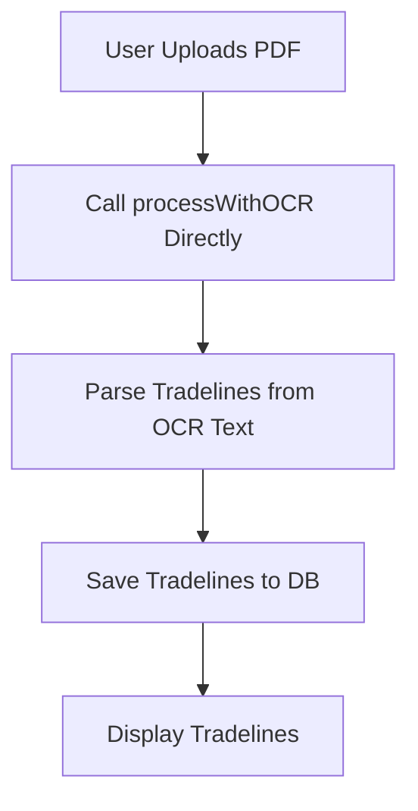

# Plan: Configure 'OCR Fast' as Singular Processing Method

**Goal**: Modify the `CreditReportUploadPage.tsx` to exclusively use the 'OCR (Fast)' processing method, removing the option for 'AI Enhanced' processing.

## Mermaid Diagram: Current Processing Flow

```mermaid
graph TD
    A[User Uploads PDF] --> B{Processing Method Selected?};
    B -- Yes --> C{Method: 'ocr'};
    C -- Yes --> D[Call processWithOCR];
    B -- No --> E{Method: 'ai'};
    E -- Yes --> F[Call processWithAI];
    D --> G[Parse Tradelines from OCR Text];
    F --> H[AI Processing (Document AI + Gemini)];
    H -- Fallback --> D;
    G --> I[Save Tradelines to DB];
    H --> I;
    I --> J[Display Tradelines];
```

## Mermaid Diagram: Proposed Processing Flow (OCR Fast Only)



## Detailed Steps:

1.  **Modify `src/pages/CreditReportUploadPage.tsx`**:
    *   **Remove AI Processing Method Selection UI**:
        *   Remove the "AI Enhanced (Slower, More Accurate)" button and related UI elements that allow the user to select the AI processing method. This will ensure that only "OCR (Fast)" is presented as an option.
    *   **Remove `processingMethod` State and Logic**:
        *   Remove the `processingMethod` state variable and any associated `useState` and `useEffect` hooks that manage its value.
        *   Remove the conditional logic (`if (processingMethod === 'ai')`) that branches to `processWithAI`.
    *   **Directly Call `processWithOCR`**:
        *   In the `handleFileUpload` function, modify the logic to directly call `processWithOCR(file)` without any conditional checks for `processingMethod`.
    *   **Remove `processWithAI` Function**:
        *   Delete the entire `processWithAI` asynchronous function, as it will no longer be used.
    *   **Remove AI-related State and UI**:
        *   Remove `extractedKeywords`, `aiInsights`, and `showAiResults` state variables.
        *   Remove the `showAiResults` conditional rendering block (lines 531-556) and any other UI elements related to displaying AI analysis results.
    *   **Update Imports**:
        *   Remove imports related to AI processing, such as `parseDocumentViaProxy` and `generateContent` from `@/services/llm-parser`.

**Rationale**:

By making these changes, the application will exclusively use the `processWithOCR` function for extracting text from uploaded PDF documents. This aligns with the requirement to configure 'OCR Fast' as the singular processing method. Future optimizations can then focus on enhancing the OCR pipeline itself.