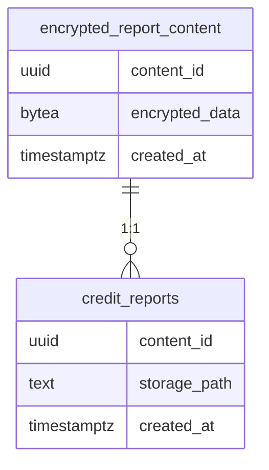

# Credit Report Storage Architecture

## Schema Restructuring (2024 Q2)

### Current Schema Structure


### Migration Strategy
- **Transactional Migration**: Atomic operation ensuring zero downtime
- **Data Preservation**: 
  ```sql
  BEGIN;
  ALTER TABLE credit_reports RENAME TO encrypted_report_content;
  CREATE TABLE credit_reports (...);
  COMMIT;
  ```
- **Data Integrity**: Existing records remain accessible via `encrypted_report_content`

### API Integration
```typescript
// upload-credit-report.ts
const { error: contentError } = await supabase
  .from('encrypted_report_content')
  .insert(encryptedData);

const { error: reportError } = await supabase
  .from('credit_reports')
  .insert({
    content_id: encryptedData.content_id,
    storage_path: validatedPath
  });
```

### Security Controls
- Path Validation: `CHECK (storage_path ~ '^credit-reports/.*')`
- Foreign Key Constraint: `UUID REFERENCES encrypted_report_content`

## Future Considerations
- Partitioning strategy for encrypted content
- Audit trail implementation