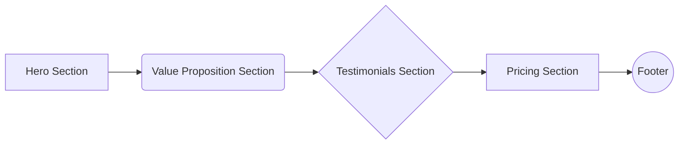

# Homepage and User Dashboard Design for Credit Clarity AI Assist

## I. Homepage Design

**Goal:** Effectively onboard new users and showcase the platform's core value proposition.

**Key Elements:**

*   **Hero Section:**
    *   Compelling headline: "Take Control of Your Credit with AI"
    *   Brief description of Credit Clarity AI Assist: "AI-powered platform to analyze, dispute, and improve your credit score."
    *   Clear call to action: "Get Started Now" (button linking to signup page)
    *   Visually appealing background image or video showcasing the platform's interface and benefits.
*   **Value Proposition Section:**
    *   Highlight key features and benefits:
        *   AI-powered credit analysis
        *   Automated dispute letter generation
        *   Personalized credit improvement recommendations
        *   Progress tracking and monitoring
    *   Use icons and concise descriptions to make the information easily digestible.
*   **Testimonials Section:**
    *   Showcase positive user testimonials to build trust and credibility.
    *   Include user photos and quotes.
*   **Pricing Section:**
    *   Clearly outline different subscription plans and pricing options.
    *   Highlight the value of each plan.
*   **Footer:**
    *   Links to important pages: About Us, Contact, FAQ, Terms of Service, Privacy Policy.
    *   Copyright information.

**Accessibility:**

*   Ensure the homepage is accessible to users with disabilities by following WCAG guidelines.
*   Use semantic HTML, provide alternative text for images, and ensure sufficient color contrast.

**Responsiveness:**

*   Design the homepage to be responsive across different devices (desktop, tablet, mobile).
*   Use a mobile-first approach to ensure a seamless user experience on smaller screens.

**Visual Appeal:**

*   Use a clean and modern design that aligns with the platform's brand identity.
*   Use a consistent color palette, typography, and imagery.

## II. User Dashboard Design

**Goal:** Provide a personalized and actionable overview of the user's activity, progress, and relevant information.

**Key Elements:**

*   **Personalized Overview:**
    *   Display the user's current credit score and a visual representation of their credit score progress.
    *   Highlight key factors affecting their credit score.
    *   Provide personalized recommendations for improving their credit score.
*   **Actionable Insights:**
    *   Display a list of negative items affecting their credit score.
    *   Provide options to dispute these items.
    *   Show the status of ongoing disputes.
*   **Customizable Widgets:**
    *   Allow users to customize their dashboard by adding, removing, and rearranging widgets.
    *   Include widgets for:
        *   Credit score monitoring
        *   Dispute tracking
        *   Recent activity
        *   Personalized recommendations
        *   File Uploader
        *   Mail Status
*   **Real-time Updates:**
    *   Provide real-time updates on credit score changes, dispute status, and other relevant information.
    *   Use notifications to alert users of important updates.
*   **Intuitive Navigation:**
    *   Provide clear and intuitive navigation to key features, such as:
        *   Dispute Center
        *   Document Uploader
        *   Billing Information
        *   Profile Settings
*   **User Support and Feedback Mechanisms:**
    *   Provide easy access to user support resources, such as FAQs and contact information.
    *   Include a feedback form to allow users to provide feedback on the platform.

**Key Performance Indicators (KPIs):**

*   Credit Score
*   Number of Disputes Filed
*   Number of Negative Items Removed
*   Credit Score Improvement Over Time

**Data Visualization:**

*   Use charts and graphs to visualize data and enhance user understanding.
*   Use color-coding to highlight important information.

**User Roles and Permissions:**

*   Admin: Access to all features and data, including user management, billing, and system settings.
*   Standard User: Access to personalized dashboard, dispute center, document uploader, and profile settings.
*   Guest: Limited access to public information and a signup/login prompt.

**Accessibility:**

*   Ensure the dashboard is accessible to users with disabilities by following WCAG guidelines.

**Responsiveness:**

*   Design the dashboard to be responsive across different devices (desktop, tablet, mobile).

**Visual Appeal:**

*   Use a clean and modern design that aligns with the platform's brand identity.

## III. Mermaid Diagrams

*   **Homepage Structure:**



*   **User Dashboard Layout:**

```mermaid
graph LR
    A[Personalized Overview] --> B(Actionable Insights);
    B --> C{Customizable Widgets};
    C --> D[Real-time Updates];
    D --> E((Intuitive Navigation));